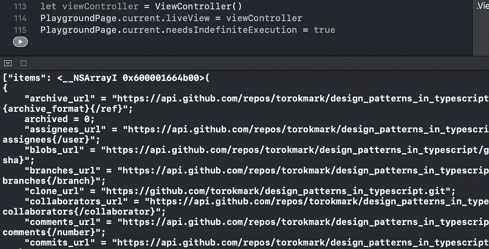

# 在 Swift 5 中实施构建器设计模式

> 原文：<https://betterprogramming.pub/implement-the-builder-design-pattern-in-swift-5-ff5bc6f2fc3d>

## 创建和使用自定义 URLRequests 和 URLSessionDataTasks

Artem Labunsky 在 [Unsplash](https://unsplash.com?utm_source=medium&utm_medium=referral) 拍摄的照片

在本教程中，我们将学习构建器设计模式，并用它实现一个`URLRequest`和`URLSessionDataTask`。

一个 Xcode 游乐场的[源代码可以在 GitHub 上获得。](https://github.com/zafarivaev/Builder-DesignPattern)

# 模式的定义

Builder 帮助我们以渐进的方式构造复杂的对象，而不是将每个设置都放入初始化器中。它包括以下几个部分:

*   产品——我们想要创建的对象。
*   构建器—将构建并返回产品的组件。
*   director——引用构建器并处理返回产品的类。

# 我们开始吧

我们的项目代表了 GitHub 的一个 REST API 客户端。它所做的是一个简单的任务:获取 JSON 格式的存储库列表。

## 产品

`URLRequest`和`URLSessionDataTask`代表产品组件，所以我们不必为它们创建单独的结构或类，因为它们已经存在了。

让我们添加一些有用的属性供以后使用:

现在我们来看下一个组件。

## 建设者

首先，我们为`URLRequest`创建一个构建器:

正如我们所看到的，我们将使用各种各样的`set`方法来分配属性，然后在`build()`方法中返回构造的对象。

`baseURL`、`endpoint`、`method`、`header`和`parameters`属性被定义为`private(set)`，以禁止从类外部对它们进行直接赋值。导演将不得不使用已定义的`set`方法。

现在，为`URLSessionDataTask`创建一个构建器:

构建器部分完成后，让我们创建最后一个组件。

## 导演

我们项目中的`Director`是一个`UIViewController`:

我们添加`[“q”: “Builder Design Pattern”]`参数来搜索 GitHub 上的相关存储库。

现在我们必须实例化`ViewController`并将这些行添加到我们的 Xcode playground 中，以使`viewDidLoad()`方法成功运行:

最后，我们可以在调试控制台中看到打印的结果:

我们已经成功地实现了生成器设计模式。

# 包扎

对其他设计模式感兴趣？请随意查看我的其他相关作品:

 [## 在 Swift 中实施战略设计模式

### 只需一行代码就可以在领域和核心数据之间切换

medium.com](https://medium.com/better-programming/implement-the-strategy-design-pattern-in-swift-5d9c3f221277)  [## 新 MVC:单一责任原则和委托

### 苹果的模型视图控制器，终于做对了

medium.com](https://medium.com/better-programming/this-is-how-you-implement-mvc-architecture-in-2020-b39d65b4212f)  [## 在 Swift 5 中实施模型-视图-演示者架构

### 使用领域数据库作为业务逻辑层

medium.com](https://medium.com/better-programming/implement-a-model-view-presenter-architecture-in-swift-5-dfa21bbb8e0b)  [## 反应式 MVVM 和协调模式做对了

### 使用 Swift 5、RxSwift 和 RxDataSources

medium.com](https://medium.com/better-programming/reactive-mvvm-and-the-coordinator-pattern-done-right-88248baf8ca5)  [## 如何使用 Swift 5 在您的 iOS 应用中实现 VIPER 架构

### 使用方便的 Xcode 模板和参考报告

medium.com](https://medium.com/better-programming/how-to-implement-viper-architecture-in-your-ios-app-rest-api-and-kingfisher-f494a0891c43)  [## 在 Swift 5 中实施面向服务的架构

### 为什么只用 MVC/MVVM/蝰蛇还不够

medium.com](https://medium.com/better-programming/implement-a-service-oriented-architecture-in-swift-5-fc70b8117616) 

感谢阅读！