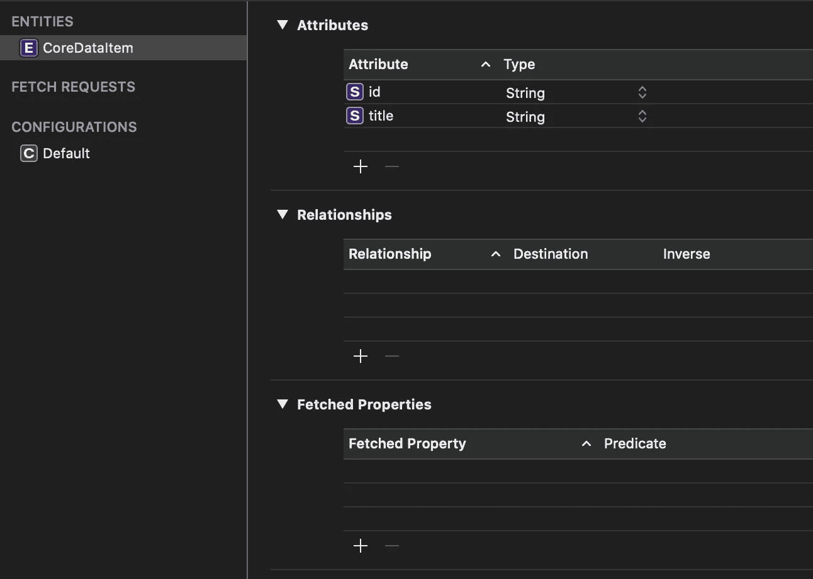

# 在 Swift 5 中实施策略设计模式

> 原文：<https://betterprogramming.pub/implement-the-strategy-design-pattern-in-swift-5d9c3f221277>

## 只需一行代码就可以在领域和核心数据之间切换

[O12](https://unsplash.com/@o12?utm_source=medium&utm_medium=referral) 在 [Unsplash](https://unsplash.com?utm_source=medium&utm_medium=referral) 上拍照

在本教程中，我们将学习如何实现一个有用的设计模式— `Strategy`。

`Strategy`提供运行时在可互换对象之间切换的功能。当我们想要实现核心数据和领域数据库时，这非常方便，使我们能够在 iOS 应用程序中轻松地在它们之间切换。

在 GitHub 上下载项目的[源代码。](https://github.com/zafarivaev/Swift-Strategy-DesignPattern)

# 我们开始吧

看看我们的项目结构:

`Strategy`文件夹中有`CoreDataStrategy`和`RealmStrategy`将符合的`PersistenceStrategy`协议。在`Model`文件夹中，我们有一个普通的`Item`，我们在`ItemsViewController`中使用它来表示持久化的项目:

现在让我们来看看`CoreDataModel.xcdatamodeld`:

我们可以看到有一个`CoreDataItem`实体，它具有以下属性(attribute):`id`和`title`，两者都是`String`的类型。当用它执行 CRUD 操作时，我们将把这个`CoreDataItem`对象转换成控制器的普通`Item`。

`RealmItem`描述了`Realm`的持久化对象，我们也将把它转换成`Item`:

太好了！我们已经讨论了 MVC 应用程序的`Model`,现在我们可以直接开始创建我们的`Strategy`实现。

# 定义持久性策略

在我们的应用程序中，我们希望检索、添加、编辑和删除项目。因此，我们的协议中有以下一组规则:

我们定义了`title`属性来为将来的`UITableView`设置一个头。

现在，让我们添加这个协议的核心数据和领域实现。

# 核心数据持久性策略

我们需要创建一个`CoreDataStrategy`类并符合`PersistenceStrategy`。

## CoreDataStrategy.swift

我们已经用核心数据实现了所有需要的方法。

# 领域持续策略

现在我们将定义`PersistenceStrategy`协议的特定领域实现:

## RealmStrategy.swift

正如我们所见，`Strategy`设计模式允许我们将实际的数据库实现隐藏在幕后。

# ItemsViewController

现在`ItemsViewController`将不会知道我们在应用程序中使用了什么特定的数据库。它将简单地调用`PersistenceStrategy`协议的方法。

## ItemsViewController.swift

正如您所看到的，我们有非特定类`PersistenceStrategy`的`persistenceStrategy`属性和保存一组`Item`对象的`items`属性:

现在让我们看看如何调用`PersistenceStrategy`协议方法。

## 添加项目

在用户点击`UIBarButtonItem`，在`UITextField`中键入一些内容，然后按“add”之后，我们向数据库添加一个项目:

## 获取项目

我们在`viewDidLoad`方法中检索所有项目，并将它们分配给`items`属性:

## 编辑项目

要编辑一个项目，我们选择`tableView`的特定行，并在`UITextField`中键入一个新标题:

## 删除项目

要删除一个项目，我们必须将实现添加到`tableView(_:commit:forRowAt:)`方法中:

现在是最有趣的部分:我们如何在领域和核心数据之间切换？为此，我们在`UINavigationBar`上有一个`UISegmentedControl`，选择它时，我们触发此代码:

正如你所看到的，我们在数据库之间切换所需要做的就是分配一个相应的`Strategy`给`persistenceStrategy`属性。整洁！

# 包扎

现在很容易看出我们的`ItemsViewController`与数据库无关。例如，如果我们以后想添加一个 SQLite 实现，我们只需要创建一个符合`PersistenceStrategy`协议的类，在所需的方法中提供特定于 SQLite 的实现——`ItemsViewController`只需要在`persistenceTypeChanged`方法中包含这个类。

我们还可以看到，当与其他设计模式一起使用时，MVC 架构看起来和感觉上都要好得多。

如果你对设计模式感兴趣并想了解更多，请随意查看我的其他相关文章:

 [## 新 MVC:单一责任原则和委托

### 苹果的模型视图控制器，终于做对了

medium.com](https://medium.com/better-programming/this-is-how-you-implement-mvc-architecture-in-2020-b39d65b4212f)  [## 在 Swift 5 中实施模型-视图-演示者架构

### 使用领域数据库作为业务逻辑层

medium.com](https://medium.com/better-programming/implement-a-model-view-presenter-architecture-in-swift-5-dfa21bbb8e0b)  [## 反应式 MVVM 和协调模式做对了

### 使用 Swift 5、RxSwift 和 RxDataSources

medium.com](https://medium.com/better-programming/reactive-mvvm-and-the-coordinator-pattern-done-right-88248baf8ca5)  [## 如何使用 Swift 5 在您的 iOS 应用中实现 VIPER 架构

### 使用方便的 Xcode 模板和参考报告

medium.com](https://medium.com/better-programming/how-to-implement-viper-architecture-in-your-ios-app-rest-api-and-kingfisher-f494a0891c43)  [## 在 Swift 5 中实施面向服务的架构

### 为什么只用 MVC/MVVM/蝰蛇还不够

medium.com](https://medium.com/better-programming/implement-a-service-oriented-architecture-in-swift-5-fc70b8117616) 

非常感谢您的阅读！