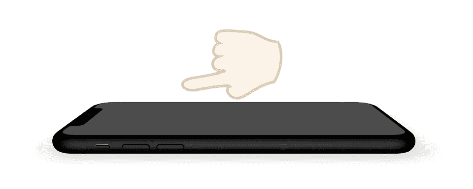
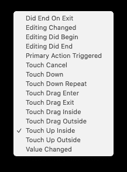
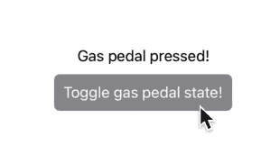
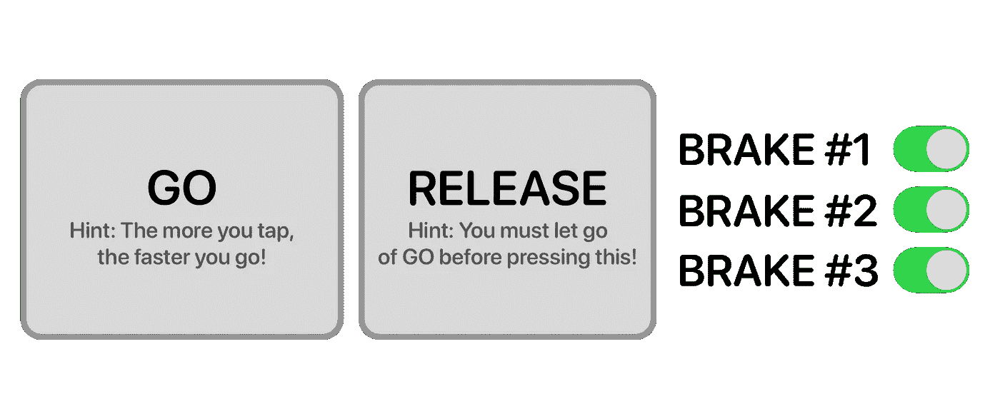
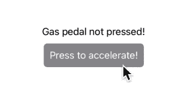
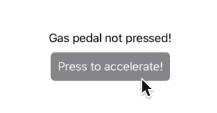

# 在 SwiftUI 中实现触摸事件

> 原文：<https://betterprogramming.pub/implement-touch-events-in-swiftui-b3a2b0700fd4>

## 当你能有一个的时候为什么要有两个按钮？

TLDR:这是代码。

SwiftUI 是一个非常新的、快速发展的框架——这很好，但这也意味着它缺少很多好的功能，包括触摸事件。

那么什么是*触摸事件呢？如果你来自 UIKit，你可能对它们很熟悉。真的，它们只是“检测到压力”的一种奇特说法*

然而，由于 iPhones 和 iPads 是先进的多点触摸设备，有时会“检测到按压！”还不够。你可能想检测用户什么时候第一次触地，或者什么时候释放……或者什么时候拖动和释放。

回到 UIKit 故事板，这些触摸事件很容易处理。s 附带了一个庞大的触摸事件列表，包括`Touch Up Inside`、`Touch Down`、`Touch Up Outside` …还有更多，所有这些事件加在一起可以接收到*你手指可以执行的每一个动作*。

但是 SwiftUI 呢？呃…没那么多。默认情况下，你只能得到一个触摸事件:`Touch Up Inside`。

这意味着按钮动作只有在*这两个*条件都满足时才会被调用:

*   用户*举起*他们的手指
*   用户的手指被*内的* 按钮的界限解除时

在今天的应用程序中，`Touch Up Inside`是最常用的触摸事件，因为它给用户时间来取消。如果他们决定不想按下按钮，他们需要做的就是把手指移开——这是一个简单的方法。

所以 SwiftUI 的按钮只支持开箱即用的`Touch Up Inside`是有道理的…但是如果你想访问所有其他的触摸事件呢？

假设你正在做一个有油门踏板的赛车游戏。按下时，汽车应该会跑得更快。放开的时候应该会慢下来。这需要三个触摸事件— `Touch Down`、`Touch Up Inside`和`Touch Up Outside`。(没有`Touch Up`触摸事件，但是`Touch Up Inside`和`Touch Up Outside`组合起来效果一样。)

但是如果 SwiftUI 的按钮只支持`Touch Up Inside`、*你要怎么*做出这些赛车游戏？当然，你可以牺牲很多 UX，用一个切换按钮——按下加速，按下减速，然后再按下加速:

**备选项#1:** 切换式按钮

或者，您还可以牺牲用户界面，采用多按钮方式:

**备选项#2:** 多个按钮

按钮越多越好！对吗？等等…看起来好可怕！

# SwiftUI 只是对游戏不好吗？

可能 SwiftUI 不适合游戏。也许它只是不喜欢复杂的触摸事件。也许是时候回 UIKit 了。

不，SwiftUI 对于游戏来说还不错。它对复杂的触摸事件没有问题。当然也不是回到 UIKit 的时候。苹果知道 SwiftUI 需要时间来赶上 UIKit 的功能水平，所以他们用*视图修改器来简化定制。*在本文中，我们将使用视图修改器来复制由内置手势驱动的触摸事件。

# 我们的演示游戏

制作一个赛车游戏会花费太多时间，但是我们可以把它减到最少——我们所需要的是:

*   跟踪油门踏板状态的属性
*   一个按钮
*   显示油门踏板状态的标签

这并不过分，所以让我们首先坚持使用默认的`Touch Up Inside`并制作一个切换按下/释放状态的按钮。

**备选项#1:** 切换式按钮

代码如下:

在这种情况下，逻辑工作正常——按下按钮切换按下/释放状态——但这不是一个很好的用户体验。这个按钮不只有一个用途，它有两种用途。这意味着有人可能会不小心刹车而不是加速，让他们输掉比赛——也让你损失一个差评。

这就是为什么触摸事件在这里会工作得很好:按下以加速，释放以减速。触地，触地。让我们在 SwiftUI 中重现那些触摸事件吧！我们可以使用视图修改器和手势来实现这一点:

首先，声明一个`@State`属性来跟踪拖动手势的变化。这将存储触摸事件的状态(真=按下，假=释放)。然后，我们将使用一个`DragGesture`来检测手指。

然后我们给手势附加一个`.onChanged()`修饰符，每当手指触地或移动手指时，系统都会调用这个修饰符。在这里，我们将`dragged`设置为`true`。一旦手指被释放，`onEnded()`将被调用，我们将`dragged`设置回`false`。

现在，将原来的切换按钮替换为:

我们将使用普通的`Text`标签，而不是使用`Button`(视图修改器在所有 SwiftUI 视图上都有效)！结果如下:

GIF 里看不出来，但是标签改成了“油门踩下！”当我按下按钮，和“油门踏板没有按下！”当我释放时。但这是个问题。不像默认的`Button`，我们没有得到一个免费的指示按钮被按下。

这个很容易解决！我们可以添加另一个视图修改器来改变它的比例。

结果如下:

圆滑！

# 结论

按钮太多，或者有多种用途的按钮都不是好主意。相反，为了一致性和易用性，请使用触摸事件。SwiftUI 中没有内置触摸事件，但是您可以使用视图修改器和手势来复制它们。您还可以将自定义视图修改器包装到一个扩展中，使其更易于使用。

感谢阅读！