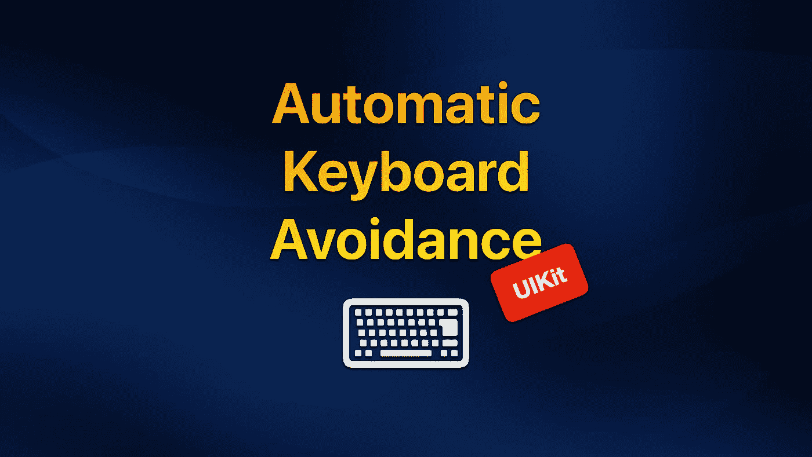
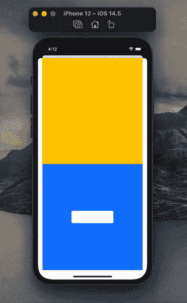
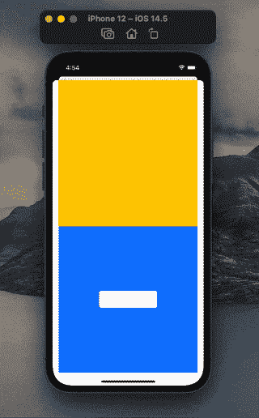

# 在 iOS 中实现 UIKit 自动键盘回避

> 原文：<https://betterprogramming.pub/implement-uikit-automatic-keyboard-avoidance-in-ios-562e2d4ce436>

## 不需要第三方 Swift 库

在 iOS 14 中，苹果通过赋予 SwiftUI 自动键盘回避功能来显示他们对 swift ui 的喜爱。默认情况下它是打开的，这意味着一旦你为 iOS 14 构建了你的应用程序，你所有的 SwiftUI 视图都可以自动获得这一令人敬畏的功能。

不幸的是，不管出于什么原因，苹果并没有为 UIKit 提供这一功能，尽管这是全世界开发者最需要的功能之一。

在本文中，我将向您展示如何使用我最近发现的技巧在视图控制器中启用自动键盘回避。最棒的是，这个简单的技巧不需要任何第三方库。

事不宜迟，让我们开始吧！

# 示例应用程序

出于演示的目的，我创建了一个名为`TextFieldViewController`的视图控制器，它由一个堆栈视图填充。在堆栈视图中，一个黄色视图占据了视图控制器的上半部分，另一个蓝色视图占据了视图控制器的下半部分。在底部的蓝色视图中，我添加了一个`UITextField`来触发键盘。

下面是`TextFieldViewController`的完整实现:

在 UIKit 中，当我们选择文本字段时，键盘会阻止文本字段。这是一个非常糟糕的用户体验，因为用户在键入时无法看到文本字段内容。

UIKit 中没有自动键盘回避

相反，我们希望系统自动将文本字段上移，这样键盘就不会挡住文本字段。

UIKit 中启用了自动键盘回避

# 这个概念

最近，我发现自动键盘回避并不仅限于 SwiftUI 视图，也适用于符合`[UIViewControllerRepresentable](https://developer.apple.com/documentation/swiftui/uiviewcontrollerrepresentable)`协议的结构。我猜这是因为，在系统上下文中，`UIViewControllerRepresentable`实例也被视为 SwiftUI 视图。

如果是这样的话，让 UIKit 可以使用自动键盘回避就非常简单了。我们需要做的就是将`UIViewControllerRepresentable`实例包装在`[UIHostingController](https://developer.apple.com/documentation/swiftui/uihostingcontroller)`中并呈现出来。

记住这一点，让我们深入研究代码。

# 实施

首先，我们需要实现一个符合`UIViewControllerRepresentable`协议的结构。这个结构基本上将我们之前创建的`TextFieldViewController`转换成一个 SwiftUI 视图。让我们把它命名为`TextFieldView`。

有了这些，我们现在可以将`TextFieldView`包装在`UIHostingController`中，并像我们通常呈现视图控制器一样呈现它。

下面的动画 GIF 展示了我们实施的最终结果:

UIKit 中默认的自动键盘回避行为

就是这样！我们已经在`TextFieldViewController`中成功启用了自动键盘回避。我们现在可以感受一下它是如何在 UIKit 上工作的。

看起来它的工作方式与 SwiftUI 类似:键盘现在会向上推动底部安全区域布局指南，降低容器视图的高度，从而压缩黄色和蓝色视图，而不是与视图控制器的容器视图重叠。

在我们的示例应用程序中(只有两个子视图和一个文本字段)，这种行为可能看起来没问题。但是假设您有一个包含多个文本字段和按钮的复杂视图。以这样的尺度降低它的高度，肯定会打破它的整个 UI。

因此，我们要寻找的行为是:当显示键盘时，向上移动文本视图，使其不被键盘阻挡，同时保持容器视图的维度。

幸运的是，这种行为可以通过使用滚动视图轻松实现。

# 滚动查看救援

这里的技巧是将视图控制器的容器视图中的所有内容包装在一个滚动视图中。这样，当显示键盘时，滚动视图框架高度将被压缩，而滚动视图内容高度将保持不变。

对于我们的`TextFieldViewController`，需要做的是用滚动视图填充容器视图，并将堆栈视图移动到滚动视图中。

从上面的代码中，请注意，我们必须显式设置堆栈视图的高度，以便滚动视图可以在运行时确定其内容高度。

以下是更改后我们得到的结果:

使用滚动视图的自动键盘回避

# 禁用自动键盘回避

尽管自动键盘回避是一个非常好的特性，但仍有一些情况下我们可能需要手动处理它。如果是这种情况，我们可以利用`[ignoresSafeArea(_:edges:)](https://developer.apple.com/documentation/swiftui/text/ignoressafearea(_:edges:))`视图修改器将其关闭，如下所示:

请注意`ignoresSafeArea(_:edges:)`是一个 SwiftUI 视图修改器，因此，它不能在视图控制器上工作。

# 包扎

我发现这个启用自动键盘回避的技巧非常有用，我非常喜欢它。另一方面，对我来说，这确实有点不舒服。你怎么想呢?如果你发现了这个技巧的任何不可预见的问题，请在评论中告诉我。

我希望你喜欢阅读这篇文章。

感谢阅读。

# 参考

*   [SwiftUI 键盘回避](https://www.fivestars.blog/articles/swiftui-keyboard/)
*   [如何在 UIKit 中使用 swift ui](https://sarunw.com/posts/swiftui-in-uikit/)
*   [如何在故事板中使用滚动视图](https://fluffy.es/scrollview-storyboard-xcode-11/)

*本文原载于 2021 年 5 月 18 日*[*https://swiftsenpai.com*](https://swiftsenpai.com/development/uikit-keyboard-avoidance/)*。*