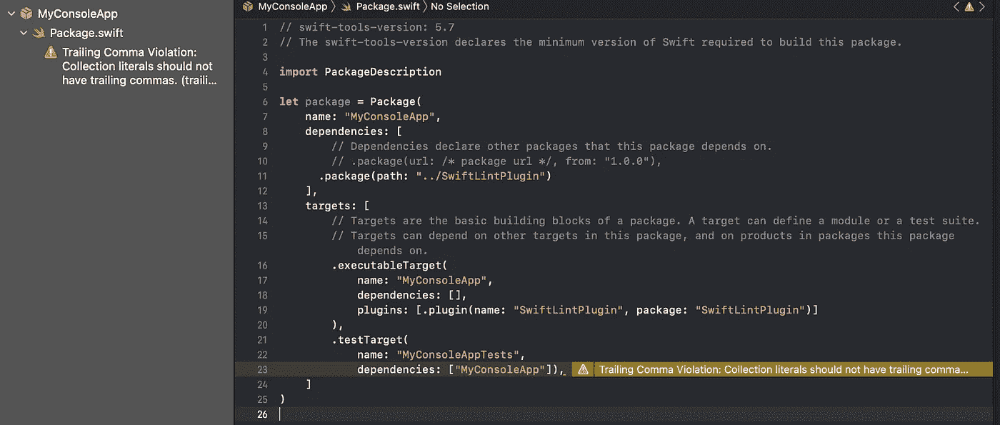
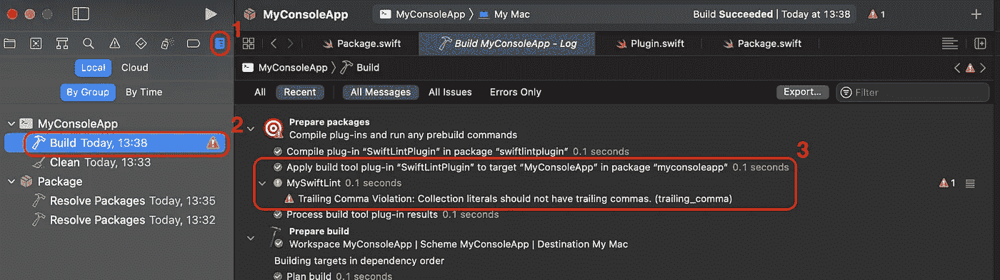

# 实施您的首个 Swift 包构建插件

> 原文：<https://betterprogramming.pub/implement-your-first-swift-package-build-plugin-9835a7aded0b>

## 使用新的构建插件改进您的开发过程


照片由 [Solaiman Hossen](https://unsplash.com/@sh_sumon?utm_source=medium&utm_medium=referral) 在 [Unsplash](https://unsplash.com?utm_source=medium&utm_medium=referral) 拍摄

从 Xcode 14 和 Swift 5.7 开始，可以创建和分发一种新类型的 Swift 产品:插件。插件有可能简化和改进任何 iOS 工程师的开发过程，在构建和预构建阶段添加自定义步骤。它们有两种口味:

*   构建插件:这些插件可以在构建发生之前运行可执行文件。它们接受输入文件并产生一个或多个输出文件。
*   命令插件:这些插件可以直接在 Xcode 中执行，也可以从命令行界面手动执行。他们可以执行定制的 Swift 脚本，也可以使用`Process`类运行其他脚本和系统命令。

这些 WWDC 视频中展示了插件，我强烈建议大家了解一下可以用它们构建什么以及它们是如何工作的:

*   [认识 Swift 包插件](https://developer.apple.com/videos/play/wwdc2022/110359/)
*   [创建 Swift 包插件](https://developer.apple.com/videos/play/wwdc2022/110401/)

今天，我将向你展示如何创建你的第一个构建插件，并在你的其他包中使用它。

> **注意:**你需要下载 Xcode 14 beta 版来自己试用这段代码。

# 构建插件

苹果从命令插件开始描述插件，但是我发现构建插件更容易编写和测试。总的来说，我也认为它们比命令插件更有用。

两者之间的主要区别是，构建插件在构建步骤中自动执行，而命令插件需要显式操作才能运行:例如，更容易忘记执行它。

苹果提供两种构建插件:预构建插件和构建插件。两者之间的主要区别在于它们可以产生的输出:

*   当输出事先未知时，必须使用预构建插件。想象一个基于一些规范生成一些代码的构建步骤。您事先不知道代码生成步骤的输出会是什么。
*   相反，构建插件要求您指定一组输出文件。想象一个步骤，创建一个在构建过程中被改变的文件的概要:输出文件被很好地定义，并且它是概要。

在下面的段落中，您将探索如何创建一个构建插件来在您的项目中运行 [SwiftLint](https://github.com/realm/SwiftLint) linter。

# 1.声明插件

首先，你需要创建一个新的`Package.swift`文件:插件是用 SwiftPM 描述的。要使用新的插件功能，步骤如下:

1.  使用大于或等于`5.7`的`swift-tools-version`版本。
2.  在`product`列表中，添加一个新的`.plugin`产品。它需要一个名字和一个目标。
3.  在`target`列表中，添加一个新的`.plugin`目标。对于构建插件，定义`name`和`capability`。正确的功能是`.buildTool()`，与命令插件的`command()`相反。

`Package.swift`文件的示例如下:

如果插件依赖于另一个目标或包，你也可以在`capability`属性下添加一个`dependencies`属性。

# 文件夹结构

如果您现在尝试构建，将会得到一个错误。SwiftPM 需要一个合适的插件结构。构建错误的描述性足以指导他们解决问题，但简而言之，您必须执行以下操作:

1.  在`Package.swift`文件下创建一个`Plugins`文件夹。
2.  在`Plugins`文件夹中创建一个`SwiftLintPlugin`文件夹(该文件夹的名称必须与`target`数组中插件的名称相匹配)。
3.  添加一个`Plugin.swift`文件来实现插件。这个文件的名称并不重要。

最终的结构可能如下所示:

```
SwiftlintPlugin
├── Package.swift
└── Plugins
    └── SwiftLintPlugin
        └── Plugin.swift
```

# 实现插件

> **注意**:为了让这个部分工作，你需要在本地安装 SwiftLint。您可以在此处遵循安装说明[。](https://github.com/realm/SwiftLint#using-homebrew)

实现新插件的主要步骤是:

1.  导入`PackagePlugin`框架，它包含了插件的所有新 API。
2.  声明一个包含插件代码的新结构。
3.  用`@main`注释来注释这个结构。这标志着你的插件的入口点。
4.  确保你的插件实现了`BuildToolPlugin`协议。
5.  实现`createBuildCommands(context:,target:) async throws -> [Command]`功能。

实现的一个例子如下:

实施遵循以下步骤:

1.  它创建一个目录来存储输出文件，最终删除旧的目录。
2.  它获取必须传递给 SwiftLint 的当前路径，以递归 Lint 文件。
3.  它返回一个`.prebuildCommand`来创建一个预构建插件。

`prebuildCommand`的参数是:

*   构建阶段的名称。这将通过 Xcode 显示在构建步骤中
*   您想要运行的可执行文件

> **注意:**记得用 SwiftLint 可执行文件的正确路径更新`*executable*`参数！

*   可执行文件需要的参数
*   必须创建文件的目录

构建命令总是要求您定义一些输出:

*   预构建命令需要一个文件夹，
*   构建命令需要特定文件的列表。

SwiftLint 不一定输出任何文件。使用没有输出的可执行文件的技巧是:

*   使用预生成命令而不是生成命令
*   创建一个空目录
*   用那个作为`outputFilesDirectory`

如果您现在构建项目，您可以看到它构建成功。

# 在另一个包中使用插件

现在您已经有了一个插件，是时候将它插入到另一个包中了，例如，一个控制台应用程序:

1.  使用 swift 命令行
    `swift package init — type executable — name MyConsoleApp`创建新的控制台应用程序
2.  将本地包作为依赖项添加。
3.  将插件添加为控制台应用程序的插件。

第一个命令生成一个由 SwiftPM 支持的新项目。双击`Package.swift`文件可以在 Xcode 中打开。

为了实现第二步和第三步，修改`Package.swift`文件如下:

如果您构建了项目，您应该会立即看到弹出的一些警告。这些是由 SwiftLint 生成的，它正在运行并报告它的错误！



查看插件是否正在运行的另一种方法是执行以下操作:

1.  打开报告导航器(`⌘+9`)
2.  点击构建日志
3.  观察中央面板中的日志



# 结论

本文教你如何为其他 Swift 包创建一个构建插件。您学习了如何声明它，实现它，并为另一个包启用它。

Xcode 插件可以改善 iOS 工程师优化开发过程的方式。我迫不及待地想看看社区会产生什么，现在我们有了在 Xcode 中添加构建步骤的简单方法。