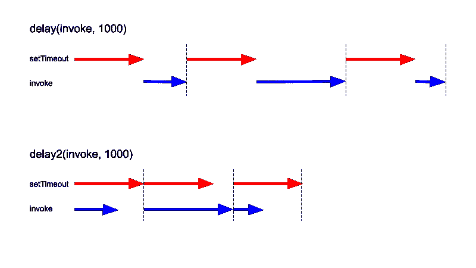
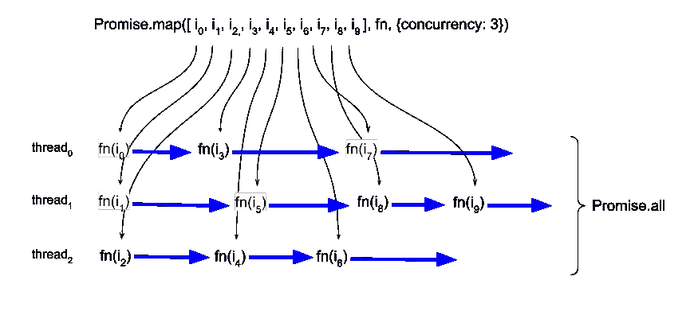

# 通过实现蓝鸟风格的 Promise.map 来提升您的异步 JavaScript 技能

> 原文：<https://betterprogramming.pub/implement-your-own-bluebird-style-promise-map-in-js-7c081b7ad02c>

## 更好的异步性

由[瓦伦丁·安托努奇](https://unsplash.com/@valentinantonucci?utm_source=unsplash&utm_medium=referral&utm_content=creditCopyText)在 [Unsplash](https://unsplash.com/s/photos/promise?utm_source=unsplash&utm_medium=referral&utm_content=creditCopyText) 上拍摄的照片。

我在工作中用 [Node.js](https://nodejs.org/en/) 做了很多网页抓取。通常，您不希望一次启动所有 API 调用，因为这样做可能会淹没其他人的服务器，触发他们的 DDoS 保护，或者更糟，使他们离线。

web 上的数据抓取通常分两步完成:

1.  您访问一个索引页面，在那里您可以找到所有子资源的“列表”,您可以调用它来获取一些细节。以资产门户为例。网站可能会按位置组织酒店信息，或者每个酒店都有自己的页面。
2.  您将一个接一个地访问步骤 1 中列表上的项目，以获取详细信息。

将所有 step 2 API 调用包装在一个巨大的`Promise.all`中肯定不是一个好主意。正确的方法是使用交错和/或速率限制。JavaScript 的`Promise`非常适合交错，因为很容易从`Promise`创建瀑布行为。你只需`.then`所有的调用，让它们一个接一个地发生。例如:

要限制速率，您可以引入一个定时延迟:

这两种延迟实现之间有细微的差别。第一个方法在调用之前等待 1000 毫秒，而第二个方法首先调用，并等待 1000 毫秒来传递结果。这种差异在下图中非常明显:

作者照片。

虽然瀑布模式在项目列表很小时很有用，但在较大的列表中会非常慢，因为您实际上是在“单线程”上运行我们能做得更好吗？

答案是肯定的。它使用的是`bluebird`中的承诺 API 扩展之一`Promise.map`。这里的神奇之处在于`concurrency`选项。

 [## Promise.map

### 给定一个有限的(数组是可迭代的)，或一个可迭代的承诺，从而产生承诺(或承诺和…

bluebirdjs.com](http://bluebirdjs.com/docs/api/promise.map.html) 

`concurrency`所做的是让你设置一次“线程”的最大数量。`Promise.all`对“线程”的数量没有限制如果我的列表包含 1000 个条目，那么将同时触发 1000 个 API 调用*。另一方面，如果我使用上面显示的瀑布模式，我最终会处理一个“线程”`Promise.map`提供了一个中间地带。*

*如果`concurrency`是一个如此有用的选择，为什么它不首先在`Promise.all`实施呢？*

*`Promise.all`:*

*   *接受一个数组作为它的唯一参数。*
*   *该数组包含未决承诺，当数组中的每个承诺都已解析时,`Promise.all`将解析。*

*`Promise.map`:*

*   *接受数组和映射函数。*
*   *将对数组中的每个项目调用 mapper 函数，每次都返回一个待定承诺。当所有返回的承诺解决后，`Promise.map`解决。*

*因为没有用`Promise.all`传入函数，所以所有未决的承诺一定是在其他地方生成的(通过调用 API 调用函数)。所以当`Promise.all`收到未决承诺集合时，所有的调用都已经开始了。另一方面，`Promise.map`可以随意调度调用，因为它对输入数组和映射函数进行操作，将输入转换为输出。也就是说，使用`Promise.all`实现`Promise.map`行为并非不可能。*

*我更喜欢尽可能多地使用原生的`Promise`，我发现为一个函数安装一个完整的`bluebird`模块是不经济的。所以我想，“为什么不写我自己的`Promise.map`？”*

*用原生的`Promise.all`实现`Promise.map`的技巧是不在输入数组的映射版本上调用`Promise.all`,而是在一个包含线程的更小的数组上调用`Promise.all`,这些线程基本上是前面显示的瀑布模式的副本。这个数组的大小由`concurrency`选项控制。这是一个直观的表示:*

**

*和一个基本实现:*

*   *第 8-12 行设置了`concurrency`线程。*
*   *内部函数`wrappedMapper`(第 16-23 行)处理并发线程的填充。*

*每次调用`wrappedMapper`时，它都会执行以下操作:*

1.  *将输入数组中的下一项出队。*
2.  *对输入调用映射器函数。*
3.  *等待调用返回的承诺解决。*
4.  *将已解析的项放入输出数组中(在相应的索引处)。*
5.  *如果输入数组中还有剩余项，则再次调用自身。*

*可以看出`Promise.map`函数是瀑布模式的一个更一般的实现。在一个极端，如果`concurrency`被设置为`1`，它的行为与简单的瀑布模式完全一样。如果没有设置`concurrency`，则默认为另一个极端，即`Infinity`。然后，它的行为类似于`Promise.all`，在整个输入数组的前面调用`mapper`。*

*上面的基本实现有两个突出的问题:*

1.  *内部函数`wrappedMapper`假设`mapper`总是返回一个承诺或结果。如果`mapper`返回一个不可命名的值，将抛出一个未定义的属性错误。*
2.  *根据 [MDN web docs](https://developer.mozilla.org/en-US/docs/Web/JavaScript/Reference/Global_Objects/Promise/all) , `Promise.all`接受一个[可迭代](https://developer.mozilla.org/en-US/docs/Web/JavaScript/Reference/Iteration_protocols)——不仅仅是数组。在`Promise.map`的情况下，传递一个 iterable 意味着可以提供一个不固定的输入列表。这对于处理 API 调用失败时的重试特别有用。*

*下面是一个更完整的实现:*

*如何确保从`mapper`返回一个名称？一种可能的方法是检查`.then`方法的存在，并分别处理可命名和不可命名。更健壮的方法是将返回值包装在`Promise.resolve`中。它确保了`.then`方法始终存在，避免了类型检查和单独处理的需要。*

*   *`Promise.resolve`应用于第 22 行。*
*   *第 18 行用迭代器对象替换了数组索引。*

*我们可以使用相同的逻辑来实现`Promise.filter`:*

*今天关于 JS 异步编程的文章到此结束。感谢您的阅读！*