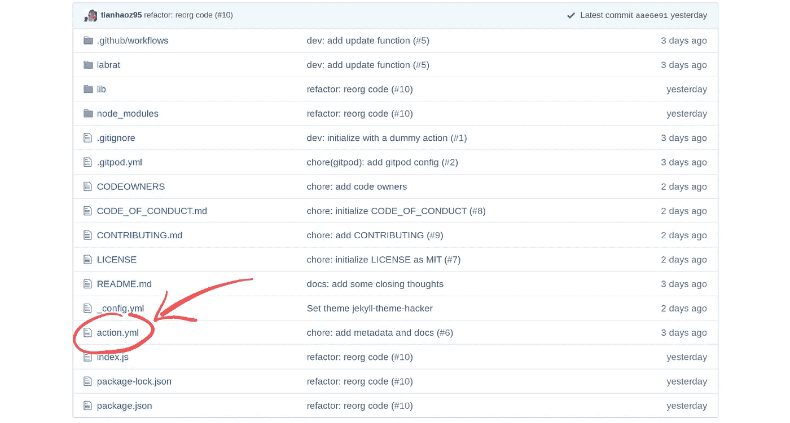
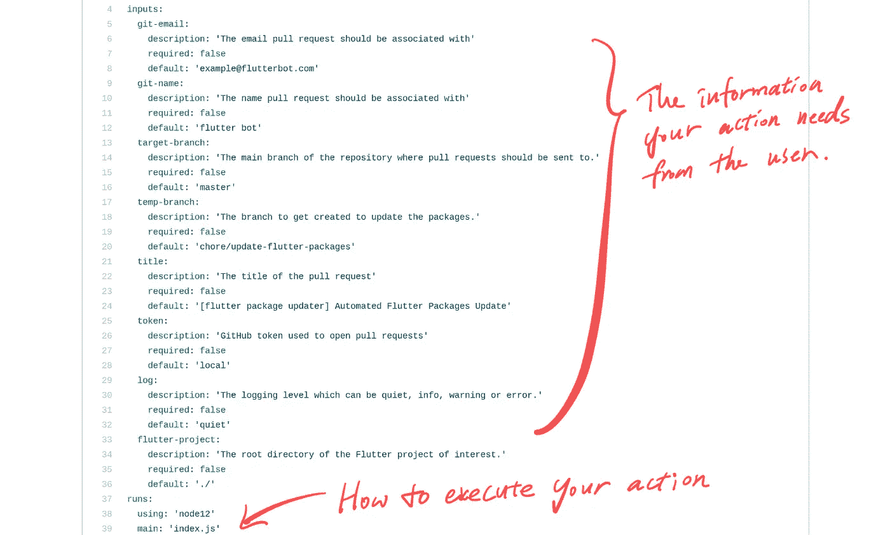
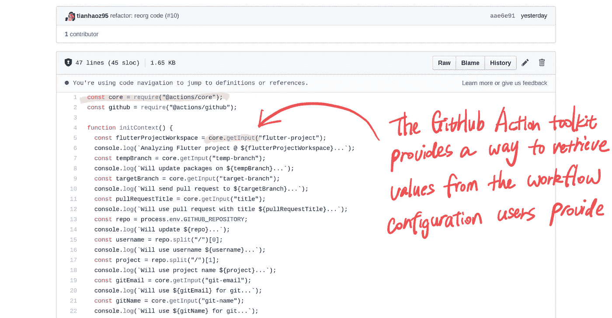
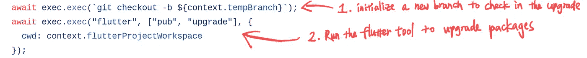
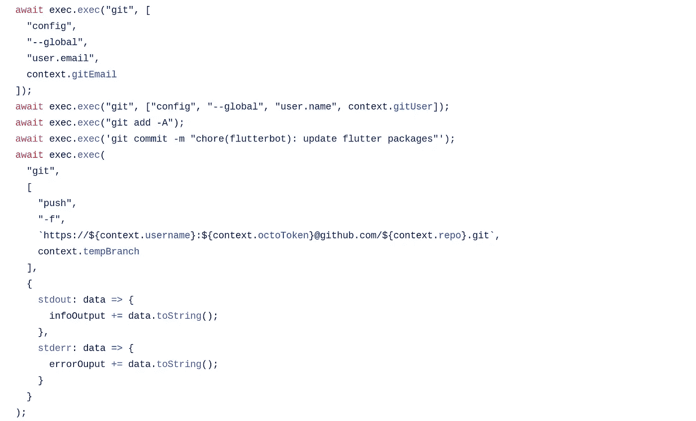
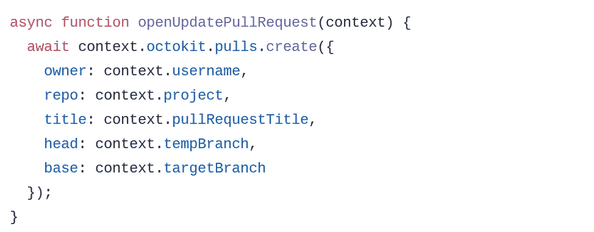
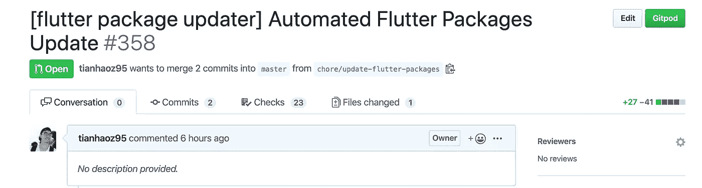
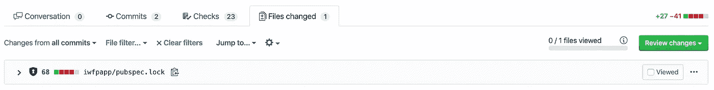
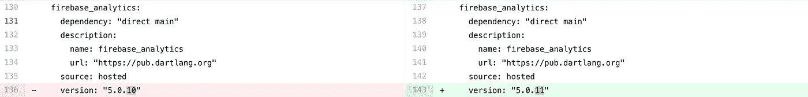

# 从头开始为 Flutter 实现你自己的依赖机器人

> 原文：<https://betterprogramming.pub/implement-your-own-dependabot-for-flutter-from-scratch-7f22b780ff68>

## 跳过等待官方支持红灯，保持你的颤振依赖最新

图片来源:来自[天昊 95/更新-飘动-包裹](https://github.com/tianhaoz95/update-flutter-packages)的横幅。

# 自动化的依赖性升级在 2020 年是必须的

2020 年，web、移动和机器学习开发已经变得难以置信地模块化，这意味着大多数项目依赖于大量的包。

尽管模块化提供了可重用性，但是维护最新的依赖关系可能是乏味的。

为了减少管理依赖项所浪费的时间，引入了[dependent bot](https://dependabot.com/)(一个自动化依赖项升级的实用程序)。更多关于 Dependabot 的细节请看[我的上一篇](https://medium.com/better-programming/auto-magic-dependency-management-for-monorepo-projects-using-dependabot-f5796f4d6c28)。

# Dependabot 非常优秀，但在支持新工具方面可能会比较慢

作为一款千人使用的产品，Dependabot 在构建新功能时要考虑很多边角情况，所以在支持新语言/框架方面会相对较慢。

因此，根据[本期](https://github.com/dependabot/feedback/issues/430)(已闲置一段时间)仍然不支持 Dart/Flutter。

# GitHub Action 提供了构建依赖型机器人的所有构件

如果有一个你想要但不存在的工具，那么我们应该创造它。

幸运的是，作为一个自动化平台，GitHub Action 提供了我们构建 Dependabot 所需的所有构件。

让我们一起一步一步地建立一个可靠的机器人。

注意:我借用了我的副业项目 Flutter Package Updater(Flutter 的 Dependabot 替代方案)的代码，它位于这个库:

 [## 天昊 95/更新-扑-包

### Dependabot 是一个自动保持依赖关系最新的好方法，但是对 Flutter 的支持仍然处于…

github.com](https://github.com/tianhaoz95/update-flutter-packages) 

下面是 GitHub Marketplace 中的即插即用操作:

 [## Flutter 包更新程序- GitHub 市场

### GitHub Action Dependabot 是自动保持依赖关系最新的好方法，但是对 Flutter 的支持是…

github.com](https://github.com/marketplace/actions/flutter-package-updater) 

要了解它在真实的 Flutter 项目中是如何工作的，请查看 [5%应用](https://medium.com/i-want-5)库:

 [## 天昊 95/iwfp

### 5% App 是一个帮助信用卡用户跨多张信用卡最大化返现奖励的实用程序。快速浏览一下…

github.com](https://github.com/tianhaoz95/iwfp) 

# 步骤 1:初始化 JS GitHub 动作

每个 GitHub 动作都需要一个`action.yml`供 GitHub 识别:

图片来源:来自[天昊 95/update-flutter-packages](https://github.com/tianhaoz95/update-flutter-packages) 的代码片段。

在`action.yml`中，我们需要定义我们需要从用户那里得到的信息:

图片来源:来自[天昊 95/update-flutter-packages](https://github.com/tianhaoz95/update-flutter-packages) 的代码片段。

以下是重要信息:

*   GitHub 凭证，用于提交更改并打开 pull 请求。
*   分支的首选名称和拉请求标题/内容。

# 步骤 2:从动作输入中检索所需的值

GitHub Action toolkit 提供了一个实用函数来以编程方式检索用户定义的值:

图片来源:来自[天昊 95/update-flutter-packages](https://github.com/tianhaoz95/update-flutter-packages) 的代码片段。

# 步骤 3:实现软件包升级

GitHub Action toolkit 还提供了一种轻松执行 bash 命令的方法:

图片来源:来自[天昊 95/update-flutter-packages](https://github.com/tianhaoz95/update-flutter-packages) 的代码片段。

如上所示，这里我们首先运行`git branch -b $target_branch`来创建一个新的分支，在这里我们升级`pubspec.yml`文件。然后我们执行`flutter pub upgrade`来升级`pubspec.yml`中的包。

# 步骤 4:提交升级的包并推送更新

有了`pubspec.yml`中保存的升级，我们需要将更改提交到我们的目标分支:

图片来源:来自[天昊 95/update-flutter-packages](https://github.com/tianhaoz95/update-flutter-packages) 的代码片段。

# 步骤 5:向主分支机构发出一个拉请求

最后，随着变更的提交和推送，我们需要打开一个 pull 请求来通知所有者。为此，我们可以使用 GitHub API 库 [Octokit](https://octokit.github.io/rest.js/v17) :

图片来源:来自[天昊 95/update-flutter-packages](https://github.com/tianhaoz95/update-flutter-packages) 的代码片段。

完成后，每次有新的软件包发布时，都会出现这样的拉请求:

# 结论

有了 Flutter 的 Dependabot，您可以节省依赖管理的时间，并构建新的特性。