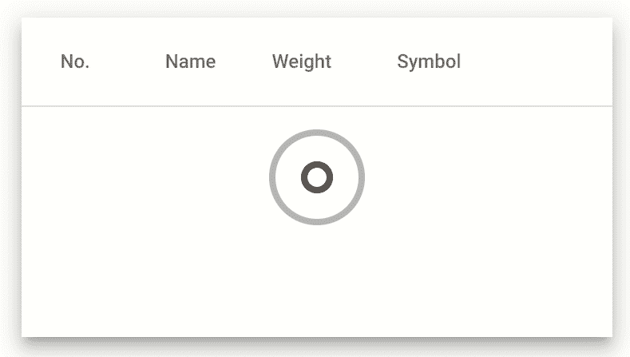
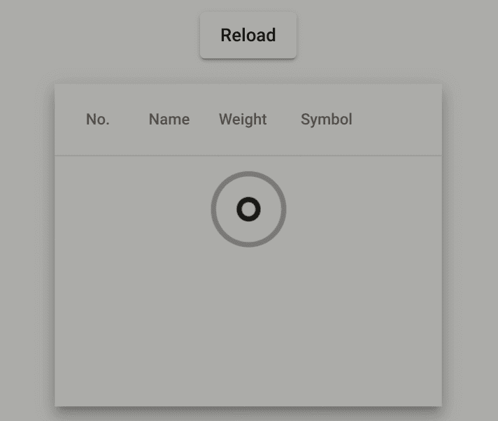
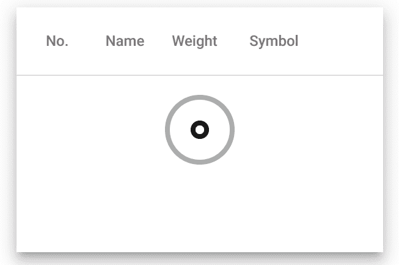
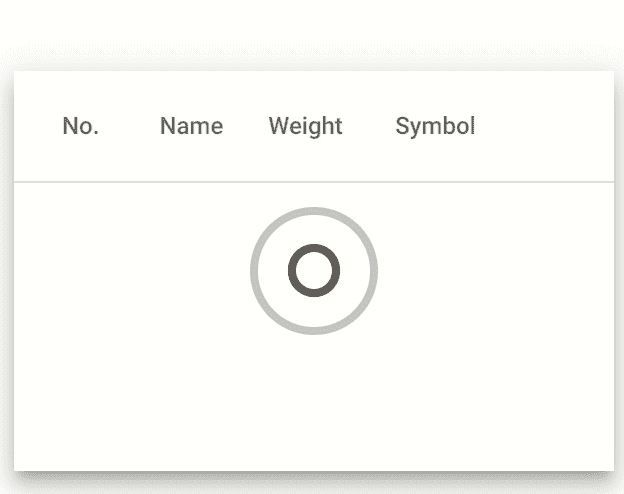

# 用角度 CDK 实现组件覆盖加载器

> 原文：<https://betterprogramming.pub/implementing-a-component-overlay-loader-with-angular-cdk-21c071f53b30>

## 通过向您的组件添加加载程序来支持 UX



在大多数 web 应用程序中，数据是从服务器加载的。它可以是图像、视频、纯文本或任何其他类型的数据。在检索该信息时，用户需要被告知一个视觉指示器。

在之前的一篇名为[“使用角度 CDK 实现页面覆盖加载器”](https://medium.com/@lambda_dev/implementing-a-global-overlay-loader-with-angular-e31ab4665cb1)的文章中，我们构建了一个服务，在整个页面的顶部显示一个组件，以通知用户并防止加载时的交互。这种方法通过在屏幕中央显示一个加载器来通知用户，从而解决了这个问题。然而，这对于用户来说可能是令人讨厌的，因为它阻止了与其他内容的交互。

这就是为什么本文要在组件之上添加一个加载器来通知用户，并让用户在加载时与其他组件进行交互。

# 重用我们的全局加载器

为了构建新的加载器，我们将重用我们之前构建的服务[，它负责显示和隐藏加载器，如下所示。](https://medium.com/@lambda_dev/implementing-a-global-overlay-loader-with-angular-e31ab4665cb1)



如果你还没有阅读前一篇文章，不要担心，这是推荐的，但不是必需的。你只需要看看下面的服务，然后继续阅读。

这是我们之前构建的服务。它负责显示和隐藏一个页面加载器，通过使用一个由角材料 CDK 提供的覆盖。

覆盖调用我们的`LoaderComponent`，它是一个组件，封装了由 [loading.io](https://loading.io/css/) 提供的 CSS 加载器动画。

为了从页面覆盖切换到组件覆盖，我们需要目标组件的引用。一种方法是将我们的服务转换成附加到目标组件的属性指令。

对于那些不知道的人来说，属性指令是一个角度概念，“改变 DOM 元素和角度组件的外观或行为”。如果你想更多地了解这个话题，我建议你阅读官方文档。

# 获取组件引用

为了用指令替换我们的服务，我们必须改变角度配置，用`@Directive`替换`@Injectable`。

由于我们从一个服务中移出，我们需要在一个`Module`中声明和导出我们的指令。我们可以在我们的`AppModule`中完成，但是让我们创建一个专用的模块，以避免有一个大而不可维护的`AppModule`。

接下来，我们将指令附加到组件，并将可观察对象传递给指令，以便知道何时显示和隐藏加载程序。

例如，我们将把指令附加到一个[角度材料表](https://material.angular.io/components/table/overview)。

此外，我们应该在指令中声明输入。

让我们在数据被请求时显示加载器，并订阅我们的 observable，以了解数据何时被传递，从而隐藏加载器。

现在我们将可观察对象传递给指令，我们有两个订阅。一个订阅来自异步管道，另一个来自我们的指令。这导致了两次 HTTP 调用，每个订阅一次。

为了减轻这种副作用，我们可以使用 RxJs 运算符`ReplaySubject`，将我们的可观测值从冷转变为热。如果你想深入了解这个话题，我建议你阅读本·莱什的文章[热与冷的对比](https://benlesh.medium.com/hot-vs-cold-observables-f8094ed53339)。

我们最终将我们的服务转化为指令。一切如前所述，我们有了改变装载机位置策略的目标组件的参考。

# 改变定位策略

现在我们使用了一个指令，我们可以注入组件引用来将加载器`positionStrategy`从全局改为局部。

让我们使用带有中心位置的`flexibleConnectedTo`将覆盖位置链接到`elementRef`。此外，我们可以删除让用户与其他组件交互的`hasBackdrop`。

恭喜你。最后，我们将页面加载器转换为组件加载器。


你现在可以把加载器附加到你想要的所有组件上，它会同样的渲染！

# 修复剩余的问题

作为软件开发人员，我们倾向于认为当我们走过快乐的道路时，它就结束了。

然而，为了生产高质量的软件，我们应该考虑并覆盖边缘情况。这就是为什么我们将看到加载器在滚动时的行为。



正如你所看到的，当我们滚动时，组件在移动，但是加载器没有移动，它停留在初始位置。这不是预期的行为。事实上，当组件移动时，加载程序应该跟随组件。

为了解决这个问题，我们可以使用`scrollStrategy`重新定位。这意味着当我们滚动时，它将重新定位覆盖图，以适应所提供的位置。

然而，这还不够。如果我们滚动直到组件消失，加载器应该是隐藏的。为此，我们可以禁用名为`withPush`的特性。

滚动问题已修复，我们的加载程序正常工作！



如果你不想在你的应用中维护这种逻辑，我们构建了 [ngx-load](https://github.com/Silvere112/ngx-load) ，一个为你做这项工作的库。

```
**Want to Connect?**Follow me on [Twitter](https://twitter.com/lambda_dev) to read more about Angular!
```