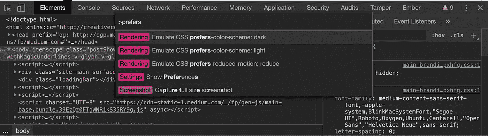
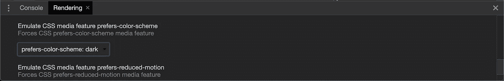

# 如何在你的网络应用中实现黑暗模式切换

> 原文：<https://betterprogramming.pub/implementing-a-dark-mode-switch-62d1a2883416>

## 为您的 web 应用程序添加配色方案响应


由[凯勒·伍兹](https://unsplash.com/@caleb_woods?utm_source=medium&utm_medium=referral)在 [Unsplash](https://unsplash.com?utm_source=medium&utm_medium=referral) 上拍摄的照片

在过去的几年里，深色模式(又名 a l [深色配色方案](https://en.wikipedia.org/wiki/Light-on-dark_color_scheme))变得非常流行。可以说，它对眼睛和电池来说更容易,[它受所有主要桌面和移动设备操作系统的支持。](https://www.popsci.com/night-dark-mode-design/)

在本文中，我将向您展示如何让您的 web 应用程序在操作系统级别响应用户选择的配色方案，以及添加一个配色方案开关，通过将用户的选择保存在浏览器的本地存储中来记住它。

# 目录

```
· [prefers-color-scheme](#9f2f)
  ∘ [Pro-tip](#565c)
· [Dark mode switch](#dccc)
· [Remembering user’s choice](#bd0e)
· [Further Reading](#e61c)
```

# 首选颜色方案

正如我们使用 [CSS 媒体查询](https://developer.mozilla.org/en-US/docs/Web/CSS/Media_Queries/Using_media_queries#Media_features)使我们的 web 应用程序对[屏幕分辨率](https://developer.mozilla.org/en-US/docs/Web/CSS/@media/width)做出响应一样，我们也可以使用媒体查询来增加对[用户偏好的配色方案](https://developer.mozilla.org/en-US/docs/Web/CSS/@media/prefers-color-scheme)的响应。

```
body { 
  background: white; color: black;
}@media (prefers-color-scheme: light) {
  body { 
    background: white; color: black;
  }
}@media (prefers-color-scheme: dark) {
  body {
    background: black; color: white;
  }
}
```

您可以在下面的代码沙箱中看到它:

## 亲 tip

出于测试的目的，你可以通过 Chrome 开发者工具强制设置值为`light`或`dark`。

打开 DevTools (F12)，按 shift+cmd/ctrl+P 运行命令，键入 prefers，然后选择一个选项:



你也可以通过点击右边的三个垂直点找到这些选项，然后点击更多工具>渲染。



# 黑暗模式开关

为了允许用户切换黑暗模式，而不管他们的[操作系统偏好](https://web.dev/prefers-color-scheme/#activating-dark-mode-in-the-operating-system)，我们将需要使用一些 Javascript。
我们首先将`data-color-scheme` [数据属性](https://developer.mozilla.org/en-US/docs/Learn/HTML/Howto/Use_data_attributes)添加到[根元素](https://developer.mozilla.org/en-US/docs/Web/API/Document/documentElement)中。当页面第一次加载时，该值将根据系统首选项进行设置。

```
const getPreferredColorScheme = () => {
  const darkQuery = "(prefers-color-scheme: dark)";
  const darkMQL = window.matchMedia ? window.matchMedia(darkQuery) : {};
  if (darkMQL.media === darkQuery && darkMQL.matches) {
   return "dark";
  } return "default";
};document.documentElement.setAttribute("data-color-scheme", getPreferredColorScheme());
```

接下来，我们将添加一组变量，这些变量将根据这个数据属性进行更改。

```
:root {
  --color-text: #191924;
  --color-background: #fff;
}:root[data-color-scheme="dark"] {
  --color-text: #fff;
  --color-background: #0d202d;
}body {
  color: var(--color-text);
  background-color: var(--color-background);
}
```

最后，对于开关，在 HTML 中添加一个按钮:

```
<button id="button">Toggle Dark Mode</button>
```

和一个单击事件处理程序:

```
document.getElementById("button").onclick = () => {
  const colorScheme = document.documentElement.getAttribute("data-color-scheme"); document.documentElement.setAttribute("data-color-scheme", colorScheme === "default" ? "dark" : "default");
};
```

您可以在这里观看现场演示:

# 记住用户的选择

您会注意到，如果页面被重新加载，data-attribute 的值会被重置。为了记住用户对配色方案的选择，我们将使用[本地存储](https://developer.mozilla.org/en-US/docs/Web/API/Window/localStorage)来保存数据属性值。

当页面加载时，我们需要检查是否有我们可以使用的值:

```
const colorScheme = **localStorage.getItem("color-scheme") ||** getPreferredColorScheme();document.documentElement.setAttribute("data-color-scheme", colorScheme);
```

而且，我们需要在使用开关时保存新值:

```
document.getElementById("button").onclick = () => {
  const colorScheme = document.documentElement.getAttribute("data-color-scheme"); const newColorScheme = colorScheme === "default" ? "dark" : "default"; document.documentElement.setAttribute("data-color-scheme", newColorScheme); **localStorage.setItem("color-scheme", newColorScheme);**
};
```

你可以在这里查看:

# 进一步阅读

在实现黑暗模式时，你可以而且应该做的不仅仅是在黑暗背景上显示浅色文本。我建议看看这两篇文章:

[](https://medium.com/dev-channel/hello-darkness-my-old-friend-48a97ab4379a) [## 你好，黑暗，我的老朋友

### 炒作过度还是必然？了解关于黑暗模式的一切，以及如何支持它以使您的用户受益！

medium.com](https://medium.com/dev-channel/hello-darkness-my-old-friend-48a97ab4379a) [](https://medium.com/@mwichary/dark-theme-in-a-day-3518dde2955a) [## 一天中的黑暗主题

### 使用一堆现代 CSS 来创建一个应用程序的夜间模式

medium.com](https://medium.com/@mwichary/dark-theme-in-a-day-3518dde2955a) 

感谢阅读。我希望你今天学到了新东西。保重，下次再见。