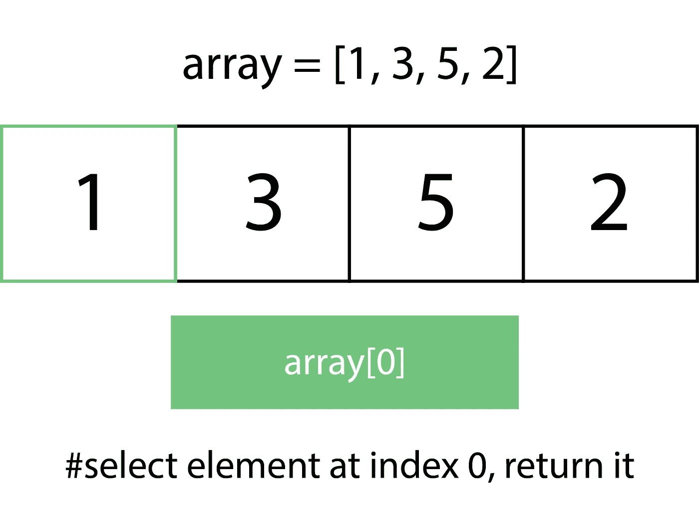
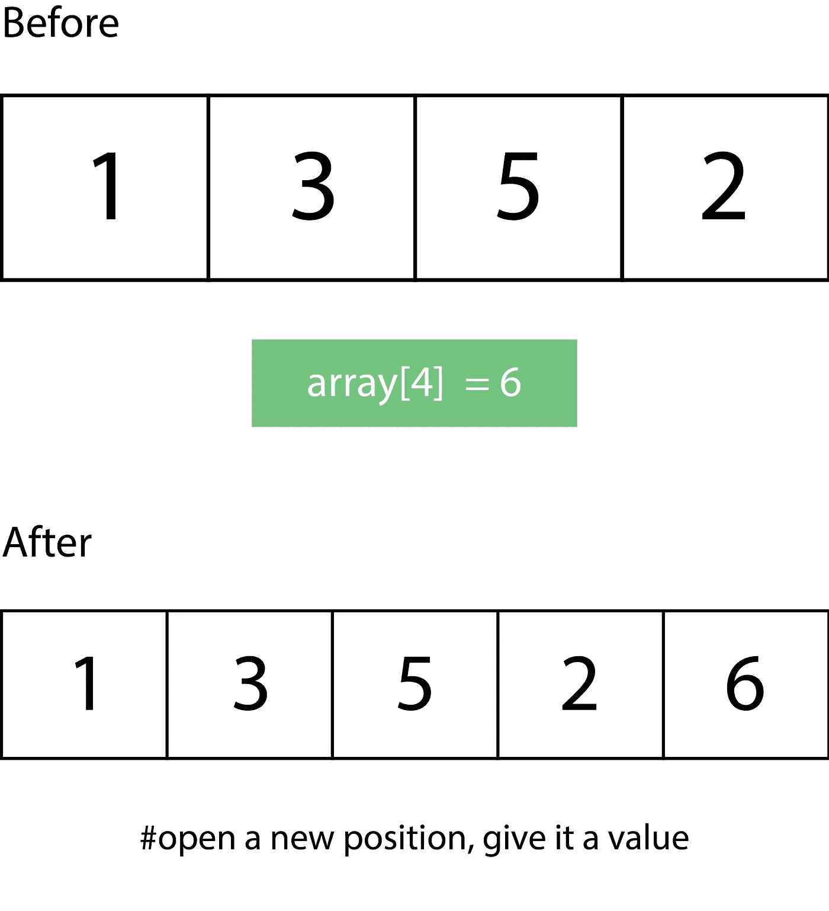
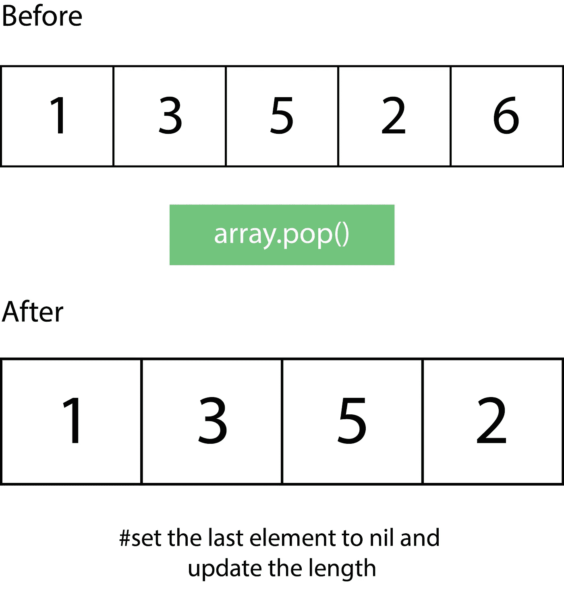
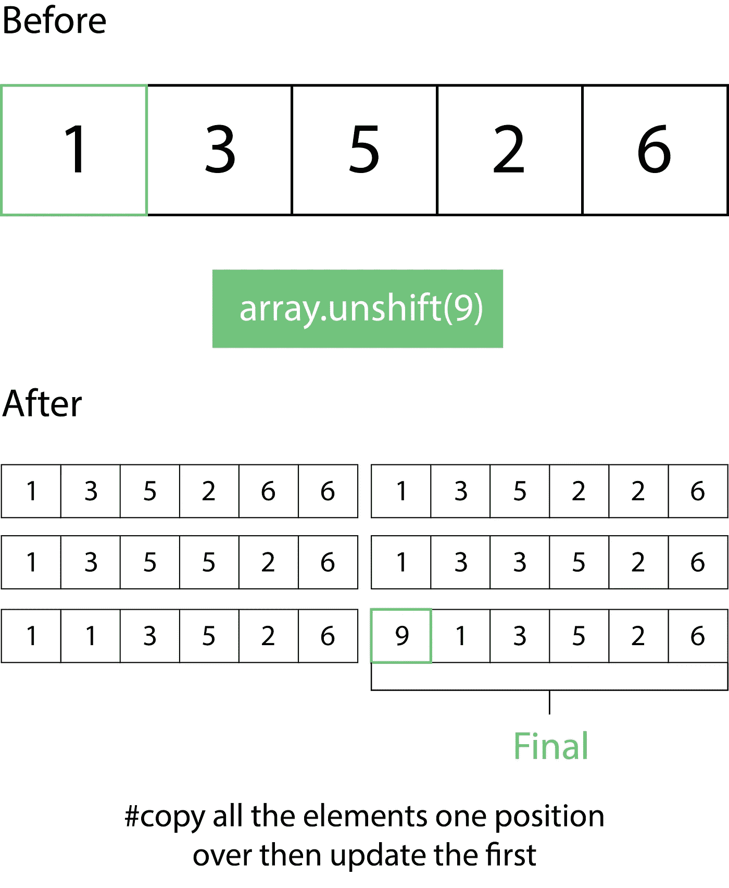
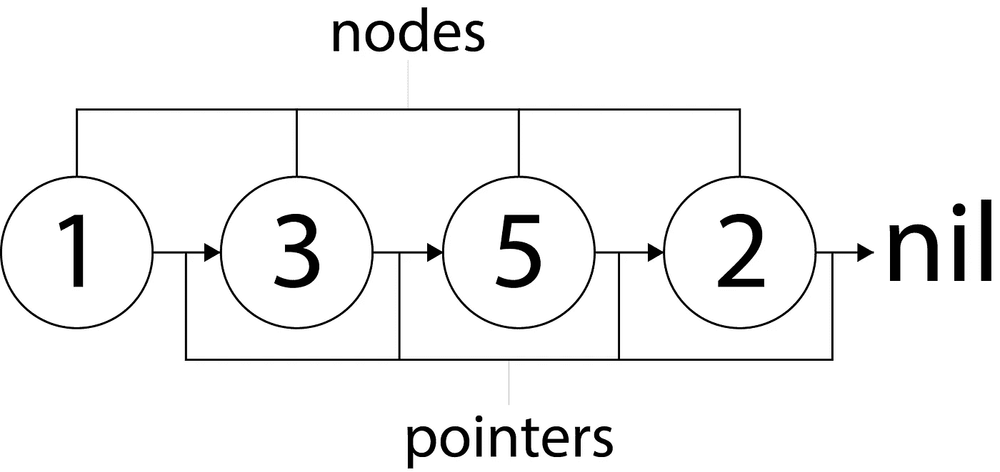

# 关于在 Ruby 中实现 Deque 的教程

> 原文：<https://betterprogramming.pub/implementing-a-deque-in-ruby-cf6e9bfd9c3c>

## 例子和方法— `pushFront`、`popFront`、`pushBack`和`popBack`

照片由[克里斯里德](https://unsplash.com/@cdr6934?utm_source=unsplash&utm_medium=referral&utm_content=creditCopyText)在 [Unsplash](https://unsplash.com/search/photos/programming?utm_source=unsplash&utm_medium=referral&utm_content=creditCopyText) 拍摄

如果你正在阅读这篇文章，我猜你已经知道什么是 deques，并且正在尝试用 Ruby 实现它，或者你正在学习 deques。

简单地说，我会试着唤起你的记忆或者增加你对德克的了解。

队列是一种抽象的数据结构。 *Deque* 是双端队列的首字母缩写。

为了解释它的重要性，我将假设您对大 O 符号以及您用来创建 bug 的编程语言中的一些内置数据结构的符号有所了解。

考虑下面的元素数组，如果你想通过键访问 0-index 中的元素，你有一个常数时间操作 O(1)。

如果你将一个元素添加到数组的后面，这也将是一个常数时间操作 O(1)。

这与从数组后面移除一个元素是一样的。

到目前为止，数组看起来很棒，是吗？

但是，昂贵的手术也随之而来。想象一下，如果您想在数组的前面添加一个元素，您需要将数组中的所有元素向右移动，这样做的代价是$O(n)。

从这里我们可以看到，我们必须执行六次操作才能将一个元素添加到数组的前面。想象一下，如果数组中有 100 万个条目，那么很快就会变成 100 万次操作。

从数组前面移除一个元素也是一样的，只是顺序相反。

如果您正在执行一些任务，其中访问元素是次要的，并且您将更频繁地在数据结构的前端添加和删除元素…

这就是 deque 派上用场的地方。它就像一个开放式数组，允许您在 O(1)时间内从数据结构的前面或后面添加和删除元素。

它给你一些俏皮的方法，比如`pushFront`、`popFront`、`pushBack`、`popBack`等等。

Deques 的工作原理是节点和指针:

每个节点至少有两个部分，节点的值和至少一个指针(它可以有两个，我们将在本教程后面看到)。指针指向其他节点，这就是队列在内存中的链接方式。

让我们实现一个并看看这些方法的作用:

首先，我们设置节点类，使我们能够创建节点。

*创建一个节点类，使您能够将节点添加到您的队列中*

从上面的类中，我们可以看到，节点的值存储在`@value`中，指针是指向“前面”节点的`@next_node`，以及指向“后面”节点的`prev_node`。

接下来，我们初始化我们的 deque 类。有很多方法来设置队列，但这是我最喜欢的，请用你的方法来试验。

用设置为 nil 的第一个元素初始化 deque

接下来，我们需要一个`pushFront`方法，允许我们添加到队列的前面。这个方法将很快成为我们最好的朋友，以及它的对手`popFront`。

前推方法非常重要，它允许我们在队列的前面添加元素

接下来，我们需要声明`pushBack`，一个将节点添加到队列后面的方法。

pushFront 向队列的前面添加新元素

既然我们已经知道了如何在 deque 中放置东西，让我们试着移除。首先，从前面通过声明`popFront`。

现在，后面，用`popBack`。

接下来，我们可能想要检索第一个或最后一个元素，因为它们对我们来说是最重要的。我们从第一个开始，声明`topFront`。

topFront 返回队列中的第一个元素

然后，最后用`topBack`。

topBack 返回队列中的最后一个元素

我们可能想问我们的 deque 的另一个重要问题是它是否为空:

isEmpty？通过检查第一个元素是否为零来返回布尔值

现在，我将在这里停止这个实现，但是还有一些方法可以添加到 deque 中，让它做一些更令人惊奇的事情。

如果你需要一些帮助，请告诉我，我会为这个教程制作一个或几个续集。

# 资源

在我的 [GitHub repo](https://github.com/Oluwadamilareolusakin/ruby-deque) 中找到本教程的代码。

关于 deques 有用性的例子，请查看我的关于滑动最大值问题的教程。