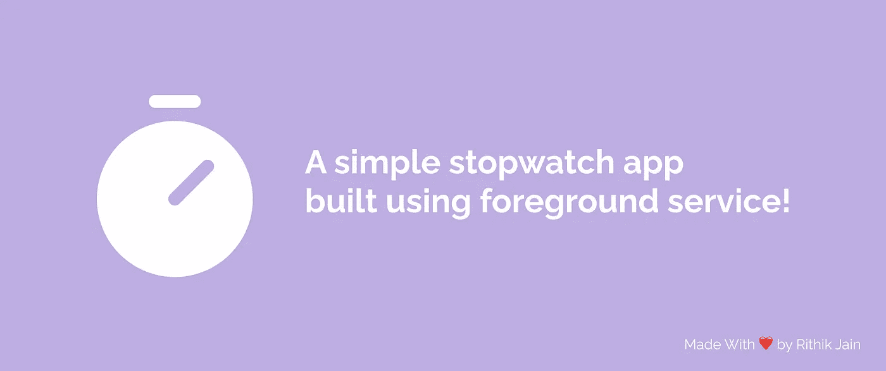
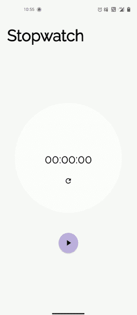
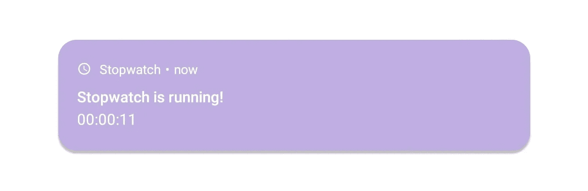

# 使用前台服务构建秒表 Android 应用程序

> 原文：<https://betterprogramming.pub/implementing-a-foreground-service-in-android-building-a-stopwatch-app-5a1da85d929f>

## 一个简单的实现

你有没有想过，一些像 Spotify、Google Maps、Google Meet 这样的应用，即使在用户/系统已经杀死了应用之后，它们是如何继续运行的？嗯，你猜对了，是因为前台服务。

我们将构建一个简单的秒表应用程序，它将使用一个服务来支持所有的秒表功能。一旦应用程序进入后台，我们将把后台服务转换为前台服务，这样即使应用程序在后台，我们的秒表仍然可以工作。

我们将实际构建的应用程序:

## 前台服务到底是什么？

这就是 Android 官方文档所述:

> 前台服务执行用户可以注意到的操作。
> 
> 前台服务显示一个[状态栏通知](https://developer.android.com/guide/topics/ui/notifiers/notifications)，这样用户就能主动意识到你的应用程序正在前台执行一项任务，并且正在消耗系统资源。除非服务被停止或从前台删除，否则无法解除通知。

我给你说清楚一点。

任何服务都可以执行后台任务，只要你的应用对用户可见，这就没问题，但一旦应用被用户杀死或长时间闲置，Android 可能会决定杀死进程，这将导致你的服务依次被杀死。

为了解决这个问题，我们使用前台服务，确保我们的服务不会在应用程序处于后台时被 Android 杀死。

由于安全原因，前台服务总是需要显示一个通知，在任务完成之前不能被取消，以便用户知道后台正在发生什么

前台服务的通知示例

## 是时候构建秒表应用程序了

是的，我们已经完成了理论，现在让我们建立应用程序。

首先，让我们添加使用前台服务所需的权限。

在您的`AndroidManifest.xml`中添加以下行

下面是呈现秒表用户界面的布局文件:

现在我们将开始构建`StopwatchService`，它将处理秒表功能的核心逻辑。

创建服务类别:

我们现在需要让 Android 系统知道我们有一项服务。为此，我们将把它添加到应用程序标签下的`AndroidManifest.xml` :

让我们在 *StopwatchService.kt* 中创建一些常量，帮助我们与服务进行通信:

服务类要求我们覆盖两个函数。让我们现在做那件事。

从 Android 8.0 开始，我们需要创建一个通知通道。

同时，我们还将创建一个函数来访问系统的`NotificationManager`以备将来使用。

现在让我们定义每个功能并设置它们的功能。

我们已经成功实现了所有的功能，只要应用程序还活着，我们就可以使用这项服务来运行秒表。

但是现在让我们来实现允许我们构建、更新通知和启动/停止前台服务的功能。

**现在让我们使用 MainActivity 中的服务来使应用程序发挥作用**

定义两个广播接收机。一个负责接收秒表的状态，另一个负责接收经过的时间。

> *广播接收器* ( *接收器*)是一个 Android 组件，允许您注册系统或应用程序事件。一旦事件发生，Android 运行时会通知事件的所有注册接收者。

在`onResume`中，我们将以如下方式初始化`BroadcastReceivers`:

功能`updateLayout`和`updateStopwatchValue` 用于用从广播接收器接收的适当值更新布局

Android 组件(服务、接收者、活动)可以通过`startService(intent)`方法触发服务的执行。

如果调用了`startService(intent)`方法，而服务尚未运行，则创建服务对象并调用服务的`onCreate()`方法。

一旦*服务*被启动，就会调用*服务*中的`onStartCommand(intent)`方法。它从`startService(intent)` 调用中传递意向对象。

让我们定义并添加将用于与服务通信的所有函数:

在`onCreate`中点击按钮时触发适当的功能:

现在对于最后一部分，我们需要分别从`onPause`和`onStart`调用`moveToForeground`和`moveToBackground`函数来适时地启动和停止前台服务。

## 项目存储库

 [## GitHub-rithikjain/stopwatch-app:一个利用前台服务的简单秒表应用程序。

### 此时您不能执行该操作。您已使用另一个标签页或窗口登录。您已在另一个选项卡中注销，或者…

github.com](https://github.com/rithikjain/stopwatch-app) 

## 几个指针

*   如果从后台调用 startService，它将抛出一个`IllegalStateException`并崩溃
*   您可以使用`startForegroundService`(或`ContextCompat.startForegroundService`)让系统了解您的服务性质。如果这样做，您需要在 5 秒钟内从您的服务类调用`startForeground`方法
*   ID 为 0 的前台服务将无法工作(我对此一无所知，不得不花费数小时调试为什么我的前台服务无法工作)

感谢您的阅读。