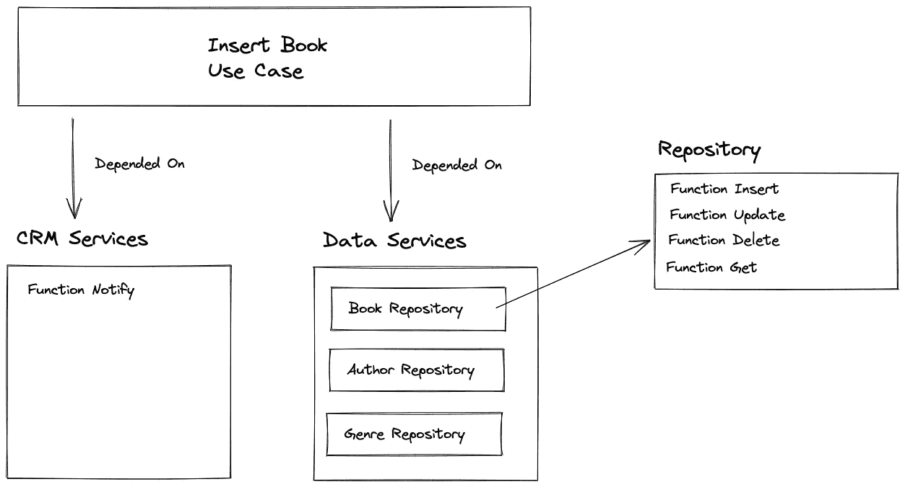
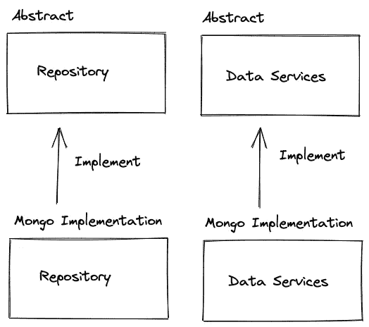

# 使用 NestJS 实现通用存储库模式

> 原文：<https://betterprogramming.pub/implementing-a-generic-repository-pattern-using-nestjs-fb4db1b61cce>

## 通用存储库——NestJS 和 Mongoose 实现

照片由[埃斯瓦兰·阿鲁科马尔](https://unsplash.com/@eswaran_arulkumar?utm_source=medium&utm_medium=referral)在 [Unsplash](https://unsplash.com?utm_source=medium&utm_medium=referral) 上拍摄

> 存储库是封装了访问数据源所需的逻辑的类或组件。它们集中了常见的数据访问功能，提供了更好的可维护性，并将用于访问数据库的基础设施或技术从域模型层中分离出来。— [设计基础设施持久层](https://docs.microsoft.com/en-us/dotnet/architecture/microservices/microservice-ddd-cqrs-patterns/infrastructure-persistence-layer-design)

抽象我们的数据访问层将把我们的应用程序业务逻辑从实现细节中分离出来，比如 mongo db/sql 数据访问代码。

诸如 DB 框架变更这样的框架变更不应该影响我们的核心服务，它们应该对我们的业务逻辑代码透明。

我们的服务应该只依赖于抽象，而不是实现。数据服务也是如此。

例如，我们有一个书店微服务。我们有一个“添加新书”用例，在这个用例中，我们使用图书存储库来添加新书。我们不关心具体的数据库实现，也不想被任何数据库所束缚。

依赖抽象

你可以在这个[报告](https://github.com/royib/clean-architecture-nestJS)中找到所有带有完整示例的代码

我们的`Author`、`Genre`和`Book`实体是:

# 抽象

首先，让我们创建我们的抽象:

`AbstractRepository`类的代码如下所示:

*   您可以根据需要添加任意多的功能。
*   `T`代表各个实体

`AbstractDataServices`类的代码如下所示:

*   我们公开 3 个存储库，每个业务实体一个。
*   每个存储库公开了所有通用的存储库功能

这些是我们的抽象，我们的业务服务可以与它们一起工作，而无需任何实现。

现在是时候添加一个实现了，在本文中，我们将使用 mongoose 实现我们的数据服务。

# MongoDb 实现

我们的 MongoDB 实现将被包装在一个模块中，我们将只公开抽象。

抽象实现

我们需要实施:

*   Mongo 模型—具有所有 mongo 规范
*   我们的通用存储库——连接到 mongo
*   数据服务——公开我们的 mongo 库

## 模型

首先，让我们创建我们的实体，它们将用猫鼬装饰者来装饰

## Mongo 通用存储库

让我们实现我们的 mongo 通用存储库

*   简单的 mongo 实现。
*   将使我们能够用连接的实体填充我们的模型

## Mongo 数据服务

在这里，我们需要创建我们的存储库，并向我们的消费者公开它们

## Mongo 数据服务模块

在本模块中，我们将:

*   将连接添加到 MongoDB
*   告诉我们的 DI 引擎在每次一个类请求`IDataServices`时创建`MongoDataServices`

## 主数据服务模块

这个模块不是必须的，但是我喜欢创建它，因为它隐藏了我们主模块的任何特定实现

## 将模块插入我们的主应用程序

*   使用我们早期创建的`DataServiceModule`，我们在这里看不到任何 mongo 实现的东西，我们只是添加了`DataServiceModule`。

## 让我们带这位美女去兜风吧

现在让我们在应用程序中使用我们闪亮的新数据服务。

例如，让我们在图书服务中使用它来获取图书并将新书添加到我们的数据库中。

*   我们将`IDataServices`注入到我们的服务中
*   我们的用例逻辑不依赖于任何数据库实现，只依赖于抽象。
*   改变我们的数据库提供者根本不会影响我们的用例代码。

假设我们想更换我们的数据库提供商，我们需要做的就是:

*   创建一个新的数据库模块，包括:`GenericRepository`、`DataServices`
*   消耗`[DataServicesModule](https://github.com/royib/clean-architecture-nestJS/blob/main/src/services/data-services/data-services.module.ts)`中的新模块

就这样，我们的应用程序没有其他变化。你老板会高兴的:)

存储库模式是将应用程序从外部数据库框架中分离出来的一个很好的方式，通用存储库减少了实现它所需编写的代码量。

# 后续步骤

您可以在我写的一篇关于这个主题的文章中阅读更多关于在您的 NestJs 应用程序中实现一个干净的架构的内容——[Clean node . js Architecture——使用 NestJs 和 TypeScript](/clean-node-js-architecture-with-nestjs-and-typescript-34b9398d790f)