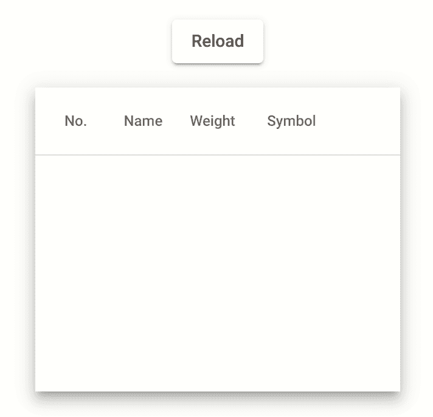

# 用角度 CDK 实现页面覆盖加载器

> 原文：<https://betterprogramming.pub/implementing-a-global-overlay-loader-with-angular-e31ab4665cb1>

## 为你的页面添加一个加载器，对 UX 友好


在大多数 web 应用程序中，数据是从服务器加载的。它可以是图像、视频、纯文本或任何其他类型的数据。在检索该信息时，用户需要被告知一个视觉指示器。

这就是为什么这篇文章是关于在整个页面的顶部添加一个组件，通知用户并防止加载过程中的交互。

# 创建要加载的组件

我们将重复使用来自[角形材料](https://material.angular.io/components/table/overview)的桌子作为示例。

克隆组件后，让我们使用这个函数模拟一些网络延迟。

我们可以用 5000 毫秒调用这个函数，现在我们有了一个添加加载程序的借口🤓



# 创建加载器服务

我们的方法包括使用[角度材质覆盖](https://material.angular.io/cdk/overlay/overview)在整个页面的顶部添加一个组件。

首先，让我们创建负责显示加载程序的`LoaderComponent`。我们将使用来自 [loading.io](https://loading.io/css/) 的加载器作为例子。

为了将`LoaderComponent`显示为覆盖图，我们首先需要注入角度材质覆盖服务。

接下来，我们**通过使用覆盖服务创建一个覆盖图**。

可以使用`positionStrategy`属性定制覆盖图，将组件放置在页面的中央。此外，`hasBackdrop`可用于添加灰色背景，防止用户在加载时进行交互。

接下来，我们需要使用下面的方法将`LoaderComponent`附加到覆盖层上，或者从覆盖层上分离。

最后，我们可以在服务中封装代码，使逻辑更容易重用。

## 使用加载器服务

就像我们对覆盖服务所做的那样，让我们将`LoaderService`注入到要加载的组件中。

现在我们调用方法`showLoader`，然后我们订阅请求，最后，一旦收到响应，我们`hideLoader`:

塔达姆🎉


# 通过反应式界面改善我们的服务

既然加载器已经可以工作了，是时候改进代码了。(至少)有两个方面需要改进。首先，我们需要在所有要加载的组件中实现显示/隐藏逻辑。这可能会导致在加载时创建更多组件时出现许多样板代码。

第二个是建议尽可能少的手动订阅 Observable。关于这个话题的更多信息，我建议阅读 Angular 中的文章 [RxJS:何时订阅？(很少)](https://indepth.dev/posts/1279/rxjs-in-angular-when-to-subscribe-rarely)来自迈克尔·洛顿。

为了解决第一个问题，我们将创建一个负责显示/隐藏逻辑的 [RxJs 操作符](https://rxjs.dev/guide/operators)。

现在我们可以应用我们的操作符，并删除组件中的`showLoader`和`hideLoader`的使用。

接下来，我们将使用[异步管道](https://angular.io/api/common/AsyncPipe#asyncpipe)来移除手动订阅。

最后，我们用赋值替换订阅。

# 下一步是什么

我们刚刚完成了页面加载器的构建。这对于让用户等待和阻止与其他组件的交互非常有帮助。然而，阻止用户与其他组件交互可能有点令人沮丧。这就是为什么我建议阅读关于将页面加载器转换成组件加载器的下一篇文章。

[](https://medium.com/@lambda_dev/implementing-a-component-overlay-loader-with-angular-cdk-21c071f53b30) [## 用角度 CDK 实现组件覆盖加载器

### 向您的组件添加加载程序，成为 UX 友好型

medium.com](https://medium.com/@lambda_dev/implementing-a-component-overlay-loader-with-angular-cdk-21c071f53b30) 

否则，如果你不想在你的应用程序中维护这个逻辑，我们构建了 [ngx-load](https://github.com/Silvere112/ngx-load) ，一个为你做这项工作的库。

```
You can also connect with me [Twitter](https://twitter.com/lambda_dev) to read more about Angular!
```