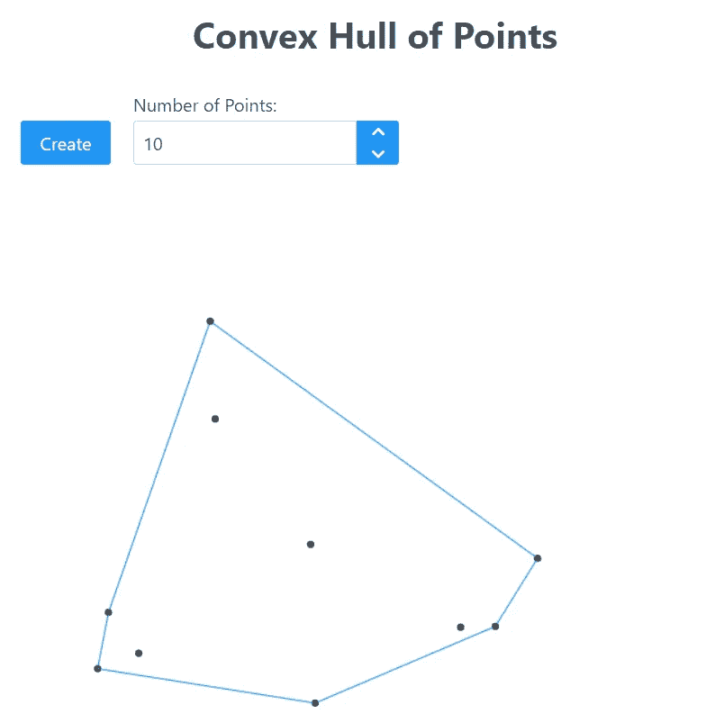

# 用 Rocket 实现 Web 应用程序

> 原文：<https://betterprogramming.pub/implementing-a-web-app-with-rocket-5e56c7e484a0>

## 利用这个成熟的 Rust 框架的力量


在这个故事中，我想向你展示一个例子，如何在 [Rocket framework](https://rocket.rs/) 之上创建一个带有后端的 web 应用程序。

此外，我们将通过构建 docker 映像来容器化应用程序。这个应用程序被认为做了一些非常简单的事情。它将提供随机点的凸包的可视化，正如我在最近的帖子[这里](https://applied-math-coding.medium.com/grahams-scan-algorithm-an-implementation-in-rust-39c7536591b5)中所承诺的。如果你对所使用的算法感兴趣，你可以参考前面提到的文章，但是为了理解后面的内容，这并不是不可避免的。如果你对 Rust 完全陌生，在阅读这篇文章之前，你可能想先从一些介绍开始，比如这里的。

我们在这个故事中的目标如下:

1.  创建一个火箭服务器并通过一个 API 服务于 Graham 的扫描算法
2.  创建基于浏览器的前端，请求服务器对一组随机点运行上述算法
3.  将前端作为静态资源托管在 Rocket 服务器上
4.  创建构建前端、后端和运行服务器的 docker 文件

## 创建服务器:

首先，Rocket 是一个相对成熟的用 Rust 构建 web 应用的框架。它支持许多功能，并执行良好和安全的标准。

首先，我们通过以下方式创建一个项目…

```
cargo init --bin
```

…在某个项目文件夹中。这为我们创造了必要的`Cargo.toml`。

为了能够使用 Rocket，我们需要添加以下依赖项:

```
...[dependencies]
**serde** = { version = "1.0.136", features = ["derive"] }
**rocket** = { version = "0.5.0-rc.1", features= ["json"] }
```

`serde`用于支持请求/响应数据的解序列化，对于`rocket`，我们设置了特性`json`。

`Features`是一个货物的概念，可以很好的减少建筑尺寸。特别是，`json`特性支持`json`数据请求/响应，而`serde`的`derive`特性包含一些实用程序，可以轻松地为我们的 Rust 数据类型“派生”解编/序列化特征。我们将很快看到这一点。

这段代码很容易定义两个端点:

*   `GET /test`只返回字符串`hello world`
*   这需要一个 JSON 编码的`Point`列表，在这些点上调用 Graham 扫描算法并返回结果，即一个 JSON 编码的`Point`列表

在后一个端点中，宏包含参数`data`。这应该将解析后的请求体的结果与变量`points`粘合在一起。

此外，用`#[launch]`标注的函数`rocket`提供了实际的 main 方法。这里，构建了`rocket`的一个实例(服务器)，并且针对上述端点安装了几个路径。

像`.mount("/api", routes![convex_hull, index])`一样`mount`的调用使得`convex_hull`中定义的端点分别。`index`在普通路线`/api`下可用。对`mount`的第一次调用在路径`/`下绑定了整个文件系统，即`/client/dist`。这使得放置在`/client/dist`中的文件直接可用。我们将使用它来托管所有静态前端资产，如`index.html`等。

我想，再简单不过了。此外，这种结构类似于一种典型的建立服务器的现代方式(例如参见 [Express](https://expressjs.com/) )。

有了这些，我们就可以像往常一样通过`cargo run`运行项目，并将浏览器指向`[http://localhost:8000/test](http://localhost:8000/test)`以获取字符串`hello world`。

我们在`main.rs`中增加了一项内容，这是对我们端点的 e-2-e 测试:

在一个更大的项目中，您可能会将它放在另一个文件中，但是出于我们的目的，它可以放在`main.rs`中。这也是铁锈和火箭一起发光的地方。首先，测试通常是通过添加一个用`#[cfg(test)]`标注的模块来建立的。所以我们已经知道了将运行所有测试的测试员:`cargo test`。

其次，Rocket 在一个模块`local`中提供了各种工具，支持针对端点测试客户端请求。正是这个部分创建了一个 HTTP 客户端并向`/api/convex-hull`发出 POST 请求:

```
// creating a client
let client = Client::tracked(super::rocket()).unwrap();// making a POST request with JSON-encoded body
let response = client
   .post("/api/convex-hull").json(&points).dispatch();
```

剩下的代码只是使用通常的`assertEq!`来验证产生的响应是否与我们的预期一致。

## 创建客户端

这个应用程序的特定客户端是一个用 [Vite](https://vitejs.dev/) 构建的 [Vue](https://vuejs.org/) 项目。由于客户端不是我们在这个故事中的主要焦点，我不会给出比下面更多的细节。

如上所述，服务器被设置为针对目录`/client/dist`安装路由`/`。因此，无论客户端是什么，它的`html, js, css`资源都必须在这个文件夹中可用。

因为我将 Vue 与 TypeScript 和 Sass 一起使用，所以需要一个构建步骤来生成所有浏览器可读的工件，并将它们放入提到的文件夹中。

## 集装箱化(码头工人)

Docker 是一种发布或部署应用程序的好方法。对于接下来的内容，我们假设环境中已经安装了某个版本的 docker，并且您对 docker 有一些基本的了解。

多阶段构建应用程序的 docker 文件如下:

```
FROM node:16.13.1 AS **client**
WORKDIR /app
COPY ./client .
RUN npm i
RUN npm run buildFROM rust:1.60 AS **server**
WORKDIR /app
COPY . .
COPY --from=client /app/dist ./client/dist
RUN cargo build --release
CMD ["./target/release/convex-hull"]
```

第一部分是关于构建前端。这是在包含 Node.js 并运行 Vite 的所有构建步骤的映像上完成的。

第二部分是构建我们的服务器。来自上述前端构建的工件被复制到这个阶段，然后我们指示 cargo 构建项目:`cargo build --release`。

最后一个命令(`CMD`)只有在我们稍后运行容器中的图像时才会执行。

上面这个`Dockerfile`是这样执行的:

```
docker build -t convexhull .
```

之后，我们可以通过执行以下操作来验证图像是否已经创建

```
docker image ls
```

最后，我们可以运行映像并进行端口映射，以确保我们能够从外部访问服务器:

```
docker run -it -p 8000:8000  convexhull
```

有了这个，我们可以将我们的浏览器指向`[http:\\localhost:8000](http://localhost:8000/)`,并且希望，下面的不那么压倒性的用户界面会出现:



请注意，上面的 docker 文件只是为了快速共享一个原型项目。它远远没有被优化，并且存在许多选择来显著减小它的尺寸。

docker 的一个非常好的特性是 [docker-hub](https://hub.docker.com/) 。如果您在这里创建了一个帐户，您可以将上面构建的映像推送到一个存储库中，并与其他人共享。你只需要做以下步骤:

首先，在 docker-hub 创建一个新的存储库。然后执行以下步骤:

```
docker login  // this will ask you to authenticatedocker tag convexhull:latest YOURACCOUNT/REPONAME:convexhulldocker push YOURACCOUNT/REPONAME:convexhull
```

这将把图像`convexhull`推送到相应的存储库。请确保用您选择的名称替换`YOURACCOUNT/REPONAME`。

尽你所能告诉你想分享你的图片的人去做

```
docker pull YOURACCOUNT/REPONAME:convexhulldocker run -it -p 8000:8000 YOURACCOUNT/REPONAME:convexhull
```

如果你想用我的，你可以这样做

```
docker pull appliedmathcoding/convexhull:convexhull
docker run -it -p 8000:8000 appliedmathcoding/convexhull:convexhull
```

可以从这个[库](https://github.com/applied-math-coding/convex-hull)中看到并克隆整个项目。一定要跑

```
git checkout v1.0
```

从克隆的存储库中查看与本文对应的版本。

当然，这个故事只讲述了用 Rocket 开发 web 应用程序的基础知识，但是更多的内容还在后面的文章中。

感谢阅读！