# 用裸 HTML 和 JavaScript 在 AWS 上实现 Web 表单

> 原文：<https://betterprogramming.pub/implementing-a-web-form-on-aws-with-bare-html-and-js-5b0a319a702e>

## 有效处理 web 表单数据

照片由[弗雷迪婚姻](https://unsplash.com/@fredmarriage?utm_source=medium&utm_medium=referral)在 [Unsplash](https://unsplash.com?utm_source=medium&utm_medium=referral)

框架无处不在。作为后端开发人员，我总是躲在漂亮 ui 的阴影下。每次我试图写一个前端，我都会被 JS 和 CSS 的框架和库的数量所迷惑。即使当我使用 NodeJS 作为我的主要工具时，我也只能勉强理解 React、Angular、Vue 和其他框架的复杂性。当我搬家时，情况变得更糟了。现在，写前端所需的不可计数的依赖项、解释器、构建器等等让我更加害怕。

前一段时间，我挑战自己，测试在没有框架的情况下，编写一个基本的 web 应用程序是否可行。我想创建比一堆静态 HTML 更复杂的东西，但我也不想让事情过于复杂。最后，我决定构建一个简单的 web 表单，用户可以在其中提交一些信息，比如一个*“联系我”*或*“订阅”*表单。

Web 表单似乎是使用框架的一个很好的用例。客户端需要处理用户输入，将数据发送到后端系统，并在收到数据处理结果后更新界面。后端应该处理数据，并提供一个 API 来处理客户端的请求。

我决定轻装上阵，在前端使用基本的 HTML、CSS 和 JS。至于后端，我计划只使用 AWS 服务——不在 EC2 或 lambdas 上运行定制代码。

分析问题后，我设计了以下解决方案:

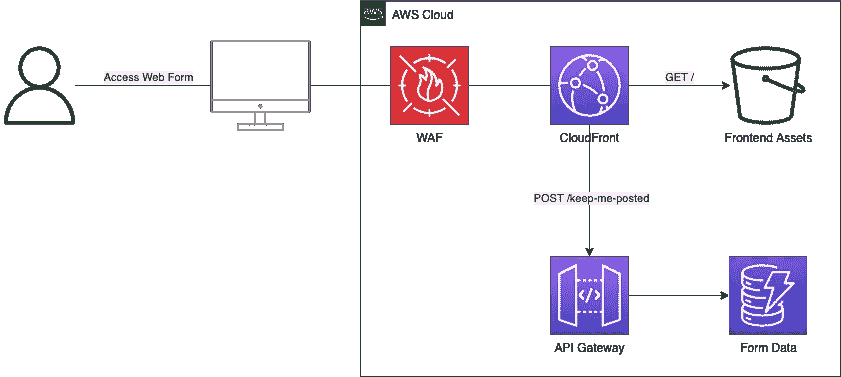

图一。解决方案设计

如您所见，即使是这样一个基本的应用程序也有多个 epics 要实现。他们在这里:

*   制作和托管静态内容
*   处理用户数据
*   提供内容
*   保护服务

以下各节详细阐述了每一部史诗。同时，如果你想看到最终的解决方案源代码，你可以在[无服务器表单](https://github.com/antklim/serverless-form)存储库中找到它。它具有以下结构:

*   目录包含所有与 AWS 相关的资产——云形成模板和自动化脚本
*   `form`目录包含所有 web 表单资产——HTML 页面、CSS 和 JS

# 制作和托管静态内容

本节介绍 web 表单开发和托管前端资产的基础设施。

我设计了一个基本的 web 表单，有几个输入框和一个提交按钮。此外，我想用一些 CSS 使它变得漂亮。对于一个经验丰富的前端开发人员来说，实现这样的表单没什么大不了的，但是对我来说，这是有问题的。因此我使用了 [HTML5 样板文件](https://html5boilerplate.com/)和[引导程序](https://getbootstrap.com/)来节省时间。我将一些来自 Bootstrap CSS 的基类应用于按钮和输入字段。

HTML5 样板模板可以作为归档文件使用。我把它解压到我的 ***表单*** 目录下，只安装了一个 ***npm*** 依赖项— [ParcelJS](https://parceljs.org/) 。ParcelJS 是一个简单但功能强大的构建工具，它允许我在本地运行 web 表单并捆绑资产。我将一个引导 CSS CDN 链接直接添加到 web 表单的 HTML 中，以访问 CSS 类。希望前端模板和 CSS 库的使用不算框架的使用。

有多种方法可以实现与后端系统的 web 表单交互。最简单的方法是只使用 HTML。在这种情况下，浏览器会为您完成所有工作。它将输入字段映射到请求负载，发送请求并重定向到结果页面。

例 1。基本 HTML 表单

另一种选择是使用 JavaScript 与后端系统交互。在这种情况下，开发人员负责请求字段映射，发送请求并通知结果。该选项提供了更多的自由，并创建了更复杂的用户体验。权衡是——有更多的东西需要维护。

例 2。带有 JS 的 HTML 表单

我编写了下面的 JS 代码来将 web 表单数据提交给后端系统。

示例 2.1 HTML 表单的 JS

我在 JS 中的 submit 按钮上附加了一个 click 事件监听器。事件处理程序协调多项工作:请求有效负载合成、发送请求和处理响应。为了将数据发送到后端，我使用了 [Fetch API](https://developer.mozilla.org/en-US/docs/Web/API/Fetch_API) ，这在大多数现代浏览器中都可以使用。

HTML5 样板中可用的工具允许我在浏览器中预览表单。

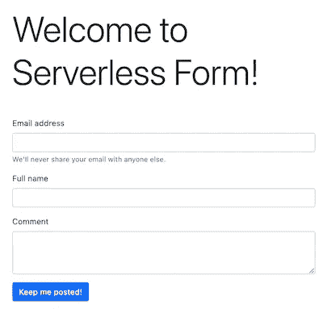

图二。随时向我发布网络表单

在我创建了表单之后，下一步是准备通过公共互联网访问它。

## AWS S3 上的托管表单

AWS S3 是分发数字资产和托管静态网站的最简单的选择之一。我需要做的只是创建和配置一个存储桶，并将 web 表单资产复制到存储桶中。

我选择 AWS CloudFormation 来自动化 AWS 资源的供应和这些资源中的版本控制变更。

我在下面的模板中为 web 表单资产声明了一个 AWS S3 存储桶。

例 3。Web 表单 S3 时段资源模板

我使用 aws cli 命令[*cloud formation create-stack*](https://docs.aws.amazon.com/cli/latest/reference/cloudformation/create-stack.html#create-stack)来提供模板中描述的资源。

然后我配置 ParcelJS 将生成的 web 表单资产保存到 ***form/dist*** 目录中。然后，我把 ***form/dist*** 目录的内容复制到 bucket 中。我还编写了一个脚本来同步 bucket 中的资产和 ***form/dist*** 目录中的工件。

例 4。桶同步脚本

> 注意，脚本应该位于**表单的**目录下。

在我将 web 表单资产复制到 bucket 之后，我临时启用了对 bucket 的公共访问，以便通过 S3 网站端点查看 web 表单。为此，我在 bucket 模板中更改了*publiccessblockingconfiguration*。

在*例 3* 中，所有对桶的公共访问都被故意阻止。这是为 AWS CloudFront 集成做准备。在最终版本中，所有流量都通过 AWS CloudFront(参见*图 1* )，而 bucket 只能通过 AWS CloudFront 分发访问。

就这样，我完成了第一个史诗——“生产和托管静态内容”。我转到了核心功能的实现——处理用户数据。

# 处理用户数据

本节介绍处理用户数据的两个主要组件—表单数据请求处理程序和数据存储。

为了存储用户数据，我选择了 AWS DynamoDB。与 DynamoDB 集成起来相对容易，开始工作起来也比较快。为了处理表单数据请求，我使用 AWS API Gateway 来简化和加快开发速度。此时，开发人员通常更喜欢放置一些后端服务来处理用户数据。在看埃里克·约翰逊的《异步思考》之前，我会设计类似的架构。这个演示启发了我，我决定直接从 AWS API Gateway 集成 AWS DynamoDB 表。下图显示了顶层架构设计。

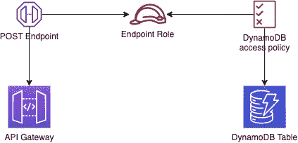

图 3。表单数据处理架构设计

AWS API 网关资源托管端点，并支持 API 分阶段部署。POST 端点的目标是处理 HTTP 请求并向下游传递数据。AWS DynomoDB 表存储表单数据。出于安全原因，不同的 AWS 资源不能相互通信，除非授予特定的访问权限。在*图 3* 、*端点角色*和 *DynamoDB 访问策略*授予 POST 端点将数据写入 AWS DynamoDB 表的权限。

## DynamoDB 表

我从表单数据表 a 开始实现，写了下面的模板来描述它。

例 5。表单数据表

对于 AWS DynamoDB 表，只需要声明关键字段。在这种情况下，我决定让 *email* 成为[主键](https://docs.aws.amazon.com/amazondynamodb/latest/developerguide/HowItWorks.CoreComponents.html#HowItWorks.CoreComponents.PrimaryKey)。为了降低成本，我还限制了生产能力。

## IAM 资源

创建表之后，我开始处理 AWS IAM 资源。我声明了一个角色和策略。角色是访问策略(授予资源权限)和主体(需要访问其他资源的资源)之间的中介。

以下模板中的角色仅限于 AWS API 网关主体；其他服务不能使用此角色。该策略授予将项目放入特定 AWS DynamoDB 表(在*示例 5* 中声明)并附加到角色的权限。

例 6。IAM 资源

## API 网关

接下来，我创建了 AWS API 网关和端点的实例。网关实例是添加端点的主机。

例 7。API 网关实例

> API 网关有两种类型:HTTP 和 RestApi。HTTP APIs 提供的功能最少，成本也更低。我选择 RestApi 是因为我需要访问请求验证、请求参数和主体转换特性(并非所有这些特性在 HTTP API 中都可用)。这两种 API 类型的比较可在[这里](https://docs.aws.amazon.com/apigateway/latest/developerguide/http-api-vs-rest.html)找到。

## API 端点

API 端点是我必须实现的最后一个基础设施。但这是事情变得有趣的地方。

了解端点如何工作、由什么组成以及组件如何协作至关重要。端点从客户端接收数据，并将其发送到集成点(在本例中，它是一个 AWS DynamoDB 表)。每个端点的配置由四部分组成:方法请求、集成请求、集成响应和方法响应。

在方法请求部分，定义了 API 端点请求参数。它们是:请求正文和标题、URL 搜索参数、请求验证规则和授权类型。在这里，客户的请求被准备转换成集成请求。

在集成请求部分，定义了集成类型和请求。集成类型是需要连接的服务。集成请求接受客户机请求参数和有效负载，并将它们转换成服务请求。

在方法响应部分，定义了所有可能的响应 HTTP 代码。每个响应代码都定义了响应代码头和主体模式(模型)。

集成响应部分将服务响应映射到客户机响应。为方法响应部分中允许的每个状态代码定义了 HTTP 响应和状态代码映射。

API 的另一个重要组件是模型。模型描述了请求或响应的模式。模型不仅用于文档。API 请求验证器使用模型来验证请求负载。如果违反了模型的模式规则，AWS API 网关将拒绝请求。

我创建了两个模型，并将它们附加到一个 AWS API 网关实例上。请求模型反映了表单字段—电子邮件、全名和注释。作为回应，我决定返回一条消息和状态代码。

例 8。请求和响应模型

接下来，我向 AWS API 网关添加了请求验证器。

例 9。请求验证器

然后我创建了一个 AWS API 网关资源。资源代表服务提供访问的实体。在这个例子中，*意图/订阅*是资源。表单数据描述资源的属性，HTTP 谓词用于检索或更改资源的状态。

例 10。表单数据资源

HTTP 方法描述了处理请求，并被附加到 AWS API 网关资源。每个 HTTP 谓词只能定义一个方法。如果 API 端点需要处理多个请求，则声明单独的方法(例如，GET 和 POST 请求有两个不同的方法)。

API 方法编排 API 端点的各个部分的交互。我编写了以下模板来处理表单数据请求，并在 AWS DynamoDB 表中存储信息。

例 11。过帐方法

上面的模板取代了后端服务的功能。有很多重要的细节需要注意。

*   `ResourceId`和`RestApiId` —将方法附加到 API 资源和 AWS API 网关实例。
*   `RequestParameters` —本节定义了可接受的参数。布尔标志指定参数是否是必需的。本节中声明的参数在集成部分中变得可访问。在*示例 11 中，*需要*内容类型*头，因为模板选择是基于所接收请求的内容类型。
*   `RequestModels`和`RequestValidatorId`—验证器使用模型中定义的模式来验证请求。*图 4* 显示了 web 控制台中的请求配置。
*   `Integration` —定义与后端系统的集成，该方法在收到请求时调用该后端系统。在这种情况下，AWS DynamoDB 是被调用来存储表单数据的服务。因此将**与*整合。类型*** 声明为 AWS。
*   `Integration.Credentials` —授予对 AWS DynamoDB 表的访问权限。
*   `Integration.Uri`和`Integration.IntegrationHttpMethod` —执行 *PutItem* 操作的 AWS DynamoDB HTTP 端点和方法。
*   `Integration.RequestParameters` —定义对后端系统请求的参数，如头、查询和路径参数。在这一节中，我引用了客户请求的内容类型标题。标题值用于`RequestTemplates` 部分。
*   `Integration.RequestTemplates` —构建要发送到后端系统的请求有效负载。客户端的请求负载在这一部分中进行映射。我使用 [Velicity 模板语言(VTL)](https://velocity.apache.org/engine/devel/vtl-reference.html) 将客户端的请求映射到 AWS DynamoDB 的 *PutItem* 请求。注意，我创建了 web 表单的两个版本，它们产生不同内容类型的有效负载。纯 HTML 表单(*示例 1* )输出*应用/x-* `www-form-urlencoded` 类型的有效负载，基于 JS 的 web 表单(*示例 2* )产生`application/json` 类型的有效负载。因此，我在本节中定义了两个模板——每个有效负载类型一个模板。我将`$context.stage`添加到模板中，以记录处理请求的 AWS API 网关阶段。*图 5* 和 *5.1* 显示了 web 控制台中的集成配置。
*   `Integration.IntegrationResponses` —定义集成响应代码和参数映射到客户端的响应代码和参数。*图 6* 和 *6.1* 显示了 web 控制台中的集成响应配置。
*   `MethodResponses` —定义如何根据接收到的响应代码构建客户端响应，以及向客户端返回什么响应参数。*图 7* 显示了 web 控制台中的响应配置。

关于如何映射请求响应数据的更多信息可在[这里](https://docs.aws.amazon.com/apigateway/latest/developerguide/request-response-data-mappings.html)获得。

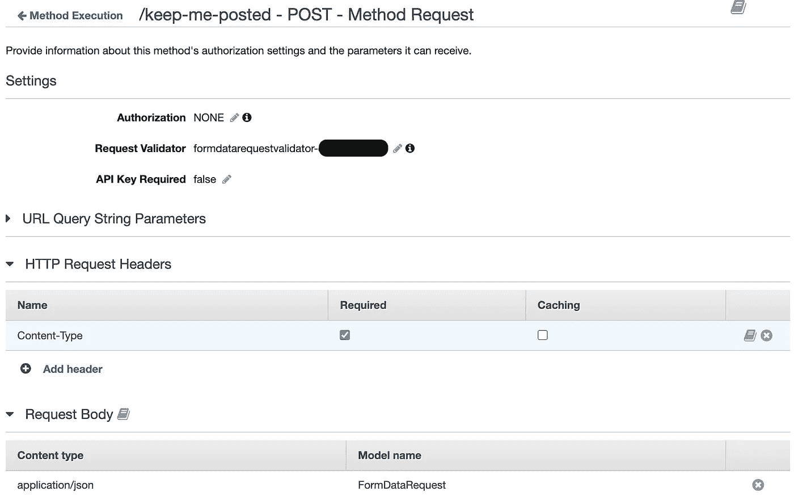

图 4。方法请求配置

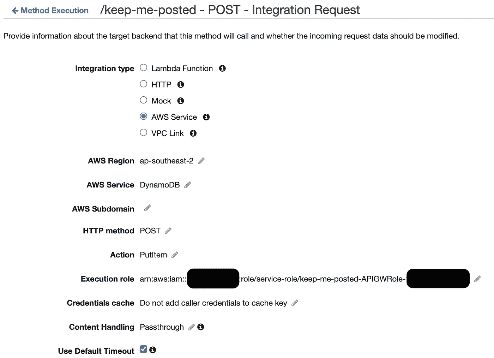

图 5。方法集成请求配置

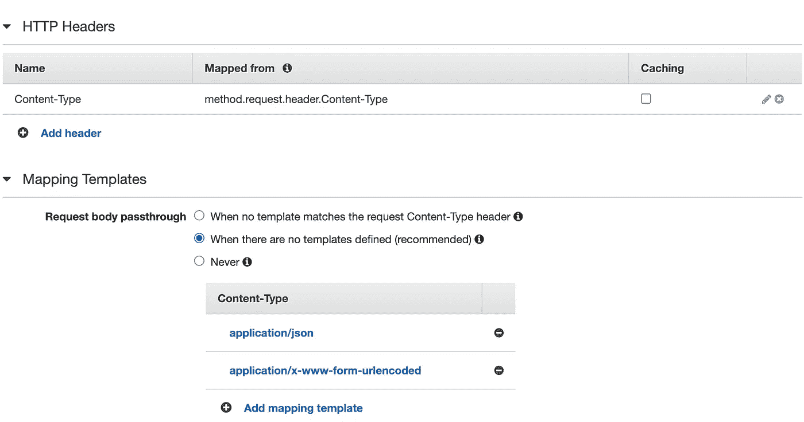

图 5.1 方法集成请求头和模板配置

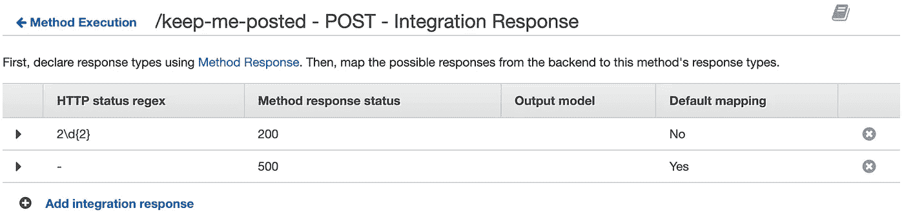

图 6。方法集成响应代码列表

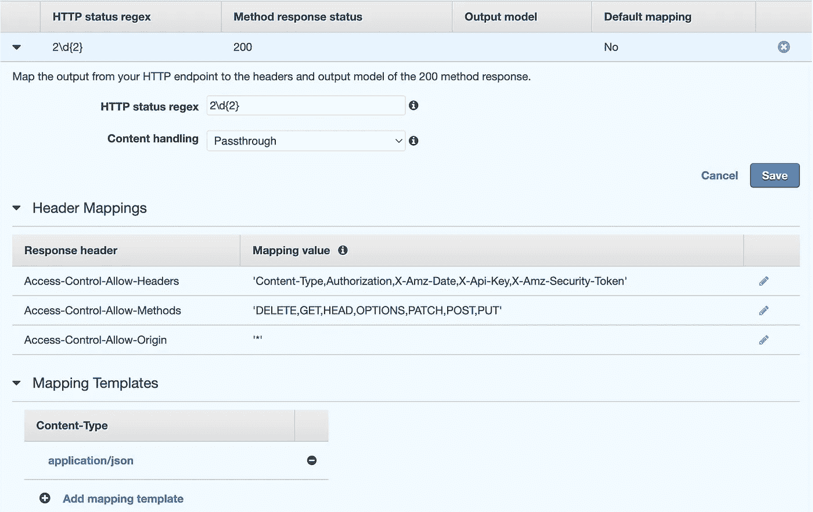

图 6.1 方法集成响应状态映射规则、标题映射和响应模板

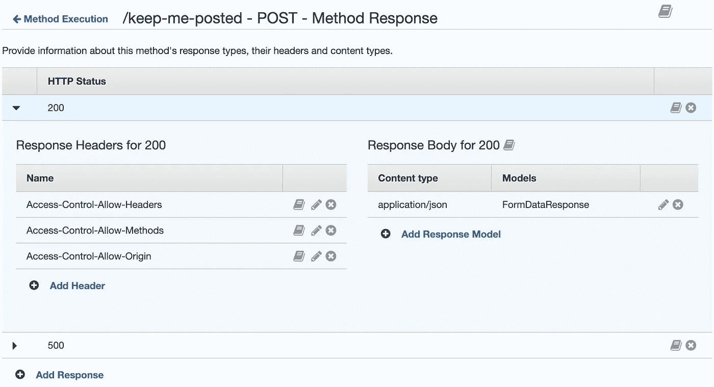

图 7。方法响应配置

*示例 7–11*中展示的模板是一个 API 端点的组件。有相当多的活动部件；有时候，把它们都记住是很有挑战性的。因此，我创建了下面的图表来形象化所有这些部分是如何一起工作的。

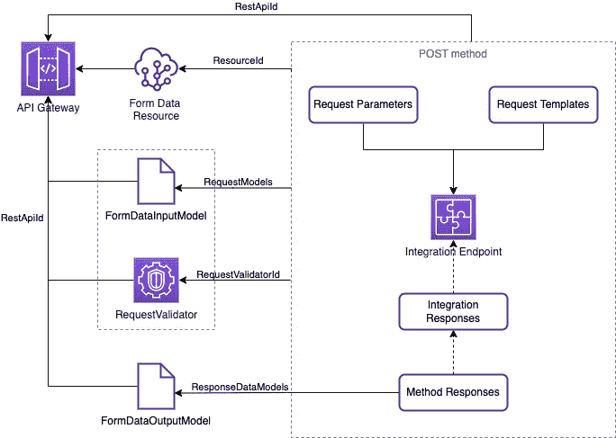

图 8。API 网关端点资源(基于云形成模板)。

## CORS 设置

您可能会注意到在*示例 11* 的集成和方法响应部分中定义了一堆*访问控制允许-** 头。这些是 CORS 的标题。CORS 既麻烦又有挑战性，尤其是在本地主机上。这个项目也不例外。为了能够从 *localhost 发送表单数据，*我需要为资源配置 CORS。为了解决这个问题，我在`FormDataResource`中添加了 OPTIONS 方法。

例 12。选项方法

当浏览器识别出一个不安全的 CORS 请求时，它会发送一个选项请求来询问服务器什么是允许的。根据 OPTIONS 响应中收到的 *Access-Control-Allow-** 报头，浏览器决定发送主请求(在本例中为 POST)是否安全。

## API 网关部署和准备

部署是使 API 资源对公众开放的最后一步。阶段是部署资源的主机。AWS API 网关支持多个阶段。我编写了下面的模板来定义`test`阶段和部署。

例 13。API 网关部署和准备

部署配置是基本的——它需要的只是对 AWS API 网关的引用。舞台配置也很简单——唯一的必填字段是`RestApiId`。我用`MethodSettings`配置扩展了阶段定义，以增加一层额外的保护。当部署发布到某个阶段时，它会生成一个公共 URL。为了限制不必要的 API 使用，我配置了请求限制。

# 将所有内容整合在一起— AWS CloudFront 分发版

AWS CloudFront 允许我为静态资产和 API 创建单一入口点。AWS CloudFront 中有许多特性支持各种实验和操作策略。

AWS CloudFront 有两个主要组件:起源和行为。Origin 定义了收到请求时要调用的服务。行为定义了请求分组规则以及使用什么来源来构建响应。自定义缓存策略和边缘功能可以添加到行为中，从而创造独特的体验。

对于这个项目，我定义了两个起源和两种行为。

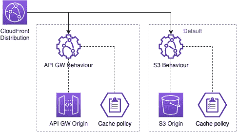

图 9。云锋起源和行为

此外，我为提供静态资产的行为创建了一个定制的缓存策略。原因是每当 bucket 中的资产发生变化时，我都需要使缓存失效。

实施例 14。静态资产的自定义缓存策略

因为 AWS API 网关部署有一个公共 URL，所以 AWS CloudFront 发行版可以访问它。AWS S3 访问不是公共的，需要额外的 IAM 资源。我结合使用了 AWS S3 存储桶访问策略和 AWS CloudFront origin 访问身份(OAI ),以允许发行版从存储桶中读取数据。

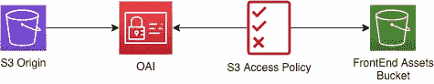

图 10。云锋 OAI 和 IAM 资源

实施例 15。OAI 云锋

源访问身份是一个特殊的 AWS CloudFront 用户，它可以与 AWS S3 源相关联，提供对 bucket 内容的安全访问。在下面的 bucket 策略模板中，我使用 AWS CloudFront OAI 作为主体，这样只有发行版可以访问 bucket 内容。

实施例 16。Bucket 策略只向 CloudFront 授予获取对象的权限

结合*示例 3* 中提供的 bucket 配置，只能通过 AWS CloudFront 分发从公共互联网访问 bucket 内容。

然后我用两个起源和行为定义了 AWS CloudFront 发行版(参见*图 9* )。

实施例 17。云锋分布

有一些重要的细节需要注意。

*   `***DefaultCacheBehavior***` —引用 AWS S3 原点。
*   `***DefaultCacheBehavior.CachePolicyId***` —是对在*示例 14* 中创建的自定义缓存策略的引用。
*   `***TargetOriginId***` —用于行为配置，应匹配*`***Origins***`部分定义的`***Id***s` 之一。*
*   *`***CacheBehaviors***` —除默认行为之外的行为列表。我添加了引用 API 网关起源的行为。*
*   *`CacheBehaviors[0].CachePolicyId` —我对 AWS API 网关行为使用了 AWS 管理的缓存优化缓存策略。可通过 AWS web 控制台*CloudFront>Policies*获得托管策略列表。当一个策略被选中时，它的 *Id* 会显示在信息视图 *CloudFront >策略>缓存>{策略 id}的顶部。**
*   *`Origins`—来源列表*
*   *`Origins[1].OriginPath`*—AWS API 网关的原始路径应包括阶段名。将 AWS API 网关资源部署到阶段时，所有路径都以阶段名称为前缀。如果在 *OriginPath 中没有设置阶段名，*AWS CloudFront 分发版在`/`解析资源。**

**在我部署了 AWS CloudFormtaion 栈之后，我验证了 web 表单和 submit 可以通过 AWS CloudFront 分发 URL 获得。我发布了表单数据，并在 AWS DynamoDB 表中找到了它。目的达到了！**

**我还需要做最后一项改进——增加更多的保护。在那一刻，AWS DynamoDB 表被隐式地暴露在公共互联网上。唯一的安全措施是在 AWS API 网关阶段限制请求速率。**

# **安全性— WAF**

**有几种服务可用于提高 web 应用程序保护。AWS Shield 和 WAF 是最受欢迎的，也是最容易集成的。简单来说，AWS Shield 保护应用和服务免受 DDoS 攻击。AWS WAF 是一个 web 应用程序防火墙，保护 web 应用程序或 API 免受常见 web 漏洞和僵尸程序的攻击。为了提高解决方案的安全性，我决定添加 WAF。**

> **警告，AWS WAF 挺贵的。只是随便玩玩或者扣球的时候，不需要的时候一定要禁用 WAF。有了 AWS WAF，用户**为活动规则**付费，而不是被这些规则过滤的流量。**

**我创建了一个单独的模板来描述 WAF 所需的资源。**

**实施例 18。晶片配置**

**有几个重要的细节需要注意。**

*   **`WebACL.Scope` —有两种类型的范围:`CLOUDFRONT`(全局)和*区域*。Scope 定义了 WebACL 是用于 CloudFront 发行版还是区域应用程序。区域性应用程序可以是应用程序负载平衡器(ALB)、AWS API Gateway REST API、AWS AppSync GraphQL API 或 Amazon Cognito 用户池。要使用`CLOUDFRONT`范围，必须在*美国东部-1* 地区创建 WAF 资源。**
*   **`WebACL.Rules` —我用的是 AWS 管理的规则。**
*   **`Logs` —晶圆日志组。对于 *CLOUDFRONT* 范围，必须在 *us-east-1* 区域创建日志组。它必须有前缀 *aws-waf-logs-* 。**
*   **`WafLogsConfiguration.LogDestinationConfigs` —日志目的地 ARN 应该是下面的格式`arn:aws:logs:{AWSRegion}:{AccountId}:log-group:aws-waf-logs-{log group name};` 但是日志组资源的 [*Fn::GetAtt*](https://docs.aws.amazon.com/AWSCloudFormation/latest/UserGuide/intrinsic-function-reference-getatt.html) 以不同的格式`arn:aws:logs:{AWSRegion}:{AccountId}:log-group:/stack-name-12ABC1AB12A1:*` *返回 ARN。*因此，我使用了 [*Fn::Sub*](https://docs.aws.amazon.com/AWSCloudFormation/latest/UserGuide/intrinsic-function-reference-sub.html) 来构建日志目的地 ARN。**

**创建 WebACL 后，我将它与在*示例 17* 中创建的 AWS CloudFront 发行版关联起来。为此，我定义了`Distribution`资源的`DistributionConfig.WebACLID` 属性。需要注意的是，创建 WebACL 时使用的是哪个版本的 AWS WAF。`WebACLID`格式因版本而异。要引用最新 AWS WAF 版本制作的 WebACL(*AWS::****WAF v2****:*)使用 WebACL ARN。要引用经典 AWS WAF 版本中创建的 WebACL(*AWS::****WAF****::WebACL*)，使用 WebACL ID。**

**就是这样。我完成了项目的最后一部分。还有改进的空间。例如，通过 Route53 添加一个自定义域，并配置仅通过该域访问 web 表单。但是这超出了本文的范围，本文已经很大了。**

> **请注意，在所有云形成模板的例子中，我省略了标签部分。我这样做是为了节省空间。在最终解决方案[模板](https://github.com/antklim/serverless-form/blob/master/.aws/main.yml)中，几乎所有的资源都是用标签声明的。我更喜欢在可能的地方添加标签。它提高了栈的可维护性。**

# **临时演员**

**正如您所注意到的，一些 AWS CloudFromation 模板使用参数。为了简化模板的使用，我将参数值组织到了`.env`文件中。下面是`.env`的一个例子。**

**实施例 19。。环境文件结构**

**为了自动部署资源，我编写了一个基本脚本。**

**例 20。创建或更新云形成堆栈**

**首先，该脚本验证是否提供了所有必需的参数。然后用 *describe-stacks* 命令发现现有的栈。如果没有找到堆栈，调用*创建堆栈*命令。否则，用*更新堆栈*命令更新当前堆栈。**

**感谢阅读；我希望你喜欢这篇文章，并学到了一些新东西。**

**这个项目的主要目标是学习一种处理 web 表单数据的新技术。每种方法都有其优点和局限性。当前的表单验证和映射技术非常有限。Apache Velocity 模板引擎对于 AWS API 网关来说并不常见，也是独一无二的。对于这个项目的需要来说，这已经足够了。但是如果需要更复杂的映射，我会考虑使用其他东西，比如 lambdas。另一方面，AWS API Gateway 和 AWS DynamoDB 的 *AWS-native* 集成减少了数据写入延迟，提高了系统的可靠性。**

**要找到正确的解决方案，理解问题的*【什么】*部分至关重要。*应用程序应该做什么*，以及*它有什么*行为？通常有多种方法来解决问题，没有必要用传统的方法来解决问题。实施应该与您当前的技术堆栈、技术开发策略以及团队的经验和知识相一致。**

**该解决方案应该易于替换。垂直和水平缩放有限制。不同规模的问题需要不同的架构。例如，当负载增加到每秒 100 万个连接时，为每秒处理数百个并发连接而设计的解决方案就不能很好地工作。**

**同样，解决方案设计应该足够好，以满足当前的需求。最好知道如何处理数百万个并发连接，并且在用户很少的情况下仍然选择更简单的方法。明智地使用你的时间和工具。**

# **参考**

*   **埃里克·约翰逊的[异步思考](https://youtu.be/V_tHVUHKqZQ)——该项目的灵感来源。**
*   **[使用亚马逊 S3 托管静态网站](https://docs.aws.amazon.com/AmazonS3/latest/userguide/WebsiteHosting.html)。**
*   **[亚马逊 API 网关 API 请求和响应数据映射参考](https://docs.aws.amazon.com/apigateway/latest/developerguide/request-response-data-mappings.html)。**
*   **阿帕奇速度项目。**
*   **[AWS 固有函数参考](https://docs.aws.amazon.com/AWSCloudFormation/latest/UserGuide/intrinsic-function-reference.html)。**
*   **GitHub 上的[无服务器表单](https://github.com/antklim/serverless-form)存储库。**