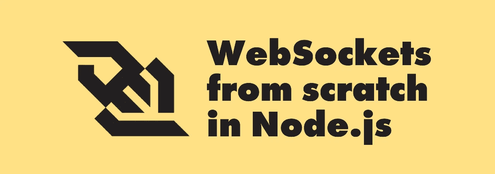
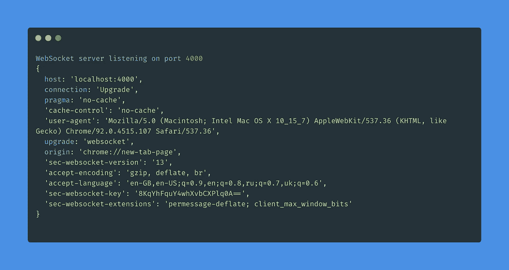
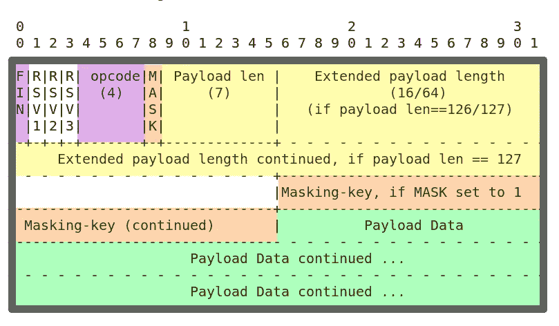
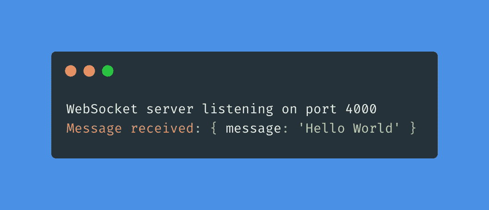
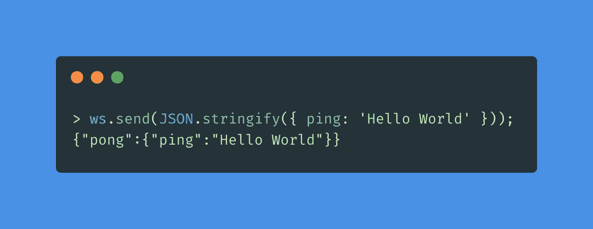

# 在 Node.js 中实现 WebSocket 服务器

> 原文：<https://betterprogramming.pub/implementing-a-websocket-server-from-scratch-in-node-js-a1360e00a95f>

## 通过这个快速指南探索和学习 WebSockets 的内部原理



在本文中，我们将通过从头实现一个简单的 WebSocket 服务器来探索 WebSockets 如何在协议层内部工作。它旨在涵盖客户机-服务器开放握手和数据组帧的基础知识。

作为我们的主要事实来源，我们将参考官方的 WebSocket 协议规范— [RFC 6455](https://www.rfc-editor.org/rfc/rfc6455) ，尤其是第 1 节和第 4–7 节🤓

对于我们的代码示例，我将使用 Node.js v18.12.1。

# **1。背景**

WebSocket 是一种通信协议，它在单个 TCP/IP 连接上运行，并在客户端和服务器之间提供双向全双工通道。

与 HTTP 请求-响应范例相反，它有助于通过持久连接进行实时的客户端-服务器消息交换，对于需要实时数据更新的 web 应用程序尤其有用。

正如 RFC 6455 的摘要所说，

> 该技术的目标是为基于浏览器的应用程序提供一种机制，这种机制需要与服务器进行双向通信，而不依赖于打开多个 HTTP 连接(例如，使用 XMLHttpRequest 或 s 和长轮询)。

本质上，WebSockets 是 TCP/IP 栈之上的一个薄的低开销传输层。

在本文接下来的部分中，我们将讨论该协议的一些细节，还将逐步构建我们的 WebSocket 服务器。

# 2.协议概述

WebSockets 运行在一个持久的 TCP 连接上，但是它是由一个特殊的 HTTP 升级请求建立的。在您的项目中使用 WebSockets 时，您可能经常会在浏览器的 Network 选项卡中看到这样一个请求的结果。

根据 RFC 第 1.7 节中的[:](https://www.rfc-editor.org/rfc/rfc6455#section-1.7)

> WebSocket 协议是一个独立的基于 TCP 的协议。它与 HTTP 的唯一关系是它的握手被 HTTP 服务器解释为升级请求。

基本上，要启动 WebSocket 服务器，我们需要首先创建一个 HTTP 服务器，然后根据来自客户端的升级请求执行一个开放式握手，这将导致协议从 HTTP 切换到 WebSockets。

让我们首先通过创建一个文件`ws.js`并声明一个类`WebSocketServer`来实现我们的服务器:

我们正在扩展`EventEmitter`，因为将来我们的服务器将需要能够发出和订阅像`open`、`upgrade`、`data`等事件。

服务器本身将在该类的`_init`方法中创建:

除了升级之外，我们真的不想处理任何 HTTP 请求，所以对于所有传入的 HTTP 请求，我们用`426 Upgrade Required`错误进行响应🚫。这表明我们的服务器拒绝使用 HTTP 协议处理请求，但是愿意使用来自`Upgrade`头的协议来处理请求。

在下一节中，我们将讨论并实现一个实际的协议升级(一个开放的 WebSocket 握手)。

# 3.开场握手

WebSocket 连接是由发起“开始握手”的客户端创建的。然后，服务器必须通过用特定的头进行响应来完成握手。之后，初始的 HTTP 连接被使用相同 TCP 套接字的 WebSocket 连接所取代。

RFC 的第 4 部分[描述了开场握手，非常简单明了。](https://www.rfc-editor.org/rfc/rfc6455#section-4)

客户端通过发送带有以下报头的 HTTP GET 请求来发起握手:

```
GET / HTTP/1.1
Connection: Upgrade
Upgrade: websocket
Sec-WebSocket-Key: kB2x1cO5zjL1ynwrLTSXUQ==
Sec-WebSocket-Version: 13
```

`Connection`和`Upgrade`头的组合向服务器发出客户机请求建立 WebSocket 连接的信号。

`Sec-WebSocket-Version`代表规范的版本。根据规范，这个头字段的值必须是 13。

`Sec-WebSocket-Key`是一个随机生成的对客户端唯一的字符串。根据 RFC，这个头的值是一个随机数，由随机选择的 16 字节值组成，该值已经过 base64 编码。必须为每个连接随机选择随机数([第 4.1 节](https://www.rfc-editor.org/rfc/rfc6455#section-4.1))。

`Sec-WebSocket-Key`的值用于创建服务器的握手，以表示接受连接。

要接受传入的连接，服务器必须用状态为`101 Switching Protocols`的 HTTP 响应进行响应。

响应必须包含一个`Sec-WebSocket-Accept`头，其值通过以下方式生成:

*   服务器必须获取`Sec-WebSocket-Key`的值，并将其与 GUID 值`258EDFA5-E914–47DA-95CA-C5AB0DC85B11`连接起来(这是一个[神奇字符串](https://en.wikipedia.org/wiki/Magic_string))
*   那么接收到的值必须被`SHA-1`散列
*   那么接收到的散列必须在`base64`中编码。

选择神奇字符串值是因为:

> 不理解 WebSocket 协议的网络端点不太可能使用它([第 1.3 节](https://www.rfc-editor.org/rfc/rfc6455#section-1.3))。

基本上，为了确保客户机和服务器都支持 WebSocket 协议，这是必需的。这一步很重要，因为如果服务器接受 WebSocket 连接，但将数据解释为 HTTP 请求，可能会出现潜在的安全问题。

握手响应还必须包含报头`Connection: Upgrade`和`Upgrade: websocket`。

在客户端接收到带有所描述的头的服务器响应之后，WebSocket 连接被建立并打开以开始传输数据。

现在让我们看看如何用代码实现握手。

我们将继续构建我们的`WebSocketServer`示例，并以如下方式更新我们的`_init`方法:

如果`Upgrade`报头的值不等于`websocket`，我们用 400 响应，并中止握手。

为了方便起见，我们发出了`headers`事件，这样我们就能够订阅这个事件，并查看在连接请求时收到了什么消息头。

让我们也将“神奇字符串”声明添加到我们的类的构造函数中:

```
this.GUID = '258EAFA5-E914-47DA-95CA-C5AB0DC85B11';
```

方法`_generateAcceptValue`是为`Sec-WebSocket-Accept`头生成值的方法，非常简单(注意，我们需要来自节点的`crypto`模块):

这样，我们的服务器就可以建立⚡️的 WebSocket 连接了

我们只需要在我们的类中添加一个`listen`方法，实例化它，然后检查是否一切都像我们预期的那样工作。

现在，要启动我们的服务器，我们必须执行以下操作:

为了检查一切是否正常，使用`node ws.js`命令运行`ws.js`文件，打开浏览器控制台并创建一个新的 WebSocket:

```
const ws = new WebSocket('ws://localhost:4000');
```

回到您的终端，您应该会看到类似这样的内容:



瞧，我们握手了！

尼斯（法国城市名）💥

在下一节中，我们将使我们的服务器能够接收和解析来自客户端的数据。

# 4.接收数据

> 在 WebSocket 协议中，使用一系列帧来传输数据。([第 5.1 节](https://www.rfc-editor.org/rfc/rfc6455#section-5.1))

在这一节中，我们将着重于实现一个解析 WebSocket 帧的方法。但首先，让我们讨论一下框架实际上是如何构造的。

下图显示了 WebSocket 帧的构建块及其大小(以位为单位)。



来源:[https://rafalgolarz . com/blog/2016/12/07/web socket _ servers _ 101/](https://rafalgolarz.com/blog/2016/12/07/websocket_servers_101/)

规范的第 5.2 节中描述了每个块的含义。

*   `FIN` — 1 位。这是 WebSocket 帧的第一位。如果该位被置位，则表明这是报文的最后一段。
*   `RSV1`、`RSV2`、`RSV3` —各 1 位。这些是保留给 WebSocket 扩展使用的。在撰写本文时，只有两个[注册扩展](https://www.iana.org/assignments/websocket/websocket.xhtml#extension-name):[web socket Per-Message Deflate](https://www.rfc-editor.org/rfc/rfc7692)和 [BBF USP 协议](https://usp.technology/)。这些超出了本文的范围。
*   `Opcode` — 4 位。该块用于解释`Payload Data`块。有代码表示文本或二进制帧，连接关闭事件，继续帧等。以下是`opcode`的可能值及其含义:

在我们的例子中，我们将只使用`0x01`和`0x08`操作码。

*   `mask` —定义`Payload Data`块是否被屏蔽。如果设置为 1，则必须存在一个 4 字节的`masking-key`块，并用于解除`Payload Data`块的屏蔽。根据[规格](https://www.rfc-editor.org/rfc/rfc6455#section-5.1):

> 客户端必须屏蔽它发送给服务器的所有帧。服务器不得屏蔽它发送给客户端的任何帧。

基本上，这意味着当从浏览器测试我们的服务器时，我们总是会收到屏蔽帧。同时，在发送响应时，我们不能屏蔽我们的有效载荷，否则浏览器将拒绝处理我们的帧并抛出错误。

*   `Payload Len` + `Extended payload length` — 7 位、7+16 位或 7+64 位。

如果`Payload Data`块的长度小于等于 125 字节，则`payload len`值就是`Payload Data`的长度。如果有效载荷的长度大于 125 字节，`Payload len`块的值可以是 126 或 127:

*   如果实际有效载荷长度在 126 到 65，535 字节之间，那么`Payload len`就是`126`，后面的 16 位将被视为实际有效载荷长度值。
*   如果实际有效载荷长度在 65，536 字节和~9223372036.85 千兆字节之间，那么`Payload len`就是`127`，后面的 64 位将被视为实际有效载荷长度值。

然而，如果你必须将`Payload len`设置为 127，你的帧太大了，你肯定做错了。你能想象单个数据帧 9000 吗，lol？

*   `masking-key` — 0 或 4 个字节。如果设置了`mask`位，则必须提供 32 位屏蔽密钥。屏蔽密钥用于解除从客户端接收的有效载荷数据的屏蔽。
*   `Payload Data` —发送或接收的实际有效载荷。大多数时候，它包含应用程序数据(我们——应用程序开发人员——发送或接收的任意数据)。但是，如果在开始握手期间已经协商了扩展，它也可以包含扩展数据。

现在让我们试着自己实现一个帧解析函数。

首先，让我们用将要使用的代码在`WebSocketServer`构造函数中定义操作码映射:

```
this.OPCODES = { text: 0x01, close: 0x08 };
```

现在，让我们定义一个名为`parseFrame`的方法，它接收一个缓冲区，从中提取有效载荷并返回一个`utf-8`字符串。

由于我们不打算使用`0x00`操作码(延续帧)，我们将假设`FIN`位总是被置位。

我们读取缓冲区的第一个字节，并提取第一个字节的最后 4 位值`opcode`。如果`opcode`是`0x08`，那么我们发出一个`close`事件并返回 null。我们也拒绝处理除纯文本(`opcode` 0x01)之外的任何内容。

为了处理连接关闭事件，让我们添加一个`close`事件监听器并销毁其回调☠️中的套接字

现在让我们尝试提取有效载荷长度。

为此，我们将读取缓冲区的第二个字节，并从中提取最后 7 位。这将是框架的`payload len`模块。如果该值等于 126 或 127，则实际有效载荷长度将分别在缓冲区的后续 2 或 8 个字节中定义。

我们不打算使用有效载荷长度值，所以我们将只设置一个偏移计数器来知道实际的有效载荷数据何时在缓冲区中开始。

初始的`offset`值是`2`，因为我们已经读取了缓冲区的第一个和第二个字节。如果`payload len`块值是 126 或 127，我们知道接下来的 2 或 8 个字节将被实际有效载荷长度占用，所以我们将各自的值加到偏移量上。

我们还需要注意的是检查`mask`位(第二个字节的第一位)并提取`masking-key`:

如果`mask`位被置位，那么我们知道我们的实际有效载荷从 4 个字节开始(在屏蔽键之后写入)，所以我们将 4 加到我们的`offset`中。如果`mask`位未置位，那么我们的`offset`值已经指示了缓存中`payload data`的开始，所以我们可以读取它直到结束并返回。

为了得到一个屏蔽键，我们使用`readUInt32BE`函数，从`offset`字节开始从我们的缓冲区提取 32 位数据。

现在，有了屏蔽键，我们需要解除有效载荷的屏蔽。

屏蔽和取消屏蔽的算法是相同的，并在规范的第 5.3 节中定义。本质上可以归结为:

> 转换数据的八位字节 I 是原始数据的八位字节 I 与屏蔽密钥的索引 I 处的八位字节模 4 的异或

我们在字节级别上操作，所以我们需要一些二进制算法来转换有效载荷的每一位。我们将遍历有效载荷的每个字节，并将其与屏蔽密钥的适当字节进行异或运算:

现在，让我们更新`_init`方法中的请求升级回调，以添加`data`事件监听器。

如您所见，我们只是重新发出了`data`事件，但是也向外传递了解析后的数据(使用`parseFrame(buffer)`)。

你可以这样使用它:

要测试它是否工作，您可以转到浏览器控制台，运行如下内容:

```
const ws = new WebSocket('ws://localhost:4000');

ws.send(JSON.stringify({ message: 'Hello World' }));
```

在您的终端中，您应该能够看到来自浏览器的消息:



万岁！🤘

但是如果我们只能接收数据而不能发回数据，我们的服务器就没有多大用处了。在下一节中，我们将处理这个问题。

# 5.发送数据

我们已经知道了 WebSocket 框架的结构，所以现在创建一个框架会容易得多。另外，我们不需要做掩蔽！

要创建一个帧，我们需要回答这个问题:我们应该为一个帧分配多大的缓冲区？

以下是我们已经知道的:

*   我们需要第一个字节用于`FIN`、`RSV`位和`opcode`；
*   我们需要第二个字节来存储`mask`位和`payload len`；
*   我们需要决定我们是否需要额外的 2 或 8 字节用于大的有效载荷；
*   还有我们实际有效载荷的字节长度。

注意，我们稍微简化了一下，没有为屏蔽键分配 4 个字节。

为了进一步简化，让我们假设`FIN`位总是被设置，并且`opcode`值总是`0x01`(文本框)。

然后我们可以硬编码第一个帧字节— `0b10000001`:

> 鳍(1)，RSV1 (0)，RSV2 (0)，RSV3 (0)，Opсode (0001)

让我们创建一个方法`createFrame(data)`并填充前 2 个字节和可选的随后的 2 或 8 个字节作为一个`extra payload length`值。之后，我们只需将有效载荷数据添加到结果缓冲区的末尾:

在上面的代码中，我们逐渐增加`payloadBytesOffset`变量，使其与缓冲区中实际有效载荷的起始偏移量相匹配。

一旦我们知道了`payloadBytesOffset`，我们可以很容易地通过将有效载荷的字节长度和偏移量相加来计算得到的缓冲区的总长度。

然后，我们将`payload len`和可选的`extra payload length`写入结果缓冲区。感谢 [Buffer](https://nodejs.org/api/buffer.html) 的助手函数——`writeUInt16BE`和`writeBigUInt64BE`——这只是一个函数调用的问题。

最后，我们的有效载荷。

就这样，很简单。😎

现在让我们在下一节把所有的东西放在一起，看看我们的服务器是如何使用的。

# 6.把所有的放在一起

我们有解析和创建 WebSocket 帧的方法，我们还实现了开始握手过程💪

为了将所有这些投入使用，让我们首先修改我们的`data`回调，将一个`reply`函数传递给最终用户:

这样，我们不仅能够接收数据，还能够将数据发送回客户端:

继续并在浏览器控制台中键入

```
const ws = new WebSocket('ws://localhost:4000');

ws.addEventListener('message', ({ data }) => { console.log(JSON.parse(data)) });
ws.send(JSON.stringify({ ping: 'Hello World' }));
```

您将看到我们的服务器用一个`pong`响应:



好吧。现在让我们建立一些更实际的东西。

让我们定义一些我们的服务器将为客户机提供的 API 方法:

`sleep`函数只是`setTimeout`函数的重命名导入:

```
const { setTimeout: sleep } = require('node:timers/promises');
```

现在让我们的服务器向客户端提供这个 API:

现在就用吧！

在浏览器控制台中，我们可以连接到我们的服务器并发送一些请求:

```
const ws = new WebSocket('ws://localhost:4000');

ws.addEventListener('message', ({ data }) => { console.log(JSON.parse(data)) });

ws.send(JSON.stringify({ method: 'auth', args: ['admin', 'wrong'] }));
ws.send(JSON.stringify({ method: 'auth', args: ['admin', 'secret'] }));
ws.send(JSON.stringify({ method: 'getUsers' }));
```

在您的浏览器控制台中，您应该会看到类似这样的内容:


哇，那个 RPC 用的是 WebSockets 吗？

是的，看起来是这样😏

恭喜你。您已到达这篇文章的结尾。到目前为止，您应该知道 WebSocket 协议在内部是如何工作的，包括客户机-服务器握手和数据组帧。正如你所看到的，WebSockets 不是一个太复杂的协议，甚至是 RFC 也很容易理解。

出于学习的目的，你可以试着用我们的`WebSocketServer`(利用连续帧)实现流式传输，这应该不会太难，或者给我们的服务器添加真正的 JWT 认证🤖

下面是本文的完整代码(我还在该类的一个`clients`属性中添加了连接跟踪):

# 7.要阅读的其他资源

1.  [RFC 6455—web socket 协议](https://www.rfc-editor.org/rfc/rfc6455)
2.  [web sockets——概念性的深度研究(Ably)](https://ably.com/topic/websockets)
3.  [编写 WebSocket 服务器(MDN)](https://developer.mozilla.org/en-US/docs/Web/API/WebSockets_API/Writing_WebSocket_servers)

感谢阅读。