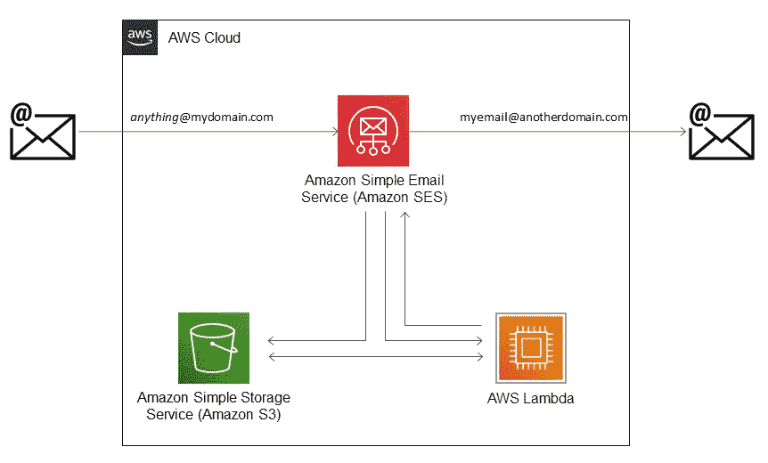

# 使用 AWS 简单电子邮件服务(SES)和 AWS Rust SDK 实施电子邮件屏蔽概念验证

> 原文：<https://betterprogramming.pub/implementing-an-email-masking-proof-of-concept-using-aws-simple-email-service-ses-and-aws-rust-c6aa34f1e1df>

## 使用屏蔽阻止电子邮件营销浪潮

图片来自 [Pixabay](https://pixabay.com/?utm_source=link-attribution&amp;utm_medium=referral&amp;utm_campaign=image&amp;utm_content=1048452) 的 [Anne-Onyme](https://pixabay.com/users/anne-onyme-1513318/?utm_source=link-attribution&amp;utm_medium=referral&amp;utm_campaign=image&amp;utm_content=1048452)

这个故事展示了一个概念验证，允许我在订阅邮件列表和注册不重要的帐户时给出一个唯一的电子邮件地址`*anything*@mydomain.com`。`anything`可以是我给出地址时当场决定的任何词。这些电子邮件会被转发到我的正常电子邮件地址，如果我发现我收到太多邮件，我可以取消订阅并将该地址列入黑名单…

作为一个额外的好处，我现在在网站注册时使用不同的密码**和**电子邮件地址……这应该会让我更安全。

这个故事中表达的观点/意见是我自己的。这个故事与我的个人经历和选择有关，提供它是希望它有用，但没有任何担保。

我喜欢订阅新闻、论坛等。但是，我已经被 pwn 了…我不读大多数电子邮件——只是随便浏览一下主题，看看是否有任何东西引起我的兴趣……我可以退订，但我有这样的印象，这些电子邮件只是不断到来。我最近开始使用一个全新的电子邮件地址——我想保持干净，因此一直在寻找一种方法来控制我给谁这个电子邮件地址。

一个黑客新闻帖子[1]让我进入了电子邮件屏蔽。Google 让我看到了 AWS 的博客文章(将收到的电子邮件转发到外部目的地[2])和这个实现。

## AWS 基础设施图

下图显示了在实施电子邮件屏蔽服务时使用的 AWS 基础设施，即接收和存储电子邮件，检查地址并在适当时转发。

AWS 基础设施图

AWS 基础设施包括:

*   route53 记录，用于将传入邮件定向到 SES 服务；
*   SES 规则处理发往`anything@mydomain.com`的电子邮件，将它们保存到 S3 并调用 lambda 函数；
*   一个 lambda 函数，处理收到的电子邮件，如果收到的电子邮件地址`anything@mydomain.com`不在黑名单上，它会转发到我的正常电子邮件`myemail@anotherdomain.com`。

我个人使用 terraform 来管理 AWS 基础设施，但人们可以通过控制台轻松地创建它——它与[2]中描述的基础设施相同——或者使用任何其他基础设施即代码工具。

terraform 脚本的主要元素如下:

*   SES 规则:下面的脚本设置了一个 SES 规则，用于处理地址为`@mydomain.com`的任何传入电子邮件。该规则有两个操作。第一个操作将电子邮件保存到 S3 存储桶`aws_s3_bucket.x.id` —这个存储桶是使用`aws_s3_bucket`资源创建的，重要的是，对该存储桶应用了一个策略，允许来自 SES 的写操作，也称为`PutObject`操作。第二个动作触发λ函数`aws_lambda_function.x.arn`。该规则被分配给使用`aws_ses_receipt_rule_set`资源定义的规则集`aws_ses_receipt_rule_set.mail.id`。

*   Lambda 函数:lambda 函数是用一个提供的运行时来定义的——即函数是一个自包含的可执行文件，没有依赖关系，如[3]中所述。最大内存使用量设置为 128MB，运行时间为 5s，这对于我的使用来说已经足够了。当我使用 AWS 命令行界面部署可执行文件时，这个函数用一个空的 zip 文件初始化。

要让 SES 规则和 lambda 发挥作用，需要设置权限:

*   定义了允许 SES 服务调用 lambda 函数的资源——我试图使用源 arn 条目来指定 SES 调用者，但是这种方法导致了循环引用。

*   使用策略定义 lambda 函数使用的角色，该策略允许 lambda 函数读取 S3 存储桶并使用 AWS SES 服务发送电子邮件。该角色还允许 lambda 函数为 CloudWatch 写日志。

## λ函数

我选择使用 Rust Runtime for AWS [3]和 AWS SDK for Rust [4]在 Rust 中编写 lambda 函数——目前在开发者预览版中。该实现与[2]中的 python 实现非常相似，只是我想(a)对照黑名单检查电子邮件地址，以及(b)转发电子邮件内容，而不是从 S3 桶访问电子邮件的链接。

安装`rust`后，使用`cargo new ses_handler`创建一个新的二进制应用程序。以下依赖关系被添加到`Cargo.toml`:

*   `lambda_runtime` —在 Rust 中编写 AWS lambda 函数所需的胶水；
*   `aws-types`、`aws-config`、`aws-sdk-ses`和`aws-sdk-s3`—Rust SDK 的组件，用于访问 SES 和 S3 服务；
*   解析 SES 收到并保存到 S3 的电子邮件。有许多可用的库——我开始使用这个库，因为它运行得令人满意，所以我没有研究任何其他的库。

实施是围绕以下 3 个 Rust 结构构建的:

*   `SesEvent`结构将 SES 事件映射到一个对象，该对象标识电子邮件 ID、发件人、主题和目的地列表。该结构及其构造方法如下所示。该构造方法与 SES 传入电子邮件事件格式[5]紧密耦合，后者作为`from_json`方法参数`payload`提供。

*   `Address`结构存储转发邮件时 lambda 函数使用的字段——`from`字段用于存储邮件最初发送到的电子邮件地址，即`anything@mydomain.com`。这被用作转发的电子邮件的发起者。`key`字段存储电子邮件地址密钥，即`anything`。

*   从电子邮件地址`anything@mydomain.com`构建`Address`结构的实例。`key`用于决定邮件是否转发，如下图所示。对于没有被转发的`key`，该方法返回一个`None`选项。

*   上述方法用于以下方法，该方法将 SES 事件目的地转换为地址列表:

*   最后一个结构`Mail`负责从 S3 桶中读取电子邮件、解析它、创建要转发的电子邮件(只转发邮件的文本和 html 部分，没有附件)并发送它。`Mail`结构由`message_id`定义，即 SES 事件给出的电子邮件标识符。其他字段`config`、`client`和`message`允许在一条消息要发送多次的情况下缓存信息——如果该电子邮件是具有不同`@mydomain.com`地址的邮件列表的一部分，这是一种边缘情况。

*   电子邮件解析由以下函数处理，该函数提取电子邮件的主题、纯文本和 HTML 组件:

*   `Mail`结构的`send`功能的实现是实现中最重要的部分，如下所示。实现相当清晰和直接:(a)初始化 AWS 配置，(b)从 S3 桶中读取传入消息，(c)从传入消息的纯文本和 HTML 内容中创建 SES 消息，(d)初始化 SES 客户端，以及(e)在…上发送消息

使用上述结构，main 函数采用以下形式，其中传入事件被处理成一个`SesEvent`对象。

`SesEvent`消息 id 用于创建`Mail`对象，而`SesEvent`目的地列表被转换为`Address`，用于调用`Mail`对象的`send`方法。

# 结论

我已经使用我的`anything@mydomain.com`概念验证几个星期了，取得了相当大的成功。但是由于黑名单是硬编码的，我不会经常更新它。虽然还有改进的空间，但尽管我对 SES 服务不太熟悉，概念验证的实施还是相当顺利。

AWS Rust SDK 可以有效地与 AWS SES 和 S3 服务配合使用——尽管还处于开发者预览版。我目前使用它与亚马逊 DynamoDB，这是目前证明有点不太稳定。

[1][https://news.ycombinator.com/item?id=31116861](https://news.ycombinator.com/item?id=31116861)
【2】[https://AWS . Amazon . com/blogs/messaging-and-targeting/forward-incoming-email-to-an-external-destination/](https://aws.amazon.com/blogs/messaging-and-targeting/forward-incoming-email-to-an-external-destination/)
[https://AWS . Amazon . com/blogs/open source/rust-runtime-for-AWS-lambda/](https://aws.amazon.com/blogs/opensource/rust-runtime-for-aws-lambda/)
【4】[https://aws.amazon.com/sdk-for-rust/](https://aws.amazon.com/sdk-for-rust/)
【5】[https](https://docs.aws.amazon.com/ses/latest/dg/receiving-email-action-lambda-event.html)