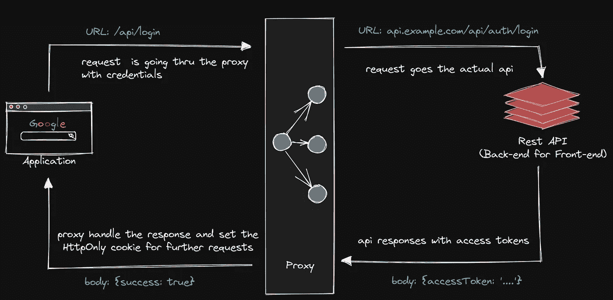
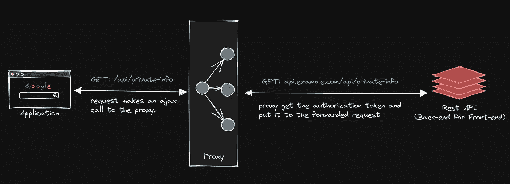

# 在 Next.js 中实现 Rest API 的 HTTP 代理

> 原文：<https://betterprogramming.pub/implementing-an-http-proxy-for-rest-api-in-next-js-65cdcd18fb73>

## 如果您的后端服务对公共用户和其他各种恶意攻击隐藏起来，那不是很好吗？Next.js 提供的后端服务有助于您的沟通


资料来源:undraw.co

在构建 web 应用程序时，安全性肯定是您最关心的问题之一。通常情况下，你不想暴露用户的敏感数据。

大多数现代 web 应用程序使用令牌进行身份验证。令牌应该由客户端存储，以便以后发送请求。有很多方法可以在用户的浏览器中存储用户的令牌。然而，最流行的方法是将所有类型的令牌保存在本地存储或普通 cookies 中。不幸的是，这不是存放代币最安全的地方。

本地存储和普通 cookies 这两者都可以通过第三方脚本和浏览器扩展来访问。我将讨论将令牌作为 HttpOnly 存储在 cookies 中。

# 为什么必须使用 HttpOnly cookies 来存储令牌？

HttpOnly cookies 不能通过客户端 JavaScript 代码访问。因此，浏览器扩展和任何在客户端运行的 JavaScript 代码都无法访问这些 cookies。因此，你的 JWT 或其他东西是安全的。最后。

使用 HTTP 代理不仅仅来自安全 cookies。它还提供了安全优势—即使存在跨站点脚本(XSS)缺陷，并且用户意外访问了利用该缺陷的链接，浏览器也不会将 cookie 泄露给第三方。

# 设计 API 代理

在我们写代码之前，我将与你分享这个流程。我们将为 BFF 创建两个不同的端点。第一个只是处理登录操作。第二个将用于将所有请求转发给实际的 API。



登录流程

上面的流程说明了登录端点是如何工作的。事实上，我们可以在一个点上实现这一切。将所有逻辑保存在一个文件中是没有意义的。正因为如此，我已经将[的](https://en.wikipedia.org/wiki/Separation_of_concerns)登录逻辑分离到其他地方。



认证后使用代理与 BFF 通信

# 实现 API 代理

在这一步中，我们将添加并启用 API 代理。我们必须创建一个代理服务器来将请求转发到目标资源。

## **0。设置环境变量**

在开始之前，您必须定义一些环境变量。如果没有文件，在根目录下创建一个名为`.env`的文件。我们将从 env 变量中获取后端服务 URL。

注意:*我们不应该用 NEXT_PUBLIC_*作为 env 变量的前缀，以避免* [*将其暴露给浏览器*](https://nextjs.org/docs/basic-features/environment-variables#exposing-environment-variables-to-the-browser) *。*

```
SERVICE_URL=http://localhost:8000/api
```

## **1。将 http-proxy 和 cookies 包作为依赖项安装**

我们需要`http-proxy`来创建一个代理服务器和 cookie 包来处理 cookie。

```
npm install http-proxy cookies
```

## **2。创建代理服务器**

您必须创建一个代理服务器实例来使用 API 路由。首先，在根目录下创建一个名为`server`的文件夹。这个文件夹包含所有你的服务器类型的东西等等。为了以防万一，你可以在这个文件夹中设置你自己的定制服务器。

创建服务器文件夹后。在`/server`目录下创建一个名为`proxy.js`的文件夹。

## **3。实现登录端点**

您必须创建一个端点来处理登录操作。我假设您有一个认证服务来登录用户。为此，创建一个名为`api`的文件夹。此文件夹包含路由。

完成这些步骤后。您必须在您的`api/auth`文件夹中创建一个名为`login.js`的路径文件。

## **4。实现 API 代理**

我们需要一个入口点来将请求转发到目标资源。为此，我们将在已经创建的`api`文件夹下创建一个名为`[..path].js`的文件。这条路由将处理所有跟在`/api`前缀后面的端点。

就是这样。您已经准备好使用您的代理服务器。事实上，您可以给这个实现添加一些特性。我还添加了一个注销 API 路由。我准备了一个演示。可以从 Github 查看。

*   [Github 上的演示项目](https://github.com/fdemir/next-proxy)

# 警告

这个特性实际上伴随着所有的缺点和优点。因为我们用代理和 BFF 交流。这导致 TTFB 时间增加。此外，代理服务器的设置和维护成本也很高。

感谢您阅读本文。