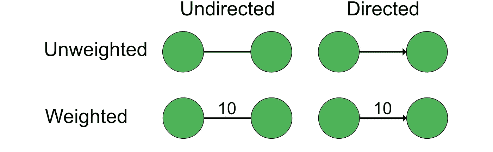
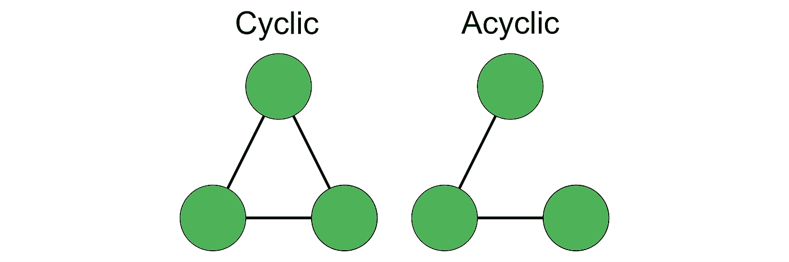
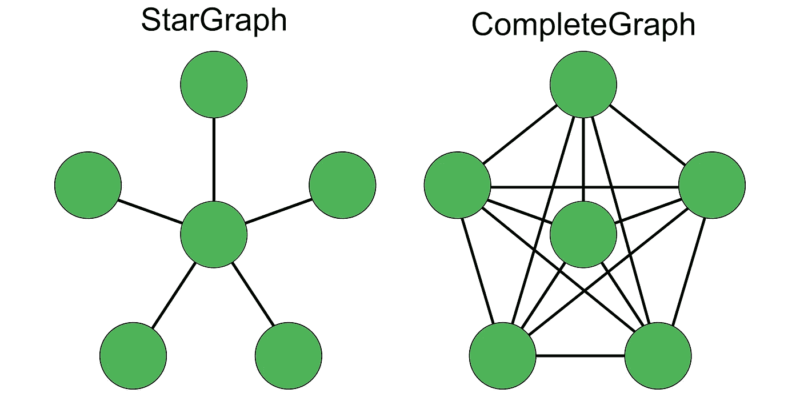
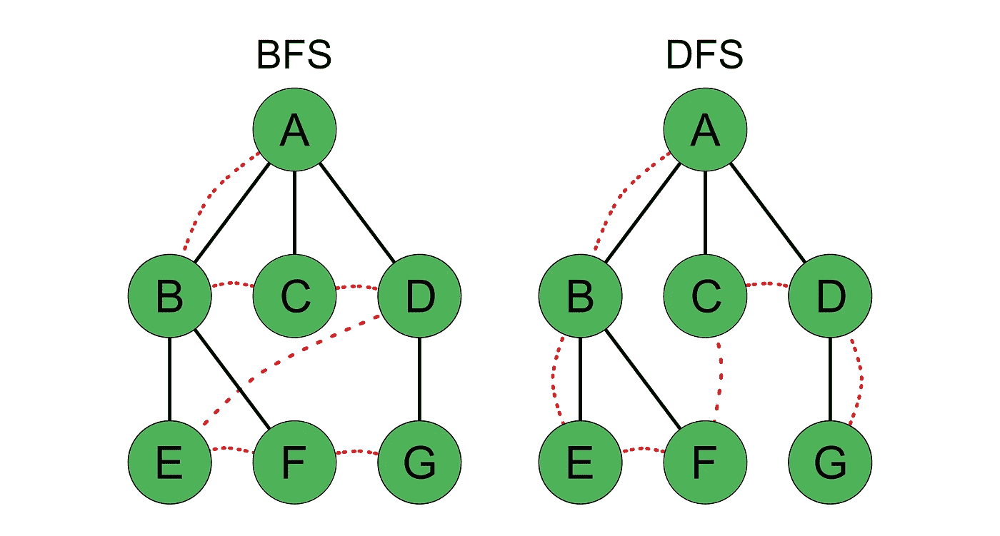
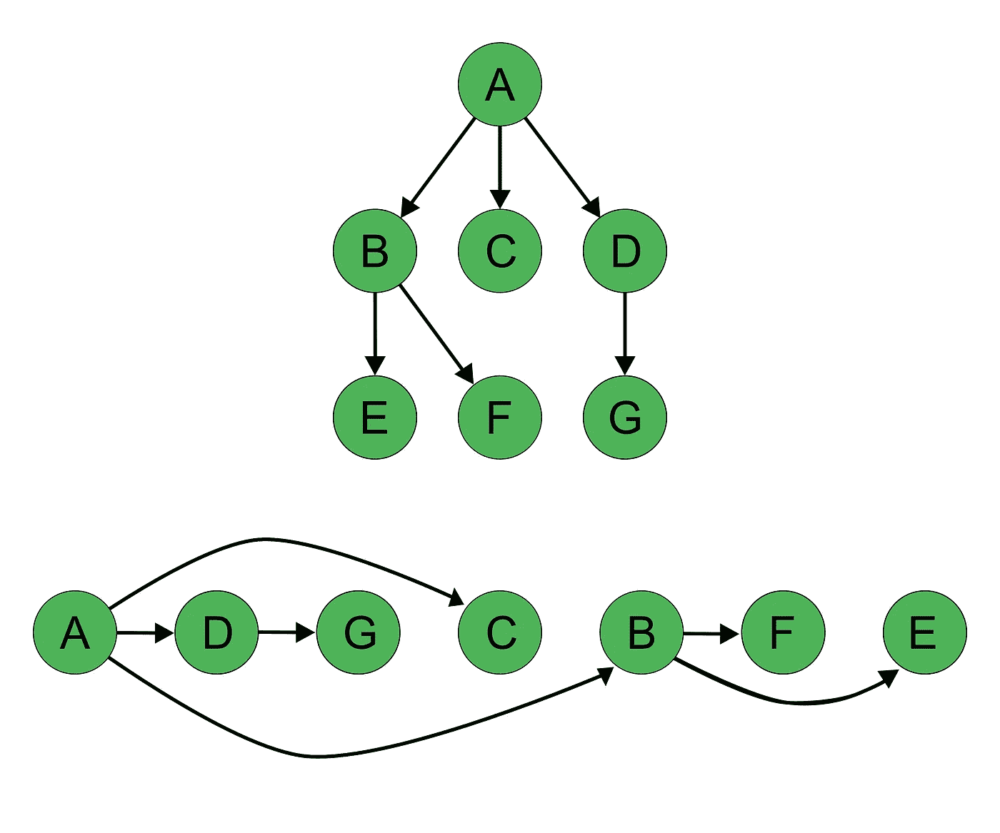

# 在 Swift 中实施和探索图形

> 原文：<https://betterprogramming.pub/implementing-and-exploring-graphs-in-swift-559de088e694>

## 使用高级数据结构

图片由 [GDJ](https://pixabay.com/users/gdj-1086657/) 来自 [Pixabay](https://pixabay.com)

图是计算机科学中广泛使用的数据结构。它们代表元素及其相互之间的联系，因此它们可以用来模拟各种类型的网络，如人与人之间的关系或城市之间的道路。

在本教程中，我们将简要介绍什么是图，并探索它们的一些性质。接下来，我们将了解如何在 Swift 中实施图表并在我们的项目中使用它们。为此，我们将使用框架 [SwiftGraph](https://github.com/davecom/SwiftGraph) ，它允许我们轻松地创建图表，使用各种算法遍历它们，并分析它们的结构。

# 什么是图？

在我们深入一些代码之前，让我们看看图形是如何构造的！一个图由通过线(称为*边*)连接的节点(称为*顶点*)组成。

图由顶点和边组成。

图可以*有向*，这意味着两个顶点之间的所有边都有一个方向，从一个顶点指向另一个顶点。如果不是这样，我们称这个图*为无向图*。无向图的一个例子是脸书的朋友。然而，Twitter 上的追随者可以用一个有向图来表示。

图表可以是*加权的*或*不加权的*。如果它们是加权的，它们的边就有一个与之相关的值。这些值可以有任何含义，例如，它们可以用来表示城市之间的距离或两个人成为朋友的天数。

图的边可以是有向的/无向的，也可以是加权的/未加权的。

一个我们可以沿着它的边回到起点的图叫做*循环图。*否则称为*无环*。

图可以是循环的，也可以是非循环的。

您还可以探索图形的更多属性，但目前已经足够了。我们写点代码吧！

# 我们如何在 Swift 中使用图表？

让我们看看如何在我们的应用程序中使用图表。幸运的是，我们不需要自己实现顶点和边。我们可以使用一个叫做 [SwiftGraph](https://github.com/davecom/SwiftGraph) 的框架。它为模型图提供了协议、结构和类。它还带来了探索它们的功能，如搜索两个节点之间的最短路径或检测循环。

SwiftGraph 定义了一个协议`Edge`，它需要一个称为`u`和`v`的源顶点和目的顶点的属性，以及一个布尔值`directed`来区分有向边和无向边。该协议由两个结构实现:`UnweightedEdge`和`WeightedEdge`。

此外，这个框架提供了一个由两个类`UnweightedGraph`和`WeightedGraph`实现的协议`Graph`。除此之外，该协议还定义了一个初始化器，它接受一个顶点数组，以及一个函数`addEdge`，它接受一条边和一个布尔标志，不管它是否是有向的。该协议定义了一些计算属性和功能，例如通过索引访问顶点和边，检查顶点是否包含在图中，添加顶点和边，等等。您可以在 SwiftGraph 的[详细文档](https://davecom.github.io/SwiftGraph/)中找到所有功能。

让我们来看一个未加权图的简短示例，其中我们创建了一个表示友谊的`Person`对象的图，并找到了两个人的一个共同朋友:

创建一个简单的未加权图。

`// 1` —首先，我们定义结构`Person`。每个人由名和姓组成。

`// 2`—现在，我们创建三个示例对象，`john`、`jane`和`max`。

`// 3`—我们使用 SwiftGraph 的`UnweightedGraph`类来创建一个`Person`对象的图形。我们将之前创建的三个人作为它的顶点。此外，我们添加了两条边，一条从`john`到`jane`——意味着约翰和简是朋友——还有一条从`john`到`max`。

如果我们想找到简和马克斯的共同朋友，我们需要寻找这两个顶点之间的现有路径。通过调用这个图上的搜索函数`bfs(from:to:)`，我们可以找到起始顶点和结束顶点之间的边的数组。在这种情况下，将有两条边，一条从 Max 到 John，一条从 John 到 Jane。因此，这两个人实际上有一个共同的朋友。

除了`UnweightedGraph`和`WeightedGraph`之外，这个框架还提供了三个特殊的图形:一个所谓的`StarGraph`，它有一个中心顶点，多个边围绕中心指向其他顶点；一个`CompleteGraph`，其中所有顶点都与其他顶点相连；一个`UniqueElementsGraph`，它只包含唯一的边，没有一对相等的顶点。虽然前两个只是未加权，但最后一个图形类型可以是加权的，也可以是未加权的。

StarGraph 和 CompleteGraph 是 SwiftGraph 的两个特殊图形。

# 我们如何探索一个图形？

那么现在我们知道了如何创建一个图并添加顶点和边，我们能用它做什么呢？

## **遍历图形**

在前面的例子中，我们已经在图上使用了方法`bfs(from:to:)`来寻找两个节点之间的路径。这个缩写代表*广度优先搜索*，意味着搜索算法首先查看当前节点的所有周围顶点，然后以同样的方式处理这些节点中的每一个。另一种方法是*深度优先搜索*，我们可以通过调用`dfs(from:to:)`来使用它。使用该算法，首先沿着一条路径到达其终点，然后访问图的新分支。

我们来看一个简单的例子，可以在下图中看到。给定下图中的节点 A 到 G，如果我们对其执行 bfs，我们将查找连接到 A 的所有顶点，因此我们会找到 B，然后是 C，最后是 d。现在我们按照找到的顺序对找到的每个节点重复此操作。因为 E 和 F 与 B 相连，所以它们是下一个要被发现的顶点。c 没有输出边，因此没有更多的节点可以找到。最后，通过寻找 D 的邻居找到 G。发现节点的顺序是 A、B、C、D、E、F 和 g。

在同一个图中使用 dfs，我们将跟随从 A 到 B 的第一个连接。现在，我们将查看离开顶点 B 的每条边，因此我们将找到 E，然后找到 f。接下来，由于 B 下面的所有顶点都已被发现，我们将从 A 再次开始，下一条边将到达 C。 我们将从 A 开始查看最后一条边。在那里我们将找到 D，最后是 g。节点被发现的顺序是 A、B、E、F、C、D 和 g。

比较 bfs 和 dfs。

你可能会问自己什么时候用 bfs，什么时候用 dfs。这取决于图的结构和您想要解决的任务，但是如果您只是想知道两个节点之间是否有联系，就像我们在前面的代码示例中所做的那样，您可以使用两者。如果你想有一个更清晰的分离，你可以在[栈溢出](https://stackoverflow.com/a/37069004)或者 [Quora](https://www.quora.com/When-should-we-use-BFS-instead-of-DFS-and-vice-versa) 上读取比较。

## **检测周期**

SwiftGraph 提供了两种方法来检查给定的图是否包含循环:`detectCycles(upToLength:)`和`detectCyclesAsEdges(upToLength:)`。两者都基于本文中[提出的算法。第一个返回一个由顶点列表表示的循环，第二个由边列表表示。参数`upToLength`默认为`Int.max`，可以省略。](https://ieeexplore.ieee.org/document/1602189)

**注意**:添加有向边以获得正确的结果很重要。

以下是如何使用这些方法的示例:

检测有向图中的圈。

`// 1` —我们和朋友一起创建了一个新的图表。这一次，约翰是简的朋友，简是马克斯的朋友，马克斯是约翰的朋友——你可以清楚地看到循环！但是如上所述，我们为每个边缘设置`directed`为真。

`// 2`—通过使用`detectCycles`我们可以找到一个循环的所有顶点。结果是一个包含四个节点的数组:John、Jane、Max 和 John。因为我们想找到所有的循环，而不管它们的大小，所以我们省略了参数`upToLenght`的值。

`// 3`—当我们对形成一个循环的边而不是顶点感兴趣时，我们可以使用`detectCyclesAsEdges`。在这个例子中，我们将收到一个数组，包含从元素 0 到 1、1 到 2 和 2 到 0 的边。同样，我们省略了循环长度的限制。

## **排序图的顶点**

如果图形包含从第一个顶点到第二个顶点的边，您甚至可以按照一个顶点的位置比另一个小的方式对图形的所有顶点进行排序。但这只可能用于有向无环图( *DAGs* )。这种排序叫做*拓扑排序*。

让我们再看一下作为搜索示例的图，但这次所有的边都是有向的。因为顶点 A 只有输出边，没有输入边，所以它是排序后的第一个顶点。所有其他顶点在顶点排序列表中的位置更高。下面你可以看到这个图的拓扑排序。

用拓扑排序法对图的节点进行排序。

在下面的代码示例中，我们创建了完全相同的图形。首先，我们可以检查它的属性`isDAG`来确定它是否是一个有向无环图，因为只有这样的图可以排序。最后，我们使用方法`topologicalSort()`对其进行排序，该方法将返回上图中的顺序。

用 SwiftGraph 对图的节点进行拓扑排序。

在本教程中，我们看到了如何使用 SwiftGraph 创建和使用图形。我们探索了不同种类的图，以及如何使用 bfs 和 dfs 找到两个节点之间的连接。我们学习了如何检测循环，最后，什么是拓扑排序以及如何使用它。

但是框架 SwiftGraph 还有更多功能，我们没有详细看。在它的自述文件中，你可以找到一个表示城市和城市间距离的加权图的复杂例子。此外，您还可以看到如何使用 *Dijkstra 算法*在加权图中找到两个节点之间的最短路径，以及如何使用 *Prim 算法*创建*最小生成树*。

图形对于复杂网络和连接的建模非常有用。如果您打算在您的应用程序中使用它们，SwiftGraph 是一个很好的框架。它提供了一种方便的方式来声明和创建各种图形，并具有强大的功能来操作它们。此外，它是有据可查和经过测试的。

如果你想学习更多关于图的知识，并学习如何在 Swift 中自己实现它们，请查阅 Raywenderlich 的文章[带邻接表的图](https://www.raywenderlich.com/773-swift-algorithm-club-graphs-with-adjacency-list)。

## 资源

 [## davecom/SwiftGraph

### SwiftGraph 是一个图形数据结构的纯 Swift(无可可)实现，适用于所有平台…

github.com](https://github.com/davecom/SwiftGraph)  [## Swift 算法俱乐部:带邻接表的图

### 了解如何使用邻接表在 Swift 中实现有向和无向图。每个月，刘凯文，克里斯…

www.raywenderlich.co](https://www.raywenderlich.com/773-swift-algorithm-club-graphs-with-adjacency-list)  [## 图中圈计数的新方法——IEEE 会议出版物

### 在许多情况下，通信系统的拓扑可以抽象成图来表示。图论和…

ieeexplore.ieee.org](https://ieeexplore.ieee.org/document/1602189)