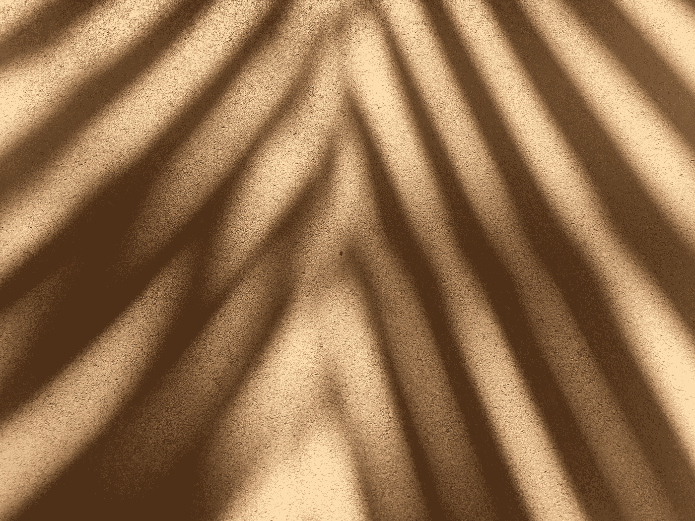
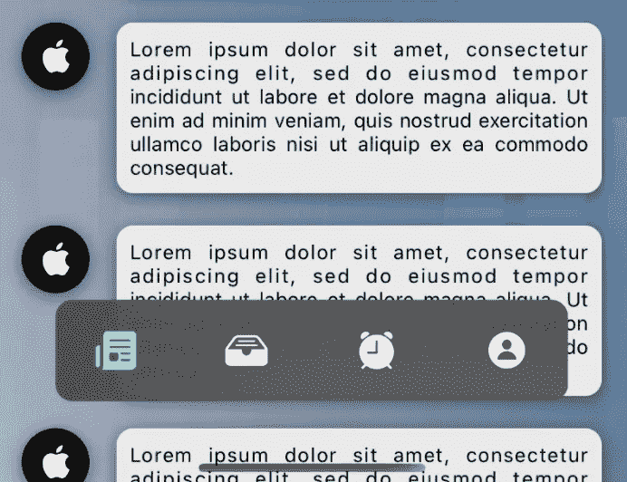
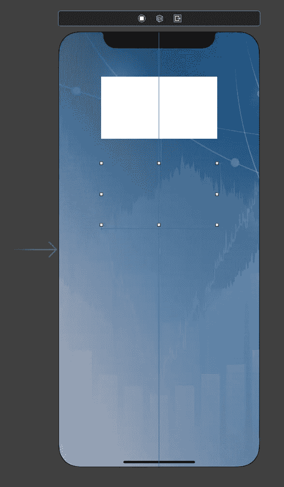
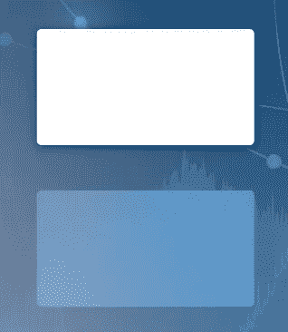
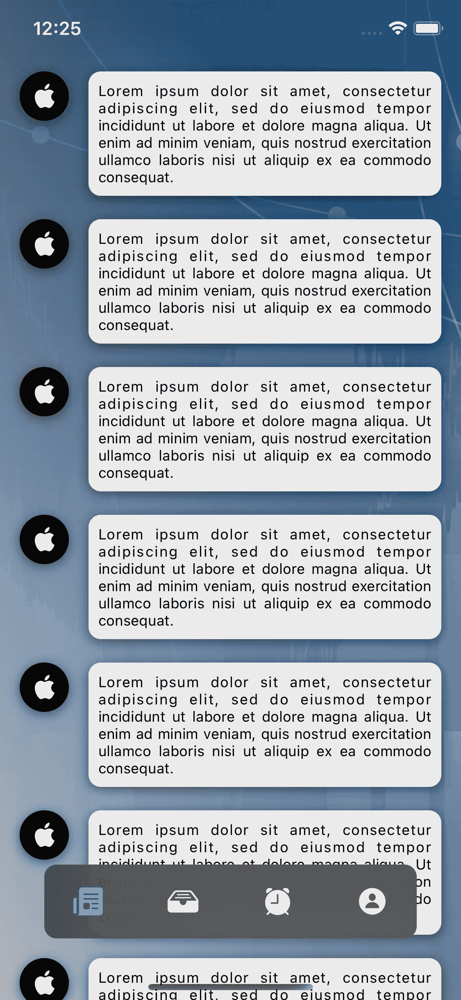
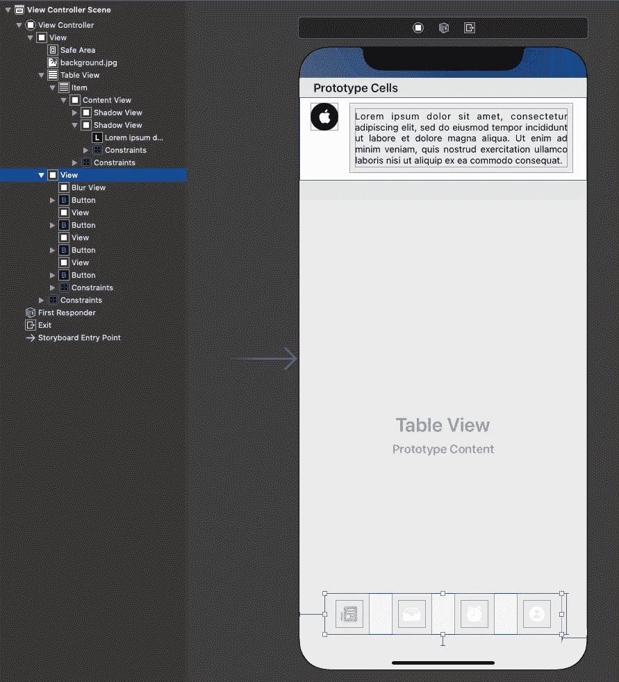

# 在 iOS 应用中实现模糊和阴影

> 原文：<https://betterprogramming.pub/implementing-blurs-and-shadows-in-ios-apps-36280caa4b04>

## 用模糊和阴影给你的应用添加一些额外的风格



照片由 [Agata Create](https://unsplash.com/@agatacreate?utm_source=medium&utm_medium=referral) 在 [Unsplash](https://unsplash.com?utm_source=medium&utm_medium=referral) 上拍摄。

对于我的大多数项目，我从我的客户那里获得应用程序设计。如果我需要说 2020 年最常用的设计元素是什么，我会说它们是平面元素、模糊和阴影。扁平元素没有问题，因为原生 iOS 设计相当扁平。所以让我们来看看如何给你的 iOS 应用添加模糊背景和阴影。



模糊和阴影

首先，让我们在你的 iOS 应用程序中创建一个模糊的矩形和一个带阴影的矩形。我将一步一步地介绍整个过程，您可以将最终结果复制到您的代码中。

# 从代码创建

对于这个例子，我们需要一个背景(例如一张图片)。在图片的顶部，让我们添加两个矩形。一个带白色背景的矩形(注意，阴影不能应用于透明或半透明视图，因为它看起来不太好)，另一个带透明背景的矩形用于模糊效果。如果我们使用不透明的颜色，模糊将被应用到这个颜色，它将没有任何效果。

如果你使用故事板，它将看起来像下面的图片:



效果故事板

在代码中，我们会有这样的代码:

```
**@IBOutlet** **weak** **var** vShadowContainer: UIView!**@IBOutlet** **weak** **var** vBlurContainer: UIView!
```

从代码中创建阴影和模糊是一个相当简单的技巧。为了让它看起来更好，我添加了一个圆角半径`5`:

如果您预先知道对象的大小，您可以从`viewDidLoad`开始调用这些函数。否则，你应该等到`viewDidLayoutSubviews`或`viewDidAppear`。



带阴影和模糊的矩形

iOS 对`UIBlurEffect.`没有太多的调整，你只能选择模糊类型(暗、亮等。).您不能使它变得或多或少“模糊”，但您可以更改 alpha 值，这将产生类似的效果。上图中，alpha 为 0.8。

# 创建子视图

如果你有大量的模糊和阴暗的视图，从代码中设置它们是不舒服的。让我们创建几个`UIView`子类，允许我们使用必要的参数动态添加效果:

例如，让我们制作一个带有模糊背景的替代标签栏，并基于带有阴影的`UITableView`进行馈送:



带有模糊和阴影的布局示例

这种布局可以通过使用上面提供的两个扩展和两个类以及最少的附加代码来完成。



故事板上面的例子

`ViewController.swift`非常简单:

当然，这只是一个布局。标签栏不起作用，提要只有十个元素，没有任何动态内容。但是当我们讨论添加模糊和阴影时——而不是动态内容——这个例子应该可以解决这个问题。

# 结论

扁平的图标、模糊的背景和背阴的面板是现代设计中最常用的元素。iOS 有自己的方式来实现它们，但是没有现成的组件(`UIViews`)来添加到故事板中。在本文中，我们找到了一种添加这种视图的方法，没有任何麻烦。

编码快乐，下次见！