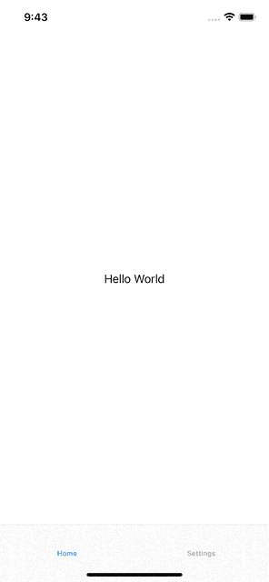

# 使用 SwiftUI 实施清洁 MVVM

> 原文：<https://betterprogramming.pub/implementing-clean-mvvm-with-swiftui-10c52d503d67>

## 如何在 SwiftUI 中正确使用 MVVM 模式

卢卡·米凯利在 [Unsplash](https://unsplash.com?utm_source=medium&utm_medium=referral) 上拍摄的照片

关于这个话题有许许多多的教程。然而，我找不到任何东西能清楚地解释如何处理现实应用中可能发生的复杂情况。

我能找到的所有例子都是基本的:它们从一个简单的视图开始，在那里放置一些由视图模型获取的数据。视图使用`@StateObject`或`@ObservedObject`变量来保持视图模型的活性。仅此而已。

在现实世界的应用程序中，我们有需要适当编排的依赖关系和逻辑片段。我们有需要传递绑定的子视图。这些问题在我找到的文章中都没有得到恰当的描述。

在今天的文章中，我想更深入地探讨这个架构问题，并帮助大家使用 MVVM 和 SwiftUI 更进一步。

# 该应用程序

我们将建立一个应用程序的通知设置。该应用程序让用户控制他们是否希望在本地通知。然后，应用程序会显示何时向用户显示提醒。只有当我们有权从系统和应用程序本身安排通知时，才会显示选择日期的选择器。

点击`Reminder at`，用户可以更新通知的预定时间。

为了给人一种应用真实的感觉，我们将把设置屏幕嵌入到一个带有 Hello World 主屏幕的`TabView`中。

这是预期的结果:

为了构建这个应用程序，我们需要实现一些组件。我将分享所有的代码，浏览文章，并在结论中加上最终的项目。

我将尽量只关注对架构真正重要的部分，跳过所有细节，比如依赖注入、如何请求推送通知权限等等。

## 模型

在开发一个 app 的时候，我们应该从思考数据模型开始。我们想向用户展示什么？我们的应用程序需要什么才能正常工作？

在这个例子中，我们需要一个`NotificationSettings`结构来存放我们需要的所有信息。在代码中，它看起来像这样:

我们有一些信息:

*   `notificationEnabledByUser`布尔值，用于跟踪当前内部用户偏好
*   `remindAt` date 属性，用于跟踪应用程序应该何时安排通知

struct 是`Codable`，这样我们可以存储用户的偏好。注意，所有的属性都是`var`:用户可以在应用程序生命周期中修改它们，我们想要持久化它们。

## 视图模型

第二步是考虑如何转换数据模型，以便视图可以轻松地使用它。

我喜欢通过理解我们需要多少个状态来呈现我们的 UI 来思考这个过程。在我们的示例中，我们有:

1.  **授权未确定**:我们需要显示一个请求授权的按钮，通知切换被禁用，并且没有日期选择器。
2.  **授权并启用通知**:我们显示当前状态，开关打开，我们显示日期选择器。
3.  **授权和通知禁用**:我们显示当前状态，开关关闭，没有日期选择器
4.  **拒绝**:我们显示一个按钮将用户移至设置，切换被禁用。没有日期选择器

这个分析也让我们理解了这个视图的其他需求是什么。我们需要一个能够打开设置页面的对象和一个请求通知权限并检索当前状态的对象。

视图模型的代码如下所示:

ViewModel 代码，没有 SwiftUI 属性包装器和协议。它们会在文章的后面出现。

我向`ViewModel`添加了一些注释和文档，并使用`extension`将语义相似的属性和方法分组在一起。理解每段代码做什么应该很容易。请注意，没有 SwiftUI/Combine 协议或属性包装器。我们将在后面的步骤中添加它们，以更深入地解释它们是什么以及为什么需要它们。

我们引入了几种类型来封装业务逻辑:`SettingsManager`、`SettingsOpener`和`AuthorizationManager`。我们将在后面探讨它们，但它们与架构无关。我们用它们来表示我们的项目中一直存在的依赖关系，它们可以通过`ViewModel`的其他方法来访问。

视图模型包含一些计算变量来决定我们需要显示 UI 的哪些部分。这大大简化了 UI，因为所有的逻辑都被推到了`ViewModel`中。

## 景色

既然我们已经分析了需要覆盖的所有州，我们可以单独开发视图。我更喜欢的方式是为每个组件使用单独的方法，这样`body`属性可以以声明的方式组成视图。代码如下所示。

没有属性包装和协议的 SwiftUI 代码。它们会在文章的后面出现。

我又一次删除了所有的绑定代码，这样我们可以稍后再讨论它。

我们可以通过监听`scenePhase`环境变量来检测应用程序何时从后台移动到前台。一旦我们声明我们的视图对观察该属性感兴趣，我们就可以在需要的时候刷新授权状态。

还要注意视图是多么整洁:主视图声明我们有一个由两部分组成的表单。在这两个扩展中，我们可以分别看到这两个部分是如何组织的。

## 将视图模型与视图连接起来

最后一步是添加所有的属性包装器和协议，以实现视图模型和视图之间的绑定。

为此，我们需要:

1.  使`ViewModel`符合`ObservableObject`协议。
2.  将`@Published`属性添加到可以触发 UI 更新的`ViewModel`的所有属性中。在我们的例子中，它们是`currentAuthorizationStatus`和`settingsManager`。
3.  将`@StateObject`属性包装器添加到视图中的`viewModel`属性。

代码如下，在这一步，我们应该能够同时使用`Toggle`和`DatePicker`。

这个设置自动使我们能够从`@StateObject`中获得所需的绑定。我们可以深入到几个层，并检索绑定所需的特定变量。SwiftUI 注意更新 UI，即使最终属性没有发布:它只需要用`@Published`属性包装器对容器进行注释。

在我们的例子中，`ViewModel`的`settingsManager`属性是`Published`，但是它的每个属性都不需要是`Published`。

## @StateObject 与@ObservedObject

关于什么时候使用前者，什么时候使用后者，有点混乱。任何事情都可以通过思考谁拥有被注释对象的所有权来解决。

如果对象是视图的本地对象，并且它的生命周期与视图的生命周期绑定在一起，那么它应该是一个`StateObject`。`ViewModel`就是这样一个对象:一个`ViewModel`只有和它关联的`View`才有意义。我们很少重用它，并且`View`是唯一应该对它有强引用的实体。

如果视图接收到一个由其他实体管理的`ObservableObject`，我们应该使用`@ObservedObject`属性包装器。

# 把所有东西放在一起

现在，我们还需要一些片段来创建一个工作示例。

我们需要实施:

1.  `SettingsManager`将设置保存在磁盘上。
2.  `AuthorisationManager`询问权限。
3.  `SettingsOpener`打开设置应用程序。

把所有的东西都放在应用程序里。

我将快速介绍前三个元素，展示代码和方法，但不会深入底层细节。

# 设置管理器

`SettingsManager`是`Settings`对象的容器，它必须从磁盘中存储和检索它们。为了实现这一点，我们将传递一个`UserDefaults`实例作为存储。

代码还包含对`UserDefaults`的一个小扩展，以使代码在处理`Codable`对象时更具可读性。

注意:我们可以使用`@AppStorage`属性包装器来存储和检索值。然而，这样做，我们无法在测试中正确地注入不同的存储。

## 授权经理

该对象实现了检索当前授权状态和向系统请求通知权限的函数。

## 设置开启器

这是这个示例应用程序所需的最后一部分逻辑。该任务可由`UIApplication`对象执行。我们应该把它包装到一个合适的协议中，以便灵活地进行替代实现，例如在测试中。

# 该应用程序

我们现在有了所有的要素来组装我们的应用程序，并在工作中看到它。同样，在这种情况下，我们需要修改`ContentView`和`MainApp`。

## 更新内容视图

内容视图包含`TabView`，它负责初始化子视图。

我们一直在使用我们的 MVVM 建筑。我们创建一个`ViewModel`来接收选项卡所需的所有经理。然后，它提供一个计算变量来导出`NotificationSettingsViewModel`。

视图是一个简单的`TabView`，它通过从`ContentViewViewModel`检索视图模型，创建了一个带有简单标签的`Home`选项卡和我们的`Settings`选项卡。

## 主应用程序

主应用程序是我们需要初始化应用程序的所有依赖项的地方。它是入口点，也是在应用程序的整个生命周期中保持所有实例存活的对象。

这个组件有责任组成应用程序逻辑的其余部分。在这个例子中，我们只需要初始化几个管理器，我们可以将它们作为单独的变量保存在`MainApp`中。

然而，当依赖项的数量开始增加时，我们可以创建一个依赖项容器来将它们放在一起。

# 结论

在今天的文章中，我们探讨了如何构建一个具有复杂依赖关系和小表单的 MVVM 应用程序。我们致力于保持代码整洁，并始终确保依赖关系和数据的单一流动:从`MainApp`到`ContentView`再到`NotificationSettings`。

我们探索了`ObservedObject`和`StateObject`之间的差异，并且我们验证了我们可以将`Published`元素的数量限制为视图实际需要的数量。

最后，我们探讨了如何在应用程序进入后台和前台时进行监听，以及如何以一种干净的方式将所有东西放在一起。

整个代码可以从[这个 repo](https://github.com/cipolleschi/MVVM) 下载。