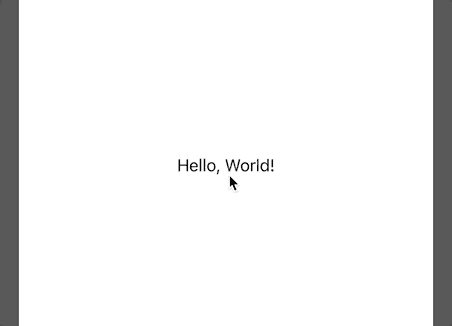
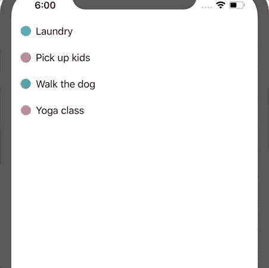
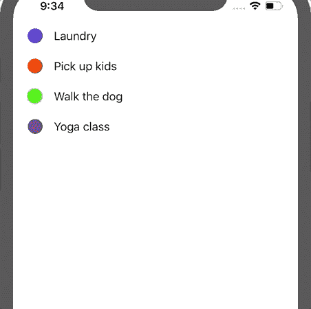
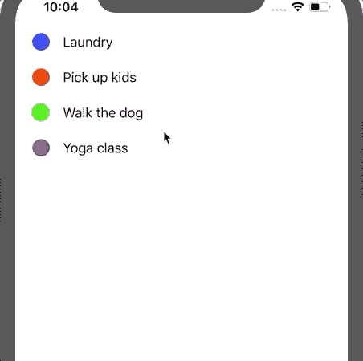
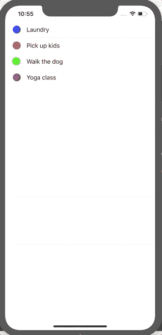

# 使用 SwiftUI 或 UIKit 在 iOS 13 中实现上下文菜单

> 原文：<https://betterprogramming.pub/implementing-context-menus-in-ios-13-using-swiftui-or-uikit-f6f629bbd561>

## 通过本教程了解如何在 iOS 应用程序中显示上下文菜单

Linda Xu 在 [Unsplash](https://unsplash.com/s/photos/ios?utm_source=unsplash&utm_medium=referral&utm_content=creditCopyText) 上的照片

随着 iOS 13 的发布，上下文菜单或上下文菜单已经成为向用户显示与屏幕上的项目相关的附加功能的便捷方式。

具体来说，当您长按(即按住)一个项目时，会弹出一个包含一些常见操作的上下文菜单。

需要注意的一点是，与之前需要 3D 触摸的 [Peek and Pop](https://developer.apple.com/documentation/uikit/deprecated_symbols/implementing_peek_and_pop) 功能不同，上下文菜单可以在任何运行 iOS 13 或更高版本的设备上实现，让更多用户可以使用这项很酷的功能。

已经广泛应用于各种系统 app，包括消息和照片。这是一个长按文本消息时上下文菜单的样子的例子。

上下文菜单的一个例子

本教程有三个部分。首先，我将回顾一下在应用程序中实现上下文菜单的原则。

其次，我将向您展示如何使用 SwiftUI 实现它们的步骤。第三，我将向您展示如何使用 UIKit 实现它们。

# 第一部分。实施原则

从用户交互的角度来看，有一套关于如何实现上下文菜单的官方指南。为了您的方便，我在这里总结了最重要的方面。

## 1.一致性

如果你决定在应用程序中实现上下文菜单，你可能希望在应用程序中一致地使用它们。

缺乏一致性只会导致用户的困惑，因为他们不知道什么会带来上下文菜单，什么不会。几次失败后，他们会停止尝试查看你的应用程序是否有这个功能，即使它在你的应用程序中的几个地方实现了。

## 2.吝啬

你不希望通过为用户提供几十个动作来挤满屏幕。传达可用的动作不仅让人不知所措，而且效率很低。

因此，您总是希望向用户显示最常用的操作，可能不超过四个。此外，应该根据被使用的可能性对它们进行排序。

换句话说，你应该把最常用的动作放在菜单的顶部。

## 3.简单

菜单应该看起来简单。您不希望对操作使用长名称。保持简短，用户不应该觉得他们已经花了时间阅读动作。只需快速浏览一下就足以让用户知道可用的操作。

如果行动清单很长，有几个选项可以使它变得简单。首先，您可以创建一个子菜单来捕获不常用的操作。

其次，您可以根据预期的行为对操作进行分组，并使用分隔符来区分不同的组。

# 第二部分。使用 SwiftUI 实施

## 第一步。项目设置

对于当前教程，我们将只在 Xcode 中创建一个单视图应用程序项目(文件->新建->项目->单视图应用程序，在 iOS 选项卡下)。

该项目将使用 Swift 作为编程语言，SwiftUI 用于用户界面设计。

## 第二步。概念证明

默认情况下，Xcode 会创建一个文本标签，显示“Hello，World！”在屏幕上。我们可以通过对`Text`使用`.contextMenu`修饰符来简单地为这个标签添加一个上下文菜单。

具体来说，我们添加了一个带有`Text`和`Image`的按钮。需要注意的一点是 SwiftUI 管理`Text`和`Image`的显示。

即使您切换`Image`和`Text`的顺序，或者将其中一个或两个嵌入到`HStack`甚至`VStack`中，上下文菜单也会以同样的方式显示。

此外，即使您声明了多个`Text`和一个`Image`，也只会使用每个的第一个。

构建项目并在模拟器中运行它。您将看到类似下面的内容。

通过点击标签的简单上下文菜单

## 第三步。多重行动

想象一下，有时我们对上下文菜单有多个动作。在这种情况下，我们可以根据它们的预期目的来安排它们，以便将相关的操作分组在一起。

在下面的例子中，我们有一个待办任务列表，用户可以改变任务标签的颜色。

显然，颜色属于同一个概念组，因此，它们被放置在彼此旁边，而剩余的动作(即，复制和共享)属于另一组。

具有多个操作的上下文菜单示例

## 笔记

1.  截至目前(2020 年 1 月)，SwiftUI 处理文本和图像的显示。如果你想改变大小，颜色，或其他属性，它不会发生。我预计，随着 SwiftUI 的改进，在定制菜单方面应该会有更多的灵活性。
2.  如果您确实想实现一个更定制的上下文菜单，就像 Photos 应用程序中使用的那样，您需要使用 UIKit 来实现它，我将在下一节向您展示这一点。

# 第三部分。使用 UIKit 实现

## 第一步。项目设置

对于这一部分，我们仍将在 Xcode 中创建一个单视图应用程序项目(文件->新建->项目->单视图应用程序，在 iOS 选项卡下)。该项目将使用 Swift 作为用户界面设计的编程语言和故事板，而不是使用 SwiftUI。

创建一个`UITableView`，并将其添加到视图控制器中。我们创建了一个名为`Task`的结构，并创建了一个将在表格视图中显示的任务列表。

在表格视图中显示任务列表

## 第二步。显示上下文菜单

为了在点击一行时显示上下文菜单，我们需要实现下面的`UITableViewDelegate`方法。

在这个方法中，我们为表格视图提供了一个`UIContextMenuConfiguration`。

具体来说，我们将传递三个参数:`identifier`(这个配置对象的惟一标识符)、`previewProvider`(预览内容时使用的定制视图控制器)和`actionProvider`(一个基于动作的上下文菜单)。

现在，我们将`previewProvider`设置为`nil`，它将使用默认预览。在后面的步骤中，我们将实现一个定制的视图控制器。

对于`actionProvider`，我们将创建一个有三个菜单项的`UIMenu`。在实现这个方法之后，我们可以构建我们的项目并在模拟器上运行它。

表格视图中包含多个操作的上下文菜单

## 第三步。显示带有子菜单的上下文菜单

有时，我们可以创建一个子菜单，将一组具有相同目的的操作组合在一起。

在本例中，我们将创建一个子菜单，允许用户更新任务的标记颜色。这些动作将作为`UIMenu`初始化中的`children`参数传递。

现在，构建的项目将如下所示。

带子菜单的上下文菜单

## 第四步。显示带有自定义预览的上下文菜单

为了使上下文菜单更有趣，我们可以实现自定义预览。

为此，我们需要创建一个定制的视图控制器来负责显示预览。为了当前教程的简单性，这个视图控制器只有一个显示任务描述的标签。

要将预览显示为上下文菜单的一部分，您只需将视图控制器传递给下面的`UIContextMenuConfiguration`中的`previewProvider`。

更进一步，当用户点击预览时，我们可以将预览显示为完整视图，这需要实现下面的`UITableViewDelegate`方法。

具体来说，我们将从配置中检索`identifier`。当我们将任务的 ID 设置为标识符时，使用该标识符，我们可以找到该任务并显示带有相关任务的预览视图控制器。

在实现了这个方法之后，我们将会看到如下所示的内容。

带有自定义预览的上下文菜单

## 附加注释

1.  上下文菜单可以类似地在集合视图中实现。关于这个话题有一篇很棒的 Medium [教程文章](https://medium.com/better-programming/ios-context-menu-collection-view-a03b032fe330)推荐。
2.  上下文菜单可以实现为任何`UIView`类型。为此，您需要创建一个`UIContextMenuInteraction`对象，并使用`addInteraction(interaction: UIInteraction)`方法将该交互添加到视图中。为了配置上下文菜单，我们将使视图控制器符合`UIContextMenuInteractionDelegate`协议。这个协议有一些方法可以像我们刚刚学过的那样实现。您可以参考[官方文档](https://developer.apple.com/documentation/uikit/uicontextmenuinteractiondelegate)了解本协议的方法。

# 结论

在本教程中，我们学习了关于实现上下文菜单的原则。我们还学习了如何使用 SwiftUI 和 UIKit 实现它。

显然，到目前为止，SwiftUI 只提供了有限的功能，很少进行定制，但是实现只需要几行代码。

然而，如果您想要一个更复杂的自定义上下文菜单，您肯定想使用 UIKit，因为它提供了更有趣的上下文菜单，可以实现自定义子菜单和预览。