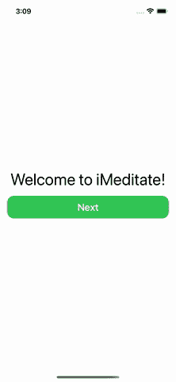
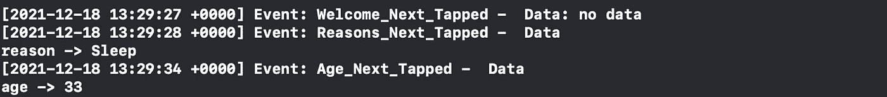
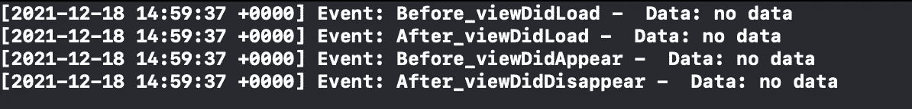

# 在监督办落实跨部门关注

> 原文：<https://betterprogramming.pub/implementing-cross-cutting-concerns-in-ios-a312fc72f798>

## 如何在不彻底改变的情况下实现普适特性

[罗伯特·安德森](https://unsplash.com/@robanderson72?utm_source=medium&utm_medium=referral)在 [Unsplash](https://unsplash.com?utm_source=medium&utm_medium=referral) 上拍照

开发一个 app 的时候，有可能影响整个代码库的非功能性需求。例如，考虑日志记录。为了检查错误，我们可能需要在许多不同的组件中添加日志，以跟踪当前状态和用户正在做的事情。

不同的关注点具有相同的普遍特征:缓存、安全性、度量、验证……所有这些概念都可以跨不同的模块使用，这就是为什么我们称它们为[横切关注点](https://en.wikipedia.org/wiki/Cross-cutting_concern):它们跨越了模块的边界。

一个简单的实现修改了所有的组件，增加了执行所需任务的依赖性。这种担忧蔓延到整个应用程序的代码中。再次考虑日志记录:如果我们将`log`调用分散在整个代码中，并且我们需要更新`log`签名，那么我们必须更新所有的调用点，潜在地必须更新整个代码库。

在今天的文章中，我们将描述一种实现类似特性的更好的方法。首先，我们将使用 UIKit 创建一个应用程序作为工作示例。然后，我们将以一种天真的方式实现横切关注点。在分析了缺点之后，我们将重构代码以获得更好的方法。最后，我们将讨论实现它们的其他技术。

# 该应用程序

我们实现的应用程序(切片)是冥想应用程序的入门。为了简洁起见，我们不会详细讨论所有代码，但我们将只关注重要的部分。我将在整篇文章中分享全部代码，并在**结论**部分分享最终版本。

我们想要实现的应用程序由 4 个屏幕组成:

1.  欢迎屏幕。
2.  询问用户为什么选择安装应用程序的屏幕。
3.  询问用户年龄的屏幕(用于统计目的)。
4.  回顾屏幕。

预期行为如下:

让我们从与视图最相关的代码开始。

## 欢迎屏幕

欢迎屏幕的完整代码可以在本[要点](https://gist.github.com/cipolleschi/ac38d0927d42a72e7eb36b6402b0ff85)中找到。

最相关的代码与应用程序的组成方式有关。控制该部分的代码如下:

该片段分为两部分:`WelcomeViewController`和`WelcomeView`。

`WelcomeViewController`需要初始化一个闭包，并在`loadView()`方法中创建`WelcomeView`。

`WelcomeView`需要在`init`中进行类似的关闭。当用户点击`Next`按钮时，视图调用闭包。

这是[委托](https://en.wikipedia.org/wiki/Delegation_pattern)模式的一个轻量级实现。当`WelcomeView`完成其工作时，闭合用于通信。由于这种模式，我们完全分离了入职的各个屏幕:欢迎视图不知道下一个屏幕是什么。

创建对象图的组件`Composer`负责注入导航到正确屏幕的逻辑。

## 理由视图

`ReasonView`的完整代码可以在本[要点](https://gist.github.com/cipolleschi/9e4348d735dbdbbf135557827d031ee2)中找到。

如果我们把重点放在与应用程序的其余部分最相关的视图组成部分，代码片段如下:

该代码片段以一个`Reason`枚举开始，描述了用户想要开始冥想的可能原因。

然后我们有一个`ReasonsViewController`，用一个接受`Reason`作为输入的闭包初始化。这样，我们可以将用户的选择传播到`Composer`。

当用户点击按钮时，`ReasonsView`以同样的方式初始化，以使`Reason`冒泡。手势在`setup`方法中设置，遍历所有按钮并根据点击的按钮传递正确的枚举值。

# 年龄观

年龄视图的完整代码可以在这个[要点](https://gist.github.com/cipolleschi/7618e0cb2b136e288dfa9290329567c8)中找到。

让我们再一次关注以下片段中有趣的部分:

这个代码片段遵循与前面相同的方法。闭包接受一个`Int`参数。我们需要将闭包传递给`AgeViewController`，它将把闭包传递给`AgeView`

## 作曲家

最后，我们可以把所有的屏幕放在一起。为此，我们创建了一个`Composer`对象:

`Composer`公开了一个返回 onboarding `ViewController`的函数。返回类型是一个简单的`UIViewController`:通过使用超类，我们可以自由地改变`Composer`主体和返回的`ViewController`，而不需要将自己限定在一个特定的类型。

该函数使用一个带有一个`Reason`和一个`Int`参数的闭包来表示用户在入职过程中的选择。`AppDelegate`可以决定如何处理这些信息。

在`onboardingVC`方法的主体中，我们用`WelcomeViewController`作为`rootViewController`来创建一个`NavigationController`。在`nextPressed`闭包中，我们创建并推送`ReasonsViewController`。一旦原因视图控制器终止了它的作业，它就调用一个闭包来创建和推送`AgeViewController`。

整个架构是高度解耦的。我们可以颠倒`Age`和`Reasons`视图控制器来实现一个完全不同的 UX，只需在`onboardingVC`方法上工作，不需要改变任何其他代码行。

# 实施跨领域关注

现在我们可以实现我们的日志功能了。我们希望在用户每次点击 next 按钮时记录一个条目，看看发生了什么。

让我们从定义一个`LogService`开始:

该代码片段引入了一个具有`name`和`timestamp`属性的`Event`结构。它还定义了一个`data`属性，为了简单起见，我们将其定义为`[String: String]`。对于更完整的解决方案，我们可以使用这个`[JSON](/how-to-encode-and-decode-any-json-safely-in-swift-d5b2b8e2e1e3)`枚举。

该协议定义了一个简单的`log`功能。我们可以实现不同种类的日志:写入文件、数据库或发送信息到远程服务器。对于这个例子，我们使用一个简单的`ConsoleLogger`:

记录器接收该事件，并准备一条操作数据字段的消息。然后，它在控制台中打印消息。

## 天真的实现

第一个简单的实现是将记录器传递给所有的`ViewControllers`并在每次按钮被按下时调用`log`函数。

如果我们在`WelcomeViewController`中应用这个策略，代码看起来像这样。

我们声明一个`logger`变量，并把它注入到初始化器中。我们决定设置默认值`ConsoleLogger`，不更新所有调用`WelcomeViewControllers` `init`的地方。

我们还没有使用它:我们需要将它注入到`WelcomeView`中，因为它是捕捉用户与按钮交互的视图。`WelcomeView`现在看起来像这样:

我们在`init`中注入记录器，并将其存储在一个属性中。然后，我们在`Button`的动作中调用记录器。

视图的`init`的变化要求我们更新`WelcomeViewController`的`loadView()`方法。我们更新它，将 ViewController 的记录器传递给`WelcomeView`。

我们可以运行应用程序并点击`WelcomeView`的`Next`按钮。我们应该会在控制台中看到一个新的记录行。

让我们在所有其他 ViewControllers 中重复这些步骤，以完成日志实现。

## 这种方法的缺点

天真的方法很有效，但也有很多缺点:

1.  `View`正在执行一些逻辑，但是视图应该只呈现一些数据并拦截用户输入。
2.  `ViewController`充当[中间人](https://refactoring.guru/smells/middle-man)，只是传递`LogService`依赖，而不做任何具体的事情。
3.  我们引入了一些代码重复。所有的`Views`和`ViewController`都以非常相似的方式改变了，修改了它们自己的`init`和`loadView`方法来传递依赖关系。
4.  如果我们改变`log`签名或者删除日志记录，我们必须相应地改变所有的视图和所有的视图控制器。
5.  对于我们想要引入的相互交叉的关注点，我们必须修改整个代码库，以保持一致性。

在这一点上，很明显这个解决方案没有很好地扩展。我们可以在非常小的应用程序中或者在有限的时间跨度内保留它，并承诺尽快重构它。但是，在一个大的应用程序中，我们需要尽快偿还这个技术债务。

让我们来看一个更具可扩展性的解决方案。

## 可扩展实现

可伸缩的实现使我们所有的视图和视图控制器保持不变，并且与它们的代码分离。

策略是利用`Composer`在我们需要的地方注入`log`调用。让我们看看下面的代码:

这个新的作曲者接收一个`LogService`和一个`DateProvider`作为输入参数。`DateProvider`是创造`Date`价值的工厂。

代码的其余部分与前面的几乎相同。在每次推送之前，我们调用`logger`在控制台中打印一个事件。这个模式是`[Decorator](https://en.wikipedia.org/wiki/Decorator_pattern)`的匿名实现:原始闭包的代码是`decoratee`而`log`是装饰器的代码。

我们可以运行应用程序并完成入职培训，以查看以下输出:

在组合级别注入横切关注点有几个好处:

1.  所有的`ViewControllers`和`Views`不变。
2.  横切关注点包含在`Composer`中。如果`log`签名发生变化，我们可以很容易地使用不同的记录器，只更新`onboardingVC`方法。
3.  如果我们需要引入其他横切关注点，我们可以用类似的方式更新`onboardingVC`方法。

# 跟踪其他事件

到目前为止，我们已经看到了如何跟踪与从一个屏幕到另一个屏幕的导航相关的事件。从一个模块到另一个模块的导航是在模块边界的操作。拦截边界操作更容易:它们被明确定义为模块的公共 API 的一部分

理论上，这些应该是我们唯一想要截取的函数。对于消费者来说，模块中发生的事情应该是一个黑盒。

然而，我们可能需要检查我们实现的一些内部细节。我们可能需要它来检查错误，因为新的需求出现了，或者收集关于用户如何使用我们的应用程序的细粒度知识。

我们想再举两个例子:

1.  在`AgeView`中跟踪上下按钮上的点击。
2.  跟踪`WelcomeViewController`的 UIKit 生命周期事件。

## 跟踪年龄视图

为了跟踪在`upArrow`或`downArrow`上的点击，我们需要将`LogService`注入视图。`AgeView`或`AgeViewController`没有暴露任何我们可以截取来添加日志的内容。

然而，我们知道注入日志程序有几个缺点，并且违反了[单一责任原则](https://en.wikipedia.org/wiki/Single-responsibility_principle)。

解决方案是将行为推到模块的边界。

我们可以用一个`increase`和一个`decrease`函数将行为封装在一个`AgeManager`中。然后，我们可以将管理器作为一个依赖项传递，这样我们就可以用日志来修饰它。

让我们从创建`AgeManager`开始:

管理器封装了曾经在`AgeView`中定义的逻辑。该对象将视图从如何增加和减少年龄的业务逻辑中分离出来。

管理器有一个未在`init`中初始化的`ageDidChange`闭包。管理器由`Composer`创建并注入到`AgeViewController`中。然而，是`ViewController`必须执行管理器和视图之间的绑定。我们使用属性注入来设置闭包并执行绑定。

> 注意: Combine 是实现绑定机制的闭包的有效替代方案。

然后，我们更新`View`和`ViewController`。

`AgeView`的主要变化有:

1.  我们宣布关闭`userDidTapUpArrow`和`userDidTapDownArrow`。
2.  我们删除了属性`age`的初始值。
3.  我们更新了`init`,让它接受`age`和两个额外闭包的初始值
4.  在`setup`方法中，我们用管理器的`increase`和`decrease`方法的调用替换了向上和向下按钮中的逻辑。

改变`init`迫使我们更新`ViewController`，如下所示:

我们声明了一个新的`ageManager`属性，我们在 init 中初始化它。`loadView`方法现在将初始年龄值以及`increase`和`decrease`函数传递给`View`。

最后，在`viewDidLoad`中，`ViewController`为`age`属性设置绑定。

最后一步，我们在`Composer`中组合所有内容。编译器建议`AgeViewController`需要一个`AgeManager`作为依赖项。我们可以直接通过`LiveAgeManager`来实现原来的行为。但是，我们想引入日志调用。为了实现这一点，我们创建了一个`LoggingAgeManagerDecorator`:

应用装饰模式的步骤是:

1.  创建一个`Decorator`类，实现我们需要修饰的服务的相同协议。
2.  添加装饰者需要的所有依赖项，再加上要装饰的服务的同一类型的一个`decoratee`属性。
3.  通过依赖`decoratee`的实现来实现我们不需要修饰的协议。
4.  在我们想要修饰的方法调用之前和/或之后应用修饰。

在这个例子中，我们只想装饰一下`increase`和`decrease`方法。为此，我们:

1.  在调用之前检索`age`值。
2.  调用`decoratee`的方法。
3.  在控制台中记录该行。

最后，我们可以将所有内容组合在一起:

我们只添加了第 12 行，在这里我们用 decorator 类创建了`ageManager`，并将它传递给了`AgeViewController`。

如果现在我们运行应用程序并使用箭头，我们可以观察到如下输出:

`AgeViewController`仍然不知道日志记录:我们必须改变一些细节来截取逻辑，但是类的功能没有改变。

## 跟踪 ViewController 生命周期

最后，让我们跟踪 UIKit 生命周期事件。具体来说，就是视图加载和出现的时间。

拦截这些行为更加棘手。我们可以使用类似于[方法 swizzing](https://pspdfkit.com/blog/2019/swizzling-in-swift/)的技术来拦截所有`UIViewControllers`中的所有这些方法调用。

然而，我们很少想要记录所有 ViewControllers 的所有生命周期事件。更有可能的是，我们希望只记录某些特定视图控制器的事件。

为了截取某些特定事件的生命周期事件，我们可以创建一个子类，并使用它来代替原来的视图控制器。子类的代码如下所示。

我们定义了一个扩展了 T2 的 T1。我们升级`init`来接受一个`LogService`和一个`DateProvider`。然后，我们传递我们必须传递给`super.init`的`nextPressed`闭包。

然后，我们`override`我们想要装饰的方法:在本例中，我们装饰了`viewDidLoad`和`viewDidAppear`方法。在这两种情况下，我们都在`super.viewDidXXX`调用之前和之后添加了一个`log`调用。

最后，我们在 composer 中使用`LoggingWelcomeViewController`来代替`WelcomeViewController`:

在代码片段中，我们声明了一个类型为`WelcomeViewController`(父类型)的变量`vc`，但是我们用上面代码片段中定义的子类初始化了它。

多亏了[利斯科夫替代原理](https://en.wikipedia.org/wiki/Liskov_substitution_principle)，系统会像以前一样工作，忽略了`WelcomeViewController`实际上是另一种类型的事实。

控制台中的输出如下所示:

# 结论

在今天的文章中，我们探讨了横切关注点的概念:它们是什么，为什么它们很重要。我们试图在一个简单的应用程序中实现它们。

从简单的实现中，我们理解了我们必须处理的可伸缩性问题。有了这些知识，我们基于根级别的组合实现了一个更具可伸缩性的解决方案。

最后，我们探索了另外两种实现横切关注点的技术。当我们完全控制代码时，我们可以将有趣的逻辑委托给我们注入到应用程序中的专用管理器。当我们注入 manage 时，我们可以注入它的修饰版本。

当我们不控制整个代码库时，我们可以子类化我们想要观察的类，并在被覆盖的方法中注入关注点。

这个例子的最终代码可以在[这个库](https://github.com/cipolleschi/iMeditate)中找到。