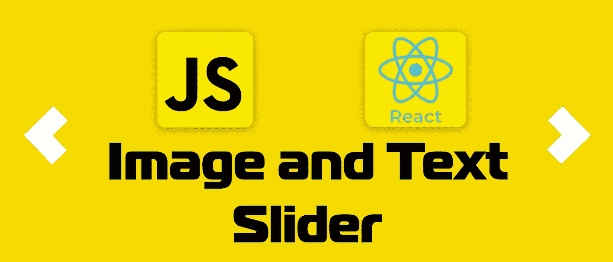
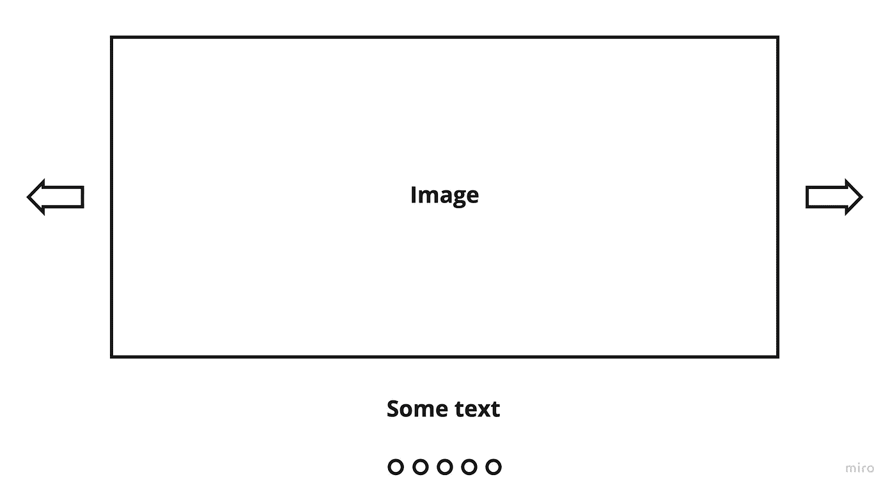
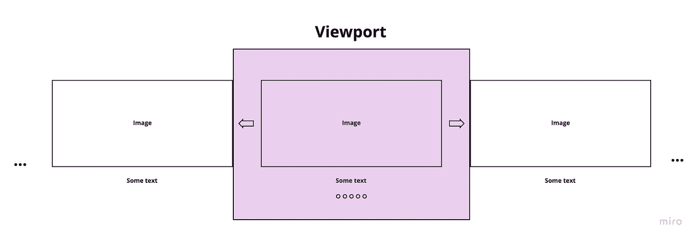
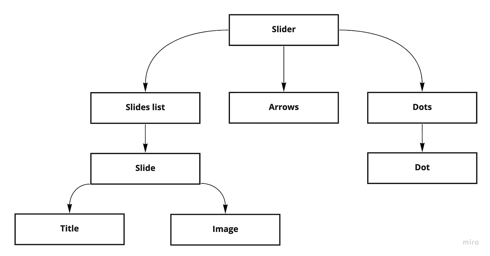
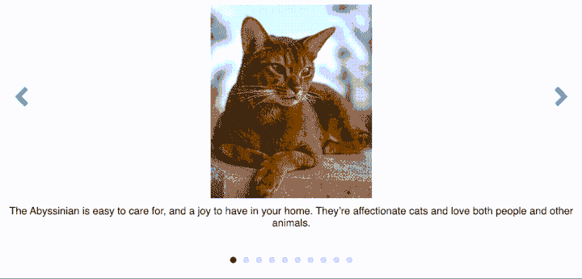
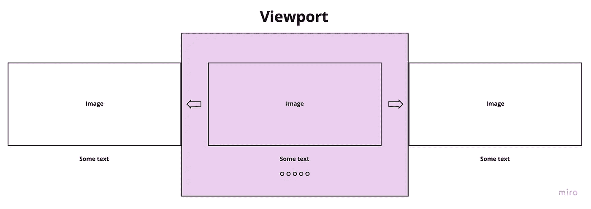
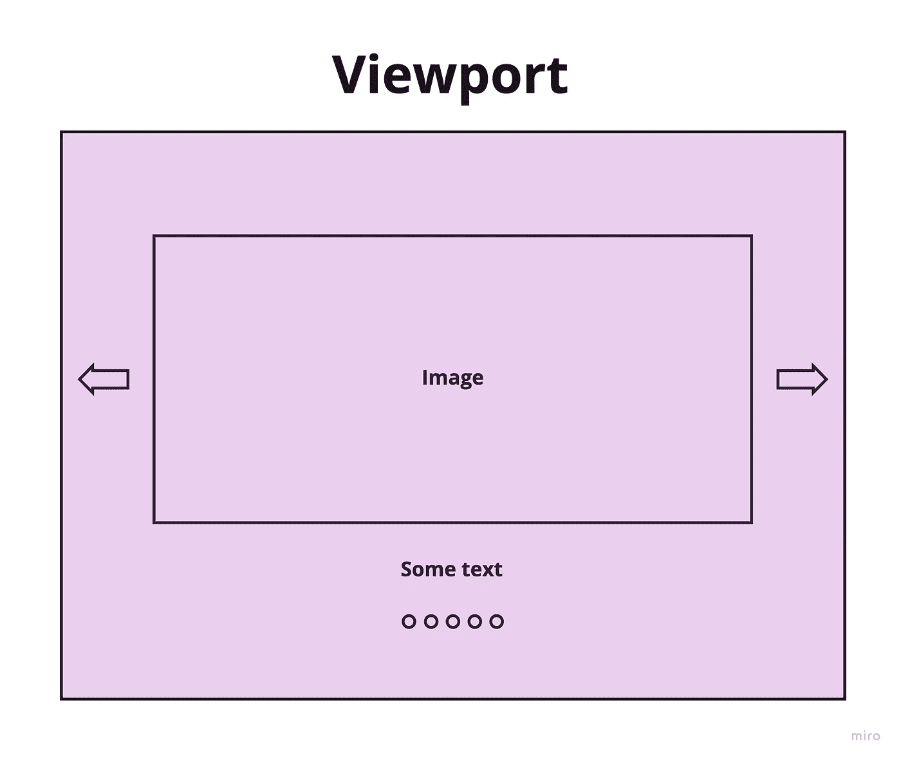
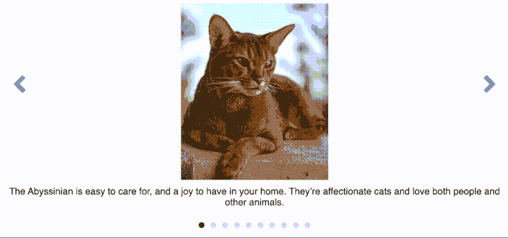

# 用 React.js 和优化实现图像和文本滑块

> 原文：<https://betterprogramming.pub/implementing-image-and-text-slider-with-react-js-and-optimizations-7a16af998548>

## 从头到尾设计它



在这篇文章中，我想讨论你在前端职位面试中可能遇到的问题——实现图像滑块。

过去 5 个月里，我参加了 15 次现场面试，收到了来自谷歌、Roku、微软和其他公司的邀请。

你应该用大约 45-50 分钟实现这个小部件，并告诉优化。我将在这里介绍这些信息。主要目标不是实现具有大量功能的图像滑块，目标是解释如何实现和优化。

# 要求

让我们从小部件的需求开始。

*   显示 API 中有猫的图片，有一定的大小限制
*   显示每个图像的描述或标题
*   可以用箭头在图像间导航
*   在移动设备上通过触摸改变幻灯片的可能性
*   可以跳到任何幻灯片
*   滑块自动播放
*   自定义滑块的宽度和高度的可能性
*   滑块应该有反应
*   滑块图像应该高效地下载并尽可能快地显示

## 实体模型



滑块模型

## **浏览器中的渲染**

对于第一个简单的实现，我们在浏览器中呈现所有幻灯片，并在视口或 slider 元素中仅显示部分内容(当我们设置宽度或高度时)。这些解决方案下载所有幻灯片的所有图像，并有 N 个 DOM 元素，其中 N —幻灯片的数量。



在浏览器中渲染

## 组件架构



滑块的组件架构

## 组件实现

先说我们滑块组件的道具。有了这些道具，我们就可以配置滑块了。

```
{ autoPlay: boolean, autoPlayTime: number, width: '%' | 'px', height:  '%' | 'px',}
```

在滑块组件中，我们需要实现以下内容:

*   加载图像
*   实现通过箭头导航的方法
*   实现一种通过点进行导航的方法
*   实现触摸导航
*   自动播放功能
*   渲染幻灯片、箭头和圆点

我们将在组件的本地状态中保存当前幻灯片编号和下载的图像。为了避免道具和训练的计数，建议使用上下文来提供变化的幻灯片方法和当前的幻灯片信息。

滑块组件

滑块组件样式

正如你在组件架构滑块上看到的，组件包含 3 个组件:滑块列表、箭头和点。

我们在左边和右边有两个箭头。

箭头组件

为了在两边显示箭头，我们可以用 CSS 样式化它

箭头组件样式

我们知道幻灯片的数量，并且可以渲染正确的点数。

Dots 组件

每个点看起来都在跟随

点分量

为了在 SlideList 中显示幻灯片，我们可以从上下文中获取项目，并使用关于幻灯片的键和数据来呈现幻灯片组件。

SlideList 组件

要实现这样的动画，需要在样式中使用 transform 和 translateX。我们按照数组中的幻灯片编号将内容移动到下一张幻灯片。



translateX 动画

Slide 组件包含 2 个组件:SlideImage 和 SlideTitle。这种体系结构允许将来为每张幻灯片添加新功能。

滑动组件

幻灯片图像组件

幻灯片标题组件

## 如何优化解决方案？

假设滑块中有很多图片，你需要优化它。优化取决于幻灯片动画的变化...是的，动画。

我在这里看到了两种优化方法。

1.  一次显示 3 张幻灯片
2.  一次只显示一张幻灯片

让我们看看他们。

## 一次优化 3 个载玻片

如果你想使用变换来改变幻灯片，你可以使用下面的优化。

这里我们一次只展示 3 张幻灯片。我们的活动幻灯片在中间，上一页和下一页幻灯片，因为用户可以更频繁地点击上一页或下一页箭头，或者在自动播放的情况下，我们每次都向前移动。

当我们移到上一张或下一张幻灯片时，我们计算新的 3 张幻灯片并渲染它们。



一次渲染 3 张幻灯片

## 一张幻灯片优化

如果你想在 CSS 中使用动画，你可以使用一张幻灯片，每次显示一张幻灯片的信息。



一次呈现一张幻灯片

可以应用的动画效果示例。



不透明动画

为此，需要对我们的解决方案进行一些更改。

现在没有必要使用 SlidesList 组件，我们应该只呈现一个 Slide 组件(第 99 行)。

此外，我们应该控制动画效果，并且只在改变幻灯片内容时应用它(第 41 行)。

最后一个变化是，为了更好的用户体验，我们应该预加载当前幻灯片的上一张和下一张图片(第 25 行)。

用于单个幻灯片优化的滑块组件

在幻灯片中，我们只需要一个变化。当幻灯片切换被触发时，它应用动画类。

用于一个幻灯片优化的幻灯片组件

风格中淡入动画的实现。

单幻灯片优化的滑块组件样式

## 另一个优化点

1.  **校正图像尺寸** —如果您的滑块尺寸有限，则无需使用全高清分辨率。
2.  **使用 WebP 格式的图像**—**允许缩小图像尺寸。它的压缩率比 jpg 和 png 至少高 20–30%。**
3.  **不要使用 100%质量的图像** —没有必要使用 100%质量的图像。根据我的经验，70-85%的质量看起来和 100%一样，但是图像的尺寸要小一些。
4.  **缩小 JavaScript 和样式。**
5.  **使用 CDN 存储图片。**
6.  **使用 Brotli 进行压缩。**

14–21%的数据的最终大小小于 gzip

# 结论

实现自己的图像滑块没有什么特别的知识。你需要在没有谷歌的情况下，在有限的时间内练习这样做。

你能在 GitHub 上看到的所有代码。

在接下来的文章中，我将介绍树形视图小部件、星形小部件、Google doc 和 Google sheet 系统设计。

您可以阅读的其他文章:

*   [如何用 React.js 实现星级 Widget 并优化](/how-to-implement-star-rating-widget-with-react-js-and-optimize-it-e3625f3104f)

```
**Want to Read More About Front-End Interviews?** [My blog](https://t.me/front_end_interview)
```

祝你面试好运！