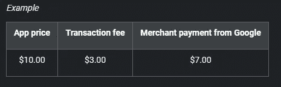
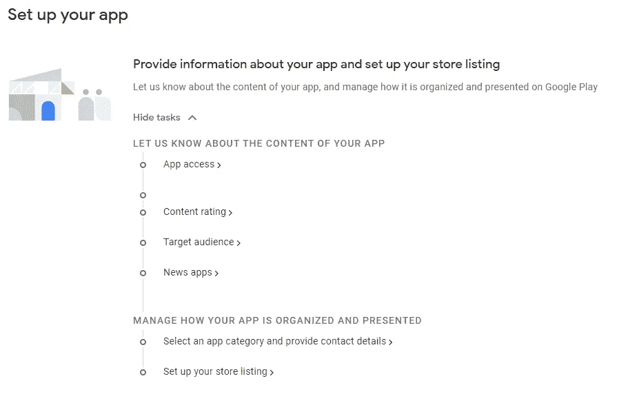
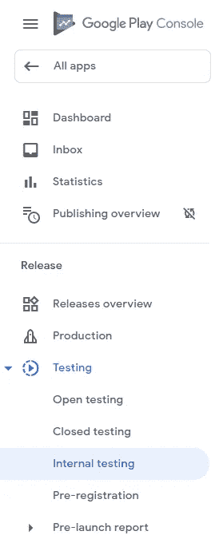
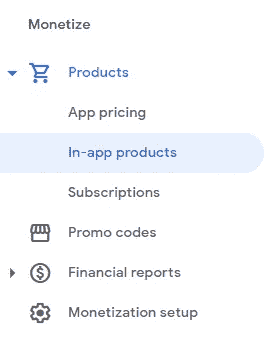
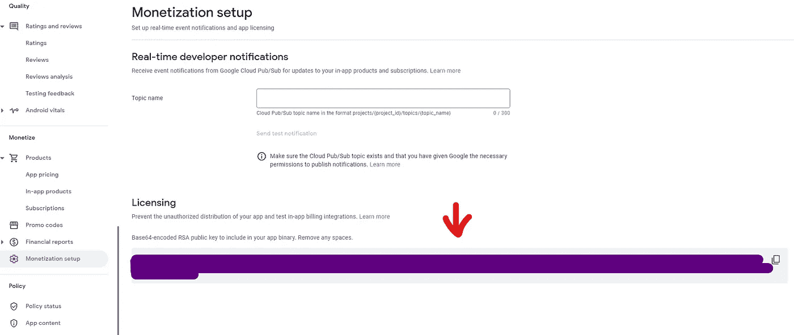
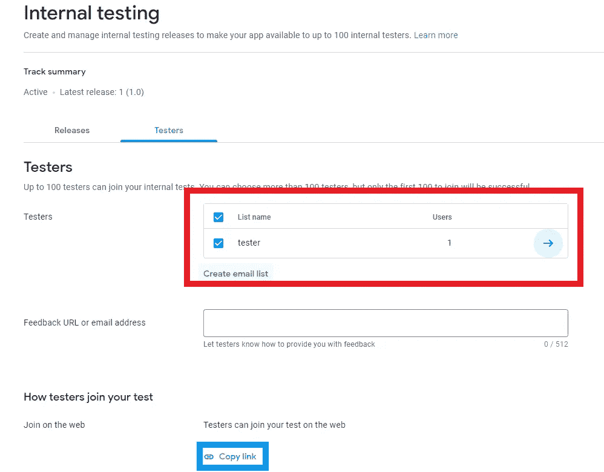

# 在 Android 中实现应用内购买

> 原文：<https://betterprogramming.pub/implementing-in-app-purchases-in-android-2bd52a3ab700>

## 提高你的免费增值应用的销量

由[米卡·鲍梅斯特](https://unsplash.com/@mbaumi?utm_source=medium&utm_medium=referral)在 [Unsplash](https://unsplash.com?utm_source=medium&utm_medium=referral) 拍摄的照片

在你的应用程序中实现应用内购买是非常惊人的。他们允许你让你的应用[免费增值](https://www.investopedia.com/terms/f/freemium.asp)，这已经被证明是让用户愿意为你的应用付费的最有效策略。

不幸的是，在 Android 中实现应用内购买需要大量的工作。和往常一样，文档也不是那么容易理解。这就是 android-inapp-billing-v3 登场的地方。

要阅读本文，您需要有一个开发者帐户，并能访问 Google Play 控制台。

> **这个库使用的是 Google Play 计费库 2.0.1 版本。如果不更新此库，您将无法在 2021 年 11 月 1 日后使用它。要了解如何实现最新的库，您可以查看本教程******。****

# **贮藏室ˌ仓库**

** [## mattiaferigutti/应用内购买-使用-示例

### 通过在 GitHub 上创建一个帐户，为 mattiaferigutti/In-App-Purchases-Usage-Sample 开发做出贡献。

github.com](https://github.com/mattiaferigutti/In-App-Purchases-Usage-Sample)** 

# **Google Play 向开发者收取的交易费用**

**Google Play 中所有购买(应用和应用内购买)的交易费是客户价格的 30%。换句话说，开发者获得 70%的支付，剩下的 30%归发行伙伴和运营费。点击查看更多关于[交易费用的信息。](https://support.google.com/paymentscenter/answer/7159343)**

****

# **第一步。**

**实现`build.gradle`中的库(你可以在这里查看当前版本[):](https://github.com/anjlab/android-inapp-billing-v3)**

**打开您的清单并在顶部添加此权限:**

# **第二步。**

**现在是时候打开你的 *Google Play 控制台*并加载应用程序了。在商店上加载应用程序之前，请确保您已经完成了第一步。这是因为您需要实现计费权限来解锁*应用内产品*部分。**

**首先，创建一个新的应用程序，并完成所有这些步骤:**

****

**谷歌 Play 商店开发者控制台截图**

**第二，一旦你完成了，你想发布你的应用。我建议你在*内部测试*部分这样做:**

****

**内部测试控制台截图**

**第三，如果您没有商户账户，您需要通过点击*设置商户账户*->-*创建被管理产品、*并填写表格来进行设置([关于填写表格的更多信息，请点击](https://support.google.com/paymentscenter/answer/7161426))。**

**第四，一旦你上传了你的 APK(或 Android 应用捆绑包)，你就可以在*应用内产品*中创建新产品。要找到它，向下滚动左侧边栏，直到找到*应用内产品。***

****

**最后，您可以通过点击*创建产品*按钮来创建新产品。请记住，一旦您被分配了产品 ID，您就不能更改它。但是，您可以更改名称、描述和价格。创建并保存产品后，必须点击*激活*按钮。否则，该产品将无法购买。**

****

**实施示例——应用内购买**

**记住产品 ID。我们以后会用到它。**

# **第三步。**

**让我们编写以下代码:**

**让我们分析一下代码:**

*   **我们通过三个参数初始化 *BillingProcessor* 对象。第一个参数是上下文，第二个是许可证密钥(我们很快就会看到如何找到它)，第三个用于在`Activity`中注册`IBillingHandler` 接口的方法。**
*   ***initialize()* 将启动服务并绑定播放服务。完成后，将调用*onbillinitialized()*。**
*   **要知道 *onProductPurchased()* 只有在第一次购买产品的时候才会被调用。如果我们关闭应用程序并重新打开它，这个方法将不会被调用。我们将在后面看到如何验证购买。**
*   **确保您已经实现了 *onActivityResult()。*如果没有这个方法 *onProductPurchased()* ，*onPurchaseHistoryRestored()*就不会被调用。**

## **哪里可以找到许可证密钥**

**让我们回到我们的 Google Play 控制台，在侧边栏上找到如下所示的货币化设置。**

****

**货币化设置屏幕截图**

**您的字符串不能有任何空格，所以如果有空格，请将其删除。**

## **购买产品**

**使用下面的代码，我们可以添加购买产品的功能:**

**在使用之前，最好检查一下应用内付费服务的可用性。在一些旧设备或中国制造的设备中，Google Play 市场可能无法使用。此外，它可能被否决，不支持应用内计费。这个`isOneTimePurchaseSupported`变量起了作用。**

## **购买带有开发者有效负载的产品**

**使用如下代码，我们可以进行设置:**

**你也可以使用开发者有效载荷([更多信息在这里](https://stackoverflow.com/questions/7891242/android-in-app-billing-what-is-the-developer-payload-and-how-the-buy-button/))，但是你应该知道 Google 已经否决了它，声明如下:**

> **[“有了这种支持，从 Google Play 计费库的 2.2 版本开始，我们已经弃用了开发者有效负载。与开发人员负载关联的方法在 2.2 版中已被否决，在 3.0 版中已被移除。](https://developer.android.com/google/play/billing/developer-payload)**

## **核实产品的购买**

**使用下面的代码，我们可以实现这个特性:**

**如果您想验证您的产品是否已经被购买，请调用此方法。我建议你在*onbillinitialized()*内部调用这个方法，以确保 *BillingProcessor* 已经初始化。**

## **恢复购买**

**使用下面的代码，我们也可以实现这个特性:**

**调用此方法来恢复购买。**

## **重置付款**

**您可能希望在发布支付之前测试几次。问题是，一旦你支付了项目，你不能“删除”付款，但实际上有一种方法可以做到这一点。你可以“消费”你刚买的东西。当你想购买额外的物品时，这主要用于游戏。比如你可以买一些硬币或者一把强化剑。这对测试我们的应用程序也很有用。**

**如你所见，这很简单。我建议你在*onbillinitialized()*方法内部使用它。**

# **第四步。**

## **测试应用内购买**

**如果您的应用程序未在 Play Store 中发布，则您不能使用应用程序内购买项目。要测试和使用它们，您必须将测试应用程序的帐户声明为测试帐户。为此，请进入 Google Play 控制台->所有应用->设置->许可证测试。记下您想要使用的账户，并在下拉菜单中选择*许可*。将您的帐户设置为测试者帐户，当您购买产品时将不会被收费。**

**您不能使用与 Google Play 控制台相同的帐户。**

****

**[更多信息请点击此处](https://support.google.com/googleplay/android-developer/answer/6062777)**

# **步骤 5(如果您使用内部测试)。**

**为了在内部测试中测试应用内购买，你需要做一个额外的步骤。**

****

*   **首先，在*列表名称*中插入您想要测试的设备上的电子邮件(红色矩形)**
*   **其次，复制链接(蓝色矩形)**
*   **第三，接受邀请。如果您已经使用想要用来测试应用程序的帐户登录到 play store，您可以从您的 pc 上执行此操作，或者只需将其复制到您的手机中，然后从那里打开 play store。**

# **处理问题**

**如果应用内购买不起作用，请尝试遵循以下步骤:**

*   **您正在运行的应用程序的`versionCode` 必须与您在 Google Play 控制台中加载的 APK 相同**
*   **您用于测试的帐户与您用于在 Play store 中发布应用的帐户不同**
*   **您用于测试的帐户已被声明为测试帐户。如果没有，[将您的帐户设置为测试者](https://support.google.com/googleplay/android-developer/answer/6062777)**
*   **您的应用程序**必须在 Play Store 中发布**。如果您正在测试您的应用程序，您可能希望在内部测试部分发布它。如果您的应用程序正在*审查中*，则该应用程序尚未发布。因此，应用内购买不起作用**
*   **如果您的应用刚刚发布，可能需要几个小时才能实现应用内购买**
*   **如果你刚刚创建了一个应用内产品，你可能需要等待几个小时才能真正运行**

# **参考**

*   **[安卓应用内计费 v3 库](https://github.com/anjlab/android-inapp-billing-v3)**
*   **[在您的 Android 应用中实现应用内购买](https://medium.com/better-programming/how-to-implement-in-app-purchases-in-your-android-app-7cc1f80148a4)**
*   **[安卓开发者:应用内购买](https://developer.android.com/google/play/billing)**