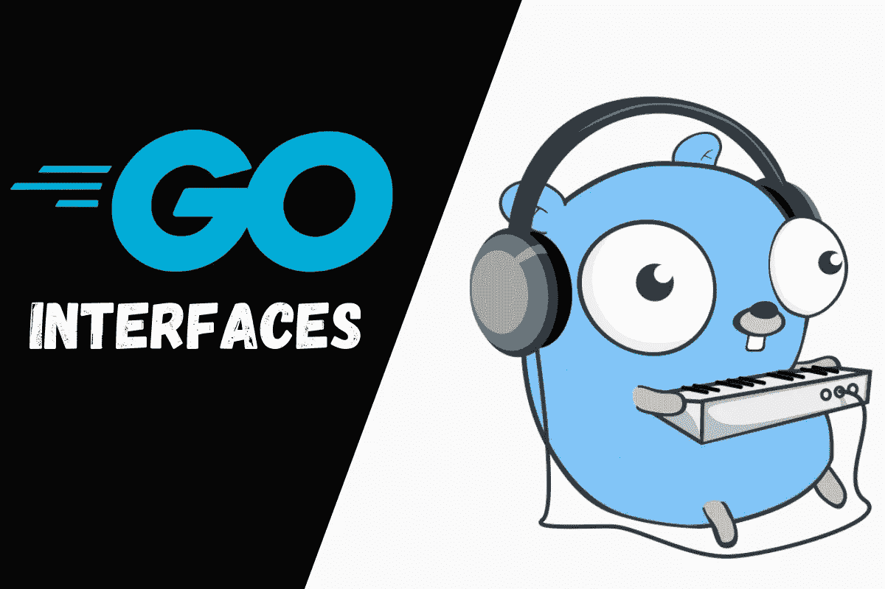
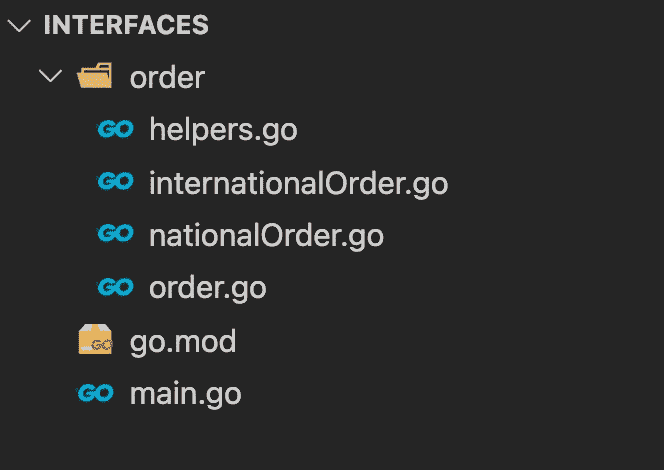
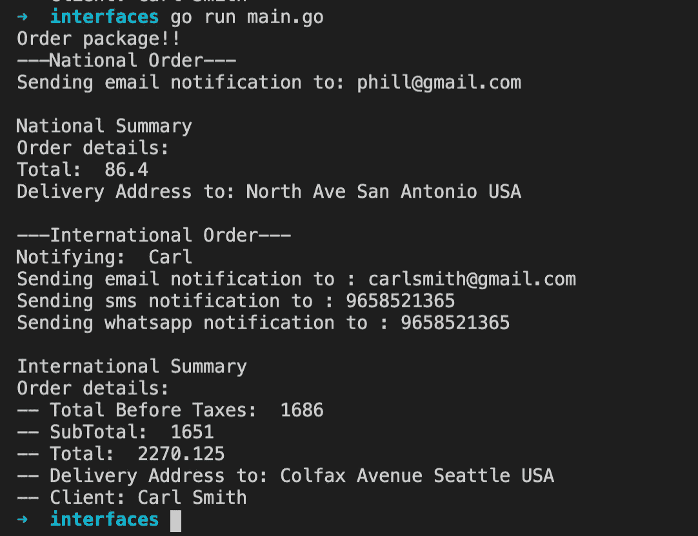

# 用 Golang 实现接口

> 原文：<https://betterprogramming.pub/implementing-interfaces-with-golang-51a3b7f527b4>

## 了解如何利用接口的力量



接口是定义一系列动作和行为的工具。它们帮助对象依赖抽象，而不是其他对象的具体实现。我们可以通过组合多个接口来组合不同的行为。

在这篇文章中，我们将讨论 Golang 中的接口以及如何使用它们。

# 什么是接口？

> 接口是一组表示不同数据类型的通用行为的方法。

有了接口，我们可以组织不同的方法组，应用于不同类型的对象。通过这样做，我们的程序可以依赖于更高的抽象(接口),而不是具体的实现，允许其他方法与实现相同接口的各种不同的对象一起工作。

在 OOP 的世界里，这个概念被称为依赖倒置原则。如果你想了解更多关于坚实原则的内容，我推荐你看一看[这篇文章。](https://medium.com/swlh/what-are-solid-principles-in-software-development-world-a5ec98637c01)

在 Go 中，构建小型接口，然后将它们组合在一起，为对象添加更多功能，被认为是最佳实践。这样，您可以保持代码整洁，并提高可重用性。

我们可以考虑多种类型之间常见的不同动作来定义接口。

在 Go 中，我们可以自动推断一个 struct (object)实现了它的所有方法就实现了一个接口。

# 在 Go 中定义简单接口

让我们在 Go 中定义一个接口，开始玩转，发现它的强大之处。

```
type Printer interface {
  Print()  
}
```

这是一个非常简单的接口，定义了一个叫做`Print()`的方法。此方法表示其他对象可以实现的操作或行为。

需要明确的是，接口仅仅定义了行为，并没有定义具体的实现。这是实现这个接口的对象的工作。

现在让我们创建两个将实现这个`Printer`接口的对象:

在上面的例子中，我们声明了两个`struct`类型——一个用户和一个文档。

然后，我们使用接收函数在每个 struct 类型上声明`Print`函数及其自定义实现。

在这之后，我们可以说这两个结构都实现了`Printer`接口。

通过这样做，我们可以编写更多依赖于抽象而不是具体对象的代码，从而允许我们的代码被重用。假设我们想写一个新的方法来打印这两个结构的细节。我们可以使用这个接口来实现:

```
func Process(obj Printer) {
    obj.Print()
}
```

该函数将实现该接口的任何对象作为参数。所以只要对象响应接口内部定义的方法，我们就可以用这个函数来处理对象。

在 main 函数中，我们可以编写以下内容来打印每个对象的详细信息:

```
func main() {
  u := User{name: "John", age: 24, lastName: "Smith"}
  doc := Document{name: "doc.csv", documentType: "csv", date: time.Now()}
  Process(u)
  Process(doc)
}
```

这段代码的输出如下所示:

```
Hi I am John Smith and I am 24years old 
Document name: doc.csv, type: csv, date: 2009-11-10 23:00:00 +0000 UTC m=+0.000000001
```

现在，让我们看一个使用接口的更复杂的例子，让我们更好地理解接口在 Go 中是如何工作的。

# 项目描述

在这个项目中，我们将处理客户订单。我们的程序将支持`National`和`International`订单，两者都依赖于接口的抽象来定义预期的行为。

我们将在这个项目中使用 Go 模块，我希望你对模块如何在 Go 中工作有一个基本的了解，但如果你没有，这也没什么大不了的。

让我们开始创建一个名为`interfaces`的新文件夹。

在该文件夹中，运行以下命令创建一个模块:

```
go mod init interfaces
```

该命令将生成一个新文件`go.mod`，其中包含模块名称和 Go 版本。对我来说，围棋版本是`go 1.15`。

创建一个名为`order`的新文件夹。在该文件夹中创建以下文件:

*   `intenationalOrder.go`
*   `nationalOrder.go`
*   `order.go`
*   `helpers.go`

在根文件夹中创建一个新的`main.go`文件。文件夹结构将如下所示:



现在，让我们看看`main.go`文件的实现。main 函数的定义将非常简单，因为我们导入了 orders 包，并且只从中调用了`New`函数。反过来，这个包将具有这个例子所有逻辑:

正如您所看到的，这个文件非常简单，我们只是导入订单包并在其上调用`New`函数。我们还没有创建订单包，但我们将很快创建。

对于订单包，我们将创建不同的结构类型和接口。让我们看看这个文件是什么样子的。

让我们浏览一下这个文件，解释每个定义的函数、接口和结构对象。

首先，我们有一个`New`函数。正如你已经知道的，我们使用大写字母作为函数名，因为我们想导出并使它对其他包可用。第一个功能的目的是创建一个国家秩序的新实例和一个国际秩序的新实例。然后，我们将这两个实例传递给类型为`Operations`的片内的`ProcessOrder`函数。我们稍后将更详细地讨论这个`Operation`类型。

以下结构类型代表了我们创建订单所需的各种对象:`Product`、`ProductDetail`、`Summary`、`ShippingAddress`、`Client`和`Order`。

`Order`结构类型将有一个摘要、送货地址和客户属性。它还有一个类型为`ProductDetail`的产品数组。

我们还声明了三个小接口:`Processer`、`Printer`和`Notifier`。这些接口中的每一个都有一个函数，它定义了其他对象实现它们时必须采用的行为。

我们还有另外一个接口叫做`Operations`。我们正在组合不同的接口来创建这个接口，这非常方便，因为它允许我们的程序组合对象，并使代码更加可重用。

最后，对于这个文件，我们有一个接收订单数组的`ProcessOrder`函数。有趣的部分来了。与接收特定对象的数组相反，该函数接收这些对象的抽象。所以，只要我们在数组内部传递的对象实现了`Operations`接口，这个函数就能正常工作。这就是接口真正有用的地方，因为它们允许我们的程序依赖抽象而不是具体的实现。

现在让我们实现`internationalOrder.go`文件:

该文件是`Operations`接口的第一个具体实现。首先，我们创建了一个名为`InternationalOrder`的新结构类型，使用`Order`结构来定义它的属性和对象。然后我们有一个名为`NewInternationalOrder`的初始化函数，它将为这个订单设置一些产品、客户信息和发货地址。

我们将使用一个助手函数来初始化一个新的`ProductDetail`、`Client`和`ShippingAddress` ——别担心，我们很快就会实现。

在文件的其余部分，我们声明了`FillOrderSummary`、`Notify`和`PrintOrderDetails`函数的具体实现。这样，我们可以说国际订单结构类型实现了`Operations`接口，因为它有所有方法的定义。相当酷！

我们来看看`nationalOrder.go`文件的执行情况:

这个文件代表了`Operations`接口的第二个具体实现。这里，我们有一个`NationalOrder`结构类型，它也使用了`Order`结构类型。

我们还声明了一个初始化函数，该函数将设置一些产品、客户信息以及这个特定国家订单的发货地址。

然后，正如我们在前面的文件中所做的那样，我们有了实现接口所需的所有方法的定义。这样，国家订单结构也实现了`Operations`接口，因为它响应它的所有方法。

有了这两个具体的实现，我们可以将这些实例传递给依赖于`Operations`接口的任何方法。

为了完成这个例子，我们只需要在`helpers.go`文件中实现助手函数:

如前所述，该文件包含一些帮助器函数，用于创建产品、设置客户端、送货地址以及计算订单的小计。

我们准备好运行这个程序了！

如果我们转到项目的根文件夹，用`go run main.go`运行程序。我们应该看到这样的预期输出:



现在我们已经学会了如何在 Go 中使用接口，我们可以创建更多依赖于其他接口的函数。

例如，我们可以创建新的函数来接收任何实现了`OrderProcesser`或`OrderNotifier`接口的对象。这时，定义小接口的想法就派上了用场。

当我们的对象实现了较小的接口，但同时又是较大接口的一部分时，这将非常有用。通过创建小接口，我们遵循接口分离原则，确保我们的程序与实现不同接口的不同对象一起工作。

# 结论

接口是创建定义行为的抽象的好方法。现在，我们可以开始构建使用接口来抽象行为和跨不同对象共享公共动作的程序。接口也给了程序更多的灵活性，允许更多的代码重用。

# 资源

如果您有兴趣了解更多关于 Go 的知识，下面的文章可能会有所帮助。

[](https://levelup.gitconnected.com/grpc-how-to-make-effective-unary-calls-4c9fa68cd9d5) [## gRPC:如何进行有效的一元调用

### 在本文中，我将解释如何进行一元 gRPC 调用——实现客户机和服务器 Go 应用程序。

levelup.gitconnected.com](https://levelup.gitconnected.com/grpc-how-to-make-effective-unary-calls-4c9fa68cd9d5) [](https://levelup.gitconnected.com/grpc-how-to-make-client-streaming-calls-5c731197585) [## gRPC:如何进行客户端流调用

### 在本文中，我将介绍客户机流 gRPC 调用——实现客户机和服务器 Go 应用程序。

levelup.gitconnected.com](https://levelup.gitconnected.com/grpc-how-to-make-client-streaming-calls-5c731197585)