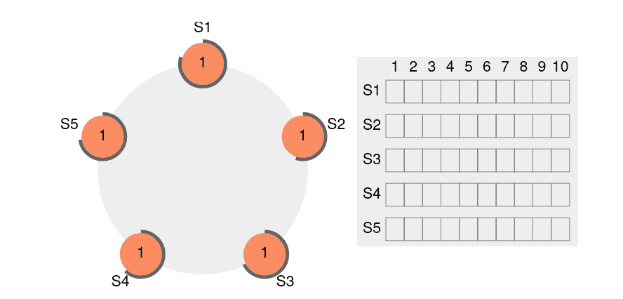

# 在分布式系统中实现领导者选举

> 原文：<https://betterprogramming.pub/implementing-leader-election-in-your-distributed-systems-5422d3123cf3>

## 无需重新发明轮子就能在系统中添加分布式共识的技巧


来自:[unsplash.com](https://unsplash.com/)

在计算机科学中，系统变得越来越复杂。许多参与者经常相互沟通，以提供业务服务并为客户创造价值。最大的挑战之一是协调参与者(例如，业务专家、流程、应用程序或线程)。

为了解决软件开发中的这个问题，我们过去依赖于操作系统同步原语，为我们的程序线程使用低级机制:

*   互斥锁( [Linux](https://github.com/torvalds/linux/blob/master/include/linux/mutex.h) / [windows](https://docs.microsoft.com/en-us/windows-hardware/drivers/kernel/introduction-to-mutex-objects) ):独占线程访问。
*   semaphore([Linux](https://github.com/torvalds/linux/blob/master/include/linux/semaphore.h)/[windows](https://docs.microsoft.com/en-us/windows/win32/sync/using-semaphore-objects)):资源访问同步工具。
*   带有重试循环的 spin lock([Linux](https://github.com/torvalds/linux/blob/master/kernel/locking/spinlock.c)/[windows](https://docs.microsoft.com/en-us/dotnet/standard/threading/spinlock))线程锁。
*   barrier([Linux](https://github.com/torvalds/linux/blob/master/kernel/sched/membarrier.c)/[windows](https://docs.microsoft.com/en-us/dotnet/standard/threading/barrier))不同相位的多线程同步。

所有这些机制对于在同一台机器上同步线程都是理想的。

不幸的是，这不适用于分布式系统。CAP 定理指出，在分布式系统中，您无法实现一致性(所有节点上的数据版本相同)、可用性(100%的请求得到响应)和分区容差(系统在少数节点关闭的情况下仍能工作)。

# 领导人选举

就像操作系统可以为线程提供额外的能力一样，在分布式系统中，我们需要一个健壮的机制来选择一个服务进行协调:一个领导者选举。

以下是领导人选举应该做的:

*   选举应该终止。
*   所有的参与者都应该认同领导者的身份。
*   领导者应该是独一无二的。

已经实现了许多一致性算法来支持这种选择，这取决于拓扑(例如，网状对环形对完整网络)以及系统的假设和需求。

# 赫希伯格-辛克莱算法

在环形拓扑中(每个节点有两个邻居)，每个节点比较它们的 id，在 O(n log(n))个消息之后，最高的一个获胜。

# 恶霸算法

这个同步算法假设每个节点都有一个唯一的 ID，并且知道所有的参与者 ID。

最高 ID 的节点通过向所有其他节点或较低 ID 的节点广播消息来宣布自己是“选举”的获胜者。然后，它等待响应，如果没有响应，它就宣布自己是赢家。

当高 ID 节点启动、领导者失败或心跳消息失败时，将调用选举。

# Raft 算法

Raft 算法允许协商一致(所有节点同意相同的信息)和领导者选举。每个节点可以是领导者、追随者或候选人(在选举期间)。

领导者负责发送心跳消息和日志，供追随者复制。

如果在追随者超时期满之前没有接收到心跳，则追随者(成为候选人)可以触发新的领导者选举。



领袖 S2 坠机模拟(牛逼[raft.github.io/](https://raft.github.io/)筏选领袖模拟)

# 我如何在我的分布式服务中使用它？

对于现实世界的实现，您可能更喜欢使用现有的实现领导者选举算法的分布式同步系统，而不是编写自己的实现。

我们将看到如何使用 [Apache 开源项目 ZooKeeper](https://github.com/apache/zookeeper) (由 ZooKeeper 原子广播算法提供支持)为您的节点实现领导者选举。

我们有一个应用程序，需要处理一个沉重的支付过程。有必要确保我们总是有一个应用程序准备好面对任务，但它永远不会做两次。

首先，我们将定义我们的支付(占位符)业务场景和客户端，它将与 ZooKeeper 通信以触发选举并监控领导者的身份。

接下来，我们需要一个工作人员将 leader election 客户端与我们的业务处理器连接起来，确保只有 leader 可以处理付款。

我们的分布式 leader payment worker 现在已经准备好接受测试:

*   我们将在一个小的`Program.cs`中实例化我们的领导人选举、工人和支付处理器。
*   使用 docker 栈部署本地 Zookeeper 集群

瞧！我们现在有了一个容错服务，可以通过部署和复制来管理我们的复杂用例，并在我们的应用节点之间进行可靠的协调。

```
docker stack deploy -c stack.yml zookeeper
```

领导者选举是一个强大的工具，可以为您的分布式系统增加容错和一致性。

像在软件工程中一样，我们总会有一个权衡。您的系统现在可能依赖于您必须维护的外部群集服务。新问题可能会影响你的系统(更复杂，分裂大脑的危险(网络分裂导致两个领导者)，以及时钟同步问题)。

如果成本太高，可以设想其他同步机制(幂等操作、乐观锁定、悲观锁定)

# 参考

 [## 阿帕奇动物园管理员

### Apache ZooKeeper Apache ZooKeeper 是一个致力于开发和维护开源服务器的项目，该服务器支持高度…

zookeeper.apache.org](https://zookeeper.apache.org/)  [## 恶霸算法—维基百科

### 在分布式计算中，恶霸算法是一种从群体中动态选举协调者或领导者的方法

en.wikipedia.org](https://en.wikipedia.org/wiki/Bully_algorithm) [](https://en.wikipedia.org/wiki/Raft_%28algorithm%29) [## Raft(算法)—维基百科

### Raft 是一种共识算法，旨在替代 Paxos 系列算法。这意味着更多…

en.wikipedia.org](https://en.wikipedia.org/wiki/Raft_%28algorithm%29)