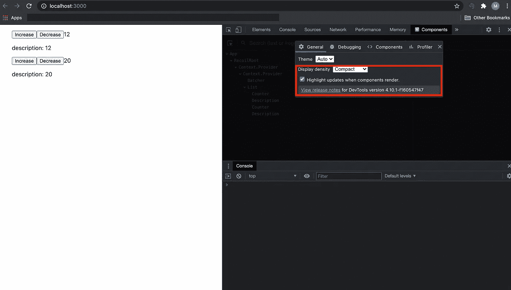
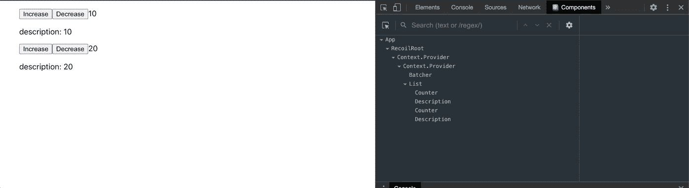

# 用 React 和反冲实现列表项

> 原文：<https://betterprogramming.pub/implementing-list-items-with-react-and-recoil-c58f75e307dc>

## 性能良好的渲染


詹·西奥多在 [Unsplash](https://unsplash.com?utm_source=medium&utm_medium=referral) 上拍摄的照片。

在这篇文章中，我将带你了解如何使用[反冲](https://github.com/facebookexperimental/Recoil)实现列表项，而不需要不必要的重新渲染。

# 回购示例

以下是最终代码库的参考:

[](https://github.com/manakuro/recoil-list-example) [## mana kuro/反冲列表示例

### 使用 React 和反冲实现列表项，无需不必要的重新呈现。在项目目录中，您可以运行…

github.com](https://github.com/manakuro/recoil-list-example) 

# 设置 React 应用程序

为了快速启动，我们使用`[create-react-app](https://github.com/facebook/create-react-app)`来设置 React 应用程序:

```
npx create-react-app reg-suit-app --template typescript
```

安装后，通过运行以下命令运行开发服务器:

```
yarn start
```

您将看到欢迎页面:


欢迎页面

# 设置反冲

接下来，我们将在我们的应用程序中设置反冲。

首先，安装反冲:

```
yarn add recoil
```

并将`RecoilRoot`添加到`App.tsx`:

App.tsx

# 实施列表项目

现在我们已经设置了反应和反冲，我们将实现列表项。

首先，我们将创建一个提供列表项的自定义挂钩。创建`src/hooks/useList.tsx`并添加以下代码:

并创建一个名为`src/List.tsx`的组件:

`List`组件通过`useList`钩子消耗`listIds`，并将每个 ID 提供给子组件。

并在`src/Counter.tsx`中创建一个`Counter`组件:

`Counter`组件通过`useListItem`钩子使用传递的 ID 消费`listItem`。这将把状态从父组件中隔离出来，因为`useListItem`钩子创建了一个隔离的原子作为本地状态。

接下来，在`src/Description.tsx`中创建另一个子组件:

与`Counter`组件一样，`Description`组件也将消耗`listItem`。

现在我们准备测试我们的应用程序。让我们来看看它是如何工作的。

为了查看组件如何在我们的应用程序中呈现，我们需要启用`Components`选项卡中的高亮选项，如下所示:



突出显示选项

这将只高亮显示已经更新和渲染的组件。

所以，让我们来测试一下:



试验

正如你所看到的，当我们点击每个条目的“增加”和“减少”按钮时，React 将检测哪个列表条目已经被更新，并呈现新的条目而不是整个列表。当需要渲染大量的`List`组件时，这极大地提高了渲染性能。

# 结论

我们已经介绍了如何使用 React 和反冲实现列表项。我希望你喜欢阅读这篇文章。

[](https://github.com/manakuro/recoil-list-example) [## mana kuro/反冲列表示例

### 使用 React 和反冲实现列表项，无需不必要的重新呈现。在项目目录中，您可以运行…

github.com](https://github.com/manakuro/recoil-list-example)