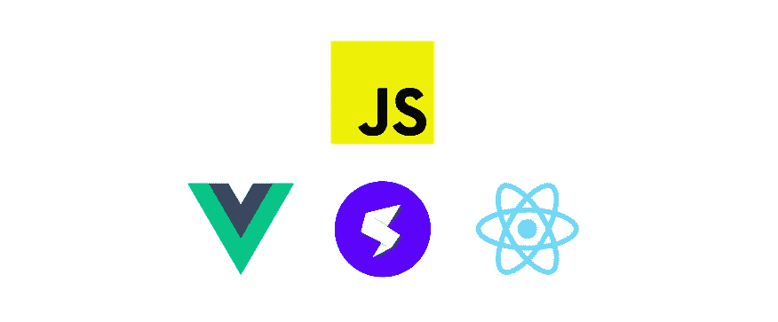
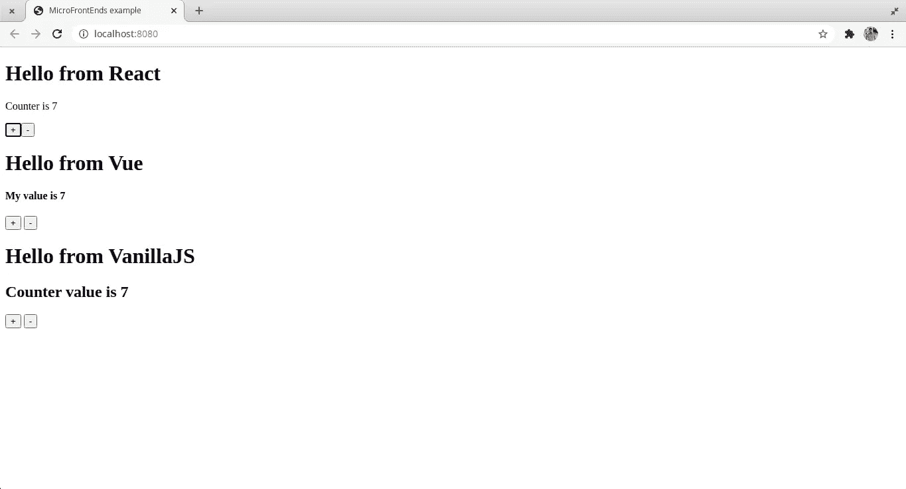
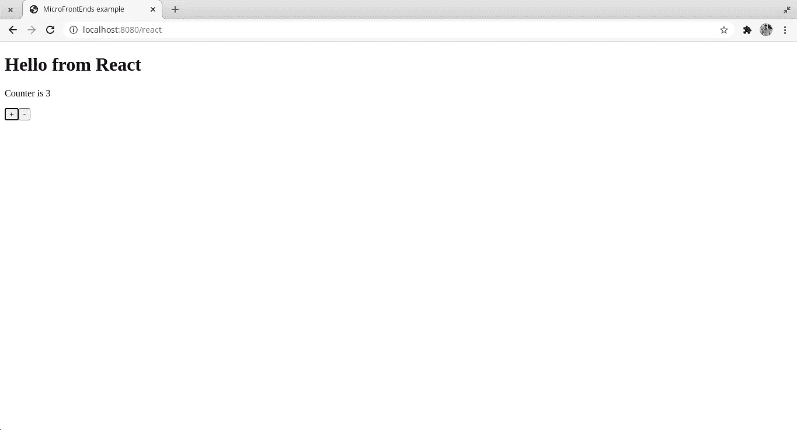

# 使用单个 SPA 实施微前端

> 原文：<https://betterprogramming.pub/implementing-micro-frontends-using-single-spa-1ac2a3f704a2>



使用单个 SPA 组合 React、Vue 和 JS 应用程序

在我的[上一篇文章](https://medium.com/better-programming/what-are-micro-frontends-is-it-even-necessary-to-use-them-f1393d65ef2f?source=friends_link&sk=e058674caf56966e035ddd76dc124631)中，我解释了什么是微前端以及它们如何有用。在本文中，我将解释我们如何实现微前端来使用单个 SPA 在单个页面中显示各种组件，这是一个 MFE(微前端)框架。

# 什么是单身 SPA？

Single SPA 是一个框架，用于在前端应用程序中整合多个 JavaScript MFEs。现在有很多框架，但这是最受欢迎的微前端开源项目之一。

# 我们要实现什么？

我们将实现一个简单的应用程序，它由三个应用程序组成，Vanilla JS、React 和 Vue app，其中每个应用程序执行递增和递减操作。我们还将确保我们在这些应用程序之间进行沟通，也就是说，每当我们在任何应用程序中进行更改时，这些更改也会反映在其他应用程序中。请记住，当使用 MFE 框架时，我们应该始终确保使用 DOM/globals 进行交互，而不是任何发布-订阅方法。

# 让我们开始吧

假设您的机器上已经安装了`node`和`npm`，让我们继续下面的步骤。

## 安装所需的软件包

为了使用`npm`脚本运行服务器，我将首先用这个命令初始化我的项目目录

```
npm init -y
```

这反过来会给我提供一个`package.json`文件。我们不会使用 CLI 方法创建 React 应用程序或 Vue 应用程序。相反，我们将手动实现一切。

为了实现微前端，`single-spa`是需要的主要软件包之一。对于 React，我们将需要像`react`、`react-dom`、`single-spa-react`这样的包。对于 Vue，我们需要两个包`vue`和`single-spa-vue`。最后，对于普通的 JS，我们需要`single-spa-html`。[单 spa](https://single-spa.js.org/docs/ecosystem) 提供的套餐多的是。对于我们的应用程序，这些包就足够了。运行此命令安装这些依赖项。

```
npm install react react-dom single-spa single-spa-react single-spa-vue vue single-spa-html
```

我们还需要两套包装才能继续。一个是[巴别塔](https://babeljs.io/)。这是用来转换所有花哨的新语法(JSX 等。)转换成浏览器可接受的 JS 语法。简单地说，它改变了语法。 [Webpack](https://webpack.js.org/) 需要另一套包。Webpack 是 Javascript 的一个模块捆绑器。它将许多文件捆绑成一个文件。我们还可以为我们配置 Webpack 应该如何捆绑。

让我们首先为 Babel 安装依赖项。运行此命令安装这些开发依赖项。

```
npm install --save-dev [@babel/core](http://twitter.com/babel/core) [@babel/plugin-proposal-object-re](http://twitter.com/babel/plugin-proposal-object-re)st-spread [@babel/plugin-syntax-dynamic-imp](http://twitter.com/babel/plugin-syntax-dynamic-imp)ort [@babel/preset-env](http://twitter.com/babel/preset-env) [@babel/preset-react](http://twitter.com/babel/preset-react) babel-loader
```

接下来，按照这个命令安装 Webpack 的依赖项。

```
npm install --save-dev webpack webpack-cli webpack-dev-server clean-webpack-plugin css-loader html-loader style-loader vue-loader vue-template-compiler
```

## 配置巴别塔

为了配置 Babel，让我们在同一个目录中创建一个`.babelrc`,然后粘贴这段代码。基本上这段代码片段指示 Babel 使用某些预设和插件。还有其他几个插件可用。一定要在巴别塔的网站上查看同样的内容。

## 配置 Webpack

像 Babel 一样，我们需要另一个名为`webpack.config.js`的配置文件。这里我们提到了什么是模式，Webpack 要查看的入口点，要捆绑的输出目录，以及在那里创建文件。我们还指定了加载器，以便解析`.css`文件、`.js`文件和`.vue`文件。插件在这里用于 Vue，并在每次构建时清理 Webpack。此外，我们使用`source-map` Devtool 进行调试和`devServer`配置，这样我们就可以启动一个开发服务器来监视 Webpack 中的变化。我们的文件应该如下所示:

如上所述，我们已经提到文件的入口点是`singleSPA.config.js`。让我们创建这个文件。

## 配置单个 SPA

让我们从这个文件的`single-spa`包中导入`start`函数，并在文件末尾调用 start 函数。一旦我们开始编写组件，我们将回到这个文件。

```
import { start } from 'single-spa'start()
```

## 创建存储文件

如前所述，在单个 SPA 中，我们可以使用 DOM/任何全局对象在组件内进行通信。因此，让我们利用窗口对象在组件之间进行通信。让我们在同一个目录下创建一个新文件`store.js`并粘贴这段代码。

这段代码是不言自明的。我们有一个增量函数、一个减量函数和一个计数器变量来访问这个值。当我们调用这些方法时，我们也在调度事件。

# 创建组件

到目前为止，我们已经完成了应用程序的配置，现在让我们创建三个不同的组件。首先，让我们创建一个名为`components`的目录。让我们在组件中创建三个目录，即`react`、`vue`和`vanillajs`。

## 创建反应组件

让我们创建一个简单的功能组件`App.js`，它呈现来自 React 的消息、计数器的当前值和两个递增和递减按钮。

现在，既然我们的应用程序已经创建，让我们看看如何使用单个 SPA 来配置它。让我们创建主`index.js`文件。在这个文件中，我们需要调用从`single-spa-react`包导出的函数，用一个对象作为由`React`、`ReactDOM`、`rootComponent`组成的参数，以及一个附加的`domElementGetter`函数。最后，我们需要导出创建的实例的三个属性:`bootstrap`、`mount`和`unmount`。这是单 spa 中常用的模式。我们的`index.js`文件应该是这样的:

## 创建 Vue 组件

类似地，在我们的`vue`目录中，让我们创建一个`index.js`文件和一个`App.js`。我们将实现几乎相同的功能，但使用 Vue。所以我就跳过解释，附上下面的代码片段。

## 创建普通的 JS 组件

正如官方[文档](https://single-spa.js.org/docs/ecosystem-html-web-components)中提到的，我们将利用`single-spa-html`通过传递包含 HTML 片段的模板来创建一个实例。我们还将修改`mount`函数，这样一旦创建了 HTML 元素，我们就可以使用绑定了。所以让我们在`vanillajs`目录下的`index.js`文件中创建所有内容。

差不多就是这样。现在只剩下几步了。我们需要在我们的`singleSPA.config.js`文件中注册这些导出的组件，最后在我们的`package.json`中添加一些脚本来启动并运行服务器。

# 将组件注册到 SPA 配置

这是我们注册组件的主要步骤之一，只有到那时单个 SPA 才会知道。有一种叫做`registerApplication`的方法是单个 SPA 提供的。它基本上接受三个参数。首先是应用的名称(这里 React、Vue、Native JS 被认为是三个不同的应用)。第二个参数是应用程序或加载函数，这意味着每个应用程序的启动(`index.js`)文件。最后一个强制参数是 activity 函数，它告诉 single SPA 何时呈现该应用程序。通常我们提供路径(URL ),基于它我们可以告诉单个 SPA 何时渲染它。下面是我们的文件经过这些更改后的样子:

现在你可能想知道它在浏览器中是如何呈现的。我们还没有做那么一点点。所以让我们把事情做完。基本上，我们需要一个`index.html`文件和某些容器，以便内容在其中准确显示。我们将把这个`index.html`文件放在我们的主根目录中，并且有一些`div`容器，这些容器带有我们在注册时给应用程序命名的值的 id，即`vue`、`react`、`vanillajs`。我们的`index.html`应该是这样的:

最后，我们还包括了`singleSPA.config.js`文件。注意，我们在它之前指定了一个目录`dist`。这是因为我们在 webpack 配置文件中将`dist`指定为输出目录。

# 运行我们的服务器

最后一步，在我们的`package.json`文件中添加两个脚本。一个是运行 webpack dev 服务器，另一个是将文件构建到一个目录中。我们最终的`package.json`文件应该是这样的:

唷，就这样。现在，让我们通过运行以下命令来测试我们的应用程序:

```
npm start
```

然后，导航至`localhost:8080`。你可以在主页上找到这三款应用。尝试使用递增/递减按钮，你会发现计数器值在每个应用程序中都会更新。另外，尝试导航到`localhost:8080/react`以仅显示 React 应用程序，`/vue`以仅显示 vue 应用程序，最后`/vanillajs`以仅显示 Vanilla JS 组件。



包含 3 个不同组件的主页

下面是一个截图，只显示了一个应用程序。



单一 SPA 仅渲染 React 应用程序

# 最后的想法

我们已经看到了如何使用单个 SPA 来实现微前端。单个 SPA 支持几种不同的生态系统，如 Angular、Ember、Preact 等等。如果你有兴趣了解更多，请参考他们的[文档](https://single-spa.js.org/docs/getting-started-overview)。

**Git 回购**——【https://github.com/harshaktg/microfrontends-single-spa】T4

**现场演示**——[https://microfrontends-single-spa.netlify.app/](https://microfrontends-single-spa.netlify.app/)

我希望这篇文章是有帮助的。感谢您的阅读！