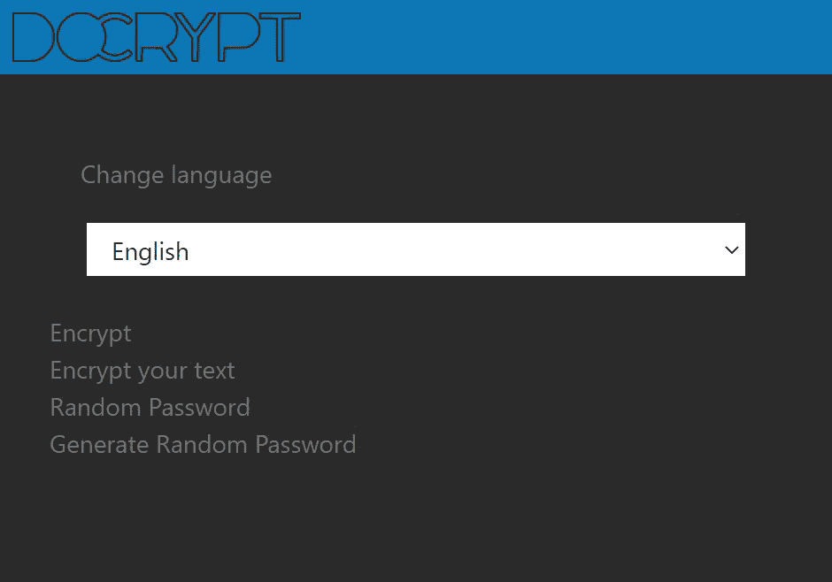

# 在 Svelte 中实现没有任何库的多语言

> 原文：<https://betterprogramming.pub/implementing-multilanguage-without-any-library-in-svelte-6b80b46521f0>

## 这一卓越功能的简要指南


由 [Towfiqu barbhuiya](https://unsplash.com/@towfiqu999999?utm_source=medium&utm_medium=referral) 在 [Unsplash](https://unsplash.com?utm_source=medium&utm_medium=referral) 上拍摄的照片

我继续记录我的加密和解密短信的应用程序([DoCrypt.org](https://docrypt.org/))。我决定使用两种语言:意大利语和英语。但我打算在未来增加更多的语言。我选择创建一个特定的组件来管理不同的语言。我认为这是一个建立多语言应用程序的简单方法。在本文中，我将讨论用 Svelte 创建一个多语言组件。

我用[苗条](https://svelte.dev/)是因为简单。它还可以实时翻译应用程序的所有组件。

想法很简单:我创建一个组件，用特定的语言显示文本。为了决定使用哪种语言，我使用了一个[存储库](https://svelte.dev/docs#run-time-svelte-store)，一个我可以从任何其他组件访问的通用变量。这样，如果我更改语言，所有显示文本的组件都会自动更新。

这样，我可以在应用程序的任何地方更改语言，只需使用`lang.set("it")`或`lang.set("en")`。

第二步是创建字典。我可以使用各种技术，但是对于一个小项目，一个对象就足够了。

在第一层，我输入显示页面的名称(例如，`Home`)，在第二层输入一个字符串，标识我想要显示的文本(例如，`Encrypt`)，在第三层输入由语言标识的翻译(例如，`en`)。

现在，我可以使用`languages.Home.Encrypt.en`或`languages.Home.Encrypt.it`来访问特定页面上的字符串翻译。

最后，我需要一个组件，它唯一的工作是读取字符串值并将其插入到另一个组件中:

我可以用`{@html languages[p][w][$lang]}`代替`{languages[p][w][$lang]}`在字符串中使用 HTML 标签。我认为翻译一些带有格式或链接的文本是个好主意。但是对于简单的文本，如按钮标签，这是不必要的。



要使用这个组件，我可以使用如下代码:

# 保存设置

问题是用户每次访问网站时都必须手动重置语言。为了解决这个问题，我可以在浏览器中保存用户的首选语言。当用户访问网站时，他使用他喜欢的语言。

为此，我可以使用[杰克·阿奇博尔德](https://github.com/jakearchibald)的 [IDB-Keyval](https://www.npmjs.com/package/idb-keyval) 库。该库允许您保存和读取本地数据库中的值。

我将库添加到我的项目中:

```
npm install idb-keyval
```

所以，我创建了一个新文件，如下所示:

我使用`setLang`函数来设置默认语言。我还使用`getLang`从浏览器内存中读取首选语言。如果用户从未设置语言，`getLang`功能将返回浏览器语言。

然后，我修改 Svelte store，将任何更改应用到本地数据库:

最后，我将应用程序的主页改为在启动时阅读首选语言。看起来是这样的:

好了，暂时就这些了。如果你想看完整的代码，可以在 [GitHub](https://github.com/el3um4s/docrypt) 上找到。该应用可在[docrypt.org](https://docrypt.org/)上获得。

感谢阅读！敬请关注更多内容。

***不要错过我的下一篇文章—报名参加我的*** [***中邮件列表***](https://medium.com/subscribe/@el3um4s)

[](https://el3um4s.medium.com/membership) [## 通过我的推荐链接加入 Medium—Samuele

### 阅读萨缪尔的每一个故事(以及媒体上成千上万的其他作家)。不是中等会员？在这里加入一块…

el3um4s.medium.com](https://el3um4s.medium.com/membership) 

【https://blog.stranianelli.com】原载于 2022 年 10 月 18 日[](https://blog.stranianelli.com/implementing-multi-language-without-any-library-in-svelte/)**。**