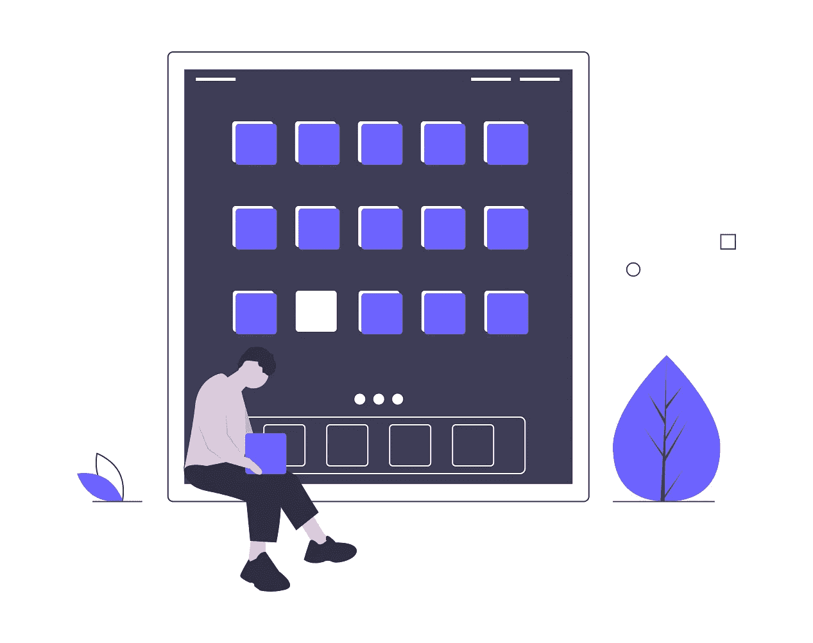
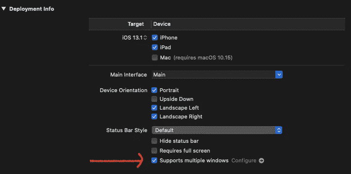
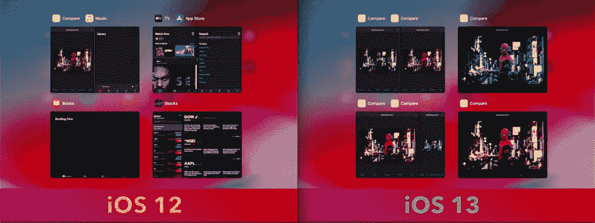
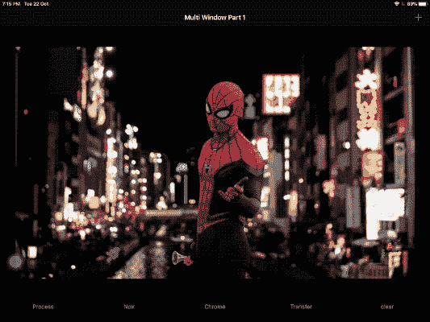
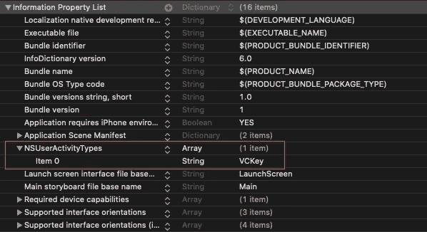
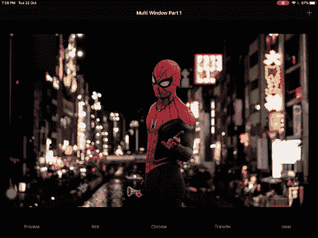

# 在 iPadOS 中实现多窗口支持

> 原文：<https://betterprogramming.pub/implementing-multiple-window-support-in-ipados-5b9a3ceeac6f>

## AppDelegate 退居二线。SceneDelegate 接管。



Pic 演职员表: [Undraw](https://undraw.co/search)

iPadOS 13 在 WWDC 2019 期间推出。最后，iPad 有一个独立的操作系统。

在 iPadOS 中引入多窗口支持是一个改变游戏规则的举措。它允许我们同时打开一个应用程序的多个实例。

当查看多条消息、电子邮件、比较笔记和地图路线时，这个令人惊叹的功能非常有用。这也会让照片和视频编辑的生活更加轻松。我相信多窗口支持将很快带来有趣的多人游戏！

# 我们今天的目标

*   了解多窗口支持如何改变应用程序的生命周期。
*   鸟瞰一下`UIScene` API。
*   以两种不同的方式实现多窗口支持——使用用户输入的*和使用拖放的*。我们将开发一个基于 iOS 和 iPadOS 的照片编辑应用程序，它在蜘蛛侠图像上使用`CIFilters`！**

**别再浪费时间了，让我们开始吧。**

# **启用多窗口支持**

**很简单，只需跳转到项目导航器，常规设置，并确保*支持多窗口*复选框被启用。**

****

**这一项检查改变了生命周期的工作方式！**

**完成后，在`info.plist`中设置多窗口支持布尔属性。在我们深入研究 API 的变化和实现之前，让我们先来解决这个问题。**

## ****多窗口支持不支持分屏****

**iOS 9 中引入了分屏支持，允许在一个窗口中查看不同的应用程序，而多窗口支持允许一次查看单个应用程序的多个实例。**

****

**iOS 13 允许显示一个应用的多个窗口(场景)**

# **AppDelegate 和应用生命周期的变化**

**多窗口支持给`AppDelegate`类带来了重大改变。现在轻多了。所有的重担都由`SceneDelegate`级完成。如果你偷看任何 iOS 13 Xcode 项目中的`AppDelegate`，你会发现它只有很少的方法。**

**`UIApplicationDelegate`在 iOS 13 及以上版本中，应用从后台进出时不被通知。**

**一个新引入的协议`UIWindowSceneDelegate`，处理一个应用程序的多个窗口的通知。**

**现在不推荐使用`UIApplication`类的以下属性:**

*   **`statusBarStyle`**
*   **`statusBarHidden`**
*   **`statusBarOrientation`**
*   **`open(_:options:completionHandler:)`**
*   **`keyWindows`**

**由于多窗口支持，窗口现在是场景！所以从 iPadOS 13 开始，你在应用切换器里看到的一切都是一个独立的场景。**

# **UIScene API:鸟瞰**

**多窗口支持使用`UIScene` API。这个 API 的两个最基本的类是:**

*   **`UIWindowScene` —负责管理一个应用程序的多个窗口。**
*   **`UISceneSession` —这表示场景的持续状态。多个`UIScene`在那里存储特定的信息，比如场景会话中的角色和用户信息。**

**`NSUserActivity`用于捕捉场景的状态。该状态用于恢复先前使用的场景或使用当前观看内容创建新场景。**

**`UIWindowSceneDelegate`由`SceneDelegate`实现。该协议是应用程序的新条目，因为它保存了对`UIWindow`的引用。**

**`UIWindow`现在包含对`UIWindowScene`的引用。如果你使用故事板，`UIWindow`属性会自动附加到场景中。**

****不用故事板？**您需要在`SceneDelegate`类中手动将`UIWindow`附加到场景，如下所示:**

```
**func scene(_ scene: UIScene, willConnectTo session: UISceneSession, options connectionOptions: UIScene.ConnectionOptions) {
guard let windowScene = (scene as? UIWindowScene) else { return }        window = UIWindow(frame: windowScene.coordinateSpace.bounds)        window?.windowScene = windowScene
}**
```

**如果上面的东西没有太多意义，下一节中的实际实现肯定会更加清晰。让我们开始吧！**

**注意:不要使用多窗口支持来跨场景扩展功能。或者通过在另一个场景中显示一个场景的输出。每个场景都应该具有应用程序的全部功能。**

# **履行**

**我们将创建一个基于照片编辑的应用程序，允许在不同的场景中使用不同的过滤器查看图像。当你需要确定哪种滤镜在图像上看起来最好时，这很方便！**

## **铺设用户界面**

**以下代码片段以编程方式向屏幕添加了一个`UIImageView`:**

```
**let VCActivityType = "VCKey"
func setupImageView(){photo = UIImageView(frame: .zero)
photo?.translatesAutoresizingMaskIntoConstraints = false
view.addSubview(photo!)NSLayoutConstraint.activate([
photo!.topAnchor.constraint(equalTo: view.safeAreaLayoutGuide.topAnchor, constant: marginConstant),
photo!.bottomAnchor.constraint(equalTo: self.stackView!.topAnchor, constant: -marginConstant),
photo!.leadingAnchor.constraint(equalTo: view.safeAreaLayoutGuide.leadingAnchor, constant: marginConstant),
photo!.trailingAnchor.constraint(equalTo: view.safeAreaLayoutGuide.trailingAnchor, constant: -marginConstant),
])
}**
```

# **在用户点击时创建新场景**

**要创建应用程序的新场景，请在按钮上添加以下代码:**

```
**let activity = NSUserActivity(activityType: VCActivityType) UIApplication.shared.requestSceneSessionActivation(nil, userActivity: activity, options: nil, errorHandler: nil)**
```

**`requestSceneSessionActivation`负责激活现有场景或创建新场景。**

**这是来自 iPad 应用程序的一个屏幕截图。**

****

**这很简单。现在，让我们跳到拖放机制上，看看需要做些什么。**

# **使用拖放创建新场景**

**我们可以通过在`DragItem`的`NSItemProvider`中传递`NSUserActivity`来使用[拖放 API](https://developer.mozilla.org/en-US/docs/Web/API/HTML_Drag_and_Drop_API) 。**

**当您拖动 UI 组件时，系统会自动提供放置点(通常在屏幕边缘)。在这些点上放下会导致一个新场景的创建。**

**要使用`UIImageView`的拖放创建一个新场景，我们必须注意三件事:**

## **1.符合`UIDragInteractionDelegate`**

**我们需要在`UIImageView`上设置拖拽交互。**

```
**photo?.isUserInteractionEnabled = true photo?.addInteraction(UIDragInteraction(delegate: self))**
```

## **2.实现拖动功能**

**在下面的代码片段中，我们将`imageView`传递给`NSItemProvider`，并用它注册`NSUserActivity`。**

```
**extension ViewController : UIDragInteractionDelegate{
    func dragInteraction(_ interaction: UIDragInteraction, itemsForBeginning session: UIDragSession) -> [UIDragItem] {
        if let imageView = interaction.view as? UIImageView {
            guard let image = imageView.image else { return [] }
            let provider = NSItemProvider(object: image)

            let userActivity = NSUserActivity(activityType: VCActivityType)
            provider.registerObject(userActivity, visibility: .all)
            let item = UIDragItem(itemProvider: provider)
            return [item]
        }
        return []
    }
}**
```

## **3.在`Info.plist`中添加活动类型**

****

**我们的 iPad 应用程序现在可以通过拖动支持多窗口了。**

****

**来自 [Pixabay](https://pixabay.com/?utm_source=link-attribution&utm_medium=referral&utm_campaign=image&utm_content=4549068) 的 [Gaby OBS](https://pixabay.com/users/gabyobs-13938287/?utm_source=link-attribution&utm_medium=referral&utm_campaign=image&utm_content=4549068) 拍摄的蜘蛛侠图像**

**我们在图像上设置了`CIFilters`来比较不同滤镜下的同一幅图像。**

**多窗口支持也与 [Mac Catalyst](https://developer.apple.com/mac-catalyst/) 兼容。**

# **结论**

**所以，就这样了！我们看到了`AppDelegate`如何退居二线，让`SceneDelegate`通过处理大多数生命周期事件来完成主要任务。**

**最后，我们实现了多窗口支持，在不同的场景中以不同的色调看到了我们友好的邻居。**

**这篇文章的完整源代码可以在 [GitHub](https://github.com/anupamchugh/iowncode/tree/master/iPadOSMultiWindowExample) 上找到。**

**在接下来的部分中，我们将处理状态恢复和在 iPadOS 中跨多个窗口同步数据。**

**这一次到此为止。我希望你喜欢它。**