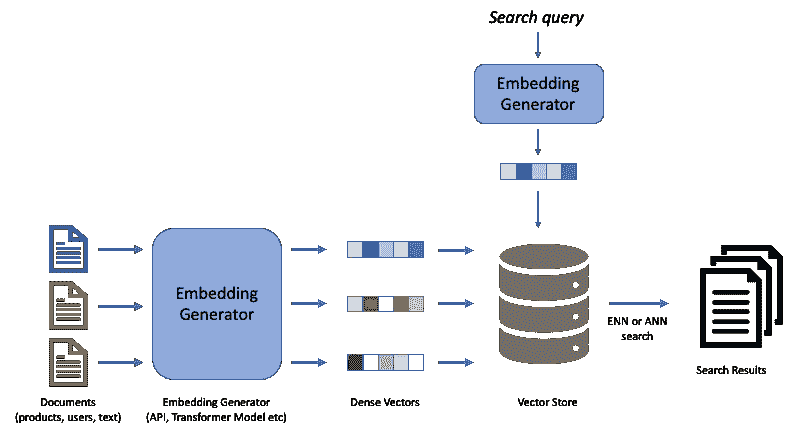

# 使用 HuggingFace 和 Elasticsearch 进行语义搜索

> 原文：<https://betterprogramming.pub/implementing-nearest-neighbour-search-with-elasticsearch-c59a8d33dd9d>

## 让我们使用最近邻搜索对数据集中的段落进行排序


马库斯·温克勒在 [Unsplash](https://unsplash.com?utm_source=medium&utm_medium=referral) 上的照片

密集嵌入是机器学习中的游戏改变者，尤其是在搜索引擎和推荐系统中。密集嵌入目前被应用于自组织信息检索、产品搜索、推荐引擎等。许多公司目前正在他们的工作流程中采用某种形式的基于嵌入的搜索。

一些关于当前顶级公司如何集成密集嵌入的文章有 [Instacart](https://sigir-ecom.github.io/ecom22Papers/paper_8392.pdf) 、 [DoorDash](https://doordash.news/company/powering-search-recommendations-at-doordash/) 、 [Etsy](https://www.etsy.com/codeascraft/deep-learning-for-search-ranking-at-etsy?utm_source=pocket_reader) 、 [Google](https://blog.google/products/search/search-language-understanding-bert/) 和 [Airbnb](https://medium.com/airbnb-engineering/improving-deep-learning-for-ranking-stays-at-airbnb-959097638bde) 。

Google 的 Talk to books 很好地演示了如何使用密集向量进行搜索。这种形式的搜索通常被称为语义搜索。该演示使用编码器模型从存储在索引中的文档(在此上下文中是书籍)生成嵌入，并在搜索时与查询向量进行比较，以检索与给定查询最相似的文档。语义搜索是对 BM25 等传统关键词搜索算法的重大升级，因为它可以检索与给定查询相关的文档，但不一定包含与查询完全相同的单词。

> **边注**:演示中使用的这个模型([通用语句编码器](https://arxiv.org/abs/1803.11175)))在深度学习谱系中有些陈旧，有一些模型可以产生更好的嵌入，其中一些可以在这里找到[。](https://huggingface.co/models?pipeline_tag=sentence-similarity&sort=downloads)

# 什么是密集嵌入？



密集嵌入是数据(文本、用户、产品等)的数字表示。)使用高维向量。密集向量具有不同的长度，并被期望对关于原始数据的信息进行编码，以便使用像[余弦相似度](https://scikit-learn.org/stable/modules/generated/sklearn.metrics.pairwise.cosine_similarity.html)这样的向量相似度算法来容易地找到相似的数据点。下面是一个简单的实现:

```
from sklearn.metrics.pairwise import cosine_similarity
from numpy import random

array_vec_1 = random.rand(1,10)
array_vec_2 = random.rand(1,10)
print(cosine_similarity(array_vec_1, array_vec_2))
```

> **边注**:两个向量的余弦相似度越高，越相似。余弦相似性也被用作训练神经网络的损失函数。参见 py torch[cosinembeddingloss](https://pytorch.org/docs/stable/generated/torch.nn.CosineEmbeddingLoss.html)

为了生成高质量的信息丰富的嵌入，您需要已经在数百万成对示例上训练过的机器学习模型，并且有一些训练技术(例如，使用硬否定的对比学习)已经被应用于生成高质量的嵌入。对于一般的语义搜索和句子表示，在 [HuggingFace](https://huggingface.co/models?pipeline_tag=sentence-similarity&sort=downloads) 上有大量公开可用的预训练或微调模型🤗以及一些商用 API 如 [cohere 嵌入](https://docs.cohere.ai/docs/embeddings)和 [OpenAI 嵌入](https://beta.openai.com/docs/guides/embeddings)用于编码文本。

# 索引和搜索

在对我们的文档进行编码(生成文档嵌入)之后，我们现在必须考虑索引向量和搜索密集索引。

向量搜索通常使用聚类算法(如最近邻搜索)来完成，由于各种原因，它可能是计算密集型的，并且实施起来具有挑战性，其中一些原因是:

(I .)一些编码器产生具有大尺寸的表示向量。大的嵌入导致大的嵌入表，当执行向量操作时具有高的存储器成本，并且可能增加搜索等待时间。

(二。)用新的向量更新密集索引可能要求很高，因为您可能需要为新的向量更新索引簇。

一些开源库已经为快速矢量搜索建立起来，以解决上述问题，如 Meta 的 [Faiss](https://github.com/facebookresearch/faiss) ，Spotify 的[angry](https://github.com/spotify/annoy)，谷歌的 [ScaNN](https://github.com/google-research/google-research/tree/master/scann) 。在[8.0](https://www.elastic.co/blog/introducing-approximate-nearest-neighbor-search-in-elasticsearch-8-0)+版本中，Elasticsearch 宣布他们流行的开源搜索引擎现在支持最近邻搜索。

> **旁注** : [参见关于使用密集向量实现语义搜索的缺点和解决方案的讨论](https://news.ycombinator.com/item?id=29554986)。此外，[关于不同的近似最近邻算法搜索算法和库，参见基准](http://ann-benchmarks.com/)。

# 使用弹性搜索的近似搜索

让我们进入有趣的部分！

我们将对由 880 万篇文章组成的[MARCO 女士](https://microsoft.github.io/msmarco/Datasets.html)文章排名集合进行编码和索引。目标是根据段落与给定查询的相关性对它们进行排序。下载并解压缩该集合。

```
wget https://public.ukp.informatik.tu-darmstadt.de/thakur/BEIR/datasets/msmarco.zip
unzip msmarco.zip
```

我们可以用下面的代码在下载后预览数据:

```
#inspect the data
head -1 msmarco/corpus.jsonl

#output
"""
{
  '_id': '0', 
  'title': '', 
  'text': 'The presence of communication amid scientific minds was equally important to the success of the Manhattan Project as scientific intellect was. The only cloud hanging over the impressive achievement of the atomic researchers and engineers is what their success truly meant; hundreds of thousands of innocent lives obliterated.', 
  'metadata': {}
}
""" 
```

接下来，我们需要对数据集进行编码。对于本教程，我们将使用托管在 HuggingFace 上的[“句子-变形金刚/ms Marco-MiniLM-L6-cos-V5”](https://huggingface.co/sentence-transformers/msmarco-MiniLM-L6-cos-v5)模型。该模型在 MS Marco passage ranking 集合上训练，为每个输入序列产生 384 长度的嵌入。我们需要定义一个编码器函数，它接受一段或一批文本，并为每个文本生成嵌入。

该模型为输入句子中的每个标记生成不同的嵌入集。我们使用平均池(也称为平均池)来聚集嵌入。或者，我们可以使用为[CLS]令牌生成的嵌入向量。

> 旁注:[这里有一个关于合用的初级读本](https://blog.ml6.eu/the-art-of-pooling-embeddings-c56575114cf8)

```
class MSMarcoEncoder:
    def __init__(self, model_name: str, device : str='cpu'):
        self.device = device
        self.tokenizer = AutoTokenizer.from_pretrained(model_name)
        self.model = AutoModel.from_pretrained(model_name)
        self.model.to(self.device)

    def encode(self, text:str, max_length: int):
        inputs = self.tokenizer(text, return_tensors="pt", padding=True, truncation=True, max_length=max_length)
        inputs = inputs.to(self.device)
        with torch.no_grad():
            model_output = self.model(**inputs, return_dict=True)
        # Perform pooling
        embeddings = self.mean_pooling(model_output, inputs['attention_mask'])
        # Normalize embeddings
        embeddings = F.normalize(embeddings, p=2, dim=1)
        return embeddings.detach().cpu().numpy()

    def mean_pooling(self, model_output, attention_mask):
        token_embeddings = model_output[0] #First element of model_output contains all token embeddings
        input_mask_expanded = attention_mask.unsqueeze(-1).expand(token_embeddings.size()).float()
        return torch.sum(token_embeddings * input_mask_expanded, 1) / torch.clamp(input_mask_expanded.sum(1), min=1e-9)

if __name__ == "__main__":
    encoder = Encoder('sentence-transformers/msmarco-MiniLM-L6-cos-v5')
    embeddings = encoder.encode(batch_info['text'], 512) 
```

现在我们有了编码器，我们需要在 Elasticsearch 中索引数据，为了有效地做到这一点，我们需要定义一个迭代器来批量循环数据。然而，我们需要设置并确保 Elasticsearch 正在运行。首先，我们按照这里的[指令在本地下载并启动 elasticsearch 服务器](https://www.elastic.co/downloads/elasticsearch)或者按照[这个](https://www.elastic.co/downloads/elasticsearch)启动一个 elastic search 容器。

对于本地设置，在下载 elasticsearch 之后，运行以下命令来启动一个具有一个节点的集群:

```
./elasticsearch-8.5.1/bin/elasticsearch
```

默认情况下，ElasticSearch 8.0 及更高版本启用了安全性，因此请通过运行以下命令来验证您是否可以连接到正在运行的 ElasticSearch 集群:

```
curl --cacert config/certs/http_ca.crt -u elastic https://localhost:9200
```

现在我们的 elasticsearch 服务器正在运行，我们需要创建一个索引来存储数据。为此，我们需要为数据集中的不同字段定义一个映射。然而，对于最近邻搜索，我们需要定义一个类型为`dense_vector`的字段，它将包含每个文档的嵌入内容。

```
from elasticsearch import Elasticsearch

es_client = Elasticsearch( "https://localhost:9200", 
                  http_auth=("username", "password"),
                  verify_certs=False)
config = {
    "mappings": {
        "properties": {
            "title": {"type": "text"},
            "text": {"type": "text"},
            "embeddings": {
                    "type": "dense_vector",
                    "dims": 384,
                    "index": false
                }
            }
    },
    "settings": {
        "number_of_shards": 2,
        "number_of_replicas": 1
    }
}

es_client.indices.create(
    index="msmarco-demo",
    settings=config["settings"],
    mappings=config["mappings"],
)

#check if the index has been created successfully
print(es.indices.exists(index=["msmarco-demo"]))
#True
```

下面的代码片段使用 elasticsearch 的批量索引 API 来批量索引文档。下面的代码在`cpu`上运行时间更长，在`gpu or tpu`上运行速度更快。这里我们使用一个[集合迭代器类](https://gist.github.com/ToluClassics/bc4bbd8b7930ee35e237984c2c9998a1#file-knn_elasticsearch-py-L10-98)来遍历数据集。对于每一批，我们生成嵌入并索引它们。

```
collection_path = 'path/to/corpus.jsonl'
collection_iterator = JsonlCollectionIterator(collection_path, fields=['title','text'])
encoder = Encoder('sentence-transformers/msmarco-MiniLM-L6-cos-v5')
index_name = "msmarco-demo"

for batch_info in collection_iterator(batch_size=256, shard_id=0, shard_num=1):
    embeddings = encoder.encode(batch_info['text'], 512)
    batch_info["dense_vectors"] = embeddings

    actions = []
    for i in range(len(batch_info['id'])):
        action = {"index": {"_index": index_name, "_id": batch_info['id'][i]}}
        doc = {
                "title": batch_info['title'][i],
                "text": batch_info['text'][i],
                "embeddings": batch_info['dense_vectors'][i].tolist()
            }
        actions.append(action)
        actions.append(doc)

    es_client.bulk(index=index_name, operations=actions)

result = es_client.count(index=index_name)

#print the total number of documents in the index
print(result.body['count'])
#8841823

#output one document
print(es_client.get(index=["msmarco-demo"], id="0", request_timeout=60))

'''
{'_index': 'msmarco-demo', '_id': '0', '_version': 2, '_seq_no': 27, '_primary_term': 1, 'found': True, 
'_source': {'title': '', 
'text': 'The presence of communication amid scientific minds was equally important to the success of the Manhattan Project as scientific intellect was. The only cloud hanging over the impressive achievement of the atomic researchers and engineers is what their success truly meant; hundreds of thousands of innocent lives obliterated.', 
'embeddings': [-0.032267116010189056, 0.05750396102666855,...]}}
'''
```

现在索引已经完成，我们可以搜索我们的索引。Elasticsearch 提供了一个 [python 包装器来执行 KNN 搜索](https://elasticsearch-py.readthedocs.io/en/latest/api.html#elasticsearch.Elasticsearch.knn_search)，这就是我们在下面代码片段中定义的搜索代码函数中使用的。为了进行搜索，我们需要使用参数`k`和`query_vector`中的查询嵌入来定义搜索集群的数量。

```
def search(query: str, es_client: Elasticsearch, model: str, index: str, top_k: int = 10):

    encoder = Encoder(model)
    query_vector = encoder.encode(query, max_length=64)
    query_dict = {
        "field": "embeddings",
        "query_vector": query_vector[0].tolist(),
        "k": 10,
        "num_candidates": top_k
    }
    res = es_client.knn_search(index=index, knn=query_dict, source=["title", "text", "id"])

    for hit in res["hits"]["hits"]:
        print(hit)
        print(f"Document ID: {hit['_id']}")
        print(f"Document Title: {hit['_source']['title']}")
        print(f"Document Text: {hit['_source']['text']}")
        print("=======================================================\n")

if __name__ == "__main__":

  search(query="What is the capital of France?", 
         es_client=es_client, 
         model="sentence-transformers/msmarco-MiniLM-L6-cos-v5", 
         index=index_name)
#output
"""
{'_index': 'msmarco-demo', '_id': '82390', '_score': 0.81541693, '_source': {'text': "In terms of total household wealth, France is the wealthiest nation in Europe and fourth in the world. It also possesses the world's second-largest exclusive economic zone (EEZ), covering 11,035,000 square kilometres (4,261,000 sq mi).", 'title': ''}}
Document ID: 82390
Document Title: 
Document Text: In terms of total household wealth, France is the wealthiest nation in Europe and fourth in the world. It also possesses the world's second-largest exclusive economic zone (EEZ), covering 11,035,000 square kilometres (4,261,000 sq mi).
=====================================================================

{'_index': 'msmarco-demo', '_id': '162291', '_score': 0.80739325, '_source': {'text': 'Paris in France lies on the Seine River. The docking location is Port de Grenelle/Quai de Grenelle. As one of the largest cities in Europe, finding a property that suit your budget is not a problem. Choose between low cost guest rooms to luxury 4 and 5 star hotels and apartments to rent.', 'title': ''}}
Document ID: 162291
Document Title: 
Document Text: Paris in France lies on the Seine River. The docking location is Port de Grenelle/Quai de Grenelle. As one of the largest cities in Europe, finding a property that suit your budget is not a problem. Choose between low cost guest rooms to luxury 4 and 5 star hotels and apartments to rent.
=====================================================================
"""
```

向量搜索现在是机器学习中的一个时髦领域，有很多其他很棒的库提供向量搜索功能，如[松果](https://www.pinecone.io/)、[纪娜 AI](https://jina.ai/) 、 [Weaviate](https://weaviate.io/) 、 [Qdrant](https://qdrant.tech/) 等。

瞧啊。用 Github Copilot 开发这个很有趣。要离线索引和搜索，请不要犹豫，来看看我们令人敬畏的图书馆 [Pyserini](https://github.com/castorini/pyserini) 。Pyserini 主要设计用于在多级排名架构中提供有效的、可重复的、易于使用的第一级检索。

这个教程的完整代码可以在[这里](https://gist.github.com/ToluClassics/bc4bbd8b7930ee35e237984c2c9998a1)找到。

# 参考

1.  [https://towards data science . com/how-to-index-elastic search-documents-with-the-bulk-API-in-python-b5 bb 01 ed 3824](https://towardsdatascience.com/how-to-index-elasticsearch-documents-with-the-bulk-api-in-python-b5bb01ed3824)
2.  [https://www.elastic.co/](https://www.elastic.co/)