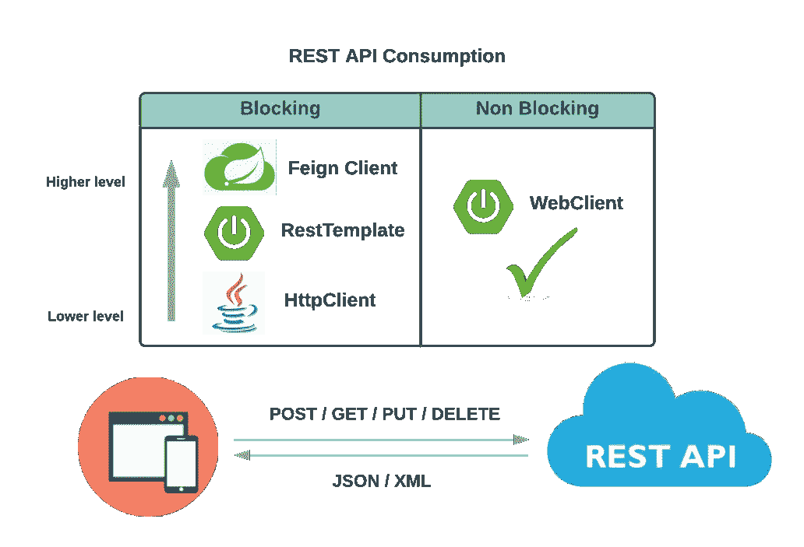
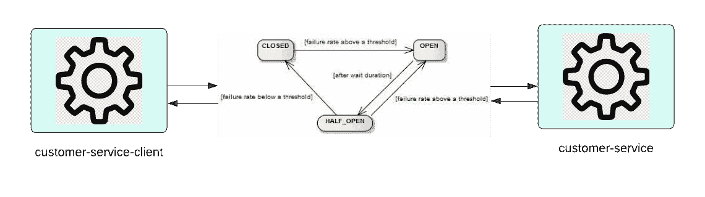

# 用 Resilience4j 实现无功断路器

> 原文：<https://betterprogramming.pub/implementing-reactive-circuit-breaker-using-resilience4j-4fe81d28e100>

## 实施反应式弹性的分步指南 4j


Craig Glantz 的图像背景

```
**Table of Contents**· [Why Reactive?](#e53c)
· [Blocking vs Non Blocking](#a26b)
· [Why Resilience4j?](#4c88)
· [Step 1\. Add POM Dependency](#329e)
· [Step 2\. Add Circuit Breaker Configuration Bean](#aed0)
· [Step 3\. Add Configuration for Circuit Breaker Properties](#56ae)
· [Step 4\. Implementing Circuit Breaker](#054d)
· [Troubleshooting](#5023)
· [Swagger UI not Working for Webflux](#18e2)
· [How to Implement Circuit Breaker for Endpoints Which Don’t Have Return Type](#f19a)
```

本文将重点介绍使用 Resilience4j(一个 Spring Cloud 断路器库)实现无功断路器。

# 为什么反应？

让我们后退一步，仔细看看 REST API 消费的一些可用选项。



作者图表

# 阻塞与非阻塞

上图中选项的“阻塞”端基本上都基于每请求线程模型。这意味着线程将一直阻塞，直到 REST API 客户机收到响应。如果我们有许多传入的请求，应用程序将创建许多线程，这将耗尽线程池或占用所有可用的内存。用户可能会体验到性能下降。

Spring 5 Reactive framework 引入了`WebClient`，一种异步、非阻塞的解决方案。反应式框架使用事件驱动的架构。它提供了通过反应流 API 组合异步逻辑的方法。与同步/阻塞方法相比，反应式方法可以处理更多逻辑，同时使用更少的线程和系统资源。此外，使用`WebClient`,我们可以使用功能性的 fluent API 发出同步或异步 HTTP 请求，该 API 可以直接集成到我们现有的 Spring 配置和 WebFlux 反应式框架中。

对于 REST API 消耗，赢家很明显！这就是无堵无功`WebClient`！

# 为什么选择 Resilience4j？

我们可以使用两个主要的库来实现断路器。网飞 Hystrix，它采用了面向对象的设计，对外部系统的调用必须封装在一个提供多种功能的`HystrixCommand`中。然而，在 SpringOne 2019 中，Spring 宣布 Hystrix Dashboard 将从 Spring Cloud 3.1 版本中删除，这使得它正式被弃用。使用废弃的库不是一个好主意。所以选择很明确，就是 Resilience4j！

Resilience4j 是一个受 Hystrix 启发的独立库，但它建立在函数式编程的原则之上。Resilience4J 提供高阶函数(decorators)来增强任何函数接口、lambda 表达式或带有断路器、速率限制器或隔板的方法引用。

Resilience4J 的其他优势包括更精细的配置选项(例如，闭合断路器模式所需的成功执行次数)和更轻的依赖性。

我们将使用两个 Spring Boot 微服务来演示如何实现反应式断路器:

*   客户服务，充当 REST API 提供者，为客户提供 CRUD 端点。
*   客户服务客户端，通过 Spring Boot Starter Webflux 库利用`WebClient`调用 REST APIs。



作者图，改编自[https://resilience4j.readme.io/docs/circuitbreaker](https://resilience4j.readme.io/docs/circuitbreaker)

现在，让我们深入了解为反应式断路器实施 Resilience4j 的详细步骤。

# 第一步。添加 POM 相关性

既然我们已经选择了`WebClient`来消费 REST API，我们需要将 Spring Cloud 断路器反应器 Resilience4J 依赖项添加到我们的 REST 客户端应用程序中。

# 第二步。添加断路器配置 Bean

`CircuitBreakerConfig`类附带了一组断路器配置的默认值，如果我们选择对所有断路器使用默认配置值，我们可以创建一个通过`ReactiveResilience4JCircuitBreakerFactory`传递的`Customize` bean。工厂的`configureDefault`方法可用于提供默认配置。样本片段如下:

如果我们选择使用定制的配置值，我们将需要如下定义我们的 bean(“customer-service”仅仅是一个示例 REST 客户端实例，您可以使用您赋予 REST 客户端应用程序的任何实例名称):

# 第三步。添加断路器属性的配置

如果我们定义我们的定制配置 bean，我们还需要在`application.yml`中添加断路器配置，例如(仅示例值，数字应根据应用使用场景进行调整):

*   `failureRateThreshold`:当故障率等于或大于阈值时，断路器转换为打开并开始短路呼叫。在我们的例子中，这个值是 50%，这意味着如果 2 个请求中有 1 个失败，将达到阈值，这将使断路器进入断开状态。
*   `minimumNumberOfCalls`:该属性确保一旦执行了最小数量的调用，就会计算失败率。在我们的例子中，在失败率计算开始之前，必须执行 10 个请求。
*   `slidingWindowType`:配置用于记录断路器闭合时通话结果的滑动窗口类型。
    滑动窗口可以基于计数，也可以基于时间。
*   `slidingWindowSize`:配置滑动窗口的大小，用于记录断路器闭合时的通话结果。
*   `waitDurationInOpenState`:断路器从打开状态转换到半开状态前应等待的时间。在我们的例子中，是 50 秒。
*   `permittedNumberOfCallsInHalfOpenState` **:** 配置断路器半开时允许呼叫的次数。在我们的例子中，限制是 3，这意味着在 10 秒的窗口中只能处理 3 个请求。

# 第四步。实施断路器

现在所有的配置都已就绪，我们可以开始使用断路器从客户端修饰 REST API 调用了。在下面的例子中，我们通过构造函数注入将`WebClient` 和`ReactiveCircuitBreakerFactory` 注入到`CustomerCientController` 中。然后，我们使用`webClient` 来触发传入的 CustomerVO 和/或 customerId 上的 CRUD 调用。请注意“`transform`”部分，我们在`ReactiveCircuitBreakerFactory`的帮助下为“客户服务”(`rcb` 类型`ReactiveCircuitBreaker`)创建了`ReactiveCircuitBreaker` 实例。执行断路器的线路是`rcb.run(...)`。在下面的示例控制器中，当抛出异常时，我们为 POST/GET/PUT 调用返回一个空白的`CustomerVO` 对象作为回退响应。对于删除调用，我们返回传入的`customerId` 作为后备。因此，在 REST API provider 关闭的情况下，不会出现 500 内部服务器错误，随着断路器的正确实现，我们会收到回退响应。

# 解决纷争

# Swagger UI 不适用于 Webflux

由于我们引入了 Webflux 库来使用`WebClient`，您可能会注意到您的 swagger UI 最初并不工作。为了使其发挥作用，请确保实施以下步骤:

*   在 pom 中添加以下依赖关系:

*   如果已经实现了注释`@EnableSwagger2WebFlux`,则将其移除。
*   访问 swagger 的 URL 现在应该是:[http://<YOUR _ APP _ SERVER>:<YOUR _ APP _ PORT>/swagger-ui/](http://localhost:8600/swagger-ui/)，一定要加上结尾“/”。比如[http://localhost:8100/swagger-ui/。](http://localhost:8100/swagger-ui/.)

# 如何为没有返回类型的端点实现断路器

对于在响应体中不返回任何内容的端点，比如 REST API provider 中的以下端点，在 REST 客户端，如果我们标记了调用该端点返回`Mono<Void>`，`ReactiveCircuitBreaker`将不起作用。如果 REST API 提供程序关闭，您将看到 500 server 错误，这完全违背了断路器的目的。

在**无功**断路器实现中，对于没有返回类型的方法，我们可以使用 **CheckedRunnable** ，做如下(举例):

但是，在无功断路器中，`ReactiveCircuitBreaker`没有这样的接口布置`CheckedRunnable`，那我们怎么办？经过一些调查和实验后，我注意到我们可以操纵这类端点的返回类型来返回一个通用类型，比如`String`。简而言之，如果一个端点(如删除调用)在服务器端返回`Void`，我们仍然可以从客户端操作该删除调用的返回类型以返回一个简单类型作为`String`，只需传回传递给该端点的输入字符串。例如，在客户端，我们可以像这样实现删除调用:

注意我们正在返回`Mono<String>`而不是`Mono<Void>`，并且我们在`.bodyToMono(String.class)`行指定了返回类型`String`，这就是为什么我们可以简单地调用`ReactiveCircuitBreaker`的`run` 方法来调用修饰的无功断路器函数。这是我能想到的唯一解决办法，不用`ReactiveCircuitBreaker`的`decorateCheckedRunnable`方法来处理没有返回类型的方法。

本文中提到的演示应用的源代码可以在[我的 GitHub 库](https://github.com/wenqiglantz/spring-boot-webclient-resilience4j)中找到。

编码快乐！手工制作快乐！

# **参考文献**

[https://resilience4j.readme.io/docs/circuitbreaker](https://resilience4j.readme.io/docs/circuitbreaker)

[https://resilience 4j . readme . io/docs/comparison-to-网飞-海斯特里克斯](https://resilience4j.readme.io/docs/comparison-to-netflix-hystrix)

[从 Hystrix 迁移到 Resilience4J](https://www.exoscale.com/syslog/migrate-from-hystrix-to-resilience4j/)

[https://github . com/spring fox/spring fox #从早期快照迁移](https://github.com/springfox/springfox#migrating-from-earlier-snapshot)

[用 Spring WebClient 发送 HTTP 请求](https://reflectoring.io/spring-webclient/)

请随意查看我关于 Spring Boot 的其他文章:

[](https://medium.com/codex/spring-boot-microservices-coding-style-guidelines-and-best-practices-1dec229161c8) [## Spring Boot 微服务编码风格指南和最佳实践

### 通过多年来与 Spring Boot 微服务公司的合作，我已经编制了一份编码风格指南和…

medium.com](https://medium.com/codex/spring-boot-microservices-coding-style-guidelines-and-best-practices-1dec229161c8)