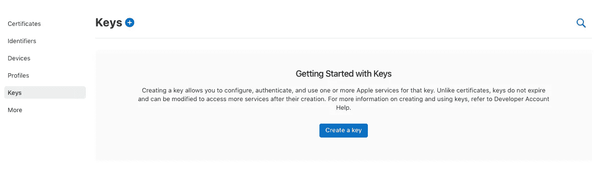
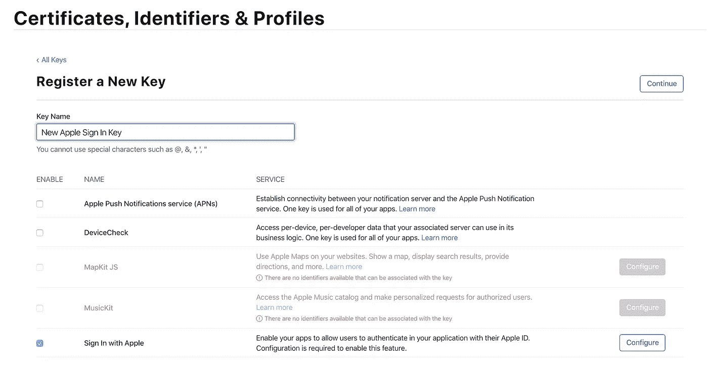
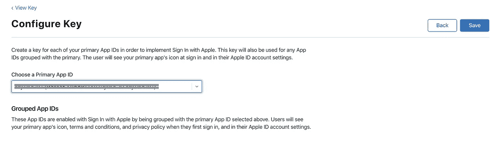
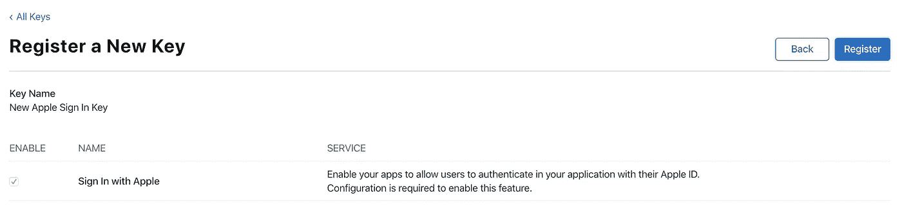
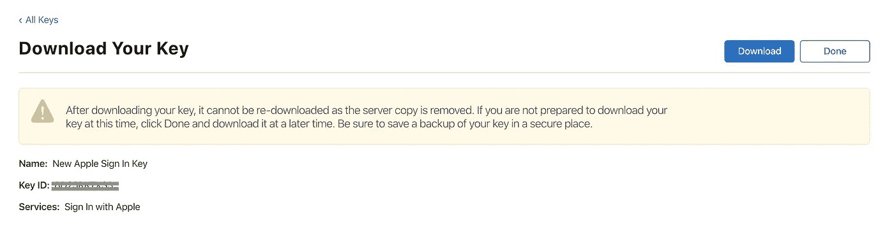

# 使用 Django 实现苹果登录(第 1 部分)

> 原文：<https://betterprogramming.pub/implementing-sign-in-with-apple-using-django-a-recipe-part-1-of-3-fc5695e6e9db>

## 证书和密钥

在 2019 年 WWDC 大会上，苹果公司宣布与苹果公司签约，这是第三方登录的替代方案——一种长期由脸书、推特、谷歌和其他公司提供的机制。当时，我正在开发一个应用程序，它具有登录脸书和谷歌的功能。因为我发现在 Apple 上实现登录的文档非常混乱，所以我不让自己在我开发的应用程序中实现它。

几周前，我开发的应用程序终于可以上传到应用商店了。我测试了所有东西，并将其发送给苹果公司进行审查。可悲的是，应用程序被拒绝了，我得到了苹果的回复，说我必须在应用程序中实现与苹果的登录。

真正的挑战才开始。我查阅了苹果公司提供的所有文档(这只会导致更多的混乱)、样本项目、视频和其他博客，最终找到了答案。

在本文中，我将向您演示如何在后端使用 Django 的 iOS 应用程序中实现苹果登录。但在此之前，请注意，使用 Apple 登录只有从 iOS 13 及更高版本才可用，并且只能使用 Xcode 11 或更高版本实现。现在，我们开始吧。

基本上，整个实施过程可以分为三个部分:

1.  [密钥和标识符的配置](https://medium.com/@sagunraj/implementing-sign-in-with-apple-using-django-a-recipe-part-1-of-3-fc5695e6e9db)
2.  [通过实现与苹果的登录来准备后端](https://medium.com/@sagunraj/implementing-sign-in-with-apple-using-django-a-recipe-part-2-of-3-12d673cf6eaf)
3.  [在 iOS 应用中实现苹果登录](https://medium.com/@sagunraj/implementing-sign-in-with-apple-using-django-a-recipe-part-3-of-3-12d66947d4f5)

# 1.密钥和标识符的配置

设置“用应用程序登录”的第一步是将“用苹果程序登录”功能添加到 iOS 应用程序的功能列表中。这一步有两种可能的情况:

1.  “自动管理签名”被选中(自动签名)
2.  “自动管理签名”未选中(手动签名)

## 场景 1:“自动管理签名”被选中(自动签名):

如果您在签名部分选择了“自动管理签名”,那么这意味着我们要做的工作更少了。Xcode 将管理其他一切。在这种情况下，我们必须:

1.  前往 Xcode 的项目导航器。
2.  选择 Xcode 项目。
3.  选择所需的目标。
4.  转到签名和功能选项卡。
5.  单击+功能按钮。
6.  选择使用 Apple 登录。

通过完成上述步骤，您将完成向应用程序添加新功能的自动签名方法。

在自动签名方法中，Xcode 会将“使用 Apple 登录”功能添加到授权中，将其与开发者门户同步，并自动为您生成新的预置描述文件。因此，您的键和标识符配置工作就完成了。

## 场景 2:“自动管理签名”未选中(手动签名)

但是，如果您未选中“自动管理签名”选项，则表示您选择了手动签名，您必须遵循以下步骤:

1.  前往 Xcode 的项目导航器。
2.  选择 Xcode 项目。
3.  选择所需的目标。
4.  转到签名和功能选项卡。
5.  单击+功能按钮。
6.  选择使用 Apple 登录。

完成这些步骤后，剩下的步骤是:

7 .**。将使用 Apple 登录添加到 app ID:** 在此步骤中，需要完成的任务有:

*   登录苹果开发者门户，选择标识符。
*   选择您想要添加的应用程序使用 Apple 登录。
*   向下滚动以登录 Apple，并勾选复选框。
*   单击保存。

默认情况下，此应用 ID 被启用为主要应用 ID。或者，如果您使用多个应用程序或 web 身份验证，您可能需要将它们作为一个组分配给此应用 ID。

**8。重新生成预置描述文件:**由于我们已经对应用程序 ID 进行了修改，现有的预置描述文件将失效。因此，我们需要按照给定的步骤重新生成它们:

*   转到个人资料。
*   点击与应用程序 ID 相关联的每个配置文件，然后再次保存。
*   要么从门户手动下载，要么通过 Xcode 下载。

现在，既然已经创建并下载了标识符，那么在我们的 iOS 应用程序中实现与 Apple 登录的一切都已经准备好了。

然而，由于我们希望我们的 iOS 应用程序在有人试图使用苹果登录时与后端服务器通信，我们必须准备好我们的后端。为了准备好我们的后端，我们首先需要一把钥匙。现在，让我们为我们的后端创建一个键:

*   登录苹果开发者门户。
*   前往“密钥”，然后点按“创建密钥”

*   给它一个特定的名称，勾选“使用 Apple 登录”复选框，然后单击“配置”。

*   选择您的应用程序 ID，然后单击保存。

*   单击继续。

*   单击注册以生成密钥。

*   通过单击下载来下载密钥文件，然后单击完成。

您可以单击 Keys 部分显示的列表中的键来查看详细信息，包括键 ID。我们生成的密钥 ID 将在后端实现中用到。

现在，我们可以进入第二步——即[通过实现与苹果](https://medium.com/@sagunraj/implementing-sign-in-with-apple-using-django-a-recipe-part-2-of-3-12d673cf6eaf)的登录来准备好后端的步骤。

# **参考文献**

*   [认证服务文档](https://developer.apple.com/documentation/authenticationservices)
*   [GitHub 上的 truffls](https://github.com/truffls/sign-in-with-apple-using-django)

如果你觉得这个帖子有用，并且愿意支持我，请“[给我买杯咖啡](https://www.buymeacoffee.com/sagunraj)”

 [## Sagun Raj Lage 正在撰写博客和书籍，并免费教授编程。

### 我是一名 iOS 开发人员，有从事各种领域相关项目的经验，如交通和…

www.buymeacoffee.com](https://www.buymeacoffee.com/sagunraj)