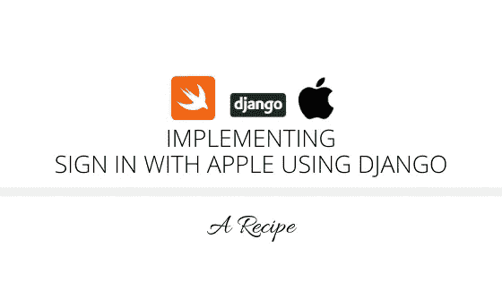
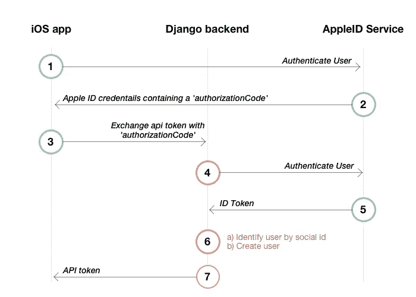

# 使用 Django 实现苹果登录(第 2 部分)

> 原文：<https://betterprogramming.pub/implementing-sign-in-with-apple-using-django-a-recipe-part-2-of-3-12d673cf6eaf>

## 构建您的自定义后端



这是“使用 Django 实现苹果登录:一个诀窍”系列的第二部分，旨在为开发人员展示一条清晰的路径，以 Django 为后端在他们的 iOS 应用中实现苹果登录功能。

请参考[此链接](https://medium.com/better-programming/implementing-sign-in-with-apple-using-django-a-recipe-part-1-of-3-fc5695e6e9db)阅读该系列的第一部分。

# 2.通过实现与 Apple 的登录，准备好后端

为了在 Django 驱动的后端上实现与苹果的登录，我们需要一个运行 Django 2.0 或更高版本项目的服务器，带有 Python Social Auth。我们已经有了在本系列的“密钥和标识符的配置”ep 中生成的密钥。

API 的身份验证部分构建在现有标准 OAuth 2.0 和 OpenID Connect 之上。为了让您清楚地了解事情是如何工作的，下面的图表显示了整个身份验证流程:



来源:GitHub 上的 truffls

## 构建身份验证请求

正如我们在上面给出的图表中看到的，iOS 应用程序联系 AppleID 服务并接收 Apple ID 凭据，其中包含一个`authorizationCode`。然后这个`authorizationCode`被发送到后端，在那里构建认证请求。身份验证请求由几部分组成:

*   Key ID:它是我们在苹果开发者门户中生成的密钥的 ID。
*   苹果开发团队 ID
*   客户端 ID:这是 iOS 应用程序的捆绑包 ID。例如，`com.samplecompany.sampleapp`。
*   客户机密

## 如何创建客户端密码？

客户秘密每次都是由我们自己从我们的私钥中生成的。Apple 使用 ES256 JWT 算法来生成客户端密码。关于这一点的更多信息在[苹果文档](https://developer.apple.com/documentation/signinwithapplerestapi/generate_and_validate_tokens)中给出，标题为“创建客户端秘密”

在我们的例子中，我们使用 PyJWT 来生成客户端秘密。为了将 PyJWT 安装到 Django 项目中，我们可以在项目文件夹中打开终端，键入并运行:

```
pip install pyjwt
```

然后，我们可以导入该包，并如下所示使用它来创建一个完整的身份验证请求:

关于`payload`中给出的按键的更多信息可以在[苹果的文档](https://developer.apple.com/documentation/signinwithapplerestapi/generate_and_validate_tokens)中找到。

## 自定义后端的实现

既然我们已经为构建身份验证请求做了安排，现在我们可以开始后端工作了。虽然 Python Social Auth 实现了 OAuth 2.0 标准，但我们必须扩展`BaseOAuth2`并覆盖一些函数，因为苹果在它们的流程上有一些差异。我们将不得不覆盖以下方法:

*   `get_user_details`:需要覆盖这个方法，将电子邮件地址或其他用户信息返回给 Python Social Auth 框架。
*   `get_key_and_secret`:我们需要覆盖这个方法，因为我们必须以上面提到的方式生成客户端秘密。
*   `do_auth`:由于我们需要验证移动客户端从 Apple 发送的访问令牌，并获取可以从中提取其他详细信息的 ID 令牌，因此我们需要覆盖此方法。

## 为什么 ID 令牌很重要？

作为验证令牌调用的响应，Apple 返回了`id_token`字段。这个字段包含了很多信息，其中`sub`和`email`最为重要。`sub`是保存唯一用户 ID 的主题字段，`email`是用户的假或真的电子邮件地址。

可以通过以下方式利用 JWT 对`id_token`进行解码:

```
decoded = jwt.decode(id_token, ‘’, verify=False)
```

这一点在[苹果的文档](https://developer.apple.com/documentation/signinwithapplerestapi/generate_and_validate_tokens)中也有说明。

现在，让我们创建一个名为`AppleOAuth2`的类，作为使用 Python Social Auth 处理 Apple 登录的自定义后端。

我们应该记住的一点是，只有当我们第一次提出请求时，才会返回电子邮件地址和姓名。因此，如果出现我们需要反复测试的情况，我们每次都需要从我们的 [AppleID 帐户](https://appleid.apple.com/)中的授权应用列表中删除我们的应用。

## 不想用 Python 社交 Auth 怎么办？

如果不想使用 Python Social Auth，可以在用户验证后手动创建用户，并解码我们从苹果收到的`id_token`字段的值。如果`uid`已经存在，那么我们必须理解它是同一个用户。因此，我们只需登录。然而，如果使用 Python Social Auth，所有这些事情都会自动处理。

现在，我们已经设置了我们的后端，使其能够使用 Apple 功能登录。剩下的唯一步骤是第三步，也是最后一步，即[在我们的 iOS 应用](https://medium.com/@sagunraj/implementing-sign-in-with-apple-using-django-a-recipe-part-3-of-3-12d66947d4f5)中实现与苹果的登录。如果你还没有读完第一步，一定要看看这个系列的[第一部分](https://medium.com/better-programming/implementing-sign-in-with-apple-using-django-a-recipe-part-1-of-3-fc5695e6e9db)。

# 参考

*   [认证服务文档](https://developer.apple.com/documentation/authenticationservices)
*   [GitHub 上的 truffls](https://github.com/truffls/sign-in-with-apple-using-django)

如果你觉得这篇文章有用，并且愿意支持我，请"[给我买杯咖啡](https://www.buymeacoffee.com/sagunraj)"

[](https://www.buymeacoffee.com/sagunraj) [## Sagun Raj Lage 正在撰写博客和书籍，并免费教授编程。

### 我是一名 iOS 开发人员，有从事各种领域相关项目的经验，如交通和…

www.buymeacoffee.com](https://www.buymeacoffee.com/sagunraj)