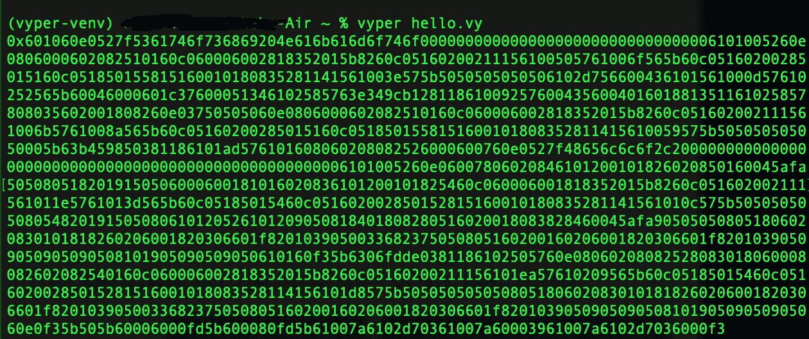
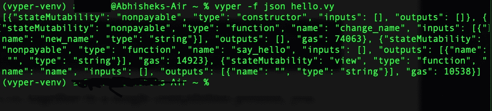
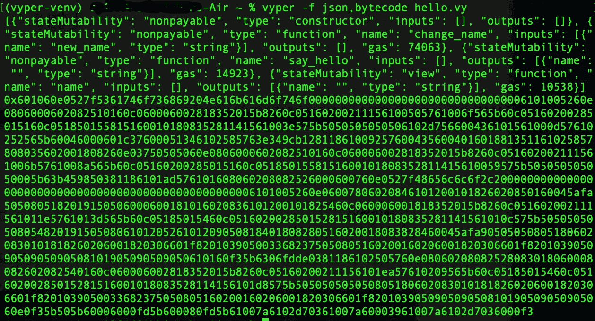
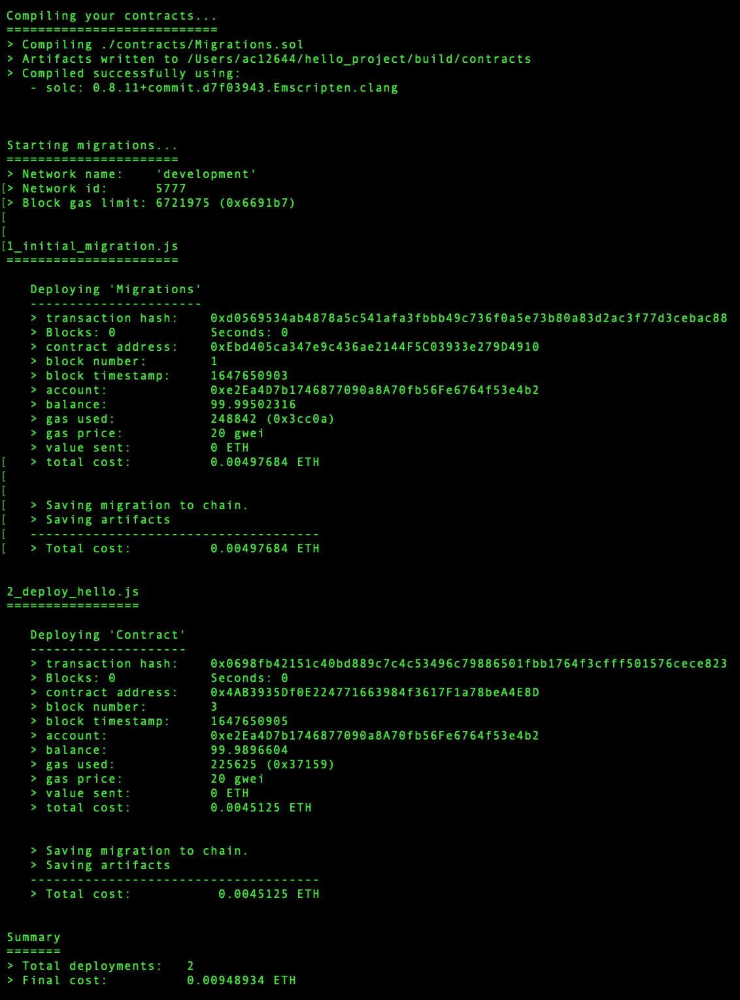
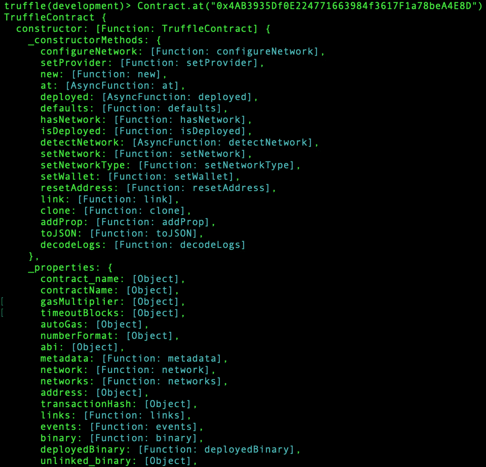
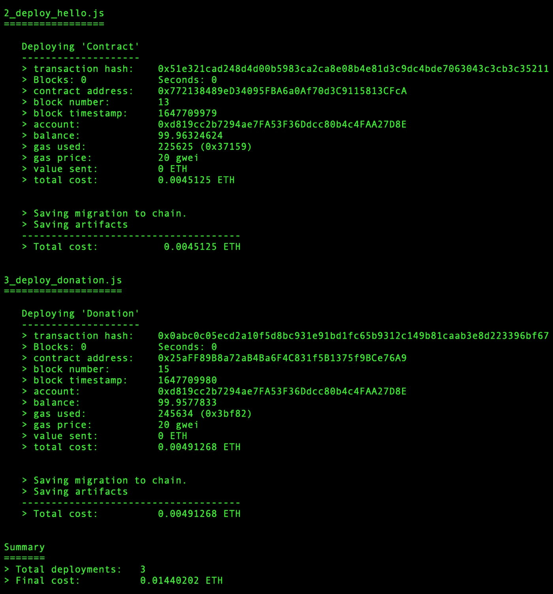

# 使用 Vyper 实现智能合约——Python 方法

> 原文：<https://betterprogramming.pub/implementing-smart-contracts-using-vyper-a-python-approach-95f9299e64d8>

## 探索如何使用 Vyper 编程语言而不是 Solidity 编写智能合同


照片由——简·kopřiva 拍摄

许多正在学习如何编写智能合同的程序员会学习 Solidity 语言。有大量的在线教程和书籍可以教你什么是可靠。当与 Truffle 框架结合时，Solidity 形成了开发智能契约的杀手组合。以太坊区块链上几乎所有的智能合约都是用 Solidity 编程语言编写的。

在本文中，我们将探讨如何用 Vyper 编程语言编写智能合同。

# 涵盖的主题

1.  介绍
2.  设置环境
3.  使用 Vyper 创建智能合同
4.  将智能合同部署到 Ganache
5.  与智能合约交互
6.  与其他智能合同交互
7.  以编程方式编译代码

# 介绍

## Vyper 是什么？

Vyper 是一种面向契约的 pythonic 编程语言，目标是[以太坊虚拟机(EVM)](https://ethereum.org/learn/#ethereum-basics) 。Vyper 的语法非常简单/易懂；Vyper 的原则之一是让开发者几乎不可能编写误导性的程序。

## 为什么是 Vyper？

*   **安全性**:在 Vyper 中构建安全的智能合约应该是可能的，也是自然的。
*   语言和编译器的简单性:语言和编译器的实现应该尽量简单。
*   可审计性 : Vyper 代码应该最大程度上是人类可读的。此外，编写误导性代码应该是最困难的。对读者来说简单比对作者来说简单更重要，而对没有多少 Vyper 使用经验(以及一般编程经验)的读者来说简单尤为重要。

因此，Vyper 提供了以下功能:

*   **边界和溢出检查**:关于数组访问和算术。
*   **支持有符号整数和十进制定点数**
*   **可判定性**:可以计算任何 Vyper 函数调用的气体消耗的精确上限。
*   **强力打字**
*   **小巧易懂的编译器代码**
*   **对纯函数的有限支持**:任何标记为常量的东西都不允许改变状态。

# 设置环境

Vyper 需要 Python 3.6 软件。所以，如果你没有安装 Python 3.6 软件，你必须在这里安装它[，然后按照以下步骤操作:](https://www.python.org/downloads/release/python-366/)

```
$ python3 -m pip install --user virtualenv
$ pip install vyper
$ virtualenv -p python3.6 vyper-venv
$ source vyper-venv/bin/activate
(vyper-venv) $ pip install vyper
(vyper-venv) $ vyper --version
```

# 与 Vyper 一起创建智能合同

现在，让我们与 Vyper 一起创建一个智能合同。首先，我们将使用。vy 扩展名，并将其命名为`hello.vy`，如下:

你好，小薇

这是您编译 vyper 文件的方式:

```
(vyper-venv) $ vyper hello.vy
```

由此，您将获得以下输出:



abi

这是智能合约的字节码。请记住，要部署智能合约，您需要字节码，但是要访问智能合约，您需要 abi。那么如何获得 abi 呢？您可以通过运行以下命令来实现这一点:

```
(vyper-venv) $ vyper -f json hello.vy
```

由此，您将获得以下输出:



json

如果您想在一个编译过程中同时获得 abi 和字节码，您可以在编译过程中组合这两个标志，如下所示:

```
(vyper-venv) $ vyper -f json,bytecode hello.vy
```

这将为您提供以下输出:



阿比，json

# **在加纳切部署智能合同**

那么，如何将这个智能合约部署到以太坊区块链呢？有几种方法可以做到这一点，但让我们使用一种熟悉的方式使用松露:

1.  创建一个目录并用 truffle init 初始化它，如下所示:

```
$ mkdir hello_project
$ cd hello_project
$ truffle init
```

2.按如下方式设置 truffle-config.js:

```
module.exports = { 
  networks: { 
    "development": { 
       network_id: "*", 
       host: "127.0.0.1", 
       port: 8545 // port at Ganache running
      }, 
    } 
 };
```

3.创建一个构建目录，如下所示:

```
$ mkdir -p build/contracts
$ cd build/contracts
```

4.然后在那里创建一个 Hello.json 文件，如下所示:

```
{
  “abi”:
  ”bytecode”:
}
```

5.然后用编译过程输出的 abi 或 json 填充 abi 字段，用编译过程输出的字节码填充字节码字段。您需要用双引号将字节码值括起来。不要忘记在 abi 字段和字节码字段之间加一个逗号。这将为您提供类似于以下内容的内容:

6.然后，您可以通过在`migrations/2_deploy_hello.js`中创建一个新文件来创建一个迁移文件来部署这个智能合约，如下所示:

```
var Hello = artifacts.require("Hello");
module.exports = function(deployer){
   deployer.deploy(Hello);
};
```

一切设置好后，点火 **Ganache** ！

7.然后，在 hello_project 目录中，您可以运行迁移过程，如下所示:

```
$ truffle migrate
```

您将看到类似如下的内容:



块菌产量

您与 Vyper 一起编写的智能合同已部署到 Ganache。您的智能合同地址如下:

```
0x4AB3935Df0E224771663984f3617F1a78beA4E8D
```

# **与智能合约互动**

正如我们之前所做的，您可以使用 Truffle 控制台与您的智能合约进行交互，如下所示:

```
$ truffle console
```

您的智能合约始终被命名为合约。我们可以使用以下语句访问智能合同:

```
truffle(development)> Contract.at("0x4AB3935Df0E224771663984f3617F1a78beA4E8D")
```

您将得到一个很长的输出，其中可以看到 abi、字节码等等，如下面的屏幕截图所示:



块菌产量

让我们使用下面的语句来看看智能合约的 name 变量的值:

```
truffle(development)> Contract.at(“0x4AB3935Df0E224771663984f3617F1a78beA4E8D”).then(function(instance){return instance.name.call(); });*'Satoshi Nakamoto'*
```

让我们将名称更改如下:

```
truffle(development)> Contract.at(“0x4AB3935Df0E224771663984f3617F1a78beA4E8D”).then(function(instance) { return instance.change_name(“Vitalik Buterin”), { from: “0xb28Fc17791bf66719FBFCc65846B01Fe2726e9E2” } });
```

> `from`字段中的值取自加纳切的一个账户。你可以只看 Ganache 窗口，选择任何你喜欢的账户。

输出:

```
{ from: ‘0xb28Fc17791bf66719FBFCc65846B01Fe2726e9E2’ }
```

现在改名字了吗？让我们找出答案。运行以下命令:

```
truffle(development)> Contract.at(“0x4AB3935Df0E224771663984f3617F1a78beA4E8D”).then(function(instance){return instance.name.call(); });*‘Vitalik Buterin’*
```

# 与其他智能合同交互

您的智能合约可以与区块链上的其他智能合约进行交互。

地址数据类型不仅用于普通帐户，也可用于智能合同帐户。因此，智能合同可以通过捐赠智能合同向我们的受赠人捐赠乙醚！

重启你的 Ganache。还记得你的`hello.vy`文件吗？我们希望使用自定义名称部署我们的 Hello smart 契约。

我们的迁移文件，`migrations/2_deploy_hello.js`仍然是相同的，如下面的代码所示:

```
var Hello = artifacts.require("Hello");
module.exports = function(deployer){
   deployer.deploy(Hello);
};
```

再次编译您的`hello.vy`文件以获得接口和字节码。打开我们的合同 JSON 文件，`build/contracts/Hello.json`文件。删除所有内容，并替换为以下代码:

```
{
     "contractName": "Hello",
     "abi": <your Hello smart contract's interface>,
     "bytecode": "<your Hello smart contract's bytecode>"
}
```

您必须为您的智能合约命名，因为这一次，您将部署两个智能合约。如果您不为智能合约命名，它将有一个默认名称 contract。如果您只想部署一个智能合约，这不是问题。

然后，对您的`donation.vy`进行编辑，并添加以下代码行:

捐赠. vy

使用下面的代码，为我们的捐赠智能契约`migrations/3_deploy_donation.js`创建另一个迁移文件:

```
var Donation = artifacts.require("Donation");
module.exports = function(deployer) {
  deployer.deploy(Donation);
};
```

编译您的`donation.vy`,并获得智能契约的接口和字节码。然后，使用下面的代码，为我们的捐赠智能契约创建另一个契约 JSON 文件，`build/contracts/Donation.json`:

```
{
     "contractName": "Donation",
     "abi": <your Donation smart contract's interface>,
     "bytecode": "<your Donation smart contract's bytecode>"
}
```

运行迁移。您可能需要使用`—- reset`标志，如下所示:

```
$ truffle migrate --reset
```

您将获得以下输出:



块菌产量

注意`Donation`智能合约“0x 25 aff 89 b 8 a 72 a B4 ba 6 f 4c 831 F5 b 1375 f 9 BCE 76 a 9”和`Hello`智能合约“0x 772138489 ed 34095 FBA 6a 0 af 70d 3c 9115813 cfca”的地址。你的可能会不同。

按如下方式运行 Truffle 控制台:

```
$ truffle console
```

现在我们的智能合同不再孤独😄，如下面的代码所示:

```
truffle(development)> Donation.at(“0x25aFF89B8a72aB4Ba6F4C831f5B1375f9BCe76A9”).then(function(instance) { return instance.donation_smart_contract_call_hello_smart_contract_method.call(“0x772138489eD34095FBA6a0Af70d3C9115813CFcA”); } );
```

输出:

```
‘0x48656c6c6f2c205361746f736869204e616b616d6f746f’
```

# 以编程方式编译代码

您可以创建一个脚本来编译 Vyper 代码，而不是使用命令行实用程序。确保您位于包含`Hello.vy`和`donation.vy`的同一目录中。创建一个名为`compiler.vy`的脚本，如下所示:

compiler.vy

如果您使用下面的命令执行这个脚本，您将得到一个可以与 Truffle 一起使用的`Hello.json`文件，如下面的代码所示:

```
(vyper-venv) $ python compiler.vy
```

# **总结**📝

在本文中，我们看到了如何使用 Vyper 编程语言编写智能合同。首先，我们安装了 Vyper 编译器。然后我们开发了一个智能合同。

通过这样做，我们了解了 Vyper 编程语言的大部分特性，包括函数装饰器、初始化函数和函数权限修饰符。

还有一些数据类型，如地址、整数、时间戳、映射、数组和字节数组(字符串)。我们学习了如何将 Vyper 源代码编译成智能契约，然后用 Truffle 工具将其部署到 Ganache。我们还通过 Truffle 控制台与智能合约进行了交互。

# 参考

[1]: Vyper。文档。[https://vyper.readthedocs.io/en/stable/index.html](https://vyper.readthedocs.io/en/stable/index.html)

更多:

[](/preventing-smart-contract-attacks-on-ethereum-a-code-analysis-bf95519b403a) [## 防止对以太坊的智能合约攻击——代码分析

### 让我们编写一个易受攻击的智能合约代码，看看攻击是如何工作的，并了解修复它的预防技术

better 编程. pub](/preventing-smart-contract-attacks-on-ethereum-a-code-analysis-bf95519b403a)