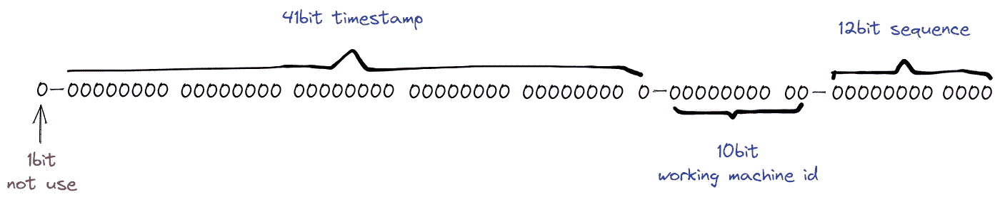
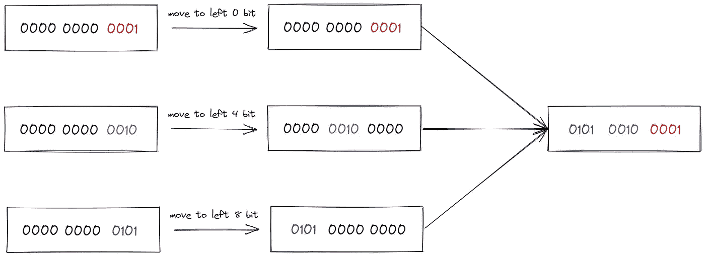

# 在 Golang 中实现雪花算法

> 原文：<https://betterprogramming.pub/implementing-snowflake-algorithm-in-golang-c1098fdc73d0>

## 雪花在行动


照片由 [Aaron Burden](https://unsplash.com/@aaronburden?utm_source=medium&utm_medium=referral) 在 [Unsplash](https://unsplash.com?utm_source=medium&utm_medium=referral) 上拍摄

雪花算法的背景当然是 Twitter 高并发环境下对惟一 ID 生成的需求。

多亏了 Twitter 的内部技术，雪花算法之所以能流传到今天并被广泛使用，是因为它有几个特点。

*   它能满足高并发分布式系统环境中的非重复 ID。
*   生产效率高。
*   基于时间戳，保证了有序的增量。
*   不依赖第三方库或中间件。
*   生成的 id 是连续且唯一的。

# 雪花算法原理

我们来看一张图。



图片来源:作者

从图中我们可以看到，雪花 ID 结构是一个 64bit 的 int 数据。

*   1bt。

在二进制中，最高位是`1`。因为我们用的 id 应该是整数，有负数，所以这里最高位应该是`0`。

*   41 位:时间戳。

41 位可以代表⁴ -1 数。如果只用来表示正整数，可以表示的值的范围是 0 — ( ⁴ -1)。这里减一的原因是因为取值范围是从`0`开始计数，而不是从`1`开始。

这里的单位是毫秒，所以 41 位可以表示⁴ -1 毫秒，翻译成单位年就是(⁴ -1)/(1000 * 60 * 60 * 24 * 365) = 69。

*   10 位:工作机器 ID。

这里是用来记录工作机的 id。⁰=1024 意味着当前规则允许分布式节点的最大数量为 1024 个节点。这包括五位数的`WorkerID`和五位数的数据中心，在这里无法区分，但是下面的代码做了区分。

*   12 位:序列号。

用于记录同一毫秒内生成的不同 id。12bit 能代表的最大正整数是-1=4095，也就是 4095 个数字`0, 1, 2, 3, … 4094`。这可用于指示同一台机器是在同一时间戳(毫秒)内生成的。4095 ID 序列号。

原理就是上面的。没有什么困难。让我们看看代码是如何实现的。

# Go 实现了雪花算法

## **1。定义基本常数**

## ***2。定义工人节点***

因为这是一个在分布式环境中使用的 ID 生成算法，如果我们想要生成多个 workers，我们必须抽象节点参数。

代码解释:

*   `mu sync.Mutex`:添加互斥，保证并发安全。
*   `LastStamp int64`:记录上次 ID 生成的时间戳。
*   `WorkerID int64`:worker 节点的 ID，对上图中的 5 位 WorkerID 有意义。
*   `DataCenterID int64`:节点的数据中心 ID。
*   `Sequence int64`:当前毫秒内已经生成的 id 序列号(从 0 开始累加)一毫秒内最多生成 4096 个 id

## **3。创建一个工人对象**

## ***4。生成 ID***

代码有点长，我来依次解释一下:

*   `getMilliSeconds()`:封装得到当前毫秒值的方法。
*   `func(w *Worker) NextID() (uint64, error)`

这段代码的内容没有什么特殊作用，主要是为了解耦。唯一需要注意的是锁定和释放步骤。

这里的实现分为几个步骤:

*   获取当前时间戳并做出判断。确保当前时间戳值大于上次 ID 生成的时间戳。否则会有重复的。
*   如果相等，首先获取当前毫秒生成的 id 序列号。这里你可能不明白。相当于`if w.sequence++ > maxSequence`。
*   如果当前毫秒中生成的 id 序列号溢出，则必须等待下一毫秒。如果不等待，会造成很多重复。
*   我们在 else 中设置`w.sequence`到`0`，这里有一个解释，如果当前时间与 worker 节点上一次生成 ID 的时间不一致，那么 worker 节点的 ID 生成顺序号需要复位。
*   最后一步，也是更重要的一步，使用了`OR`操作。这里的目的是返回各部分的位，通过按位`OR`运算(也就是这个`|`)进行整合。`<<`这是向左移动归位的功能，`|`是积分操作。



图片来源:作者

## ***5。测试***

写完代码，我们来测试一下。在这里，我用 10，000 个 goroutines 并发地生成 id，将它们存储在 map 中，并检查是否有重复。让我们看看代码:

以下是验证结果:

```
All 10000 snowflake ID Get successed!
```

感谢您阅读这篇文章。