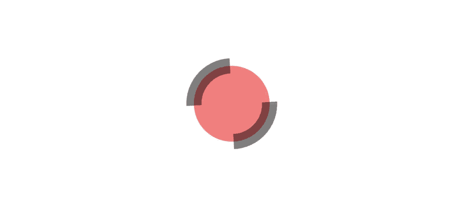
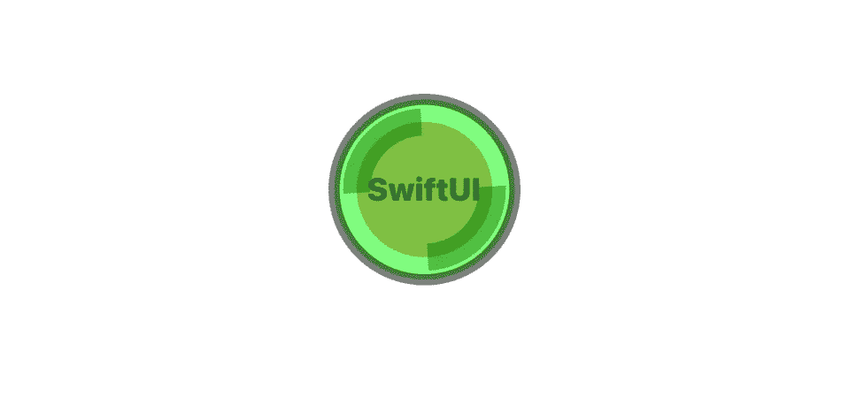
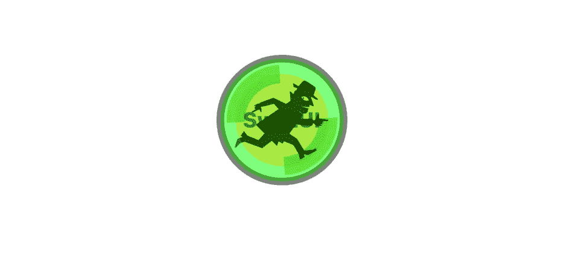
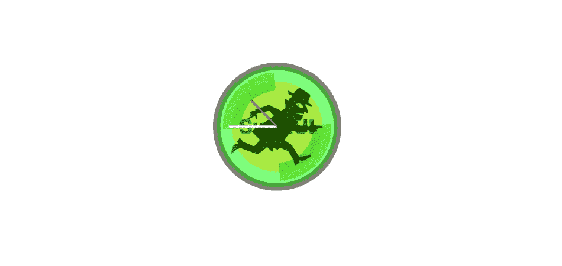

# 在 iOS 15 中实现 SwiftUI Canvas

> 原文：<https://betterprogramming.pub/implementing-swiftui-canvas-view-in-ios-15-b7909eac207>

## 看看如何在 SwiftUI 中使用新的画布视图

展示 SwiftUI 3.0 中新的 Apple Canvas 视图的动画 GIF

不幸的是，SwiftUI 仍然有点未完成——至少与其老大哥 UIKit 相比。尽管这是 iOS15 的第三个版本，但它仍然缺少一些重要的视图。

我觉得，苹果剩下的主要挑战之一是如何尽可能无痛地完成过渡。没有人想重写 UI/UX 代码——公司当然负担不起。他们需要一种方法来重用他们已经拥有的尽可能多的代码，但是没有随之而来的 UIKit 包袱。

除此之外，SwiftUI 是一个非常新的范例，调整了开发人员以前掌握的一些控件。因此，尽管他们在最近的 WWDC 21 大会上没有说太多，但在我看来，苹果正在尝试涵盖一些中间地带。中间地带有一个新的视角叫做画布。某种程度上的妥协。

它在 WWDC 21 上被展示为一种更有效的绘画方式。就 CPU 而言，它可能更高效，但看着它，我不禁认为它在代码迁移方面也更高效，本机支持核心图形原语，这是你以前在 SwiftUI 中无法轻易做到的——需要在`UIImages`和`Images`之间转换有点痛苦。

# 什么是 SwiftUI 画布视图？

画布视图有点像 SwiftUI 中的 SpriteKit 视图。它们之所以相似，是因为它们在某种程度上自成一体。

你不能**，**例如，将手势附加到画布视图中的元素，它是一个单独的对象(当然，你可以将手势作为一个整体添加到画布视图中)。但是，与以前的现状相比，它们提供了一个主要优势:它们绘制视图的效率要高得多。更重要的是，它们原生支持所有核心图形绘制图元。这意味着您可以将代码移植给他们，只需对您的新 SwiftUI 界面进行最小的更改。请和我一起参观一下新的 Canvas 指令，构建您在本文标题中看到的绿色时钟。

# 在画布上绘制形状

在 SwiftUI 画布视图上绘制形状

我先画一个钟的形状，一个简单的圆。也可能是一个方形的钟，你在渲染圆形和方形时得到的两个基本形状。是的，它是红色的，但是不透明度降低了——所以它是一种褪色的红色。黑线是您在下面的代码中看到的`setLineDash`函数。长度以弧度为单位(不，这不是很方便用户使用)。

# 在画布上混合形状颜色

在 SwiftUI 画布视图上混合形状

接下来，为了完成这张图片，我需要一个边框，我决定绿色也是一个很好的颜色，所以我把它和我的红色时钟混合在一起，添加了一个边框。

# 在画布上绘制文本

在 SwiftUI 画布视图上绘制文本

现在，虽然严格来说不需要，但我想包含一个用 render 添加一些文本的例子，所以我在 SwiftUI 画布中添加了一个单词。

# 在画布上绘制图像

在 SwiftUI 画布视图上绘制图像。忍者形象由[伊恩·兰斯利](https://thenounproject.com/ian821/)

接下来，同样为了完整起见，我添加了一张我从`[thenounproject](https://thenounproject.com)`中找到的图片。我再次将它融入画面，这样就不会太过强烈。虽然你确实丢失了一些文本。

# 在你的画布上画线

在 SwiftUI 画布视图上画线

最后，我在画布上添加了双手，只需从图像中心向外画两条线。注意这是另外两个独立的画布对象。他们需要被分开，因为我想让他们单独的动画。还要注意，我改变了`zIndex`以确保它们总是出现在时钟图像的上方，并在这里稍微旋转了一下，这样你可以更好地看到它们。

# 赋予它生命

这是既成事实——我在钟面上加了四个主要数字；然后通过创建两个计时器并将其链接到代码来制作动画，以便随着时间的推移将包含线条的图像旋转 360 度，这就是您在本文开头看到的移动图像。

所有这些都让我想到了这篇文章的结尾。我希望你喜欢读它，就像我喜欢写它一样。