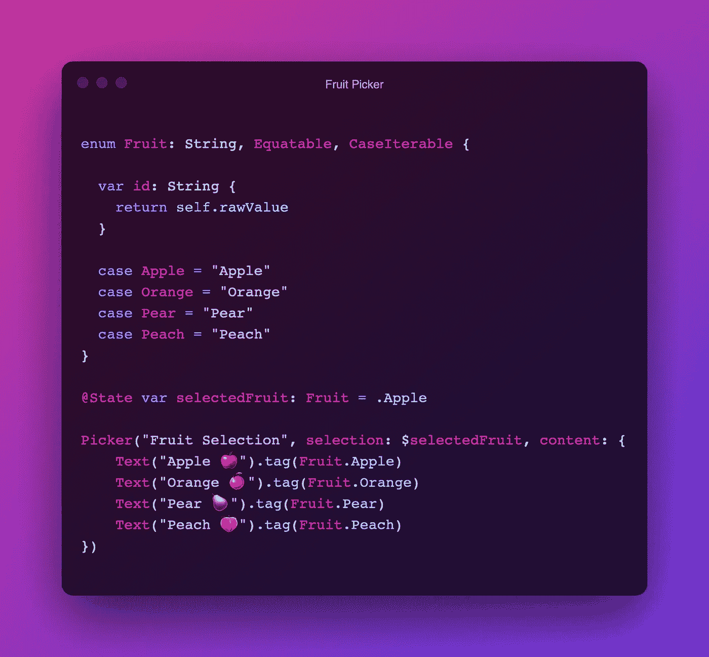
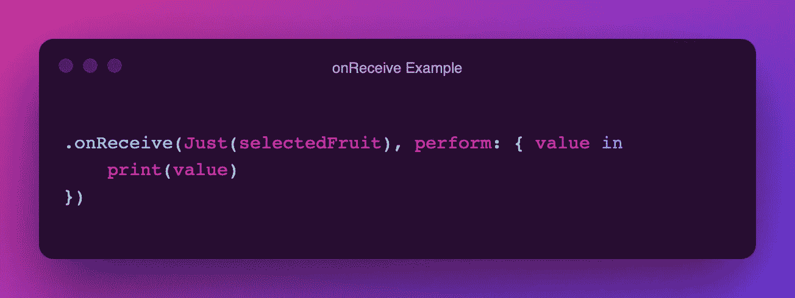
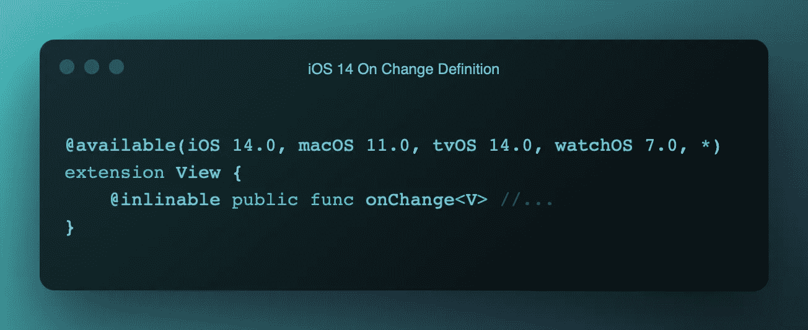

# 为 iOS 13 实现 SwiftUI 的 OnChange 修改器

> 原文：<https://betterprogramming.pub/implementing-swiftui-onchange-support-for-ios13-577f9c086c9>

## 让我们为最新的 SwiftUI 特性添加向后兼容支持

Patrick Ward 在 [Unsplash](https://unsplash.com?utm_source=medium&utm_medium=referral) 上拍摄的照片。

随着 iOS 14 的发布，SwiftUI 获得了一些强大的新功能。但如果你仍然坚持支持 iOS 13 平台，那么这对你没有太大好处，不是吗？

我最近需要在一个项目中使用`onChange`视图修改器，但我很快意识到它在 iOS 13 部署目标上不受支持。下面是 XCode 给我的一个大错误:

幸运的是，iOS 13 已经有了一个简单的变通方法。看看我下面做的这个`Picker`，选出你最喜欢的水果:

假设我们想在选择的水果发生变化时打印到控制台。

我们如何实现这一目标？

我们实际上可以使用`onReceive`来监听给定的发布者，当然，你也可以使用早在 iOS 13 的`onReceive`钩子。

但是要创建一个`Publisher`来监听我们的`selectedFruit`变量的变化，我们必须将它包装在一个`Just`发布器中。`Just`是`Publisher`的内置类型，*只是*监听给定变量的变化。如果你愿意，你可以自己测试一下。你可以在这个[要点](https://gist.github.com/zane-carter/ded575291e446e74b2870e6675c3a609)中找到完整的代码。你可以在苹果开发者上阅读关于`Just`出版商[的信息。](https://developer.apple.com/documentation/combine/just)

*注意:* `*Just*` *需要* `*Combine*` *，所以一定要用* `*import Combine*` *。*

但是，这并不便于您跨平台实现。您仍然需要使用`@available`语句在`onReceive`和`onChange`之间手动切换，或者只使用`onReceive`修饰符。

为了让事情变得简单一点，我做了一个定制的`onChange`修改器，在 iOS 13 中使用这个`onReceive`。但是如果你最终为 iOS 14 目标编译，你可以充分利用苹果自己的`onChange`修改器。

下面，你可以看到苹果的`onChange`修饰符的定义，右击`onChange`并选择`Jump To Definition.`，如果你愿意，你可以自己在 XCode 中测试一下:

如你所料，定义上方有一个`@available`标签，指明这仅在 iOS 14 或更高版本上可用。我们将通过 iOS 13 和 iOS 14 的实现来做出自己的定义。为了避免混淆编译器，我们将稍微不同地命名我们的实现。我们新的向后兼容修饰符将被称为`valueChanged`。

解决方案是:

你可以在 iOS 13+的任何项目中安全地使用这个新的`valueChanged`修改器。一旦你结束了为 iOS 14 目标的编译，你可以确定你的项目已经利用了苹果的`onChange`修改器。

感谢阅读。