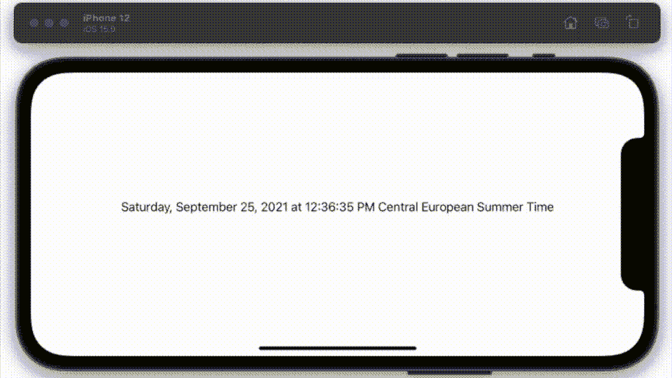
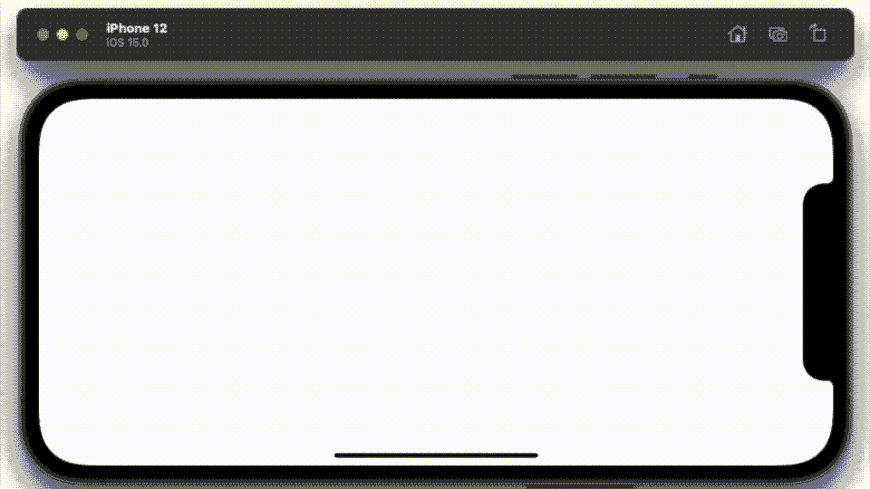
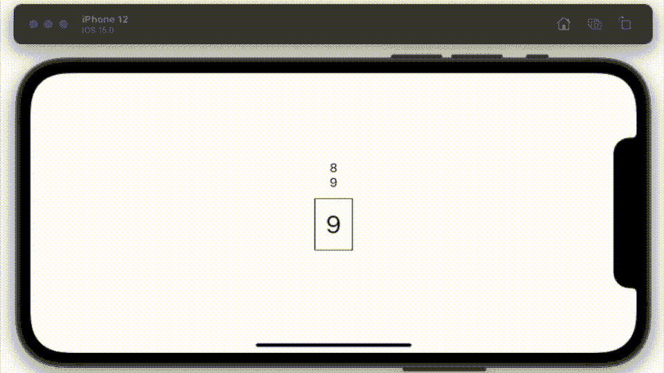
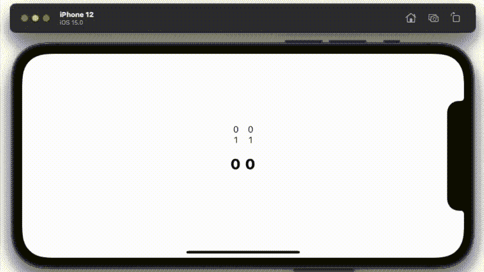

# 在 iOS 15 中实施 SwiftUI TimelineView

> 原文：<https://betterprogramming.pub/implementing-swiftui-timelineview-in-ios-15-511f414614a6>

## 让我们使用新的画布视图构建一个数字时钟


使用全新 SwiftUI 3.0 TimelineView 的时钟

你听说过 crontab 吗？不，他不是 DC 英雄。它从 1975 年就存在了，那是一个永恒。iOS 曾经运行过一个 crontab，虽然翻看 SO 的帖子，但是早就销声匿迹了。当然，它仍然存在于 OS X，在 shell 下键入“crontab -l ”,您将得到一个响应。

但也许并没有失去一切，因为在 iOS 15 中，苹果推出了一个新的视图，专门用于按计划运行作业，有点像 crontab。我说运行作业，是指刷新计划中的视图。现在；在这一点上，我应该承认，我不太确定我应该如何使用这个新的视图。我不确定，因为 SwiftUI 中已经有了一个调度程序。像这样的调度程序。

```
let timer = Timer.publish(every: 0.5, on: .main, in: .common).autoconnect()
```

您可以在代码中捕获一个调度程序，并强制进行某种视图刷新。在所示情况下，每 0.5 秒刷新一次。

```
.onReceive(timer) { _ in
  refresh += 1
}.id(refresh)
```

我只能假设他们决定创建一个专用于调度的视图，因为它符合 SwiftUI 中真理哲学的单一来源。安排应用程序应该引用的所有代码的单一来源。请和我一起踏上了解这一新观点的旅程。

让我们从我能做的最简单的`TimelineView`开始。

一段代码将产生这个输出。



新 SwiftUI 3.0 TimelineView 的基本输出

## 案情摘要

我想把它变成一个时钟，一个带数字的数字时钟。它需要显示秒、分、小时…仅此而已。

为此，我最初的想法是解析我从`TimelineView`获得的行，尽管我很快改变了主意，因为我确信它不会很好地老化——谁知道在 SwiftUI 4.0 中苹果会默认报告什么。我认为更好的解决方案是使用`onChange`指令来观察这条线的变化。这是我的第一个时钟代码片段:

上面的代码生成了一个非常简单的数字时钟，如下所示:



使用全新 SwiftUI 3.0 TimelineView 的时钟

现在，除了无聊；还有一个更严重的问题——当它变化时，你会看到一个小的抖动。这都与所显示数字的宽度有关。例如，数字 2 的宽度大于 1。我确实尝试用框架来解决这个问题，但它仍然不起作用。

现在，如果你看着它运行，再仔细想想这个问题——专注于固定一个数字是有意义的。如果我能得到一位数的工作，那么我就成功了。我也想借此机会让时钟变得更有趣，想起我在亿万年前发表的一篇论文，[这篇](/drawing-in-3d-using-swiftui-ed211d7c2c91)。我决定在这里也尝试使用 rotation3DEffect。经过几次尝试后，我完成了这段代码。

动画方面的正道，没那么无聊。最终结果如下所示:



使用新的 SwiftUI 3.0 TimelineView 进行计数

但是，正如你在这个动画 GIF 中看到的，我仍然有一个微光在那里。当然我可以去掉边框，但是如果我把两个视图放在一起，它们会因为值的改变而争夺空间。我仍然发抖。

我需要做的是使用一张图片。使用 iOS 15 中另一个新视图，即画布的理想机会。

我将代码嵌入到我为文本对象创建的先前结构中。一个简单的更新。



使用新的 SwiftUI 3.0 TimelineView 进行计数

我相信你会同意，这要好得多。我不仅去掉了 hic-up 的显示，而且正如你所看到的，我开始摆弄它翻转数字的方式。秒的下拉列表，每十秒钟数字就会翻上来。

然后我放了一个开关，根据转动的数字选择不同种类的 3d 效果。你有很多选择。

上面的代码代表了一个我会在`timelineView`括号内重复调用的视图。最终结果，你可以看到这篇论文的标题。我承认我确实编辑了一点，这样你会看到时间过得更快，而且我包括了比我在这里展示的更多的`TimelineView`，总共六个。

每个视图与所有其他视图同步，在有意义的时间运行。第一个视图在循环回到 0 之前计数到 9。第二个视图在循环回到零之前只计数到 5。

总而言之，这让我想到了这篇文章的结尾。感谢阅读。