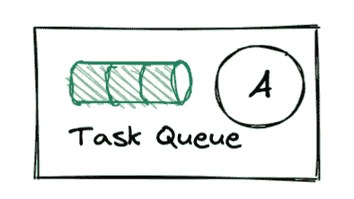
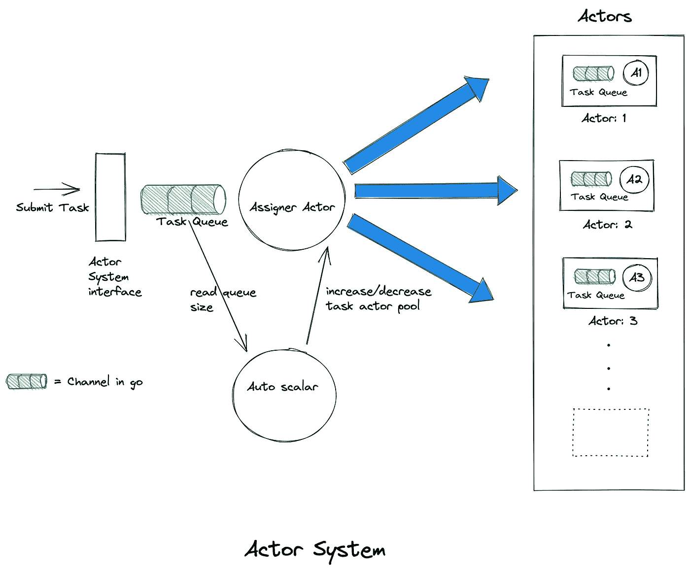
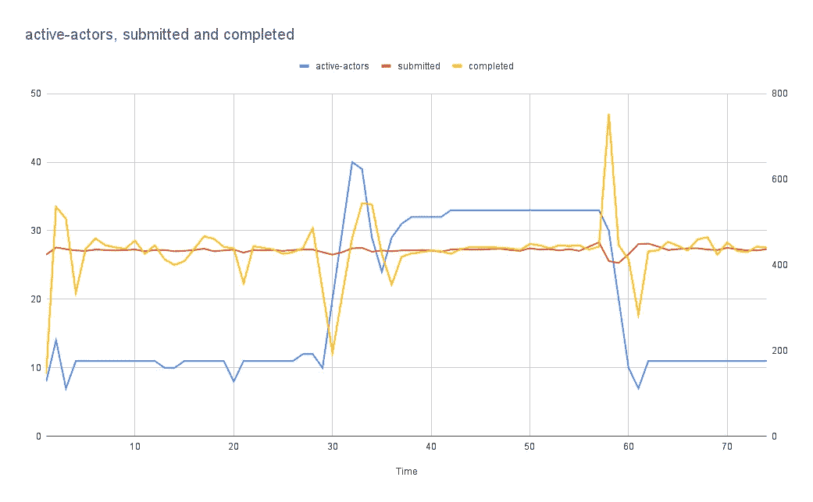

# 在 Golang 中实现一个演员模型

> 原文：<https://betterprogramming.pub/implementing-the-actor-model-in-golang-3579c2227b5e>

## 使用这种编程结构利用并发的力量


乔治·豪登在 [Unsplash](https://unsplash.com?utm_source=medium&utm_medium=referral) 上的照片

随着多核 CPU 的出现，我们需要能够通过以并发方式处理任务来利用这些额外内核的编程结构。
actor 模型就是这样一种编程结构，它对大量独立作业进行建模，这些作业以任意顺序进行处理，无需锁同步。

actor 模型的一个非常常见的用法可以在 web 服务器，Play！Java 中的框架就是一个例子。一般来说，任何并发应用程序都可以构建在参与者模型之上。

在本文中，我将描述如何在 golang 中实现一个原始的 actor 模型。我们将利用 golang 提供的工具进行并发处理——go routines、通道和等待组。

首先，我们来看一个演员:



**演员**

一个 actor 有一个任务队列和一个监听任务队列并执行任务的 goroutine。

这里 A 是一个阻塞任务队列并继续执行队列中的任务的 goroutine。
这里是一个 actor 的界面的样子:

```
type Actor interface {
   AddTask(task Task)
   Start()
   Stop()
}
```

现在我们来看看`task`

任务在一个 actor 中执行。它是用*执行方法*给定接口的实现。任何可以通过执行调用来执行的东西。任务是我们需要做的工作的业务实现。

在 web 服务器框架中，它将调用定义 API 实现的接收者。

```
type Task interface {
   Execute()
}
```

整个系统看起来像这样:



我们来看看 actor 系统界面。

```
type ActorSystem interface {
   Run()
   SubmitTask(task Task) 
   Shutdown(shutdownWG *sync.WaitGroup)
}
```

使用`SubmitTask`方法将`Task`提交给`ActorSystem`。一个`taskAssigner`将每个任务分配给其中一个`Actor`。每个`Actor`也有一个小队列，在其中缓冲任务并逐个执行。

现在，让我们深入了解每个组件

# 演员系统

下面是`ActorSystem`的一个要点:

当`ActorSystem`启动时，它启动一个`taskAssigner`演员。通过调用 actor 上的 AddTask 方法，将每个传入系统的`Task`添加到 taskAssigner `actor`中。

使用`SubmitTask`方法将`Tasks`提交给`ActorSystem`。我们通过调用`AddTask`方法将每个传入的`Tasks`放到`taskAssigner`中。

在`Shutdown`它关闭`tasks`通道，阻塞任何新的输入任务，等待所有接收到的任务被分配给参与者。然后，它在每个`Actor`上调用`Stop`，并等待它们完成。

# 任务分配者

我们将每个传入的`Tasks`放在通道`tasks`中，将`taskAssigner`和`Task`放在一个`Actor`的内部队列中。

`taskAssigner`内部流程任务通过调用池中的`AddTask`将任务传递给池中的一个任务参与者。

`autoScalar`监视`tasks`中的项目数，并增加或减少`task actor pool`的大小。

# 任务参与者

它也是一个参与者，其工作是执行添加到通道任务中的任务，类似于分配者参与者。

# 基准

这里我们模拟了一个 web 服务器。

1.  100k 个请求以 2 毫秒的时间间隔线性发送
2.  当时钟在一分钟前 30 秒时，每个请求需要[0，50]~ 25 毫秒，在一分钟的后 30 秒需要[50–100]~ 75 毫秒。
3.  这模拟了下游服务延迟突然变化的情况。我们希望控制我们的吞吐量，以便不增加任何任务的等待时间

以下是 io 模拟基准的代码:

# **结果**

这是模拟的结果。我们每隔 100 毫秒跟踪 3 个指标

1.  提交的任务:这是一条恒定的线性橙色线，因为我们每 2 毫秒添加一个任务。
2.  已完成的任务:这是黄线，它试图紧跟橙色线，因为我们希望尽快完成提交的任务。
3.  活动参与者:这是蓝线，显示了系统需要为任务提供短等待时间的活动参与者的数量。当任务延迟增加时，参与者的数量也会增加，因为我们需要更多的参与者来实现类似的吞吐量。



## **观察结果**

1.  在大约 30 秒时，标记等待时间从大约 25 毫秒增加到大约 75 毫秒
2.  已完成的指标被删除，因为我们无法再处理类似数量的任务。
3.  自动标量注意到队列大小增加，并开始增加 actors，使其稳定在 30 个 actors 左右
4.  当延迟下降到大约 25 毫秒时，我们在 60 秒左右返回到原始状态。

该项目的完整代码可在以下网址找到:

[](https://github.com/gauravsa/go-actor-system) [## GitHub-gauravsa/go-actor-system

### 此时您不能执行该操作。您已使用另一个标签页或窗口登录。您已在另一个选项卡中注销，或者…

github.com](https://github.com/gauravsa/go-actor-system)