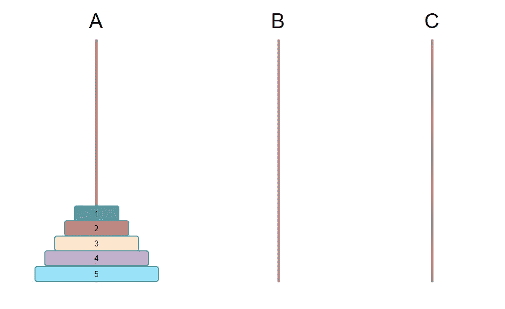
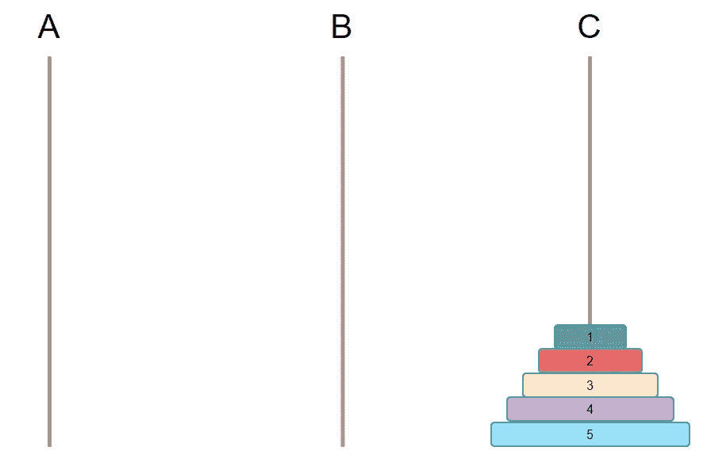
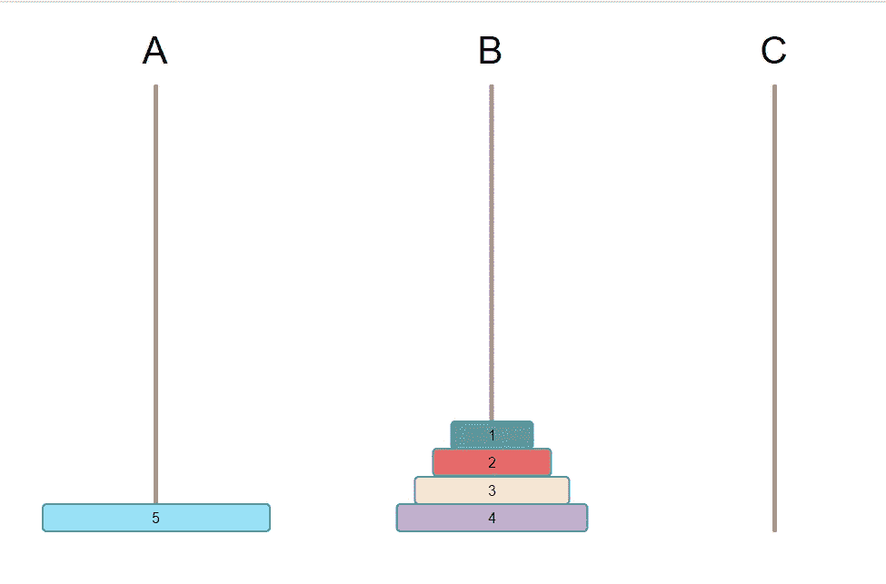
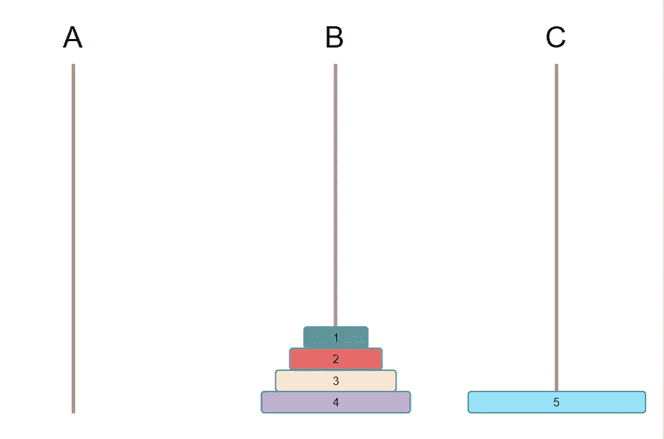
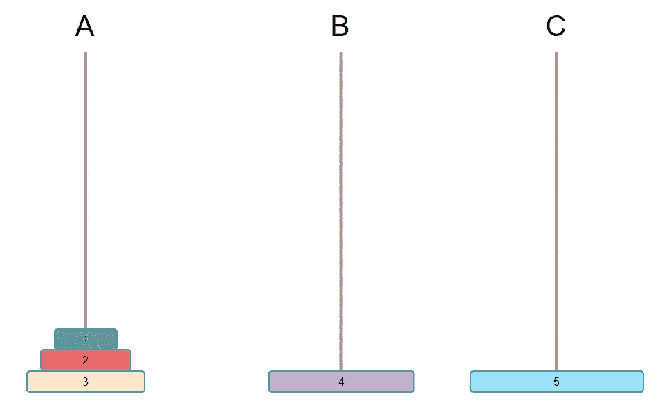
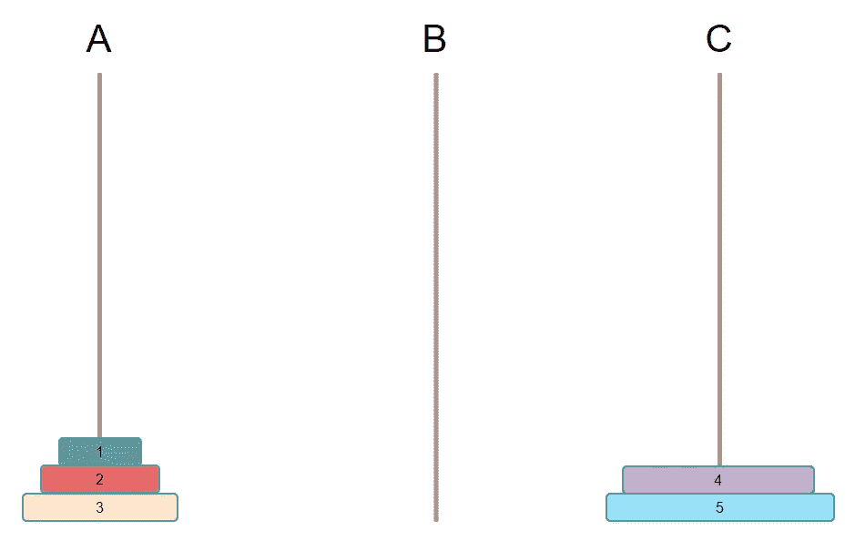

# 使用 Golang 实现 Hanota 算法

> 原文：<https://betterprogramming.pub/implementing-the-hanota-algorithm-using-golang-7c3b9e142448>

## 河内之塔——戈朗版本


卡斯帕·卡米尔·鲁宾在 [Unsplash](https://unsplash.com?utm_source=medium&utm_medium=referral) 上的照片

最近重温了电影《人猿星球的崛起》。在电影中，凯撒玩了一个河内塔游戏。你还有印象吗？一个人玩几个游戏还是挺难的😭，今天我们将使用 Golang 来实现河内塔游戏。

**游戏起源**

传说最早发明这个问题的人是法国数学家爱德华·卢卡斯(Edouard Lucas)。

在世界中心的贝拿勒斯圣殿(印度北部)，三根镶有宝石的针被插入一个黄铜盘子里。印度教的主神梵天在创造世界的时候，在其中一根针上从下到上穿了 64 枚黄金，也就是所谓的河内塔。

不管是白天还是晚上，总有一个和尚按照下面的规则移动这些金块:一次只移动一块，而且不管是在哪根针上，小的那块必须在大的那块上面。

众僧预言，当所有的金片从梵天佩戴的别针移到另一个别针时，世界将在一声雷劈中毁灭，梵天宝塔、寺庙、众生也将灭亡。

这个传说有很多变体，是谁不得而知，但是留下的数学题非常经典。

留下的数学知识:金币数和移动步数的关系是`2^n — 1`

```
The number of moves of a gold piece is 2 to the power of 1 minus 1
The number of moves of 2 gold pieces is 2 to the power of 2 minus 1
The number of moves of 3 gold pieces is 2 to the power of 3 minus 1
…
The number of moves of n pieces of gold is 2 to the nth power minus 1
```

如果这个传说是真的，僧侣们需要`2^64 — 1`步棋来完成这个任务；假设他们每秒移动一块黄金，需要 5849 亿年才能完成。整个宇宙才 137 亿岁，所以宇宙毁灭还早…

**游戏规则分析**

假设这个游戏有 3 根柱子，分别是`A`、`B`、`C`。需要移动的是珠子，其中一个已经有 N 个排序的珠子，最大的在最下面，珠子按顺序越来越小，另外 2 个空列。

基本条件

1.  一次只能移动一个珠子
2.  小珠子必须在大珠子的上面

初始状态如下图所示



最终目标是将一列上的所有珠子移动到另一列。

如下图。



# **游戏实现思路**

1.  清空大脑，先思考最简单粗暴的解决逻辑。把珠子看成一个整体。
2.  要满足大珠要下的基本条件，肯定要把`A`上最大的珠清空，然后把最大的珠放到`C`柱上。假设最大的珠子数是`N`。
3.  如果要移动到`C`列，要实现的第一步必须是将所有的`N-1`珠子移动到`B`列，只有这样`Nth`珠子(也就是最大的珠子)才能移动到`C`列。
4.  把`N-1`珠子移到`B`栏，因为大的是下的，小的是上的，所以`N-1`珠子也被点在`B`栏上。
5.  最后将 B 列的 N-1 颗珠子移到 C 列，完成最终目标。

**实现第一步:将 A 上的 N-1 个**珠子**移动到 b 上**

为什么先把 N-1 移到 B？因为你最终实现的是把所有的珠子从 A 移到 C，顺序不能变，只有大的在下面，小的在上面。

那么你必须先把最大的数移到 C，否则不满足条件。要将最大的珠子从 A 移动到 C，您必须腾出 A 上的最大珠子，也就是说，必须移除最大珠子上面的所有珠子。

而你只有 3 根柱子，C 上一定不能有其他的珠子，否则，你就不符合条件，这 N-1 颗珠子只能全部放在 B 上，而且还是有序的。



**第二步将 A 上的第 n 个珠子(最大的珠子)移动到 c 上**

这个很简单，一步就把最大的盘子从 A 移到 C。如下图。



第三步将 B 上的 N-1 个珠子移动到 c 上。

*提醒:要实现将 N-1 颗珠子移动到 C，是不是找到其中最大的珠子，然后先移动最大的珠子。所以这里的单词实际上变成了重复步骤 1 和 2，从 N-1 中找出最大的一个，先移到 C，然后重复。*

```
The third step is actually equivalent to changing the requirements. Suppose K = N - 1.There are K beads on column B, column A is empty, column C has the largest bead so for column B with K beads it is equivalent to empty.The first step is to move K-1 beads on B to A.The second step moves the Kth bead on B to C.The third step moves K-1 beads on A to C.
...
```

如下图。



首先找到剩余珠子中最大的一颗，在这个演示中是四颗。那就移动它。



循环重复以上步骤，直到只剩下一颗珠子，直接移动到 C，游戏结束。

**辅助柱。**

什么是辅助栏？假设你现在在 A 上有所有要移动的珠子，目标是移动到 C，那么 B 是 N-1 个珠子的辅助列。因为他们只能暂时留在这里，否则不符合游戏规则。

这里你需要先找到辅助支柱，不要想怎么实现，先理清逻辑。

```
To achieve moving from A to B, then C is the auxiliary column.To move from A to C, then B is the auxiliary pillar.To achieve the move from B to C, then A is the auxiliary column.
```

**戈朗实现。**

从上面的分析可以看出，这其实是一个循环的重复操作，非常类似于递归，都可以用递归来实现。

使用递归有两个必要条件

1.  求递归公式
2.  找到退出条件

在这个游戏中，退出条件是在只有一个珠子的情况下直接移动到 C 柱。

那么递归公式是什么呢？根据以上逻辑分析，可以分解为 3 个步骤。

*   第一步是将[N-1]个板从 A 移动到 B
*   第二步是将第 n 块板从 A 移到 C
*   第三步是将[剩余的 N-1]块板从 B 移到 C

下面是 Golang 实现的伪代码

感谢您阅读本文，如果您认为文章写得很好，请关注我。

如果发现本文有错误，欢迎留言讨论。

祝你愉快。