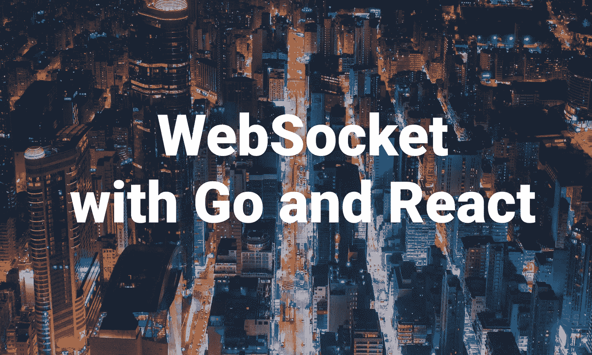
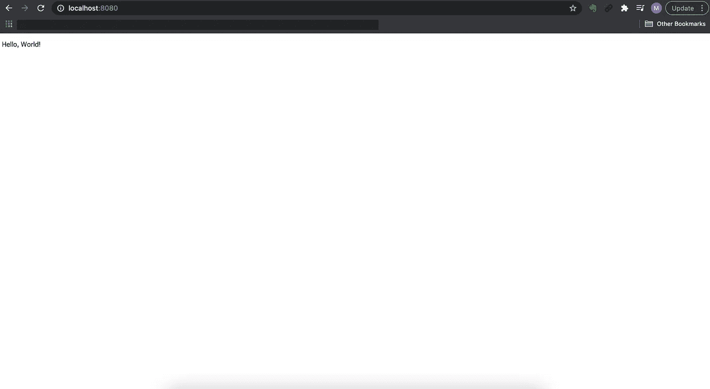
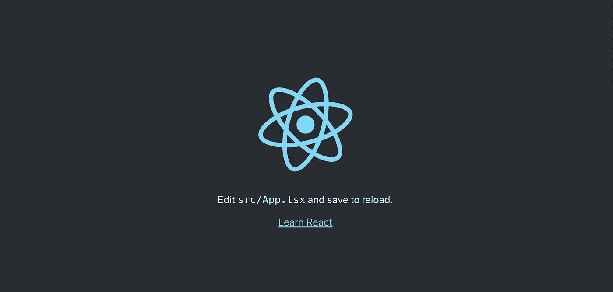
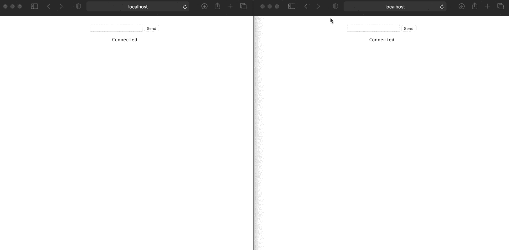
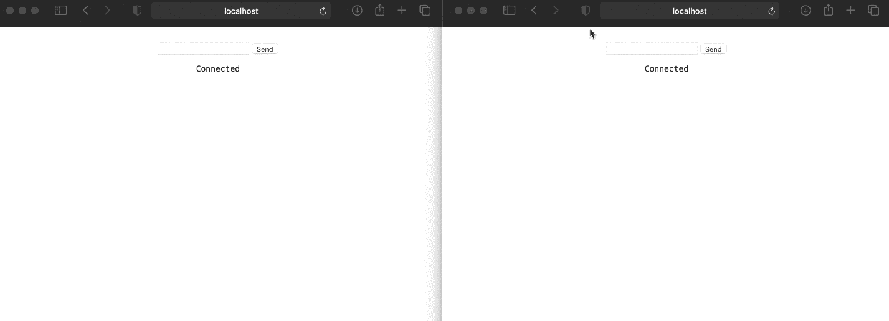

# 用 Go 和 React 实现 Websocket

> 原文：<https://betterprogramming.pub/implementing-websocket-with-go-and-react-b3ee976770ab>

## 在你的网络应用中实现实时交流的简单教程



照片由[曼森·伊姆](https://unsplash.com/@mansonyms?utm_source=unsplash&utm_medium=referral&utm_content=creditCopyText)在 [Unsplash](https://unsplash.com/?utm_source=unsplash&utm_medium=referral&utm_content=creditCopyText) 拍摄，经作者修改

这篇文章将带你了解如何使用 Go 和 React 实现 WebSocket。

# 属国

所需的依赖关系如下:

*   [回音](https://github.com/labstack/echo)
*   [大猩猩/网络插座](https://github.com/gorilla/websocket)

# 设置 API 服务器

首先，我们将使用 [echo](https://github.com/labstack/echo) 包制作一个 API 服务器。

将以下代码添加到`main.go`:

它会在 [http://localhost:8080](http://localhost:8080:) 响应`Hello, World!`，像这样:



http://localhost:8080

# 设置 WebSocket

默认情况下，Go 有一个 WebSocket 的包，但目前，它缺少一些功能，正如他们[所说的](https://pkg.go.dev/golang.org/x/net/websocket):

> “这个包目前缺少一些在替代的和更积极维护的 WebSocket 包中发现的功能:
> 
> [https://godoc.org/github.com/gorilla/websocket](https://godoc.org/github.com/gorilla/websocket)https://godoc.org/nhooyr.io/websocket

因此，我们将使用[gorilla](https://github.com/gorilla)/[WebSocket](https://github.com/gorilla/websocket)包建立一个 web socket——这是一个广泛用于 Go 的 web socket 实现。

实现 WebSocket 的步骤如下:

*   为 WebSocket 创建端点
*   升级传入的 HTTP 连接
*   听一个连接

## 为 WebSocket 创建端点

我们要做的第一件事是为 Websocket 创建一个端点。

让我们给`main.go`添加一个 WebSocket 端点，就像这样:

## 升级传入的 HTTP 连接

接下来，我们将升级传入的 HTTP 连接。

为此，我们需要创建一个结构:`websocket.Upgrader`。此代码的结构包含 WebSocket 连接的信息，如下所示:

```
var upgrader = websocket.Upgrader{}func main() {}
```

使用这段代码，升级处理程序中的 HTTP 连接:

## 听一个连接

接下来，我们将创建一个函数来侦听通过客户端发送的任何 WebSocket 连接。

在这种情况下，我们将期待来自客户端应用程序的 JSON 数据，所以让我们创建一个名为`Message`的结构:

并在处理程序中添加一些代码:

定义`for`循环，它将监听客户端应用程序发送的任何消息。

读取 JSON 数据后，它会通过`ws.WriteJSON(message)`将消息发送给客户端。

# 设置客户端应用程序

现在我们已经为 WebSocket 设置了一个端点，我们将创建一个客户端应用程序来发送到 WebSocket 端点。

为了快速启动，我们将如下使用`create-react-app`:

```
npx create-react-app websocket-app --template typescript
```

安装后，通过运行以下命令运行开发服务器:

```
yarn start
```

您将看到欢迎页面:



欢迎页面

# 连接到 WebSocket 端点

为了连接到我们的 WebSocket 端点，我们将在`ws://127.0.0.1:8080/ws`上创建一个 WebSocket API 连接实例，并尝试通过该连接发送消息。

对`src/App.tsx`做一些修改，比如:

安装后，App 组件将使用`socket.onopen`事件启动一个监听器，其中 WebSocket 将升级连接。

和`socket.messsage`事件监听来自服务器的消息。

现在我们已经准备好测试它了，访问 [http://localhost:3000](http://localhost:3000) ，让我们在字段中输入一些值:


测试电路

您可以看到连接正在成功工作。

但是如果多个客户端同时发送一条消息呢？会在其他标签页同步吗？



测试连接 2

答案是否定的:因为每个客户端都有各自的连接。在`main.go`中，我们仅向一个具有关联连接的客户端发送消息。

在这篇文章中，我们想要实现跨应用程序的实时连接，而无需重新加载。

为此，我们需要实现一个可以处理多个客户端并向它们发送消息的实现。

# 处理多个客户端的实现

首先，我们将创建`hub.go`，它保存客户端信息并向它们发送消息。我们将使用以下代码:

并对`main.go`做一些修改，像这样:

`hub`结构存储一个客户端，并通过通道发送消息。当通道收到消息时，它将写回所有客户端。

现在我们已经实现了一个侦听器，它将向所有选项卡发送消息。

让我们测试一下是否一切正常。



正如您所看到的，只要右边的选项卡发送一条消息，左边的选项卡就会显示相同的消息。

我们现在已经实现了实时交流。

# 结论

我们已经介绍了如何使用 Go 和 React 实现 WebSocket 连接。WebSocket 已经存在了一段时间，现在大多数现代浏览器都支持它，根据[我可以使用](https://caniuse.com/?search=websocket)吗？

此外，GraphQL 通过[订阅](https://www.howtographql.com/react-apollo/8-subscriptions/)利用 WebSocket 协议，这是一个观察从 Graphql 服务器发出的事件的操作。

当谈到全双工通信时，WebSocket 比以前的方式(如 HTTP 轮询和 SSE)更加可靠和高效。此外，有了我们上面看到的优秀库，您可以轻松地将 WebSocket 引入到您的应用程序中。