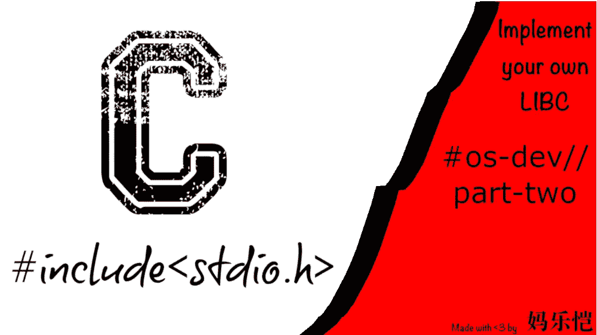

# 如何实现自己的 Libc

> 原文：<https://betterprogramming.pub/implementing-your-own-libc-tk-cce1c8e84e80>

## 我们的操作系统不支持 libc，所以让我们努力吧！

让我们一起深入 OS 开发吧！

这是我撰写的关于创建自己的操作系统的系列文章的第二部分。你可以跟随 GitHub 上的[库](https://github.com/azyklus/sys3)(或者 [Sourcehut](https://git.sr.ht/~azyklus/sys3) )。

当我们离开时，我们已经设置了一个基本的 shell，当我们启动系统时，它会向我们打招呼。除了编写的汇编代码和 C 语言的一些零碎内容，如 VGA 颜色代码和低级打印，没有什么别的东西。在这篇文章中，我们将扩展我们的 shell 程序并实现一些关键的 libc 功能。

首先，我们需要创建一些文件来保存我们的代码。您可以随意称呼它们，但是我创建了一个基本的源代码树，如下所示:

*   /(根目录)
*   /main —包含入口点和我们的 shell 程序。
*   /lib —包含在整个应用程序中使用的“库”。
*   /lib/boot —包含我们的引导加载程序。
*   /lib/libc —包含我们的 libc 实现。
*   /lib/link —包含我们的链接器脚本。

*注意:这种布局可能不是您最喜欢的，但是您可以根据自己的喜好设置您的源代码树。这有助于我保持条理。*

您需要创建至少两个头文件来包含`MemCpy`、`MemSet`、`MemCmp`、`MemMove`、`strlen`、`abort`和`PutChar`的定义。这些是一些基本函数，使我们能够进一步扩展我们的内核。我们将从`mem`函数开始:

定义一个头文件来包含我们的 mem 函数。

现在我们将在它们自己的文件中实现这些函数。代码如下:

非常基本的内存实用函数实现。

我们现在有了一些基本的内存操作工具，但是我们需要一个适当的“打印”实现和它的一些化身。为了实现这一点，我想稍微偏离 libc 实现，创建一个类似软件 UART(通用异步收发器)的东西。

首先，我们将创建一个名为“Uart”的结构，并给它一个字段:内存基址。稍后我们将向这个结构中添加更多内容，但是现在，我们将用一个字段写出它，并在旁边添加两个函数。看起来是这样的:

一种基本的通用异步收发器系统。

然后我们实现这些函数，如下所示:

UART 功能已实现。

我们的`UartInit`函数创建了一个指向`Uart`结构实例的指针。这个指针将被传递给其他相关的函数— `Read`和`Write`。

在我们的`Read`函数中，我们有两个参数:`Uart`指针和一个整数偏移量。将焦点转移到函数体，我们可以看到，我们声明了一个指向可变的无符号 8 位整数的指针，并将其设置为结构中的基址。我们在这里使用“volatile ”,这样编译器就不会优化掉我们的代码。最后，我们解引用并返回可变指针和偏移量的组合值。

要将我们的值写入 UART，我们需要一个指向`Uart`的指针和一个偏移量，很像`Read`，但是我们也需要一个无符号的 8 位整数值来写入。我们以和以前一样的方式使用“volatile ”,将我们的值赋给指针和偏移量的组合。

现在我们有了一个非常基本的内存映射 IO 设置，我们可以回到我们的`stdio`头。稍后我们将重写我们的 shell 函数来使用我们的 UART 定义。现在，让我们写出我们的`Print`和`Printf`函数:

让我们定义我们的打印功能！

在我们的 include guard 之后，我们从一个我还没有谈到的叫做`sys/cdefs.h`的头球切入。这是我创建的一个文件，用来存放我的一些个人#定义和类型别名等等。这并不重要，因为除了它自己的 include guard 之外，该文件中目前只有一个定义，所以我们将在以后的文章中再次讨论它。

接下来，我们用下面的代码实现我们的函数:

这里有很多东西需要解开，所以我们将从`PutChar`函数开始。这需要一个整数来表示一个“字符代码”,然后将其转换成一个`char`,然后将其提供给`UartWrite`函数，该函数随后执行一个易失性写操作。现在，这个函数自己初始化 UART，但是我们以后会改变它。

静态的`Print`函数接受一个字符数组并简单地循环，直到它放入通过`PutChar`函数提供的每个字符，尽管`Printf`必然会变得更加复杂。

因为我们试图完成一些基本的格式化，所以我们必须发挥创造力:我们需要检查一些常用的特殊格式化字符。

首先，我们必须确保我们没有写任何东西，所以我们检查我们的`EOF`条件，然后我们继续检查我们是否遇到了“格式表达式”这些以符号`%`开始，后面的字符表示我们将要进行的格式化类型:`%s`表示字符串格式化，`%c`表示字符格式化。另一次，我们将实现整数、浮点数和其他数据类型的格式化。

现在我们还有一个功能要实现:`abort`。

Abort 在出错时暂停程序！

当我们的系统遇到不可恢复的错误时，这个函数被调用。理想情况下，我们永远不会到达这一点，但是如果到达这一点，我们需要能够执行系统的快速停止。

现在我们已经有了一些基本的 libc 功能，我们可以像上次一样编译我们的程序了，我们可以打字了！我们还没有像 Bash 或 ZSH 那样的“外壳”,但我们将在下一期中实现更合适的东西，敬请期待！

# 资源

作为免责声明，部分代码是从其他来源借用或翻译而来的:

*   [OSDev Wiki](https://wiki.osdev.org/Main_Page)
*   [RedoxOS 文档](https://redox-os.org/docs/)
*   [斯蒂芬·马兹博客](https://osblog.stephenmarz.com/index.html)

我的 git 仓库:

*   [GitHub](https://github.com/azyklus/sys3)
*   [Sourcehut](https://git.sr.ht/~azyklus/sys3)

故事到此为止:

*   [第一章](/how-to-create-your-own-operating-system-bfd2545d2e6d)

再次，我非常感谢你阅读我的故事，我期待着我们下次见面！❤