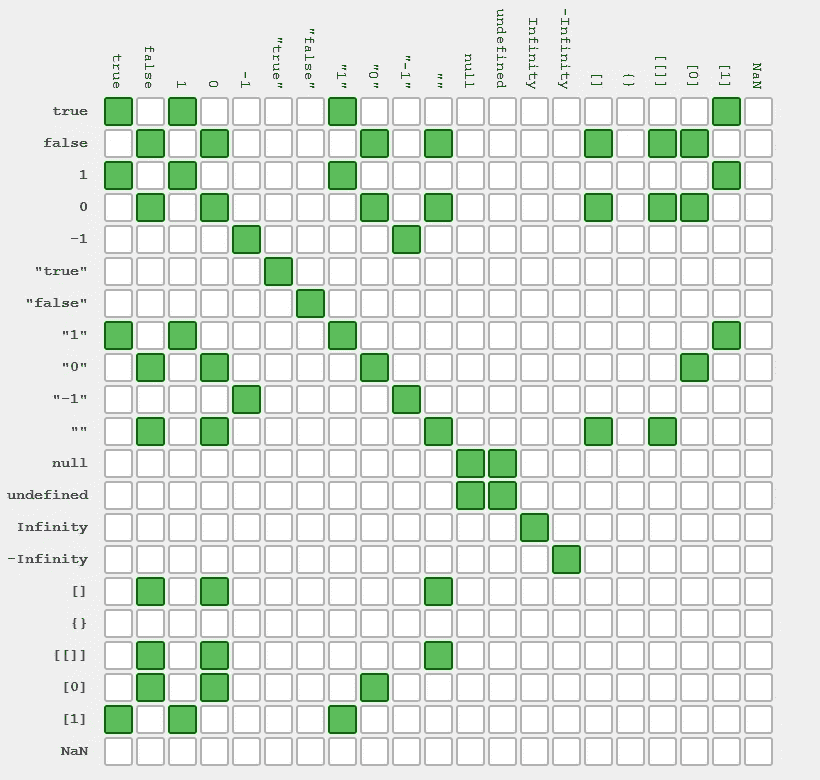

# JavaScript 中的隐式和显式强制

> 原文：<https://betterprogramming.pub/implicit-and-explicit-coercion-in-javascript-b23d0cb1a750>

## **强制是将数据从一种类型转换成另一种类型的过程**


照片由[克拉克·蒂布斯](https://unsplash.com/@clarktibbs?utm_source=unsplash&utm_medium=referral&utm_content=creditCopyText)在 [Unsplash](https://unsplash.com/s/photos/programming?utm_source=unsplash&utm_medium=referral&utm_content=creditCopyText) 上拍摄

有些情况下，JavaScript 隐式地进行了强制，而我们却没有意识到。

强制适用于 JavaScript 世界中的每一种数据类型。强制的一个例子如下所示:

```
let number = Number("35");
```

这里，我们通过将字符串传递给内置的 **Number()** 函数，显式地将字符串转换为数字。

JavaScript 中有两种类型的强制:

**隐式强制:**类型转换由 JavaScript 隐式完成。

**显式强制:**类型转换是使用内置函数(如 Number()、String()、Boolean()等)在代码中显式完成的。

我们将看两种类型的例子。

# 隐性强制

在这种情况下，强制是隐式完成的。当 JavaScript 在错误的数据类型中操作时，它会尝试将值转换为正确的数据类型。

有时候，结果和预期的不一样。下面是隐式类型转换的一些示例:

```
12 + ""    //Output is "12" as number 12 is converted to string "12""15" * 2    //Output is 30 as string 15 is converted to number 15"15" - "11" //Output is 4 as both the strings are converted to numberundefined + 6 //Output is NaN as undefined could not be converted to number"Hello" + null  //Output is "Hellonull" as null is converted to string "null"null + 25     //Output is 25 as null is converted to 0.true + true //Output is 2 as true is converted to number 1.false + 10 //Output is 10 as false is converted to number 0.10 * [6] //Output is 60 as [6] is converted to number 6.10 * [10, 20] //Output is NaN as [10, 20] could not be converted to number[1] + [1,2] //Output is "11,2" as [1] is converted to "1" and [1,2] is converted "1,2". Finally the two are concatenated to give the result "11,2"
```

每当我们在涉及像`-, *, /, %`这样的运算符的数值表达式中将不同的数据类型作为操作数传递时，转换过程类似于对操作数调用内置的`Number`函数。如果不能转换为数字，则返回 NaN。

*   +运算符的工作方式与其他数值运算符不同。根据传递的操作数的类型，它既可以作为串联运算符，也可以作为数值运算符。

**隐式强制也由 if()条件和==运算符完成。**

如果 If()条件中的值不是布尔值，那么它将被隐式地转换为布尔值。所有数据类型都可以转换为布尔值。除了下面提到的值之外，所有的值都被转换成一个真正的布尔值。

1.  **”**
2.  **0**
3.  **-0**
4.  **未定义**
5.  **空值**
6.  **楠**

```
let x;
if(x){
console.log("I am true.");
}
// No result is printed in console as x is undefinedlet y = [];
if(y){
console.log("I will get logged.");
}
// "I will get logged." will get printed in consoleif (-1) {
console.log("I will be logged.")
}
//"I will be logged." will get printed in console
```

如果值的数据类型不同，则==运算符会转换它们的数据类型。为了进行严格的比较，我们在不进行类型转换的地方使用===操作符。

```
12 == "12" // Output is true as string "12" is converted to number12 === "12" // Output is false as string "12" is not converted to numbertrue == 1 //Output is true as true Boolean is converted to 1'true' == true //Output is false as 'true' is converted to NaN and true is converted to 1
```



==操作员图表参考— StackOverflow

***注意:*** *其他比较运算符的行为与==运算符相同。*

# 显性胁迫

在这种情况下，类型转换由开发人员在代码中显式完成。JavaScript 提供了类型转换的内置方法。

## **转换为数字**

Number()全局方法用于将任何其他数据类型值转换为数值。

```
Number("25") //Output is 25 as "25" string is converted to number 25Number("") //Output is 0 as "" string is converted to 0Number([]) //Output is 0 as [] is converted to 0Number(null) //Output is 0 as null is converted to 0Number(true) //Output is 1 as true is converted to 1Number(false) //Output is 0 as false is converted to 0Number("Test") //Output is NaN as "Test" could not be converted to number
```

**parseInt()** 和 **parseFloat()** 方法也可以用于将存储为字符串的数字转换为数字。对于所有其他数据类型，它将返回 NaN。

## **转换成字符串**

String()全局方法用于将任何其他数据类型值转换为字符串值。

```
String(25) //Output is "25" as 25 is converted to string "25"String([]) //Output is "" as [] is converted to empty string ""String(null) //Output is "null" as null is converted to string "null"String(true) //Output is "true" as true is converted to string "true"String(false) //Output is "false" as false is converted to string "false"String({}) //Output is "[object Object]" as {} is converted to string(similar to calling toString() on a object)
```

## **转换为布尔型**

Boolean()全局方法用于将任何其他数据类型值转换为布尔值。

```
Boolean(25) //Output is trueBoolean([]) //Output is trueBoolean(null) //Output is falseBoolean({}) //Output is trueBoolean("Yeah! I will be converted to Boolean.") //Output is true
```

我这边就这样。感谢您的阅读！