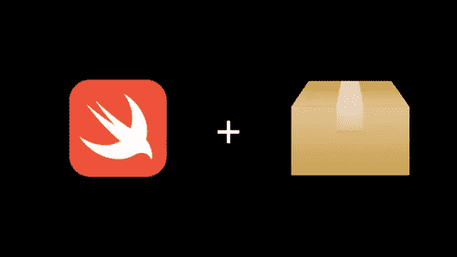
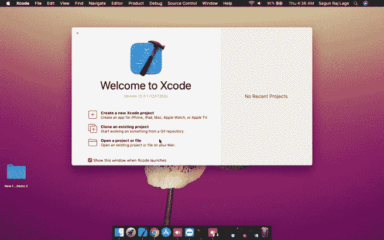
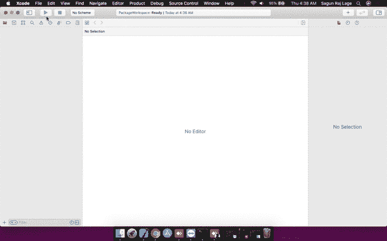
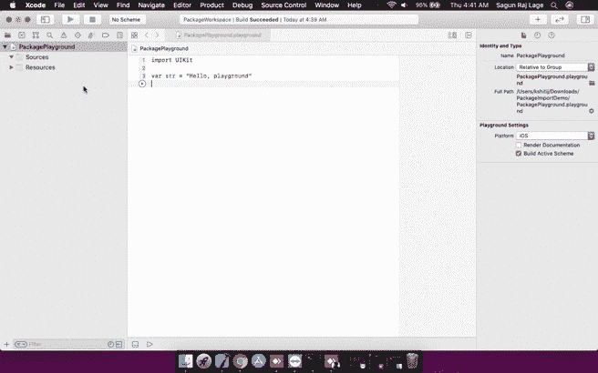

# 如何将 Swift 包导入游乐场

> 原文：<https://betterprogramming.pub/import-a-swift-package-into-a-playground-1bb650e196b0>

## 以简单的方式了解导入流程



资料来源:developer.apple.com

游乐场是 Xcode 最受欢迎的功能之一。这是一个交互式开发环境，允许开发人员使用 Swift 编程语言进行简单的实验，并实时查看他们代码的输出。

在您的编程之旅中，有时您可能想尝试一个新的包。就我而言，我在 Swift 官方网站上偶然发现“[宣布 Swift 算法](https://swift.org/blog/swift-algorithms/)”。当我浏览它时，我开始了解到 [Swift 算法](https://github.com/apple/swift-algorithms)包提供的新功能。这让我很兴奋地想把手弄脏！就在那时，我觉得有必要学习如何将一个快捷的包裹导入游乐场。

经过一些研究，我知道在运动场上使用第三方框架是可能的。但是随着 Xcode 12 的发布，苹果""不再需要使用这些第三方框架。因此，在本帖中，我将分享如何在不使用第三方框架的情况下将 Swift 包导入运动场*。*

*注意:您需要 Xcode 12 或更高版本才能将 Swift 包导入游乐场。*

# 入门指南

您需要遵循四个简单的步骤将 Swift 包裹导入您的游乐场。所有这些都描述如下:

## 1.创建新文件夹

首先创建一个新文件夹来存储与本教程相关的所有文件。我把它命名为 **PackageImportDemo** 。

## 2.创建新的工作区

现在，按照下面给出的步骤创建一个新的工作区:

*   打开 Xcode。
*   进入**文件**新建工作区**工作区**。
*   现在，会出现一个对话框。输入您的工作空间的名称作为**package workspace . workspace**。并将存储位置设置为您创建的 **PackageImportDemo** 文件夹。
*   点击**保存**。



创建新的工作空间

## 3.创建一个新的游乐场

因为我们的目标是将一个 Swift 包导入到一个游乐场，所以我们需要创建一个。为此，您可以遵循下面给出的步骤:

*   当您的**package workspace**workspace 打开时，进入**文件**新建游乐场**游乐场**。
*   现在，会出现一个对话框，要求你“为你的新操场选择一个模板”。现在，你可以选择 **iOS** ，双击**空白**。
*   这将启动另一个对话框，要求你输入你的游乐场的文件名和位置。我已经将它的文件名设为**package playground . playground**，并将它的位置设为 **PackageImportDemo** 文件夹。
*   在对话框的底部，您会看到两个下拉菜单— **添加到**和**组**。将**添加到**设置为**包工作区**，将**组**设置为**包工作区**。
*   然后，点击**创建**。



在你的工作空间内创建一个新的游乐场

## 4.将您的包文件夹拖到工作区

现在，您有了一个包含操场的工作空间。接下来，您将把包添加到工作空间，这样您就可以在您的运动场中使用该包的功能。在我的例子中，我将使用从其 [GitHub 库](https://github.com/apple/swift-algorithms)下载的 Swift 算法包。

现在，请遵循以下步骤:

*   将包文件夹从 Finder 拖放到 **PackageWorkspace** 的项目导航器中，使其成为工作区中 **PackagePlayground** 的同级。



将包文件夹拖到工作区的项目导航器中

*   关闭工作区，然后再次打开它。
*   重新打开工作区后，打开 **PackagePlayground** ，删除所有现有代码和顶部，添加以下代码将 Swift 算法包导入到 Playground:

```
import Algorithms
```

*   要检查 Swift 算法包是否已成功导入，您可以从[Swift 算法包指南](https://github.com/apple/swift-algorithms/tree/main/Guides)中复制一个演示程序，并在操场上试用。在我的例子中，我已经导入了[产品操作](https://github.com/apple/swift-algorithms/blob/main/Guides/Product.md)的代码，整体代码如下所示:

*   如果包已经成功导入，您将得到类似如下的输出:

```
1900 winter
1900 spring
1900 summer
1900 fall
1901 winter
1901 spring
1901 summer
1901 fall
...
```

# 就是这样！

恭喜你！您现在已经了解了如何将 Swift 包裹导入您的游乐场。

享受在操场上玩耍和弄脏你的手，保持学习的精神。另外，不要懒于分享你所知道的！

如果你有兴趣了解更多关于 Swift 算法包的信息，请查看它的 [GitHub 库](https://github.com/apple/swift-algorithms)。

如果你觉得这篇文章有用，并且愿意支持我，请"[给我买杯咖啡](https://www.buymeacoffee.com/sagunraj)"

[](https://www.buymeacoffee.com/sagunraj) [## Sagun Raj Lage 正在撰写博客和书籍，并免费教授编程。

### 我是一名 iOS 开发人员，有从事各种领域相关项目的经验，如交通和…

www.buymeacoffee.com](https://www.buymeacoffee.com/sagunraj)