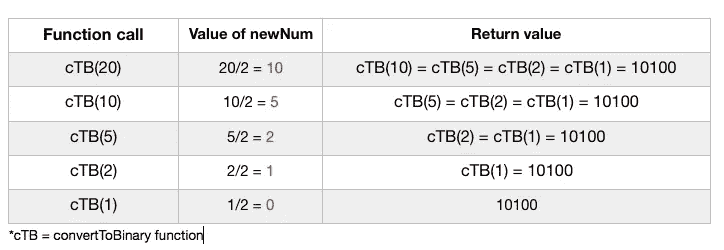

# Return 关键字在递归 JavaScript 函数中的重要性

> 原文：<https://betterprogramming.pub/importance-of-the-return-keyword-in-recursive-javascript-functions-d12203c30d1a>

## 分析为什么只有函数调用是不够的

[Artem Sapegin](https://unsplash.com/@sapegin?utm_source=medium&utm_medium=referral) 在 [Unsplash](https://unsplash.com?utm_source=medium&utm_medium=referral) 上拍照。

我最近不断遇到几个围绕递归的算法问题，在其中一些问题中，我遇到了一个奇怪的问题:我的递归特性似乎有效，但我的最终结果一直显示为`undefined`。

下面是一个将十进制数转换成二进制数的函数。它查看数字除以 2 的商及其余数，根据结果将`0`或`1`添加到数组中。

注意:这个函数适用于特定阈值以下的数字，因为特定长度的二进制数字会被 JavaScript 错误地舍入。也就是说，它的功效与本文中包含的逻辑或示例没有任何关系。

很简单，对吧？它做了它需要做的事情，然而当我把一个数字放进去并调用这个函数时，我得到的只是`undefined`。将我的结果记录到控制台显示了我所期望的，但是为什么这个值实际上没有被返回呢？

答案是这个函数的递归调用前面没有`return`关键字。这样，仍然会再次运行该函数，但是不会对该函数的结果做任何处理。

假设我把数字`20`作为这个函数的参数。二进制的 20 是 10100。我们的第一个递归调用使用`10`作为参数(20 除以 2 等于 10，因此我们将 10 设置为变量`newNum`的值，并在递归调用中使用它)。然后，我们重复这个过程，直到数字参数除以 2 等于`0`(或者向下舍入到`0`)。

最终，我们得到了数字 10100。但是，那个数字只在`convertToBinary(1)`的函数调用中返回。函数调用`convertToBinary(2)`识别出`convertToBinary(1)`已经完成运行，但是因为在`convertToBinary(1)`调用之前没有`return`关键字，所以对计算的 10100 不做任何事情。本质上，这个数字只是坐在那里。

所以，`convertToBinary(5)`意识到`convertToBinary(2)`完成了(并且没有返回任何东西)并且完成了它自己。同样的事情也发生在`convertToBinary(10)`身上。最后，`convertToBinary(20)`——我们最初的呼叫——解决了。但是`convertToBinary(10)`没有返回任何东西，因为它的前辈没有返回任何东西。

基本上，如果您在递归函数调用之前不使用`return`，您仍然会调用该函数，但是您不会从中获得任何东西。

这里恰当地使用`return`意味着`convertToBinary(2)`给出的返回值是 10100(是`convertToBinary(1)`的结果)。`convertToBinary(5)`的返回值是`convertToBinary(2)`的结果。这种逻辑推断，意味着`convertToBinary(20)`本质上依赖于其后每个连续调用的返回值。通过使用`return`，在每个连续的函数调用中都会返回 10100，最终冒泡到`return convertToBinary(10)`。

递归函数可能有点令人困惑，所以要了解`convertToBinary(20)`如何依赖于它后面的调用，请参考下图:

我们的初始调用需要任何后续调用的返回值，以便它可以正确地返回值本身。

希望本文已经解释了为什么`return`关键字对于递归操作是必要的，以及为什么简单地调用没有它的函数是不够的。

至此，祝您编码愉快！