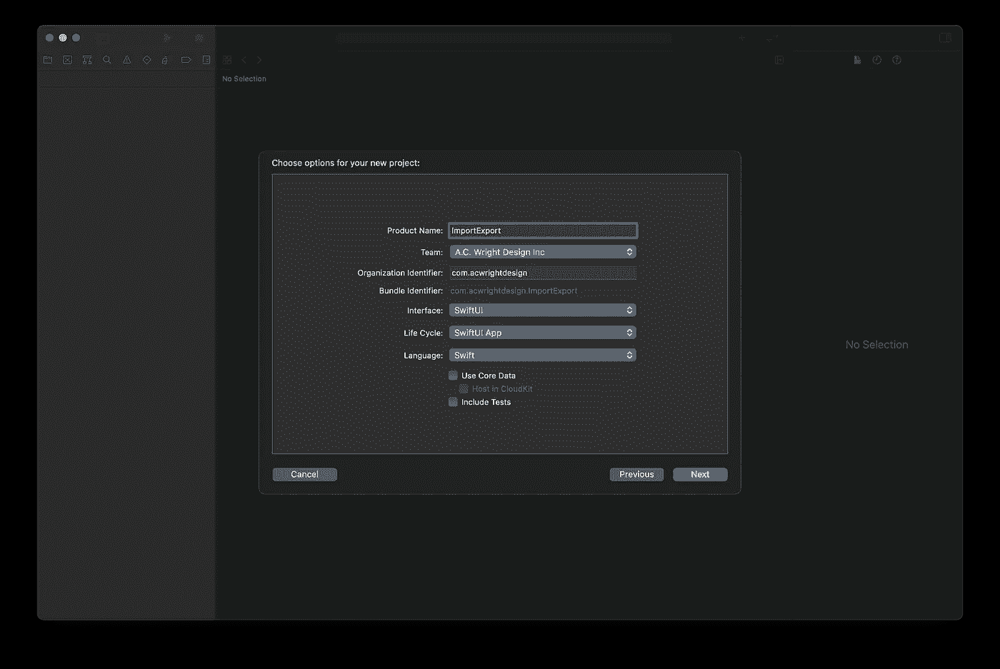

# 在 SwiftUI 中导入和导出文件

> 原文：<https://betterprogramming.pub/importing-and-exporting-files-in-swiftui-719086ec712>

## 使用视图修饰符在应用程序中导入或导出数据

维克多·塔拉舒克在 [Unsplash](https://unsplash.com?utm_source=medium&utm_medium=referral) 上拍摄的照片。

在 WWDC 2020 大会上，SwiftUI 推出了使用新的`@Environment`变量向您的应用程序导入和从中导出数据的功能。虽然这些新增功能对 SwiftUI 来说是一个受欢迎的改进，但它们有点笨重。随着 iOS 14 beta 6 的发布，苹果为我们提供了一套新的视图修改器，减少了进出口摩擦。

让我们通过创建一个可以以纯文本格式导入和导出数据的简单项目来探索这些新的视图修饰符。

# **入门**

首先使用 iOS 应用程序模板创建一个新的 Xcode 项目。确保您已经为界面选择了“SwiftUI ”,为生命周期选择了“SwiftUI App”。

作者为这个项目使用的 Xcode 选项。

# **创建文档类型**

我们需要提供一个文档类型来表示我们导出的数据，所以接下来让我们创建它。我们的文件将是符合`FileDocument`协议的`struct`。

创建一个名为`MessageDocument.swift`的新 Swift 文件，内容如下:

在这个例子中，我们的文档是一个简单的包装器，包装了一个名为`message`的`String`变量。在您的应用程序中，这个文档可以表示您希望导出的任何数据。上面的代码是我们对纯文本文件进行编码和解码所需的全部内容。

# 创建用户界面

接下来，我们将创建一个基本的 UI，允许我们编辑消息并提供导入和导出按钮。在`ContentView.swift`中，将内容替换为以下内容:

这里没什么意思。我们已经创建了一个`TextEditor`元素，它绑定到我们文档的`message`属性，这将允许我们编辑我们的消息。我们还制作了两个绑定到几个`State`变量的导入和导出按钮。现在是时候实施导入导出了！

# **实现出口**

在我们的`VStack`上的`.padding()`修饰符下面，添加以下代码:

`fileExporter()`方法接受一个到我们的`isExporting`变量的绑定，以及一个到要在导出时写入的文档的绑定。我们还为该方法提供了符合`UTType`的内容类型和默认文件名。在我们的简单示例中，我们可以忽略结果，但是您可能希望在应用程序中更加健壮，并在导出成功或失败时向用户提供反馈。

上面的代码是我们导出一个文件所需要的全部！在模拟器中运行并尝试一下！按下`Export`按钮会出现一个模态对话框，您可以在其中选择保存文件的位置，并根据需要重命名文件。

# **实施进口**

现在我们可以导出我们的消息了，让我们颠倒这个过程并实现 import，这样我们就可以从我们新导出的文件中读取数据。在`fileExporter()`方法下面，添加以下代码:

`fileImporter()`方法也接受一个表示绑定——这次是绑定到我们的`isImporting`变量。`allowedContentTypes`属性接受一个`UTType`类型的数组，该数组将限制用户的选择。如果您希望用户选择多个文件，也可以将`allowsMultipleSelection`设置为`true`，但是在这个简单的例子中，我们一次只允许导入一个文件。

在结果块中，`result.get()`方法为用户选择的文件返回一个`URL`数组。在我们的例子中，我们只对第一个`URL`感兴趣，因为我们已经将`allowsMultipleSelection`设置为`false`。我们从这个`URL`中读取`Data`,并将其转换为一个`String`,然后分配给我们文档的`message`属性。

重新运行项目，您应该能够将之前导出的文件导入到应用程序中！

# 结论

如果您遵循了本教程，您现在应该有一个在 SwiftUI 中导入和导出的工作示例。

感谢阅读和快乐编码！

GitHub 上的[提供了示例代码。](https://github.com/acwright/ImportExport)