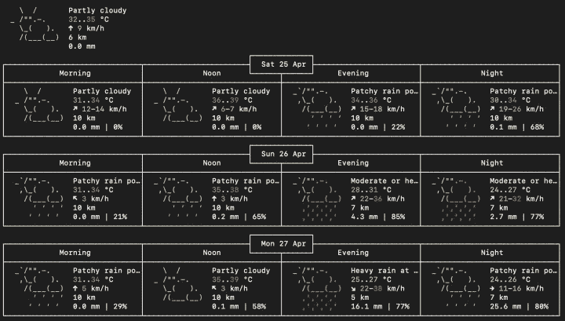

# 用这些有趣而有用的 Mac 终端命令打动你的朋友

> 原文：<https://betterprogramming.pub/impress-your-friends-with-these-fun-and-useful-mac-terminal-commands-c091ec2a0024>

## 显示天气，关闭你的电脑，等等，都可以从你的终端上完成


由 [Ash Edmonds](https://unsplash.com/@badashproducts?utm_source=medium&utm_medium=referral) 在 [Unsplash](https://unsplash.com?utm_source=medium&utm_medium=referral) 上拍摄的照片。

我们总是想知道大多数人不知道的事情。如果你知道一些只有少数人知道的事情，你会自我感觉良好。这里有八个大多数人都不知道的有趣命令。

# 1.让您的 Mac 与您交谈

是的，你的 Mac 可以和你说话。无论你说什么，它都会重复。

```
say “I am Groot”say “I am great at impressing people”
```

`say`命令将以默认的系统声音指示您在双引号之间输入的任何句子。

您也可以更改嗓音，方法是前往“系统偏好设置”→“辅助功能”→“语音”→“系统嗓音”弹出式菜单，然后选取一种嗓音。

这是一个用来恶作剧的很酷的终端命令。

# 2.让您的 Mac 坐立不安

如果您没有与 Mac 进行任何互动，它将进入睡眠模式以节省能源。但在某些情况下，比如记笔记或阅读长篇文章时，你可能会忘记与 Mac 互动，然后不得不输入密码再次登录。要防止 Mac 进入睡眠状态，您可以使用 caffeinate 命令:

```
caffeinate
```

我们还可以设置时间段，以便该命令仅在一段临时时间内处于活动状态。

为此，添加`-t`标志，后跟您希望该特性启用的秒数:

```
caffeinate -t 600
```

上面的命令将使您的 Mac 在 10 分钟(600 秒)内不进入睡眠状态。在此之前，可以通过按 ctrl + c *来停止。*

# 3.从您的终端下载 YouTube 视频

如果你想下载 YouTube 视频，你的 Mac 终端只需一个命令就能做到。为此，您需要安装 youtube-dl:

```
brew install youtube-dl
```

安装 youtube-dl 后，您可以下载任何 youtube 视频，如下所示:

```
youtube-dl "video-url"
```

有很多选择。您可以参考[文档](https://youtube-dl.org/)了解更多信息。

# 4.关闭您的 Mac

如果您想要使用终端关闭 Mac，您只需键入以下命令:

```
sudo shutdown -h now
```

然后输入您的密码。这将关闭您的计算机。

要重新启动计算机:

```
sudo shutdown -r now
```

要在一段时间后关闭 Mac，您可以使用以下命令:

```
sudo shutdown -h +60
```

上面的命令将在 60 分钟后关闭机器。

参见[本页](https://apple.stackexchange.com/questions/103571/using-the-terminal-command-to-shutdown-restart-and-sleep-my-mac)了解更多关闭 Mac 的选项。

# 5.让您的 Mac 通过自定信息激励您

Mac 允许您设定自定登录信息。你可以写一段励志名言，或者如果你想向使用你电脑的人传达一些信息，那么这是一个很好的选择。我在登录屏幕上添加了我的地址和手机号码，所以即使我的 Mac 丢失了，找到它的人也很容易联系到我。

```
sudo write /Library/Preferences/com.apple.loginwindow LoginwindowText "Custom Text Here"
```

这将要求您输入管理密码。就是这样。更多详细信息，请参见本页。

# 6.让您的 Mac 显示天气预报

你不需要使用浏览器来获取天气预报。您可以在终端上使用一行命令来完成此操作:

```
curl [http://wttr.in/](http://wttr.in/)
```

它将为您带来未来三天的天气预报，包括早上、中午、晚上和晚上。



如果你经常出差，这将非常有帮助。

要获取特定城市的天气报告，您可以使用:

```
curl wttr.in/London
```

# 7.获取历史记录

您可以使用以下命令获取终端命令历史记录:

```
history
```

如果您要从命令历史中搜索特定的单词，那么您可以使用:

```
history | grep cd
```

上面的命令将列出历史中包含`cd`的所有命令。

如果您想清除命令历史，那么您可以使用:

```
history -c
```

# 8.更改截图的保存位置

如果您想在自定义位置保存您的屏幕截图，您可以使用以下命令:

```
defaults write com.apple.screencapture location ~/your/location/here
```

在这之后，输入另一个命令:

```
killall SystemUIServer
```

就是这样。

[](https://medium.com/@jagathishsaravanan/why-should-you-donate-me-30a6f5d112b8) [## 你为什么要捐赠我

### 请求为 y 羽毛球训练捐款。

medium.com](https://medium.com/@jagathishsaravanan/why-should-you-donate-me-30a6f5d112b8) 

[https://www.buymeacoffee.com/Jagathish](https://www.buymeacoffee.com/Jagathish)