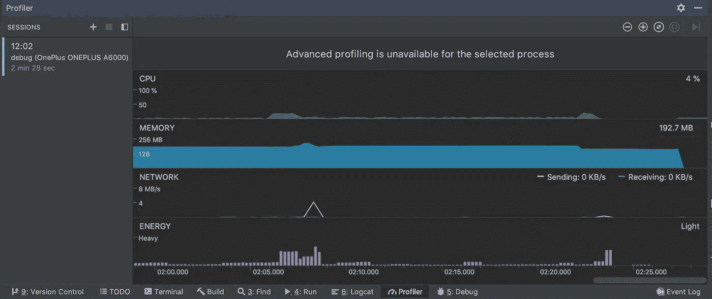
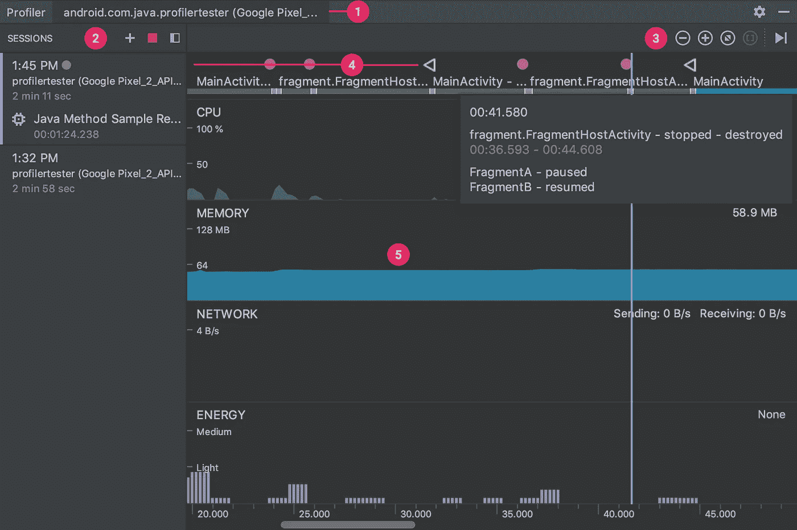
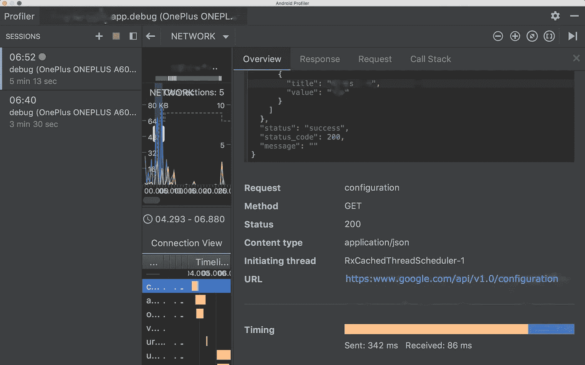
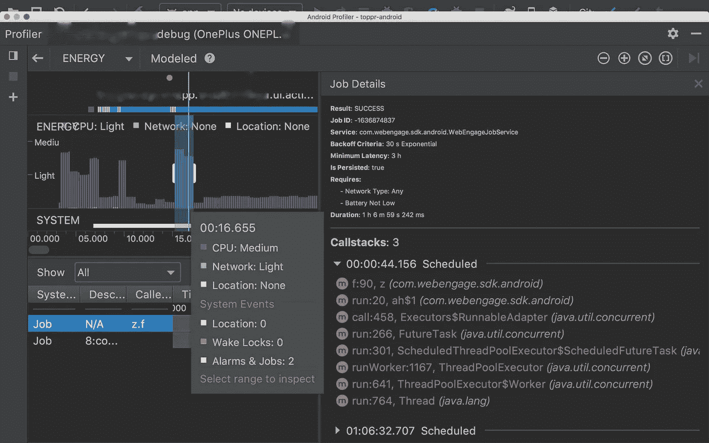
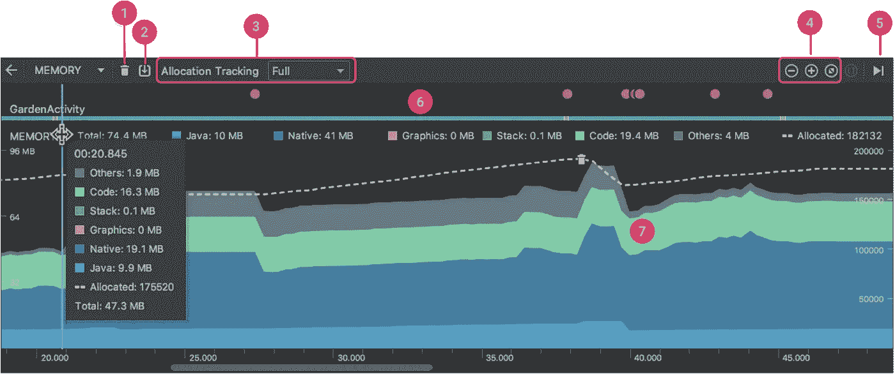
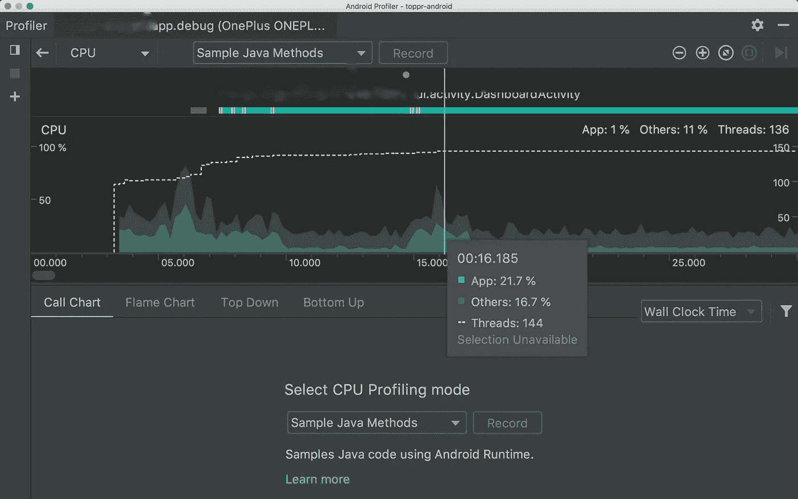

# 使用 Android Profilers 提高应用程序的性能

> 原文：<https://betterprogramming.pub/improve-apps-performance-with-android-profilers-edb240deeb71>

## Android Studio 评测器概述

在我之前的帖子中，我们看到了如何优化 [UI 性能](https://medium.com/better-programming/android-ui-performance-11b57ac4af8c)，但是 UI 并不是应用程序性能差的唯一原因。

可能有很多原因，如 CPU 使用不良、不必要的内存消耗、电池资源执行不良等。为了调试和克服这些问题，在 [Android Studio](https://developer.android.com/studio) 3.0 中有一个名为 [*Profiler*](https://developer.android.com/studio/profile/android-profiler) *的部分。*

在这篇文章中，我们将有一个概要分析器。

探查器是一套用于探查、优化性能和排除性能故障的工具。Android Studio 3.0 及更高版本中的 Android Profiler 部分取代了 Android Monitor 工具。

Android Profiler 工具提供实时数据，帮助我们了解我们的应用程序如何使用 CPU、内存、网络和电池资源。让我们检查一下 Android Studio 中可用的分析器。

1.  网络分析器
2.  能量分析器
3.  内存分析器
4.  CPU 分析器

# 概观

要打开 Profiler 窗口，选择*视图* > *工具窗口* > *Profiler* 或单击工具栏中的 *Profile、*或下面的图标。

为了检查应用程序，我们需要构建和部署应用程序。Android Profiler 会继续收集分析数据，直到您断开设备连接或单击*结束会话*。

Profiler 的主视图向我们实时显示 CPU、网络、内存和能源的使用情况。单击任何图表，我们都可以看到每个部分的详细视图。

让我们大致了解一下 Profiler 部分的外观以及它的组成。

1.  Android Profiler 显示当前正在分析的进程和设备。
2.  在*会话*窗格中，选择要查看的会话或启动新的分析会话。
3.  使用缩放按钮控制查看多少时间线，或使用*附加到实时*按钮跳转到实时更新。
4.  事件时间线显示与用户输入相关的事件，包括键盘活动、音量控制更改和屏幕旋转。
5.  共享时间线视图，包括 CPU、内存、网络和能源使用情况的图表。

# 网络分析器

“网络概述”提供了所选应用程序网络状态的高级概述。网络概述在时间线上显示实时网络活动，显示发送和接收的数据，以及当前的连接数。

这使您可以检查应用程序如何以及何时传输数据，并适当地优化底层代码。还有一个线程视图，我们可以从中看到工作在哪里执行。

该图显示了实际的网络活动，包括发送和接收的字节。如果网络请求正在发生，图形会继续移动。

在右上角，您可以找到缩放和暂停按钮来检查特定的一段代码。选择一部分 ph 值后，它会显示以下视图:

它列出了所有连接请求及其在所选部分的时间表，包括数据大小、所用时间等。

如果您想检查一个请求的数据，在 connection 视图中单击该事件，然后在右侧会显示一个窗口，其中包含该请求的详细信息，如下所示。

它显示实际的网络调用请求响应数据以及调用堆栈、有效负载等。

没有任何拦截器，您现在可以看到整个请求、响应体和请求的其他细节。它还显示图像(如果有的话),并具有 XML 和 JSON 的语法格式。

# 能量分析器

能源分析工具有助于我们发现可能导致能源相关问题的问题。它可视化了应用程序对系统组件的估计能耗的细分。

Energy Profiler 监控 CPU、网络无线电和 GPS 传感器的使用情况，并显示这些组件各自的能耗情况。

我们可以检查可能导致电池耗尽的背景事件。我们可以使用 Energy Profiler 来查找会影响能耗的系统事件，包括唤醒锁、作业和警报等。

能量分析器如下所示:

打开*系统事件*窗格，显示事件的详细信息，如作业或网络呼叫或唤醒锁，并在*能量*时间线中选择一个范围。

这给出了事件的细节。例如，在上面的 pic 中，我们检查了一个作业，该作业在右侧面板中显示了带有调用堆栈的作业细节。

# 内存分析器

内存分析器是一个组件，它可以帮助我们识别内存泄漏和内存流失，这些泄漏和流失会导致应用程序停顿、冻结甚至崩溃。

它显示应用程序内存使用的实时图表，并允许您捕获堆转储、强制垃圾收集和跟踪内存分配。

在开发我们的应用程序时，我们有时会由于许多原因遇到内存泄漏。

最重要的原因之一是未使用的对象没有被垃圾收集。尽管 Android 系统负责这些内存分配和垃圾收集，但在某些时候，我们可能会给一些对象分配更多的内存。

这甚至可能发生在垃圾收集器清除之前的对象之前，这可能导致应用程序冻结、跳帧或崩溃等。

有时，我们甚至会在应用程序处于后台状态时消耗内存，这反过来又会导致系统重新启动应用程序而不恢复它。

为了防止这些问题，我们应该使用内存分析器来执行以下操作:

*   在时间线中寻找可能导致性能问题的不良内存分配模式。
*   转储 Java 堆，以查看在任何给定时间哪些对象用完了内存。长时间的几次堆转储有助于识别内存泄漏。
*   记录正常和极端用户交互期间的内存分配，以准确识别您的代码在短时间内分配了太多对象或分配了泄漏的对象。

1.  强制垃圾收集事件的按钮。
2.  一个按钮[捕获堆转储](https://developer.android.com/studio/profile/memory-profiler.html#capture-heap-dump)。
3.  注意:只有当连接到运行 Android 7.1 (API level 25)或更低版本的设备时，记录内存分配的按钮才会出现在堆转储按钮的右侧。
4.  放大/缩小时间线的按钮。
5.  一个下拉菜单，用于指定探查器捕获内存分配的频率。选择适当的选项可以帮助您[在评测时提高应用性能](https://developer.android.com/studio/profile/memory-profiler.html#performance)。
6.  放大/缩小时间线的按钮。
7.  向前跳转到实时内存数据的按钮。
8.  事件时间线，显示活动状态、用户输入事件和屏幕旋转事件。
9.  内存使用时间线，包括以下内容:

*   每个内存类别使用了多少内存的堆叠图，由左侧的 y 轴和顶部的颜色键表示。
*   虚线表示已分配对象的数量，如右侧的 y 轴所示。
*   每个垃圾收集事件的图标。

由于篇幅太长，我将在接下来的文章中详细介绍垃圾收集、堆转储和内存分配跟踪。如果您渴望了解更多信息，请查看参考资料部分的以下链接。

# CPU 分析器

优化我们的应用程序的 CPU 使用有许多优势，例如提供更快更流畅的用户体验和延长设备电池寿命。

在与应用程序交互时，您可以使用 CPU Profiler 实时检查应用程序的 CPU 使用情况和线程活动，或者您可以在记录的方法跟踪、函数跟踪和系统跟踪中检查 CPU Profiler 的 Android 详细信息。

从下拉菜单中选择一个选项，点击*记录*按钮。与应用程序互动一段时间，然后点击停止按钮。

CPU Profiler 自动选择记录的时间范围，并在跟踪窗格中显示其跟踪信息。记录活动后，我们可以导出跟踪以供以后检查。我们可以通过点击左上方菜单中的`+`来导入轨迹。

我们可以检查应用程序在主线程上渲染每一帧需要多长时间，并调查导致 UI 抖动和低帧率的瓶颈。

要查看帧渲染数据，[使用允许您跟踪系统调用的配置来记录跟踪](https://developer.android.com/studio/profile/cpu-profiler#method_traces)。记录完轨迹后，在名为*帧*的部分下寻找每一帧的信息。

这就是全部，现在，我们将在接下来的文章中深入探讨内存和 CPU 分析器。

# 参考

[深入了解 Android 评测器](https://www.youtube.com/watch?v=LGVbpobV-Yg)

[使用 Android Studio 评测器提高应用性能](https://www.youtube.com/watch?v=O5V9ZSL0BsM)

[使用 CPU 分析器检查 CPU 活动](https://developer.android.com/studio/profile/cpu-profiler.html)

请让我知道你的建议和意见。

感谢您的阅读。